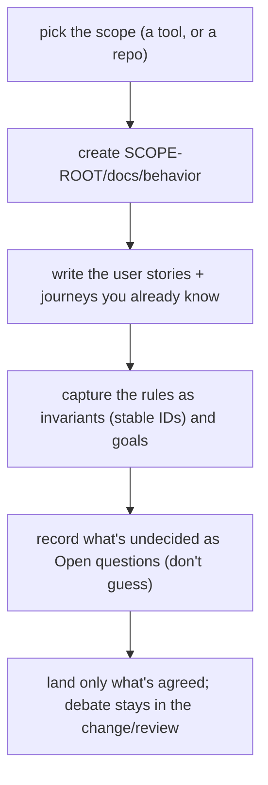
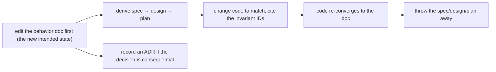

# Behavior docs — the method

This is the behavior-doc set **for the behavior-docs method itself**. The method is
treated as a tool; this set is its scope, so it lives at `behavior-docs/docs/behavior`.
It is self-describing — a behavior-doc set that documents how to write and use
behavior-doc sets, using its own vocabulary. New here? Start with the
[glossary](glossary.md); the rules are in [invariants](invariants.md).

A **behavior doc** describes how a system _should_ behave — from the user's
perspective — as user stories, journeys, constraints, goals, and invariants. It is a
living doc that sits **above** the disposable spec → design → plan → code chain: the
downstream artifacts are derived from it and thrown away once the code re-converges;
the behavior doc persists.

## User stories

- As a tool author, I want one place that answers "how is this supposed to behave?"
  so I don't re-derive intent from code or stale specs.
- As someone changing behavior, I want to state the new intent first and derive the
  work from it, so the change is anchored to a durable rule rather than a throwaway
  spec.
- As a reviewer, I want a stable **invariant** ID to cite from a test or an ADR, so
  the `invariant → check` link outlives the spec that introduced it.
- As an operator of many tools, I want a **generic** set I can reuse and a
  **per-project overlay** for how _my_ deployment uses it, so shared behavior isn't
  copy-pasted and org specifics don't leak into the shared set.

## Journeys

### Starting a set for a new tool/project

### Changing intended behavior

### Resolving an open question

Decide → update the doc to state the decision → record an ADR if consequential →
delete the open question. An open question is a placeholder for a gap, not a parking
lot for debate.

### Layering a per-project overlay

A deployment that _uses_ a generic tool writes its own set (its scope) that cites the
generic set's invariant IDs and adds only what is specific to that deployment. It
**imports by reference**, never by copying, and the generic set never references the
overlay.

## What belongs in a behavior doc — with examples

Say what the user should be able to do and what must always hold; leave _how_ to the
downstream artifacts. Illustrative:

> **User story** — "As an operator, I want to run one command and have all ready
> work advanced, so I don't babysit the queue."
>
> **Invariant** — **`INV-EXAMPLE-1`** — A drain **MUST** work every ready item, then
> exit; idling is the scheduler's job.
>
> **Open question** — How are workflows grouped in config? Undecided.

### Counter-examples (these do _not_ belong)

| ❌ Written in a behavior doc                                | ✅ Where it belongs                           |
| ----------------------------------------------------------- | --------------------------------------------- |
| "`parseConfig()` in `config.go:42` validates the schema"    | downstream design/code (`file:line`)          |
| "Today we shell out to X; we'll switch to Y next quarter"   | current-vs-future code framing → nowhere here |
| "Covered by `TestDrainRunsToEmpty`"                         | the test suite (cite the invariant ID there)  |
| "Retry 3 times with a 30s backoff"                          | downstream config/constants                   |
| "the tracker stores the item" (naming a tool where neutral) | the capability map / per-project overlay      |

The rule of thumb: if it would change when the _implementation_ changes but the
_intended behavior_ stayed the same, it's downstream, not here.

## The rules

The method's invariants (`INV-METHOD-*` / `GOAL-METHOD-*`) — scope convention,
intended-behavior-only, the invariant-ID convention, living-by-default, ADR-backing,
and overlay layering — are in [invariants](invariants.md). Cross-set references use
textual citation (`<repo-name> · <set-path> · <ID>`), never a relative link across
sets; see the glossary.

## Keeping a set honest (drift)

A behavior doc describes intended behavior; reality can lag. A periodic **conformance
pass** reconciles each invariant and each open question against what the code
actually does, and closes questions already decided elsewhere. Because every
invariant carries a stable ID, the check is mechanizable.

## Documents

- **[README](README.md)** — this on-ramp: what a behavior doc is, journeys, examples.
- **[glossary](glossary.md)** — the method's vocabulary.
- **[invariants](invariants.md)** — the `INV-METHOD-*` / `GOAL-METHOD-*` rules.

_The method currently has no open questions._
