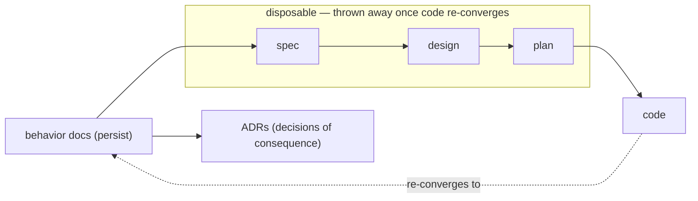

# Behavior docs — the method

This directory is the behavior docs **for the behavior-docs tool itself**: what a
behavior doc is, where it lives, how to use and maintain one, and the conventions
every behavior-doc set follows. It is self-describing — it is a behavior-doc set
that documents behavior-doc sets. New to the vocabulary? Start with the
[glossary](glossary.md).

Other sets follow this method:

- **pr-pool (generic):** `phillipgreenii-nix-agent-support` ·
  `packages/pr-pool/docs/behavior`
- **pr-pool @ ZR:** `phillipg-nix-ziprecruiter` · `pr-pool-components/docs/behavior`

## What a behavior doc is

A **behavior doc** is a living document that describes **how a system should
behave** — from the user's perspective — in terms of user stories, journeys,
constraints, goals, and invariants. It sits **above** the disposable
spec → design → plan → code chain: those are derived from it and thrown away once
the code re-converges; the behavior doc persists.

Behavior docs describe _intended_ behavior. They are not a design record, a debate,
or a status report. When something is genuinely undecided it is written as an
explicit **Open question**, never guessed at.

## Where behavior docs live — the scope convention

A behavior-doc set describes exactly one **scope**, and lives at that scope's root:

- **`SCOPE-ROOT/docs/behavior`** — always, for every scope.
- A whole repository → `<repo-root>/docs/behavior`.
- A single tool/component → `<tool-root>/docs/behavior` (e.g.
  `packages/pr-pool/docs/behavior`).

The behavior-docs method is itself treated as a tool (this directory is its scope
root), so it lives at `behavior-docs/docs/behavior`.

## How to use a behavior-doc set

- **Start here.** Any question about intended behavior is answered in the relevant
  set. If it isn't, that is a gap to fill, not a thing to infer.
- **Change here first.** A behavior change begins by editing the behavior doc; a
  spec → design → plan is then derived to reach the newly-described state, and code
  is changed to match.
- **Downstream is disposable.** Specs, designs, and plans are working artifacts;
  once the code matches the behavior docs again they can be thrown away.
- **Cite invariant IDs.** See the ID convention below.
- **Tie decisions back here.** Decisions of lasting consequence are recorded as
  ADRs and referenced from the relevant doc.

## What belongs in a behavior doc (and what doesn't)

| In a behavior doc                                      | Not here (lives downstream: spec/design/plan/code) |
| ------------------------------------------------------ | -------------------------------------------------- |
| User stories ("As a user, I want…")                    | File/function entry points, `file:line`            |
| Journey narratives + mermaid diagrams                  | Test names, code-coverage goals                    |
| Invariants / business rules (MUST / MUST-NOT) with IDs | "current vs past vs future" state of the code      |
| Goals & constraints (incl. budget concept + limits)    | Which tool implements it (→ capability map only)   |
| Example user-visible output & error messages           | Internal data schemas, function signatures         |
| Usage scenarios (commands to do & verify a thing)      | Sequencing/phasing of the work                     |
| Failure conditions per workflow                        | Retry counts / timeouts as constants               |
| Open questions (gaps are OK)                           |                                                    |

Examples are **illustrative** unless labeled **golden** (asserted by a real test).
Illustrative examples show intent; they are not guaranteed byte-accurate.

## The invariant-ID convention

Each invariant has a stable **ID** (e.g. `INV-TRACK-2`). Downstream artifacts
(specs, designs, ADRs, tests) **MUST** cite the ID they implement or verify, so the
durable `invariant → check` link survives after the disposable spec is thrown away.

A set distinguishes three kinds of rule, tagged so the distinction stays legible:

- **`INV-*`** — a true **invariant**: a rule that must always hold (MUST / MUST NOT).
- **`GOAL-*`** — a **goal**: a desired-but-not-absolute property (often a SHOULD or
  a configurable default).
- **concepts** — named ideas the invariants and goals build on.

## Shared base vs. per-project overlay

To scale to multiple tools/repos without copy-paste drift, a tool's behavior is
layered:

- **Generic (base):** the tool's org-agnostic behavior — reusable across every
  deployment. Other deployments import it **by reference** (cite its IDs), never by
  copying.
- **Per-project overlay:** how a specific organization/repo _uses_ the tool — its
  configuration, identities, labels, and any roles/workflows it adds. This lives in
  **that organization's own repository**, never in the generic tool's repo.

## Cross-repo & cross-set references

Behavior docs in one scope refer to another scope by **textual citation**, never by
a relative-path markdown link (a link across a flake-input boundary would not
resolve; a link across far-apart subtrees is brittle). Cite as:

    <repo-name> · <set-path> · <ID-or-section>

for example `phillipgreenii-nix-agent-support · packages/pr-pool/docs/behavior ·
INV-AUTH-2`. Use the repository's **directory/workspace name** as the canonical
`<repo-name>` (e.g. `phillipgreenii-nix-agent-support`), not its flake-input alias
or its GitHub slug. Relative markdown links are used only **within** a single set.

## Rules for behavior docs (MUST / SHOULD)

- **`INV-METHOD-1`** — A behavior-doc set **MUST** live at its scope's
  `docs/behavior` and describe exactly **one** scope.
- **`INV-METHOD-2`** — A behavior doc **MUST** describe intended behavior only. It
  **MUST NOT** carry downstream detail (`file:line`, test names, schemas) or
  current-vs-past-vs-future code framing (that is what the in/out rubric enforces).
- **`INV-METHOD-3`** — Every invariant **MUST** have a stable ID; downstream
  artifacts **MUST** cite the ID they implement or verify.
- **`INV-METHOD-4`** — **Every behavior doc is living; there is no per-doc status.**
  A doc **MUST NOT** carry a "status" header. Debate is not merged: it stays in the
  proposing PR, and a change lands **only when there is agreement**. What is merged
  is therefore always the agreed expected behavior.
- **`GOAL-METHOD-5`** — Adding or changing an invariant **SHOULD** reference an ADR
  recording the decision.
- **`GOAL-METHOD-6`** — Org/repo-specific behavior **SHOULD** live in the per-project
  overlay in that org's own repo, keeping the generic set reusable.

## Keeping behavior docs honest (drift)

Behavior docs describe intended behavior; reality can lag. A periodic **conformance
pass** reconciles each invariant and each open question against what the code
actually does, and closes questions already decided elsewhere. Each open question
has an owner and a resolution path: resolve → update the doc → record an ADR if the
decision is consequential. Because every invariant carries an ID
(`INV-METHOD-3`), this drift check is mechanizable (a linter can enforce that each
ID is cited by at least one downstream check).
