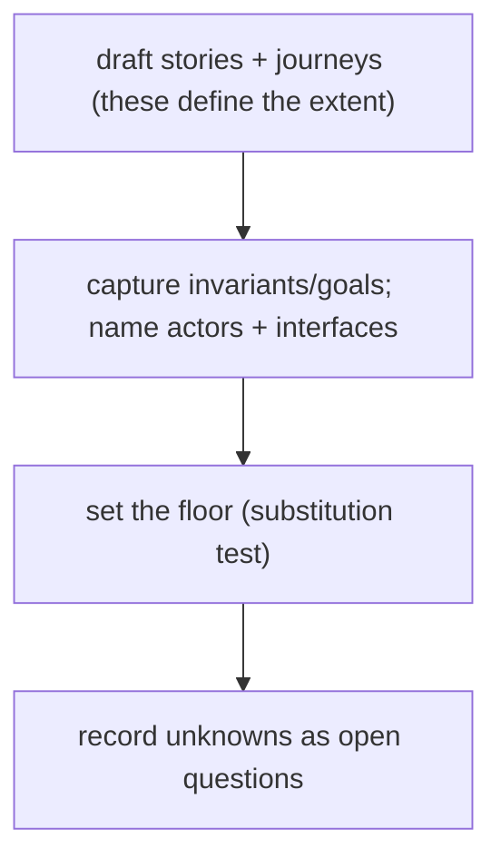

# Journeys & open questions — the behavior-docs method

User stories, the lifecycle journeys, and open questions. Stories and journeys carry IDs so
downstream can cite them (`INV-3`); together they establish the scope's extent (`INV-11`),
so every behavior docs set includes them.

- **Story shape** — the standard role–capability–benefit form: `As <actor>, I want
<capability>, so that <outcome>`.
- **Journey shape** — an ID, a one-line intent, the actor(s), and the flow (prose, or
  Given/When/Then scenarios; a diagram when it branches).

## User stories

**Author**

- **`STORY-1`** — As an **author**, I want one place that answers "how is this supposed to
  behave?", so I don't re-derive intent from code or stale specs.
- **`STORY-2`** — As an **author**, I want to state new intent first and derive the work
  from it, so a change anchors to a durable rule, not a throwaway spec.
- **`STORY-3`** — As an **author** adopting behavior docs on an existing product, I want to
  derive a first behavior docs set from what already exists, so I don't start from a blank
  page.
- **`STORY-8`** — As an **author**, I want a clear rule for what is at fault when a product
  misbehaves, so I know whether to fix the behavior docs or the decision docs.
- **`STORY-9`** — As an **author** whose system interacts with another product, I want each
  interface defined and **reconciled** for agreement (inter-consistency) — cross-checked with a
  peer, or verified by a conformance suite where the other side merely implements my contract —
  so integrations don't silently drift.

**Implementer**

- **`STORY-4`** — As an **implementer**, I want a source of truth to resolve uncertainty
  against, and to locate and classify a gap rather than guess. _(the method's north-star)_
- **`STORY-5`** — As an **implementer**, I want a stable ID to cite from a test or decision
  doc, so the `intent → check` link outlives the spec that introduced it.
- **`STORY-6`** — As an **implementer** re-platforming, I want to regenerate a
  behavior-conformant implementation from the behavior docs + decision docs.
- **`STORY-7`** — As an **implementer**, I want the behavior docs to be self-consistent and
  cross-checkable — and, where two rules genuinely tension, resolved by a declared **precedence**
  — so I can trust which rule wins when I read them.

## Journeys

### `JOURNEY-1` — Starting a behavior docs set

Establish the scope by writing what you already know. Draft the user stories and journeys
first — their union _is_ the extent (`INV-11`). Capture the rules they imply as invariants
and goals, name the actors and interfaces they touch, and set the floor with the
substitution test. Record every unknown as an open question.

### `JOURNEY-2` — Changing intended behavior

Edit the behavior docs first to state the new intended state. Downstream (spec → design →
plan) is re-derived from the change and thrown away on re-convergence. Record a decision doc
(ADR) if the change is consequential. Until the implementation catches up, the difference is a
normal **realization gap** (`INV-15`) tracked against the changed IDs — not a status header on
the doc (`INV-4`).

### `JOURNEY-3` — Resolving an open question

Decide → state the decision in the docs → record a decision doc if consequential → delete
the question. A question is a placeholder for a gap, not a home for debate.

## Open questions

Each open question states the gap, its owner, a resolution path, and where it blocks.

- **`OQ-1` — What counts as a "named concept" for `INV-14`?** Glossary terms alone are too
  narrow; "every noun" is too broad. _Owner_: author. _Path_: iterate on a real set.
  _Blocks_: a mechanized redundancy check.
- **`OQ-2` — A category name for stories + journeys?** They are required and define the
  extent, so they may deserve a collective term. _Owner_: author. _Path_: decide while
  applying the method. _Blocks_: nothing yet.
- **`OQ-3` — The bootstrap flow.** `STORY-3`'s want (existing product → first behavior docs
  set) has no defined journey yet. _Owner_: author. _Path_: co-develop with the companion
  authoring tool. _Blocks_: the bootstrap tool.
- **`OQ-4` — The regeneration flow.** `STORY-6` / `GOAL-17`'s want is forward-looking and
  has no defined journey. _Owner_: author. _Path_: revisit once a first full set exists.
  _Blocks_: re-platform automation.
- **`OQ-5` — Behavior/decision seam.** How to classify observable-behavior-essential "how"
  (durability, backoff-growth). _Owner_: author. _Path_: refine the substitution test with
  an observability framing on real cases. _Blocks_: clean placement at the seam.
