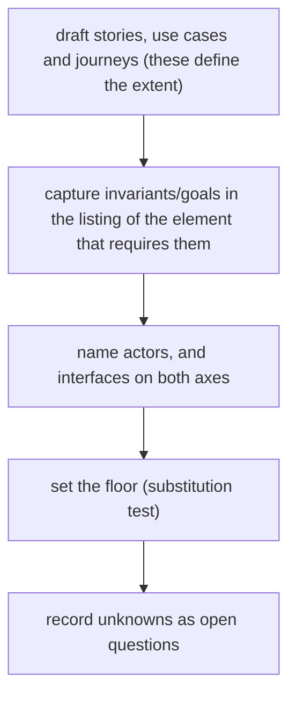
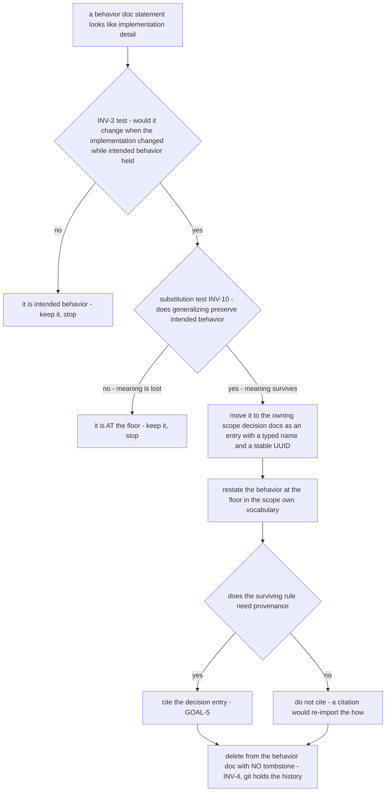

# Use cases, journeys & open questions — the behavior-docs method

User stories, the lifecycle use cases and journeys, and open questions. Stories, use cases and
journeys carry IDs so downstream can cite them (`INV-3`); together they establish the scope's
extent (`INV-11`), so every behavior docs set includes them. Each one carries its own **listing**
of the invariants and goals it exercises and of what it includes by reference (`INV-22`) — there is
no separate coverage section.

## Which kind of element to write

The three kinds are not interchangeable, and **level** decides between the last two
(`behavior-docs/docs/decisions · DEC-VOCAB-1`):

- a **want** with a benefit, not a flow ⇒ a **user story**;
- a flow one **primary actor** completes in one sitting ⇒ a **use case** at **user-goal** level;
- a step below a user goal that more than one element **includes** by reference ⇒ a **use case** at
  **subfunction** level, written once and included, never copied;
- a **summary**-level arc, usually across more than one actor, that includes user-goal use cases by
  reference ⇒ a **journey**.

A story is never "promoted" into a use case and a use case is never re-typed into a journey to make
it look bigger: they answer different questions, and the level test answers which.

### The prescribed shapes

- **Story shape** — the standard role–capability–benefit form: `As <actor>, I want <capability>, so
that <outcome>`, plus its listing.
- **Use case shape** — an ID, the **primary actor**, the **level**, the **preconditions**, a
  **main success scenario** as a numbered step sequence, and the **extensions** off those steps;
  plus its listing, naming anything it includes by reference. A diagram when it branches.
- **Journey shape** — an ID, a one-line intent, the actors, and the arc — which **includes** the
  user-goal use cases by reference rather than restating their steps; plus its listing. A diagram
  when it branches.
- **Scenario shape** — a scenario SHOULD be written `Given` / `When` / `Then`. The exception is the
  one its cited source prescribes: a **use case**'s main success scenario is a numbered step
  sequence with extensions, so it is written that way and not as Given/When/Then.

The glossary defines each kind and cites the established source it is drawn from; those sources are
cited, never reproduced.

## User stories

**Author**

- **`STORY-1`** <!-- uuid: 95f8c8e5-7cd2-4979-a7c5-bc9099178f9d --> — As an **author**, I want one place that answers "how is this supposed to
  behave?", so I don't re-derive intent from code or stale specs. _(→ `USECASE-1`; `INV-1`,
  `INV-13`, `INV-15`.)_
- **`STORY-2`** <!-- uuid: 7ac93c27-f9a4-459a-b1a7-108facac1585 --> — As an **author**, I want to state new intent first and derive the work
  from it, so a change anchors to a durable rule, not a throwaway spec. _(→ `USECASE-2`; `INV-2`,
  `INV-15`, `GOAL-5`.)_
- **`STORY-3`** <!-- uuid: e824087b-5ee6-4ab8-87a8-2711f35fecad --> — As an **author** adopting behavior docs on an existing product, I want to
  derive a first behavior docs set from what already exists, so I don't start from a blank
  page. _(→ `USECASE-1`; `INV-10`, `INV-11`. Gap: `OQ-3`.)_
- **`STORY-8`** <!-- uuid: a725f994-235b-4940-9c8f-1c1a974062dc --> — As an **author**, I want a clear rule for what is at fault when a product
  misbehaves, so I know whether to fix the behavior docs or the decision docs. _(→ `USECASE-2`;
  `INV-21`, `INV-15`.)_
- **`STORY-9`** <!-- uuid: b80977af-7a2f-47ae-987d-7ae344d608ac --> — As an **author** whose system interacts with another product, I want each
  interface defined and **reconciled** for agreement (inter-consistency) — cross-checked with a
  peer, or verified by a conformance suite where the other side merely implements my contract —
  so integrations don't silently drift. _(→ `JOURNEY-4`; `INV-8`, `INV-18`, `INV-20`, `INV-13`.)_

**Implementer**

- **`STORY-4`** <!-- uuid: 5ae35f53-5599-419c-982e-d893c89fe677 --> — As an **implementer**, I want a source of truth to resolve uncertainty
  against, and to locate and classify a gap rather than guess. _(the method's north-star)_
  _(→ `USECASE-1`; `INV-15`, `INV-13`, `INV-22`.)_
- **`STORY-5`** <!-- uuid: c35a453b-f6b8-4311-8a0a-64e5049bf03d --> — As an **implementer**, I want a stable ID to cite from a test or decision
  doc, so the `intent → check` link outlives the spec that introduced it. _(→ `USECASE-5`;
  `INV-3`, `INV-4`.)_
- **`STORY-6`** <!-- uuid: 89aeb9aa-2003-43cb-98bf-7788af4fe956 --> — As an **implementer** re-platforming, I want to regenerate a
  behavior-conformant implementation from the behavior docs + decision docs. _(→ `USECASE-2`;
  `GOAL-17`, `INV-15`. Gap: `OQ-4`.)_
- **`STORY-7`** <!-- uuid: 05c396f9-0466-4937-8032-f6b0611da321 --> — As an **implementer**, I want the behavior docs to be self-consistent and
  cross-checkable — and, where two rules genuinely tension, resolved by a declared **precedence**
  — so I can trust which rule wins when I read them. _(→ `USECASE-3`; `INV-12`, `INV-14`,
  `INV-19`.)_

## Use cases

### `USECASE-1` — Start a behavior docs set <!-- uuid: 8fc13b60-a1c6-4869-bc0a-2b52b12b6e52 -->

_Primary actor:_ `ACTOR-1` (Author). _Level:_ **user-goal**.
_Preconditions:_ a scope worth describing, and no set describing it yet.
_Requires:_ `INV-1`, `INV-3`, `INV-8`, `INV-10`, `INV-11`, `INV-13`, `INV-22`, `GOAL-7`.

Establish the scope by writing what you already know.

1. Draft the user stories, use cases and journeys first — their union _is_ the extent (`INV-11`).
2. Capture the rules they imply as invariants and goals, and carry each one in the listing of the
   element that requires it (`INV-22`).
3. Name the actors and the interfaces they touch, classifying each interface on both axes
   (`INV-8`).
4. Set the floor with the substitution test (`INV-10`).
5. Record every unknown as an open question.

_Extensions._ 1a. The product already exists, so the set is derived from it rather than drafted
(`STORY-3`) — the flow is the same, and how to derive it is `OQ-3`. 2a. A rule has no element that
requires it: it is out of extent, so either an element is missing or the rule is.

### `USECASE-2` — Change intended behavior <!-- uuid: 5497015a-4537-4d18-a7c7-dface48365ea -->

_Primary actor:_ `ACTOR-1` (Author) — a change of intent originates here. _Level:_ **user-goal**.
_Preconditions:_ the intended behavior differs from what the docs say.
_Requires:_ `INV-2`, `INV-4`, `INV-15`, `INV-21`, `GOAL-5`, `GOAL-17`.
_Includes:_ `USECASE-5` (where the change sheds a _how_), `USECASE-3` (where it settles an open
question).

Edit the behavior docs first to state the new intended state. Downstream (spec → design → plan) is
re-derived from the change and thrown away on re-convergence. Cite a decision-doc entry if the
change is consequential (`GOAL-5`). Until the implementation catches up, the difference is a
normal **realization gap** (`INV-15`) tracked against the changed IDs — not a status header on
the doc (`INV-4`).

_Extensions._ 1a. The statement being edited turns out to be realization content, not intended
behavior: relocate it instead (`USECASE-5`). 1b. The right behavior is not yet known: record an
open question and settle it through `USECASE-3` rather than guessing.

### `USECASE-3` — Resolve an open question <!-- uuid: 20083081-2735-4ab4-8a65-d56d59a8a1e7 -->

_Primary actor:_ `ACTOR-1` (Author) — owns the question and its resolution. _Level:_ **user-goal**.
_Preconditions:_ a recorded open question whose answer is now available.
_Requires:_ `INV-4`, `INV-12`, `INV-13`, `INV-19`, `GOAL-5`.

Decide → state the decision in the docs → cite a decision-doc entry if consequential
(`GOAL-5`) → delete the question. A question is a placeholder for a gap, not a home for debate.

_Extensions._ 1a. The question is a newly-surfaced **precedence** conflict between two invariants:
it MUST be settled here and recorded as a decision, never chosen ad hoc (`INV-19`).

### `USECASE-5` — Relocate implementation content out of a behavior doc <!-- uuid: 7d6de948-3ef5-426a-949e-2dd872f06d28 -->

_Primary actor:_ `ACTOR-1` (Author) — owns both inputs of the two-input model, so only the Author
routes content between them. _Level:_ **subfunction** — it is included by reference from
`USECASE-2` and from the conformance pass rather than pursued for its own sake, and it delivers
nothing until the behavior it stood in for is restated at the floor.
_Preconditions:_ a behavior doc carries a statement that may describe _how_ rather than _what_.
_Requires:_ `INV-2`, `INV-3`, `INV-4`, `INV-10`, `GOAL-5`.

A behavior doc has accumulated a statement that describes _how_, not _what_. Route it to the
decision docs without losing the behavior it was standing in for. The **hand-off** is in this
method's scope; the decision docs' own **internal form** is not.

1. **Apply the `INV-2` test.** Would this statement change when the implementation changed while
   intended behavior held? If yes it is realization content and MUST NOT stay.
2. **Confirm it is below the floor, not merely specific**, with the substitution test (`INV-10`).
   Generalize the term: if intended behavior survives the generalization, the content is below the
   floor and MUST move. If generalizing loses essential meaning within the extent, the content is
   **at** the floor — keep it, and stop here. Specificity alone is not a reason to move.
3. **Move it to the owning scope's decision docs**, as an entry carrying a **typed local name** and
   a **stable UUID** minted on its definition line in the same carrier form the behavior docs use
   (`INV-3`), so a behavior doc MAY cite the entry by name and the cross-input reference resolves by
   UUID (`GOAL-5`). Which typed names a decision area uses, and how it lays its entries out, is that
   project's own realization decision — out of this method's scope.
4. **Restate the behavior at the floor.** Where a behavior statement leaned on the moved content,
   the surviving statement MUST say what must hold, in the scope's own vocabulary. Cite the decision
   entry **only** where the rule needs provenance (`GOAL-5`) — never merely to point at the detail
   just shed, which would re-import the _how_ by reference.
5. **Delete it from the behavior doc, with no tombstone** (`INV-4`): no "moved to …" note, no status
   header, no changelog line. Git holds the history.

_Extensions._ 1a and 2a. Either test says "keep": a relocation is not a rename — nothing moves and
the doc is already correct. 4a. The statement being relocated carried the only trace for an
invariant or goal: the replacing listing MUST land before the statement is deleted (`INV-22`).

## Journeys

### `JOURNEY-4` — Propagating a contract change across a reference seam <!-- uuid: 0d9f88cb-d020-43ac-a87e-c415db77073e -->

_Actors:_ `ACTOR-1` (Author) of the owning set, and the `ACTOR-1` of every consuming set — the arc
spans them, which is what makes it a journey rather than a use case. _Level:_ **summary**.
_Requires:_ `INV-3`, `INV-4`, `INV-8`, `INV-15`, `INV-18`, `INV-20`.
_Includes:_ `USECASE-2` (the owner's own edit).

An owner edits its contract (`USECASE-2`). It does **not** notify consumers — an owner does not
know its implementers (`INV-3`). Each consumer instead **re-converges by pull**: it re-runs its
conformance suite (`INV-18`) against the owner's _current_ contract, matching cited elements by
UUID (`INV-3`). A reconciliation failure is a **realization gap** (`INV-15`) on the consumer's
side, tracked against the cited elements — not a status header (`INV-4`). The conformance suite
versions with the contract, so the pull always checks against the latest owner state. This is the
same **level-triggered** re-convergence the docs use everywhere: no push, no notification — each
side pulls the current truth from the reference seam.

## Open questions

Each open question states the gap, its owner, a resolution path, and where it blocks.

- **`OQ-1` — What counts as a "named concept" for `INV-14`?** <!-- uuid: 6b9cb74d-04ea-43f5-b8e7-6522a0c5173c --> Glossary terms alone are too
  narrow; "every noun" is too broad. _Owner_: author. _Path_: iterate on a real set.
  _Blocks_: a mechanized redundancy check.
- **`OQ-2` — A category name for stories + use cases + journeys?** <!-- uuid: 7716c97d-9e14-4e8a-b941-8912e871a7f4 --> All three are required
  and together define the extent, so they may deserve a collective term; until one is settled the
  rules name all three. _Owner_: author. _Path_: decide while applying the method. _Blocks_:
  nothing yet.
- **`OQ-3` — The bootstrap flow.** <!-- uuid: af7f087e-0cdb-4cd4-b4ec-324c6990b6f4 --> `STORY-3`'s want (existing product → first behavior docs
  set) is served only as an extension of `USECASE-1`, not on its own terms. _Owner_: author.
  _Path_: co-develop with the companion authoring tool. _Blocks_: the bootstrap tool.
- **`OQ-4` — The regeneration flow.** <!-- uuid: 731fe9c5-b051-4010-b601-c70b873f16b6 --> `STORY-6` / `GOAL-17`'s want reaches past what any
  element here describes. _Owner_: author. _Path_: revisit once a first full set exists.
  _Blocks_: re-platform automation.
- **`OQ-5` — Behavior/decision seam.** <!-- uuid: ff2fc74c-a5ef-4460-9682-b724202b5338 --> How to classify observable-behavior-essential "how"
  (durability, backoff-growth). _Owner_: author. _Path_: refine the substitution test with
  an observability framing on real cases. _Blocks_: clean placement at the seam.
- **`OQ-6` — Enforcing docs-first, and onboarding.** <!-- uuid: bb2430eb-e523-4f70-9442-14ef7529b843 --> Companion tooling that directs
  contributors to start from the behavior docs, keeps their downstream work tied back to the
  cited IDs (`INV-3`, `INV-21`), and helps maintain the docs. The **conformance/drift pass**
  partially realizes this by checking a set against the method, but the direct-to-source
  onboarding and the tie-back enforcement are undefined. _Owner_: author. _Path_: co-develop
  with the companion tooling. _Blocks_: automated docs-first enforcement.
