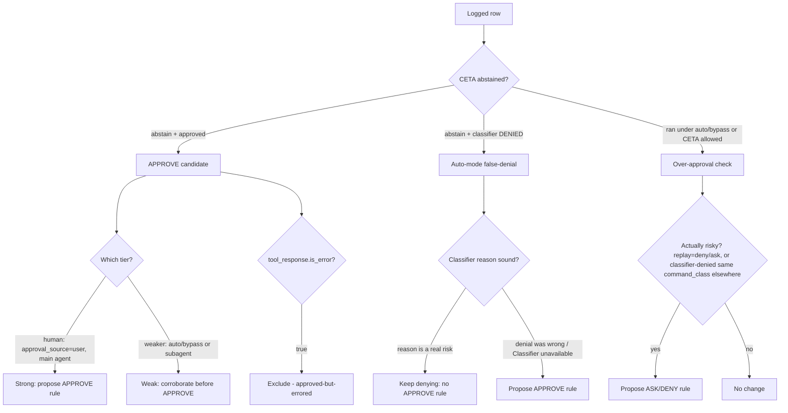

# Auto-mode as a two-way calibration signal

Claude Code's `auto_mode_classifier` decides, without a prompt, whether to let a
tool call run in auto/bypass mode. CETA can treat that decision as a **two-way
calibration signal**: the same dataset yields both new APPROVE rules and new
ASK/DENY rules. This note defines when to write which. It is consumed by
`identify-hook-misses` Steps 4-6.

All terms below are defined purely from the `evaluate --format=json` fields — see
[database-schema.md](database-schema.md#calibration-tiers-auto-mode-two-way-signal)
and [terminology.md](terminology.md#calibration-terms-auto-mode-two-way-signal).
The skill keeps its "no raw sqlite3" rule; every field is read from the CLI.

## The two directions

## Write an APPROVE rule when

- The command is an **APPROVE candidate** (`hook_decision == "abstain"` and
  `outcome == "approved"`), AND
- It has **human (PRIMARY) tier** support (`approval_source == "user"` and
  `agent_type == null`) — the strongest evidence — OR a **false-denial** whose
  mined `auto_mode_classifier` reason was NOT a real risk (e.g. the reason is
  literally `Classifier unavailable`, an infrastructure gap), AND
- The row is NOT approved-but-errored (`tool_response.is_error != true`).

You SHOULD NOT propose an APPROVE rule on **weaker-tier** support alone
(`approval_source in {auto, bypass}` or `agent_type != null`): machine or
subagent approval is not a human endorsement. Use it only to corroborate a
pattern that already has human-tier evidence, and say so in the bead.

## Write an ASK/DENY rule when

- A command **ran under `auto`/`bypass`** and is **"actually risky"**
  (`replay_result in {"deny", "ask"}`), OR
- A **CETA-`allow`** row's `command_class` was **denied by the
  `auto_mode_classifier` elsewhere** (the over-approval cross-reference, joined
  on the FULL normalized command — `command_class`, never the leading
  executable). A non-empty result means CETA approves a command another safety
  layer flags as risky, so CETA SHOULD at least ASK.

`also_risky_by_replay > 0` (Step 6 query 2) strengthens the case: the current
engine would itself now deny/ask some of those rows.

## Data-state caveat (read before reconciling counts)

`approval_source` is **derived** from `permission_mode`, and `permission_mode` is
`null` on every **pre-v5** row. On a database with no v5 rows yet, EVERY row
derives to `approval_source == "unknown"`, so:

- the `user` / `auto` / `bypass` tiers are **empty** (a justified empty set, not a
  bug) — the human/machine split only becomes available as v5 rows accumulate;
- `tool_response` is likewise `null` on pre-v5 rows, so the approved-but-errored
  exclusion currently drops nothing (again justified-empty);
- the `agent_type` axis IS populated (it is a stored column, not derived), so the
  subagent slice of the weaker tier is available even on an all-`unknown`
  database.

When you hit this state, fall back to the `agent_type` axis for the weaker-tier
segmentation and STATE the caveat in your findings rather than reporting the
empty human tier as "no candidates".
