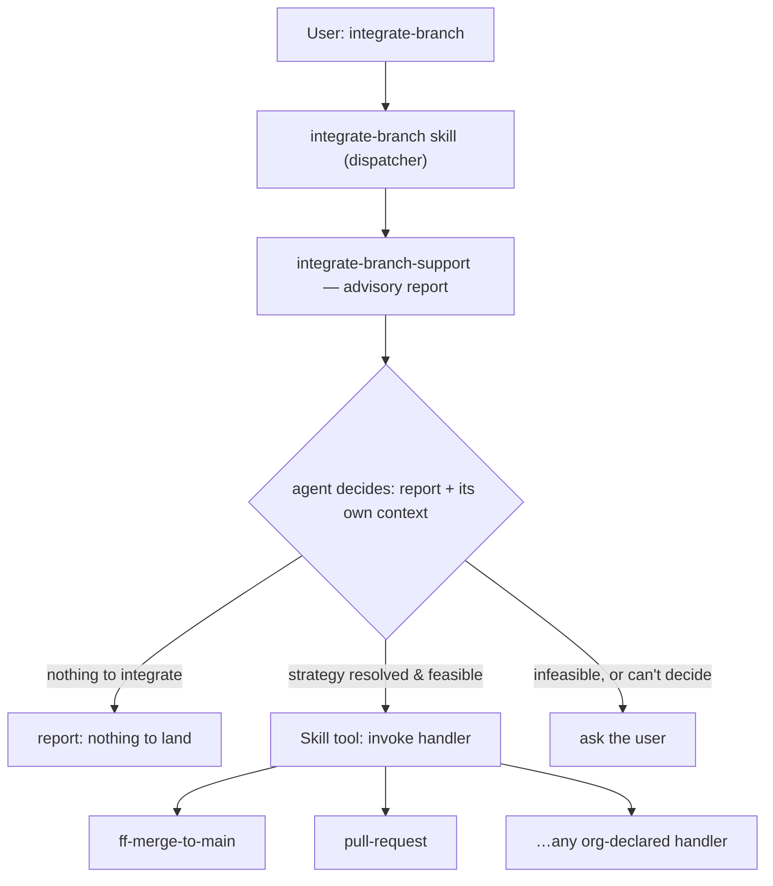

# integrate-branch

Land the current branch by whichever method the repo actually uses, without an
agent hand-rolling a rebase-and-merge (or forgetting to open a PR) every time.

## The Strategy design

`integrate-branch` is a thin **Strategy-pattern dispatcher**. It does not know how
to land a branch itself — it runs an advisory bash tool
(`integrate-branch-support`) to gather facts about the repo, decides (or asks)
which integration method applies, and delegates to a **Command-style handler
skill** named after the resolved `strategy`:



`integrate-branch-support` never decides — it returns facts and, when it can, a
recommended `strategy`; it never returns `ask`/`halt`/`none`. Those are judgment
calls the `integrate-branch` skill makes, guided by the workspace's Tier R rules
(the canonical clone MUST stay on its primary branch and clean; a canonical-
advancing integration method MUST halt if it isn't). See the `integrate-branch`
skill (`skills/integrate-branch/SKILL.md`) for the full decision logic, and the
design spec
(`docs/superpowers/specs/2026-07-13-canonical-main-worktree-discipline-design.md`
in the parent repo) for the rules this plugin implements.

## Shipped handlers

Both handlers are sibling skills in this plugin; the dispatcher does not implement
either one's mechanics — it only decides which applies and hands off via the
`Skill` tool, using the `strategy` string as the skill name.

| Handler                                                 | Method                                                                                                                                                                                                                                                                                       | Cleanup                                                        |
| ------------------------------------------------------- | -------------------------------------------------------------------------------------------------------------------------------------------------------------------------------------------------------------------------------------------------------------------------------------------- | -------------------------------------------------------------- |
| `ff-merge-to-main` (`skills/ff-merge-to-main/SKILL.md`) | Rebase the worktree onto the primary branch, then fast-forward-only merge into the canonical clone. Halts if the canonical clone is off-primary or dirty.                                                                                                                                    | Retires the worktree and feature branch.                       |
| `pull-request` (`skills/pull-request/SKILL.md`)         | Push the feature branch, open a new PR or confirm/update an existing one. **Never auto-merges** — merging a PR-driven repo requires explicit human action outside this plugin. Surfaces (but never halts on) a canonical-clone anomaly, since this method never touches the canonical clone. | Keeps the worktree and branch — the work isn't integrated yet. |

## The uniform handler contract

Skills don't receive typed arguments, so every handler **re-derives its own
context from git** rather than trusting values passed to it:

- **`<WT>`** — the current working tree (wherever the handler is running).
- **`<FB>`** — the current branch (`git rev-parse --abbrev-ref HEAD`; detached →
  halt, nothing to integrate).
- **`<CC>`** — the canonical clone: the main working tree of the common git dir
  (`git rev-parse --git-common-dir`, resolved to its parent).
- **primary branch** — the shared resolution used everywhere in this plugin:
  `git config --get pgii-integrate-branch.primaryBranch` → else `git symbolic-ref
refs/remotes/origin/HEAD` → else `main`.

Beyond re-deriving context, every handler MUST:

- Re-verify Tier R preconditions itself (never trust that the dispatcher already
  checked — e.g. `ff-merge-to-main` re-checks the canonical clone even though
  `integrate-branch` already surfaced the same anomaly).
- Integrate by its own method, halting and reporting on anomaly per its own
  contract (a canonical-advancing method halts; a method that never touches the
  canonical clone surfaces the anomaly and proceeds).
- Clean up per its own method (or explicitly not, per its own method).
- Report one of `landed | pr-opened | pr-updated | stopped:<reason>`.

This uniformity is what makes the dispatcher extensible without changes to itself.

## Adding a custom handler

An org (or a single repo) can add its own handler without touching this plugin's
`integrate-branch` skill:

1. Declare the strategy name in the target repo's git config:
   ```bash
   git config pgii-integrate-branch.strategy <name>
   ```
   (local, never pushed — works even in repos the org can't commit config into).
2. Ship a skill named `<name>` (matching the `strategy` string exactly) that
   follows the handler contract above — re-derive `<WT>`/`<FB>`/`<CC>`/primary
   branch from git, re-verify preconditions, integrate by its own method, clean up
   per its own method, and report one of `landed | pr-opened | pr-updated |
stopped:<reason>` (or a `<name>`-specific outcome, documented in its own
   `SKILL.md`).

As long as a skill named `<name>` is installed, `integrate-branch` treats it
identically to the two built-in handlers — it only confirms the declared strategy
names an installed skill and that it's feasible given the repo's facts (e.g. a
`pull-request`-style custom handler is infeasible with no remote) before invoking
it.
