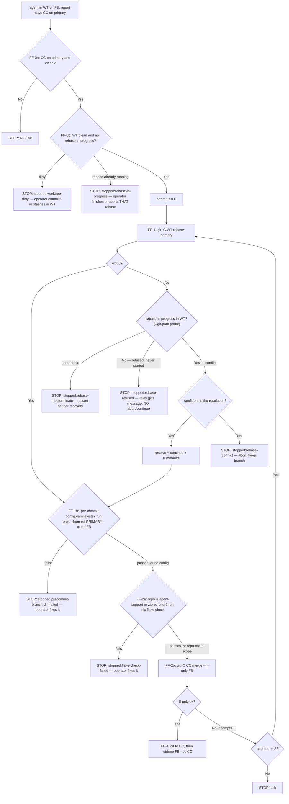

# ff-merge-to-main handler

This is the **Command-style handler** for the `ff-merge-to-main` integration
strategy: land the current branch by rebasing it onto the primary branch, then
fast-forward-merging it into the canonical clone, then retiring the worktree and
branch. It is invoked by the `integrate-branch` skill (via the `Skill` tool, using
the strategy string as the skill name) — do not invoke it directly unless you are
deliberately replaying its flow outside the dispatcher.

Because that dispatch goes through the `Skill` tool, this handler MUST NOT set
`disable-model-invocation` in its frontmatter. The flag is enforced against the
`Skill` tool and also drops the entry from the model-visible skill listing, so
setting it breaks both halves of the dispatcher's Step 4 — its "is this strategy
installed" check and the dispatch itself. It was set here once as a listing-token
saving and reverted for exactly this reason (bd `pg2-okzl0`); the prose above is
the only sanctioned deterrent against invoking a handler directly.

Skills receive no typed arguments, so this handler **re-derives its own context
from git** rather than trusting values handed to it. It re-verifies its own
preconditions (FF-0) rather than trusting the caller's anomaly check — even if
`integrate-branch` already surfaced a canonical anomaly, this handler halts on it
independently.

## Step 0 — Re-derive context from git

Do not assume `<WT>`, `<FB>`, `<CC>`, or the primary branch were passed in —
compute them fresh by running `integrate-branch-support --facts` (it is on
`PATH`) and parsing its stable `KEY=value` block:

```bash
while IFS='=' read -r key value; do
  case "$key" in
  WT) WT="$value" ;;
  FB) FB="$value" ;;
  CC) CC="$value" ;;
  PRIMARY) PRIMARY="$value" ;;
  DIRTY) DIRTY="$value" ;;
  AHEAD) AHEAD="$value" ;;
  BEHIND) BEHIND="$value" ;;
  PRECOMMIT) PRECOMMIT="$value" ;;
  esac
done < <(integrate-branch-support --facts)
```

- **`<WT>`** = the current working tree's worktree root — wherever this handler
  is running.
- **`<FB>`** = the current branch. If it reads `(detached)`, there is no feature
  branch to integrate — **halt and report** "nothing to integrate: detached
  HEAD," and stop here.
- **`<CC>`** = the canonical clone, i.e. the **main working tree** of the common
  git dir. This is true whether or not `<WT>` and `<CC>` are the same directory.
- **primary branch** (`<PRIMARY>`) = the shared resolution (the same one every
  caller of `integrate-branch-support` uses, so they all agree): `git config
--get pgii-integrate-branch.primaryBranch` → else `git symbolic-ref
refs/remotes/origin/HEAD` (stripped of the `refs/remotes/origin/` prefix) →
  else `main`.
- `DIRTY`, `AHEAD`, `BEHIND`, and `PRECOMMIT` are also available from this same
  call — FF-0b below uses `DIRTY` instead of re-running `git status --porcelain`
  itself.

## FF-0 — Precondition: canonical steady-state, and `<WT>` actually rebasable

FF-0 checks **two** trees, because the two steps that follow depend on different
ones: FF-2 advances `<CC>`'s primary branch, and FF-1 rebases `<WT>`. Checking
`<CC>` alone would leave the one tree FF-1 actually operates on unverified.

### FF-0a — the canonical clone (`<CC>`)

Before touching anything, verify the canonical clone is in the steady state Tier R
requires:

```bash
git -C "$CC" rev-parse --abbrev-ref HEAD   # MUST equal the primary branch
git -C "$CC" status --porcelain            # MUST be empty
```

If either check fails — canonical is off the primary branch, or canonical has
local changes — **halt and report** (R-3/R-8). Do **not** reset, stash, or
re-checkout the canonical clone to "fix" it; that is exactly the work-around Tier R
forbids. Report the anomaly and stop; this handler goes no further.

### FF-0b — the worktree FF-1 will rebase (`<WT>`)

`<WT>` MUST be clean, and MUST NOT already have a rebase in progress. Verify both
**before** FF-1 runs:

```bash
[ "$DIRTY" = no ]                          # from Step 0's integrate-branch-support --facts call; MUST be "no"
```

Reusing `$DIRTY` here (rather than re-running `git -C "$WT" status --porcelain`)
is safe: nothing between Step 0 and FF-0b performs any action that could dirty
`<WT>`, so the fact captured at Step 0 is still current.

```bash
# MUST print nothing: no rebase already in progress in <WT>. Both git backends.
for name in rebase-merge rebase-apply; do
  path="$(git -C "$WT" rev-parse --git-path "$name")"
  case "$path" in /*) ;; *) path="$WT/$path" ;; esac   # re-anchor a relative answer on <WT>
  if [ -d "$path" ]; then echo "rebase already in progress: $path"; fi
done
```

Each failure is its **own** halt, because each has its own disposition and FF-0 is
the last point at which they are still distinguishable:

- **`<WT>` dirty** (`$DIRTY = yes`) → **halt and report** `stopped:worktree-dirty`
  with the absolute path of `<WT>` and, for the diagnostic detail `$DIRTY` alone
  doesn't carry, `git -C "$WT" status --porcelain`'s output. The operator commits
  or stashes in `<WT>`, then re-invokes `integrate-branch`.
- **rebase already in progress in `<WT>`** → **halt and report**
  `stopped:rebase-in-progress` with the state directory the probe found. The
  operator finishes that rebase (`git -C "$WT" rebase --continue`) or abandons it
  (`git -C "$WT" rebase --abort`), then re-invokes `integrate-branch`.

Unlike FF-0a, these are **caller-state** halts rather than Tier R anomalies: `<WT>`
is the tree the caller handed this handler, and both dispositions above are
ordinary operator actions, not the canonical-clone work-arounds Tier R forbids.
The handler still MUST NOT perform either one itself — committing, stashing,
continuing, or aborting on the caller's behalf silently decides the fate of work
the handler did not create.

**FF-0b is load-bearing, not a cheaper early copy of an FF-1 check.** Neither
failure is reliably detectable once FF-1 has run:

- **A dirty `<WT>` may not stop FF-1 at all.** `git rebase` refuses on a dirty tree
  only while `rebase.autoStash` is **off**; with it on, git stashes, rebases, and
  pops — and reports **exit 0** even when that pop leaves conflicts behind.
  Verified on git 2.54 with `rebase.autoStash=true`: the rebase printed both
  "Applying autostash resulted in conflicts" and "Successfully rebased", exited
  **0**, and left `<WT>` at `UU <file>` with the autostash still in
  `git stash list`. FF-1 reads exit 0 as its clean no-conflict path and proceeds;
  FF-2 then advances `<CC>`'s primary branch; and only FF-4 fails, because
  `git worktree remove` refuses a worktree that "contains modified or untracked
  files". The result is **half-landed** — merged onto the primary branch, worktree
  still present, and the operator's uncommitted work stranded in an orphaned
  autostash. That is precisely the state FF-0b exists to prevent, and no later step
  can.
- **A rebase already in progress is indistinguishable at FF-1** from a conflict
  FF-1 itself caused — the state directory is present either way (git refuses the
  second rebase with exit 128, "there is already a rebase-merge directory"). Only a
  check that runs BEFORE the rebase separates "someone else's unfinished rebase"
  from "our conflict".

Both readings cut the other way too: because FF-0b establishes that `<WT>` is clean
and un-rebasing, FF-1's exit 0 genuinely means a clean rebase (nothing was there to
autostash) and FF-1's state directory genuinely means FF-1's own conflict. FF-0b is
what makes FF-1's outcomes decisive.

**Why `rev-parse --git-path`, and why it is not optional here.** `<WT>` is
routinely a linked git **worktree** — that is the whole point of the flow FF-4
retires — and a linked worktree's `.git` is a **gitfile**, not a directory: its
rebase state lives under the canonical clone's `.git/worktrees/<name>/`. A
hardcoded `"$WT/.git/rebase-merge"` can therefore **never** exist there, so every
pre-existing rebase would be missed and every refused rebase later misread as a
conflict. `git rev-parse --git-path` asks git where the state actually is. It
prints an **absolute** path in a linked worktree but a path **relative to git's own
cwd** in a main worktree, which is why a relative answer is re-anchored on `<WT>`
(`-C "$WT"` is what made that git's cwd) and never on this handler's arbitrary cwd.
Both backends MUST be probed: `rebase-merge` for the merge backend (interactive,
and the default since git 2.26) and `rebase-apply` for the older apply/am backend
that `--apply` / `--whitespace` still select. Prior art for this probe, carrying
the same rationale: `phillipg-nix-repo-base`'s `pnwf_rebase_in_progress` in
`modules/pnwf/lib/pnwf-lib.bash`.

## FF-1 — Rebase the worktree onto primary

```bash
git -C "$WT" rebase "$PRIMARY"
```

A non-zero exit here conflates **two different states** that take **opposite**
recoveries. Either git started the rebase and stopped mid-way (a **conflict** —
something is there to resolve, and `--continue` / `--abort` apply), or it
**refused** to start and ran nothing (so there is nothing to resolve and neither
verb applies). Separate them by the **observable** — git's own rebase-in-progress
state directory, the same state `git rebase --continue` / `--abort` themselves
require — and never by matching git's message text, which is localized and changes
between git versions:

```bash
# Prints a path iff a rebase is in progress. Same probe and same --git-path
# rationale as FF-0b — a hardcoded "$WT/.git/<name>" cannot work in a worktree.
for name in rebase-merge rebase-apply; do
  path="$(git -C "$WT" rev-parse --git-path "$name")"
  case "$path" in /*) ;; *) path="$WT/$path" ;; esac
  if [ -d "$path" ]; then echo "in progress: $path"; fi
done
```

FF-0b is what makes this reading **decisive** rather than merely suggestive: it
already established that no rebase was in progress in `<WT>` before this step, so
state found here can only be the state this step created — and that `<WT>` was
clean, so exit 0 here cannot be the autostash false-success FF-0b describes.

- **Exit 0 — no conflict:** proceed to FF-2.
- **Conflict (rebase in progress), and you are confident in the resolution:**
  resolve it, continue the rebase (`git -C "$WT" rebase --continue`), and do
  **not** stop — but summarize the resolution to the user (what conflicted, how it
  was resolved) so it isn't silent.
- **Conflict (rebase in progress), and you are not confident:** `git -C "$WT"
rebase --abort` to restore the pre-rebase state, keep the branch and worktree
  exactly as they were, and hand off to the user — report
  `stopped:rebase-conflict` with what conflicted. Do not guess at a resolution you
  aren't sure of.
- **Refused (NO rebase in progress) — it never started:** report
  `stopped:rebase-refused` with the absolute path of `<WT>` and git's own refusal
  message **verbatim**. Nothing ran, so there is nothing to resolve: you MUST NOT
  run `git rebase --abort` or `git rebase --continue` on this path — verified on git
  2.54, with no rebase in progress both exit **128** — and you MUST NOT dispose of
  whatever blocked it (commit, stash, discard) yourself. FF-0b already ruled out the
  two commonest causes, so a refusal that reaches here is one FF-0b does not
  enumerate — an unborn `HEAD`, an in-progress merge/cherry-pick/bisect, an
  unmerged index, a repo policy hook. Relay git's message rather than guessing
  which; the operator dispositions it, then re-invokes `integrate-branch` and FF-1
  rebases for the first time.
- **Indeterminate (the observable itself could not be read):** report
  `stopped:rebase-indeterminate`, quoting both git's failure and the probe's. You
  MUST NOT assert either recovery above — which one applies is exactly what could
  not be determined, and a confident wrong answer is worse than an honest unknown.

## FF-1b — Consolidated `prek` check across the whole branch diff

Every commit on `<FB>` already had its own hooks run against its own staged
diff at commit time — but that only ever validates one commit in isolation.
Nothing before this step has checked the **union** of every file any commit on
the branch touched, together, in one pass. This step closes that gap, and it
applies to **every repo that has a `.pre-commit-config.yaml`** — not just the
two repos FF-2a special-cases:

```bash
if [ -f "$WT/.pre-commit-config.yaml" ]; then
  (cd "$WT" && prek run --from-ref "$PRIMARY" --to-ref "$FB")
fi
```

No `.pre-commit-config.yaml` → skip silently; nothing to run. `prek`'s
`--from-ref`/`--to-ref` diff-expression form resolves exactly the file set
`git diff --name-only "$PRIMARY"...` would, so this scopes to files the branch
actually touched, not the whole repo (`--all-files` MUST NOT be used here for
the same reason it MUST NOT be used as a per-commit gate — it forces every
hook over the whole tree and can false-block on a pre-existing violation the
branch never touched). `<FB>` already reflects FF-1's rebase, so this runs
against the freshly-rebased tree, at the default `pre-commit` hook stage —
the same stage every individual commit already ran, just scoped to the whole
branch's diff instead of one commit's.

This is **distinct from, and runs before,** FF-2a below: FF-1b checks the
`.pre-commit-config.yaml` hook set (fast, prek-cached, every repo); FF-2a
checks the heavier `checks.*` derivations under `nix flake check` (slow,
repo-scoped to the two repos with no external CI). Neither substitutes for
the other — FF-1b passing does not mean FF-2a can be skipped, and FF-2a
passing does not mean FF-1b can be skipped.

A non-zero exit here — **halt and report** `stopped:precommit-branch-diff-failed`
with the repo name, the failing hook(s), and `prek`'s own output. Do not
attempt to fix the violation yourself; that decision belongs to the operator.

## FF-2 — Precondition: repo-scoped `nix flake check`, then fast-forward-only merge

FF-2 splits into two parts, the same way FF-0 does: FF-2a is a **blocking
precondition** that only two specific repos require, and FF-2b is the
fast-forward merge itself, unchanged for every other repo this handler lands.

### FF-2a — Repo-scoped `nix flake check` (blocking)

`phillipgreenii-nix-agent-support` and `phillipg-nix-ziprecruiter` have no
external CI system — their pre-commit/pre-push hooks have historically been the
only automated, whole-repo check they get, and a separate design is narrowing
those hooks (moving heavyweight test hooks out of pre-commit). For **these two
repos only**, this handler runs a full `nix flake check` against the just-rebased
`<WT>` before it moves `<CC>`'s primary branch, so trimming those hooks does not
leave a landing with no automated check at all.

**Run this exact block; do not eyeball the match or reconstruct the pattern from
memory.** `basename "$CC"` is a real, cheap command — actually run it (this block
is meant to be executed verbatim, not paraphrased) and let the shell's own `case`
decide:

```bash
case "$(basename "$CC")" in
phillipgreenii-nix-agent-support | phillipg-nix-ziprecruiter)
  (cd "$WT" && nix flake check)
  ;;
esac
```

**Known trap — a shorter shorthand is not the match value.** Plenty of prose
elsewhere (ADR titles, plan docs, even this workspace's own agent-rules text)
casually calls the first repo `nix-agent-support`, dropping the
`phillipgreenii-` prefix. That shorthand is **not** what `basename "$CC"`
prints for that repo and **MUST NOT** be substituted for the literal pattern
above. Bead `pg2-5hww2` recorded exactly this failure: a lander agent recalled
the pattern as `nix-agent-support`, "concluded" the repo's real basename
(`phillipgreenii-nix-agent-support`) didn't match, and silently skipped this
MUST-run gate — even though the two quoted literals in the `case` above are
correct and always have been. If your own reasoning about whether this repo
"matches" produces any string other than a verbatim copy of one of the two
`case` literals above, that reasoning is wrong; re-read the block above rather
than trust recollection, or just run it and observe which branch (if any)
executes.

Match on `basename "$CC"` — the canonical clone's directory name, the same
identifier this workspace's own `pn-workspace.toml` and root `CLAUDE.md` repo-label
table key on — not on the git remote: for at least one of these two repos
(`phillipg-nix-ziprecruiter`, remote `phillipg_mbp.git`) the remote's repo name
does not match the conventional workspace name. The root `CLAUDE.md` repo-label
table's **short label column** (e.g. `agent-support`) is a different, shorter
identifier still — it is the label used on beads, never the `case` match value
either.

Every other repo this handler lands (every other repo in this workspace's
`pn-workspace.toml`, all of which also resolve to `ff-merge-to-main`) skips this
step entirely — they either already have external CI or have not been evaluated
for this gap, and this handler MUST NOT widen the check to them without a
separate decision.

`nix flake check` can run long. Give it an explicit generous timeout, or
background it and wait for it to finish — but "wait" means STAY IN THIS SAME
INVOCATION (keep calling tools) until it resolves, never send a final response
expecting a later notification to resume you. This handler is usually
executing inside a dispatched (non-top-level) subagent's own invocation — e.g.
the lander subagent `/pb:drain-beads`' LAND step dispatches — and such an
invocation is a bounded request/response: the moment it stops calling tools
and returns final text, that invocation is OVER, permanently, unlike the
top-level orchestrating session's turn, which genuinely can be resumed later
by a task-notification. Ending the turn with something like "I'll wait for the
Monitor notification to arrive" is a no-op that leaves the land unfinished
(observed live: bead `tc-wklt`). Use this pattern verbatim:

```
Bash({ command: "nix flake check > /tmp/flake-check.log 2>&1; echo DONE >> /tmp/flake-check.log",
       run_in_background: true })
Monitor({ command: "until grep -q '^DONE' /tmp/flake-check.log; do sleep 2; done; tail -c 4000 /tmp/flake-check.log",
          description: "wait for nix flake check", timeout_ms: 1200000 })
# Monitor's tool result comes back immediately as "started" — that is NOT
# completion. Do not send a final response yet. The completion event (with the
# tailed log) arrives later as a notification INTO this same invocation, as
# long as you keep it open — never end your turn here; continue FF-2a/FF-2b
# once that event lands.
```

Do not skip or truncate the check for expediency.

A non-zero exit here is a **new**, repo-scoped precondition failure — distinct
from every rebase/merge reason below. **Halt and report** `stopped:flake-check-failed`
with the repo name and the command's own failure output, and do **not** proceed
to FF-2b. Do not attempt to fix the failure yourself; that decision (fix the
flake, or investigate what the narrowed pre-commit hooks would have missed)
belongs to the operator.

### FF-2b — Fast-forward-only merge in the canonical clone

```bash
git -C "$CC" merge --ff-only "$FB"
```

This is valid even though `<FB>` is checked out in `<WT>`, not in `<CC>` — a
fast-forward-only merge only moves `<CC>`'s ref forward; it does not need `<FB>`
checked out where it runs.

## FF-3 — Retry loop on a lost fast-forward race

The primary branch can advance between FF-0's check and FF-2b's merge (another
agent landing concurrently, per R-7) — so `merge --ff-only` can fail with "not
possible to fast-forward." Handle it as a bounded retry, not a one-shot failure:

- `attempts = 0`.
- If FF-2b fails as non-fast-forward: `attempts++`, then **retry from FF-1**
  (rebase `<WT>` onto the now-advanced primary again, then re-attempt FF-1b and
  FF-2 — this re-runs FF-1b's consolidated `prek` check for every repo, and for
  the two named repos also FF-2a's `nix flake check`, both against the freshly
  rebased tree, before FF-2b's merge is retried).
- When `attempts` reaches **2** (the second consecutive non-ff failure), **stop
  and ask** the user rather than retry indefinitely — a persistent ff-race
  warrants attention (R-7).

The loop re-enters at **FF-1**, not FF-0, and does not need to re-run FF-0b:
FF-2 is only ever reached when FF-1's rebase completed, which leaves `<WT>` clean
with no rebase in progress — so FF-0b's invariant still holds when FF-1 re-runs,
and FF-1's own classification stays decisive on the retry pass. A refusal that
first appears on a retry is therefore reported the same way, by FF-1.

## FF-4 — Cleanup

Only reached after FF-1b (when a `.pre-commit-config.yaml` exists) and FF-2
succeed (FF-2a's check, when it applies, and FF-2b's merge). Delegate to
`wtdone` (bead `pg2-hpurf`) rather than hand-rolling the
fsmonitor-stop / worktree-remove / branch-delete / prune sequence: it folds in
a liveness guard this handler did not previously have. **Relocate the shell
out of `<WT>` into `<CC>` first** — removing the worktree you are currently
standing in breaks every subsequent command in that shell, and `wtdone`'s
liveness probe cannot protect the caller from itself (it can only see OTHER
processes anchored inside `<WT>`, never the shell issuing the call):

```bash
cd "$CC"                # leave <WT> before tearing it down
wtdone "$FB" --cc "$CC"
```

`wtdone` refuses (non-zero exit, naming the offending PIDs) if any live
process is still anchored inside `<WT>` — most likely this handler's own
shell if step 0 was skipped, or a peer session that isolated the same
worktree — leaving `<WT>` and `<FB>` untouched. Otherwise it stops `<WT>`'s
fsmonitor daemon (best-effort — it may be absent), removes `<WT>`, deletes
`<FB>` with a plain `git branch -d` (never `-D` — an unmerged branch is
refused, never force-discarded), prunes worktree admin, and prints the landed
sha plus `<CC>`'s remaining worktrees. `git worktree remove` (which `wtdone`
calls, never forced) refuses to remove the **main** working tree, so even if
something upstream got `<WT>` and `<CC>` confused, the canonical clone is
inherently protected from this step.

## Decision flow



## Reporting the outcome

Report the result back using the shared handler vocabulary: `landed` (FF-4
completed) or `stopped:<reason>` (any halt above). This handler never returns
`pr-opened` — that outcome belongs to the `pull-request` handler. Its `<reason>`
values, and the disposition each one asks of the operator:

| `<reason>`                     | Raised by | What the operator does next                                                  |
| ------------------------------ | --------- | ---------------------------------------------------------------------------- |
| detached `HEAD`                | Step 0    | check out the feature branch                                                 |
| canonical off-primary or dirty | FF-0a     | Tier R guidance — never reset the canonical (R-3/R-8)                        |
| `worktree-dirty`               | FF-0b     | commit or stash in `<WT>`, then re-invoke                                    |
| `rebase-in-progress`           | FF-0b     | finish or abort **that** rebase in `<WT>`, then re-invoke                    |
| `rebase-conflict`              | FF-1      | resolve the conflict, then re-invoke                                         |
| `rebase-refused`               | FF-1      | disposition whatever git's message names, then re-invoke                     |
| `rebase-indeterminate`         | FF-1      | inspect `<WT>`; the handler asserts no recovery                              |
| `precommit-branch-diff-failed` | FF-1b     | fix the hook violation (every repo with prek configured), then re-invoke     |
| `flake-check-failed`           | FF-2a     | fix the flake (repo-scoped; only agent-support/ziprecruiter), then re-invoke |
| ff-race retry limit hit        | FF-3      | re-run once concurrent landings settle                                       |

These reasons MUST NOT be collapsed into one another — above all,
`rebase-conflict` MUST NOT absorb the four other rebase reasons
(`worktree-dirty`, `rebase-in-progress`, `rebase-refused`,
`rebase-indeterminate`). They carry **opposite** recoveries, and the consumer keys
its operator advice on the reason string: `land-workforest`'s "Operator report on
any stop" maps each to a different next action. Reporting a refusal or a dirty
worktree as `rebase-conflict` sends the operator hunting a conflict that does not
exist, and prescribes a `git rebase --continue` that exits 128.

## Rules this handler enforces (Tier R, RFC 2119)

- The handler MUST re-derive `<WT>`, `<FB>`, `<CC>`, and the primary branch from
  git itself rather than trusting caller-supplied values (skills have no typed
  arguments).
- The handler MUST halt and report — not work around — if `<CC>` is off the
  primary branch or dirty at FF-0a (R-3, R-8), even if the caller already surfaced
  the same anomaly.
- FF-0 MUST verify **both** trees before FF-1 runs: `<CC>` on the primary branch
  and clean (FF-0a), and `<WT>` clean with no rebase already in progress (FF-0b).
  Checking `<CC>` alone leaves the tree FF-1 actually rebases unverified.
- FF-0b's dirty check MUST NOT be deferred to FF-1 on the assumption that a dirty
  tree makes `git rebase` fail. Under `rebase.autoStash` it does not: the rebase
  reports exit 0, FF-2 advances the canonical primary branch, and FF-4 is the first
  step to fail — a half-landed state no later step can prevent.
- The handler MUST NOT conflate the two FF-0 halts. `<CC>`'s is a Tier R violation
  it MUST NOT work around (R-3, R-8); `<WT>`'s is caller state whose disposition is
  an ordinary operator action — but the handler MUST NOT perform that disposition
  itself either, in `<WT>` or `<CC>`.
- On a detached `HEAD` in `<WT>`, the handler MUST halt and report "nothing to
  integrate" rather than guess at a feature branch.
- The handler MUST rebase (`<WT>` onto primary) before attempting the fast-forward
  merge — this is the rebase-first requirement; it MUST NOT fall back to a plain
  non-fast-forward merge.
- When `<WT>` has a `.pre-commit-config.yaml`, FF-1b MUST run
  `prek run --from-ref <PRIMARY> --to-ref <FB>` against the rebased `<WT>`
  before FF-2, and MUST halt and report `stopped:precommit-branch-diff-failed`
  on any non-zero exit rather than proceed to FF-2 — this check is universal
  (every repo with prek configured, not just agent-support/ziprecruiter): a
  per-commit hook run only ever validated ONE commit's own diff, never the
  union of every commit's changes across the whole branch. The handler MUST
  NOT use `--all-files` here (same false-block risk as a per-commit
  `--all-files` run), and MUST NOT skip it on the reasoning that FF-2a will
  also run for the two named repos — FF-1b's hook set and FF-2a's `checks.*`
  derivations check different things, and neither substitutes for the other.
- When the repo being landed is `phillipgreenii-nix-agent-support` or
  `phillipg-nix-ziprecruiter` (identified by `basename "$CC"`), FF-2a MUST run a
  full `nix flake check` against the rebased `<WT>` and MUST halt and report
  `stopped:flake-check-failed` on any non-zero exit, rather than proceed to
  FF-2b's merge — these two repos have no external CI, so this handler's own gate
  is the only whole-repo check they get at landing time. The handler MUST NOT
  widen this requirement to any other repo it lands without a separate decision,
  and MUST NOT identify the repo by git remote (it does not match the
  conventional repo name for at least one of these two).
- The handler MUST classify a non-zero `git rebase` exit by git's own
  rebase-in-progress state directory, probed with `git rev-parse --git-path` for
  **both** `rebase-merge` and `rebase-apply`, re-anchoring a relative answer on the
  probed directory. It MUST NOT classify by matching git's message text (localized,
  and it changes between git versions), and it MUST NOT probe a hardcoded
  `<WT>/.git/<name>` — a linked worktree's `.git` is a gitfile, so that path can
  never exist there and every refusal would be misread as a conflict.
- On a rebase conflict the handler MUST NOT stop just because a conflict occurred;
  it MUST attempt resolution, and MUST summarize any confident resolution to the
  user rather than resolving silently. It MUST abort the rebase (leaving the
  branch untouched) and hand off when it is not confident in the resolution.
- On a **refused** rebase (non-zero exit with NO rebase in progress) the handler
  MUST report `stopped:rebase-refused` — distinct from `stopped:rebase-conflict` —
  and MUST NOT run `git rebase --abort` or `git rebase --continue`: nothing was
  started, so neither applies and both exit 128. It MUST NOT itself commit, stash,
  or discard whatever blocked the rebase; that disposition belongs to the operator.
- When the rebase-in-progress observable itself cannot be read, the handler MUST
  report `stopped:rebase-indeterminate` and MUST NOT assert either of the two
  recoveries above.
- Each `stopped:<reason>` this handler reports MUST be the reason matching the state
  it actually observed. The handler MUST NOT map an unenumerated state onto the
  nearest existing reason — a wrong reason is not a lesser error than no reason,
  because the consumer's operator advice is keyed on it.
- The handler MUST bound its fast-forward retry loop and stop-and-ask after the
  second consecutive non-fast-forward failure (R-7) rather than retry
  indefinitely.
- FF-4 MUST relocate the shell out of `<WT>` into `<CC>` before invoking `wtdone`
  — `wtdone`'s own liveness guard cannot see the calling shell's process, only
  other processes anchored inside `<WT>`, so removing this shell's own presence
  is on the handler, not the guard.
- FF-4 MUST delegate the removal, branch deletion, and prune to `wtdone "$FB"
--cc "$CC"` rather than hand-rolling `git worktree remove` / `git branch -d` /
  `git worktree prune` — it folds in the liveness guard (refuse if a live
  process is anchored inside `<WT>`), stops `<WT>`'s `git fsmonitor--daemon`
  best-effort immediately before removal (the daemon is keyed by worktree path
  and is NOT torn down by the removal itself, so skipping this orphans it), and
  never escalates an unmerged branch's `-d` to `-D`.
- The handler MUST NOT remove, reset, or otherwise mutate `<CC>` beyond the
  fast-forward merge and the FF-4 cleanup step.
