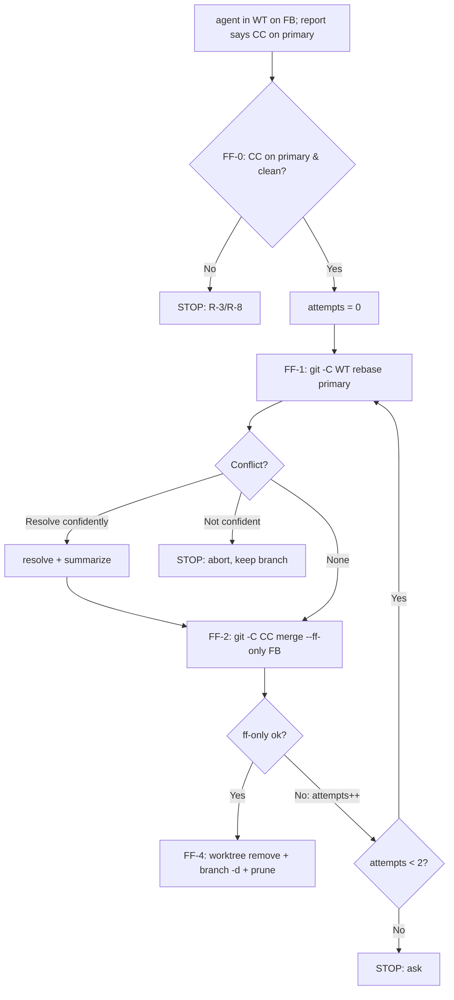

# ff-merge-to-main handler

This is the **Command-style handler** for the `ff-merge-to-main` integration
strategy: land the current branch by rebasing it onto the primary branch, then
fast-forward-merging it into the canonical clone, then retiring the worktree and
branch. It is invoked by the `integrate-branch` skill (via the `Skill` tool, using
the strategy string as the skill name) — do not invoke it directly unless you are
deliberately replaying its flow outside the dispatcher.

Skills receive no typed arguments, so this handler **re-derives its own context
from git** rather than trusting values handed to it. It re-verifies its own
preconditions (FF-0) rather than trusting the caller's anomaly check — even if
`integrate-branch` already surfaced a canonical anomaly, this handler halts on it
independently.

## Step 0 — Re-derive context from git

Do not assume `<WT>`, `<FB>`, `<CC>`, or the primary branch were passed in —
compute them fresh:

```bash
WT="$(pwd)"                                   # the current working tree
FB="$(git rev-parse --abbrev-ref HEAD)"        # the feature branch
CC="$(cd "$(git rev-parse --git-common-dir)/.." && pwd)"   # canonical clone (main worktree)
```

- **`<WT>`** = the current working tree — wherever this handler is running.
- **`<FB>`** = the current branch. If `git rev-parse --abbrev-ref HEAD` prints
  `HEAD` (detached), there is no feature branch to integrate — **halt and report**
  "nothing to integrate: detached HEAD," and stop here.
- **`<CC>`** = the canonical clone, i.e. the **main working tree** of the common
  git dir (`git rev-parse --git-common-dir` resolved to its parent directory). This
  is true whether or not `<WT>` and `<CC>` are the same directory.
- **primary branch** = the shared resolution (same one `integrate-branch-support`
  uses, so they agree): `git config --get pgii-integrate-branch.primaryBranch` →
  else `git symbolic-ref refs/remotes/origin/HEAD` (strip the `refs/remotes/origin/`
  prefix) → else `main`.

## FF-0 — Precondition: canonical on primary and clean

Before touching anything, verify the canonical clone is in the steady state Tier R
requires:

```bash
git -C "$CC" rev-parse --abbrev-ref HEAD   # MUST equal the primary branch
git -C "$CC" status --porcelain            # MUST be empty
```

If either check fails — canonical is off the primary branch, or canonical has
local changes — **halt and report** (R-3/R-8). Do **not** reset, stash, or
re-checkout the canonical clone to "fix" it; that is exactly the work-around Tier R
forbids. Report the anomaly and stop; this handler goes no further.

## FF-1 — Rebase the worktree onto primary

```bash
git -C "$WT" rebase "$PRIMARY"
```

- **No conflict:** proceed to FF-2.
- **Conflict, and you are confident in the resolution:** resolve it, continue the
  rebase (`git -C "$WT" rebase --continue`), and do **not** stop — but summarize
  the resolution to the user (what conflicted, how it was resolved) so it isn't
  silent.
- **Conflict, and you are not confident:** `git -C "$WT" rebase --abort` to restore
  the pre-rebase state, keep the branch and worktree exactly as they were, and hand
  off to the user — report `stopped:rebase-conflict` with what conflicted. Do not
  guess at a resolution you aren't sure of.

## FF-2 — Fast-forward-only merge in the canonical clone

```bash
git -C "$CC" merge --ff-only "$FB"
```

This is valid even though `<FB>` is checked out in `<WT>`, not in `<CC>` — a
fast-forward-only merge only moves `<CC>`'s ref forward; it does not need `<FB>`
checked out where it runs.

## FF-3 — Retry loop on a lost fast-forward race

The primary branch can advance between FF-0's check and FF-2's merge (another
agent landing concurrently, per R-7) — so `merge --ff-only` can fail with "not
possible to fast-forward." Handle it as a bounded retry, not a one-shot failure:

- `attempts = 0`.
- If FF-2 fails as non-fast-forward: `attempts++`, then **retry from FF-1**
  (rebase `<WT>` onto the now-advanced primary again, then re-attempt FF-2).
- When `attempts` reaches **2** (the second consecutive non-ff failure), **stop
  and ask** the user rather than retry indefinitely — a persistent ff-race
  warrants attention (R-7).

## FF-4 — Cleanup

Only reached after FF-2 succeeds. Run every command against `<CC>`, and **relocate
the shell out of `<WT>` first** — removing the worktree you are currently standing
in breaks every subsequent command in that shell:

```bash
cd "$CC"                              # leave <WT> before removing it
git -C "$CC" worktree remove "$WT"
git -C "$CC" branch -d "$FB"
git -C "$CC" worktree prune
```

`git worktree remove` refuses to remove the **main** working tree, so even if
something upstream got `<WT>` and `<CC>` confused, the canonical clone is
inherently protected from this step.

## Decision flow



## Reporting the outcome

Report the result back using the shared handler vocabulary: `landed` (FF-4
completed) or `stopped:<reason>` (any halt above — detached HEAD,
canonical-off-primary/dirty, rebase conflict not confidently resolved, or the
ff-race retry limit hit). This handler never returns `pr-opened` — that outcome
belongs to the `pull-request` handler.

## Rules this handler enforces (Tier R, RFC 2119)

- The handler MUST re-derive `<WT>`, `<FB>`, `<CC>`, and the primary branch from
  git itself rather than trusting caller-supplied values (skills have no typed
  arguments).
- The handler MUST halt and report — not work around — if `<CC>` is off the
  primary branch or dirty at FF-0 (R-3, R-8), even if the caller already surfaced
  the same anomaly.
- On a detached `HEAD` in `<WT>`, the handler MUST halt and report "nothing to
  integrate" rather than guess at a feature branch.
- The handler MUST rebase (`<WT>` onto primary) before attempting the fast-forward
  merge — this is the rebase-first requirement; it MUST NOT fall back to a plain
  non-fast-forward merge.
- On a rebase conflict the handler MUST NOT stop just because a conflict occurred;
  it MUST attempt resolution, and MUST summarize any confident resolution to the
  user rather than resolving silently. It MUST abort the rebase (leaving the
  branch untouched) and hand off when it is not confident in the resolution.
- The handler MUST bound its fast-forward retry loop and stop-and-ask after the
  second consecutive non-fast-forward failure (R-7) rather than retry
  indefinitely.
- FF-4 MUST relocate the shell out of `<WT>` before removing it, and MUST run the
  removal, branch deletion, and prune from `<CC>`.
- The handler MUST NOT remove, reset, or otherwise mutate `<CC>` beyond the
  fast-forward merge and the FF-4 cleanup steps.
