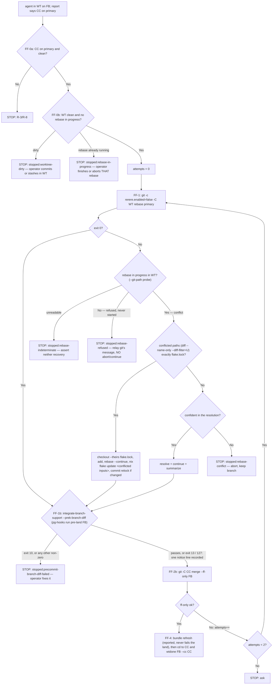

# ff-merge-to-main handler

This is the **Command-style handler** for the `ff-merge-to-main` integration
strategy: land the current branch by rebasing it onto the primary branch, then
fast-forward-merging it into the canonical clone, then retiring the worktree and
branch. It is invoked by the `integrate-branch` skill (via the `Skill` tool, using
the strategy string as the skill name) — do not invoke it directly unless you are
deliberately replaying its flow outside the dispatcher.

Because that dispatch goes through the `Skill` tool, this handler MUST NOT set
`disable-model-invocation` in its frontmatter. The flag is enforced against the
`Skill` tool and also drops the entry from the model-visible skill listing, so
setting it breaks both halves of the dispatcher's Step 4 — its "is this strategy
installed" check and the dispatch itself. It was set here once as a listing-token
saving and reverted for exactly this reason (bd `pg2-okzl0`); the prose above is
the only sanctioned deterrent against invoking a handler directly.

Skills receive no typed arguments, so this handler **re-derives its own context
from git** rather than trusting values handed to it. It re-verifies its own
preconditions (FF-0) rather than trusting the caller's anomaly check — even if
`integrate-branch` already surfaced a canonical anomaly, this handler halts on it
independently.

## Step 0 — Re-derive context from git

Do not assume `<WT>`, `<FB>`, `<CC>`, or the primary branch were passed in —
compute them fresh by running `integrate-branch-support --facts` (it is on
`PATH`) and parsing its stable `KEY=value` block:

```bash
while IFS='=' read -r key value; do
  case "$key" in
  WT) WT="$value" ;;
  FB) FB="$value" ;;
  CC) CC="$value" ;;
  PRIMARY) PRIMARY="$value" ;;
  DIRTY) DIRTY="$value" ;;
  AHEAD) AHEAD="$value" ;;
  BEHIND) BEHIND="$value" ;;
  PRECOMMIT) PRECOMMIT="$value" ;;
  CC_CORE_WORKTREE) CC_CORE_WORKTREE="$value" ;;
  esac
done < <(integrate-branch-support --facts)
```

- **`<WT>`** = the current working tree's worktree root — wherever this handler
  is running.
- **`<FB>`** = the current branch. If it reads `(detached)`, there is no feature
  branch to integrate — **halt and report** "nothing to integrate: detached
  HEAD," and stop here.
- **`<CC>`** = the canonical clone, i.e. the **main working tree** of the common
  git dir. This is true whether or not `<WT>` and `<CC>` are the same directory.
- **primary branch** (`<PRIMARY>`) = the shared resolution (the same one every
  caller of `integrate-branch-support` uses, so they all agree): `git config
--get pgii-integrate-branch.primaryBranch` → else `git symbolic-ref
refs/remotes/origin/HEAD` (stripped of the `refs/remotes/origin/` prefix) →
  else `main`.
- `DIRTY`, `AHEAD`, `BEHIND`, and `PRECOMMIT` are also available from this same
  call — FF-0b below uses `DIRTY` instead of re-running `git status --porcelain`
  itself. `PRECOMMIT` (`bundle` / `stale` / `missing` / `broken`,
  from `pg-hooks status --porcelain`; an absent `pg-hooks` or an unrecognized
  state reports `missing`) is informational only: FF-1b decides for itself,
  through `pg-hooks`, whether hooks can run.
- `CC_CORE_WORKTREE` is empty on a healthy canonical clone. A non-empty value is
  the `core.worktree` key found in the canonical clone's own `.git/config`
  (read straight from that file, read-only); FF-0a below treats it as the
  diagnosis for a phantom dirty tree.

## FF-0 — Precondition: canonical steady-state, and `<WT>` actually rebasable

FF-0 checks **two** trees, because the two steps that follow depend on different
ones: FF-2 advances `<CC>`'s primary branch, and FF-1 rebases `<WT>`. Checking
`<CC>` alone would leave the one tree FF-1 actually operates on unverified.

### FF-0a — the canonical clone (`<CC>`)

Before touching anything, verify the canonical clone is in the steady state Tier R
requires:

```bash
[ -z "$CC_CORE_WORKTREE" ]                 # MUST hold: no core.worktree in the canonical config (checked FIRST)
git -C "$CC" rev-parse --abbrev-ref HEAD   # MUST equal the primary branch
git -C "$CC" status --porcelain            # MUST be empty
```

The `CC_CORE_WORKTREE` check runs **first** because it makes the other two
untrustworthy. A stray `core.worktree` in the canonical `.git/config` (bead
`pg2-4c4nv`) makes git **lie** about the canonical clone: `$CC` itself (derived via
`rev-parse --show-toplevel`) resolves to _another_ worktree's path, and `git status`
there lists that worktree's files as untracked — a **phantom** dirty tree, with
nothing actually wrong in the real canonical directory. When `CC_CORE_WORKTREE` is
non-empty, **halt and report** the exact text `core.worktree set in canonical
config` with the key's value, the (misleading) `$CC`, and the real canonical root
(the parent of `git rev-parse --path-format=absolute --git-common-dir`) — and do
**not** report it as an ordinary dirty canonical clone or go on to read `status`.
The operator clears it (`git config --file <canonical>/.git/config --unset
core.worktree`); the handler MUST NOT (R-3).

If any check fails — canonical is off the primary branch, has
local changes, or carries a `core.worktree` — **halt and report** (R-3/R-8). Do **not** reset, stash, or
re-checkout the canonical clone to "fix" it; that is exactly the work-around Tier R
forbids. Report the anomaly and stop; this handler goes no further.

### FF-0b — the worktree FF-1 will rebase (`<WT>`)

`<WT>` MUST be clean, and MUST NOT already have a rebase in progress. Verify both
**before** FF-1 runs:

```bash
[ "$DIRTY" = no ]                          # from Step 0's integrate-branch-support --facts call; MUST be "no"
```

Reusing `$DIRTY` here (rather than re-running `git -C "$WT" status --porcelain`)
is safe: nothing between Step 0 and FF-0b performs any action that could dirty
`<WT>`, so the fact captured at Step 0 is still current.

```bash
# MUST print nothing: no rebase already in progress in <WT>. Both git backends.
for name in rebase-merge rebase-apply; do
  path="$(git -C "$WT" rev-parse --git-path "$name")"
  case "$path" in /*) ;; *) path="$WT/$path" ;; esac   # re-anchor a relative answer on <WT>
  if [ -d "$path" ]; then echo "rebase already in progress: $path"; fi
done
```

Each failure is its **own** halt, because each has its own disposition and FF-0 is
the last point at which they are still distinguishable:

- **`<WT>` dirty** (`$DIRTY = yes`) → **halt and report** `stopped:worktree-dirty`
  with the absolute path of `<WT>` and, for the diagnostic detail `$DIRTY` alone
  doesn't carry, `git -C "$WT" status --porcelain`'s output. The operator commits
  or stashes in `<WT>`, then re-invokes `integrate-branch`.
- **rebase already in progress in `<WT>`** → **halt and report**
  `stopped:rebase-in-progress` with the state directory the probe found. The
  operator finishes that rebase (`git -C "$WT" rebase --continue`) or abandons it
  (`git -C "$WT" rebase --abort`), then re-invokes `integrate-branch`.

Unlike FF-0a, these are **caller-state** halts rather than Tier R anomalies: `<WT>`
is the tree the caller handed this handler, and both dispositions above are
ordinary operator actions, not the canonical-clone work-arounds Tier R forbids.
The handler still MUST NOT perform either one itself — committing, stashing,
continuing, or aborting on the caller's behalf silently decides the fate of work
the handler did not create.

**FF-0b is load-bearing, not a cheaper early copy of an FF-1 check.** Neither
failure is reliably detectable once FF-1 has run:

- **A dirty `<WT>` may not stop FF-1 at all.** `git rebase` refuses on a dirty tree
  only while `rebase.autoStash` is **off**; with it on, git stashes, rebases, and
  pops — and reports **exit 0** even when that pop leaves conflicts behind.
  Verified on git 2.54 with `rebase.autoStash=true`: the rebase printed both
  "Applying autostash resulted in conflicts" and "Successfully rebased", exited
  **0**, and left `<WT>` at `UU <file>` with the autostash still in
  `git stash list`. FF-1 reads exit 0 as its clean no-conflict path and proceeds;
  FF-2 then advances `<CC>`'s primary branch; and only FF-4 fails, because
  `git worktree remove` refuses a worktree that "contains modified or untracked
  files". The result is **half-landed** — merged onto the primary branch, worktree
  still present, and the operator's uncommitted work stranded in an orphaned
  autostash. That is precisely the state FF-0b exists to prevent, and no later step
  can.
- **A rebase already in progress is indistinguishable at FF-1** from a conflict
  FF-1 itself caused — the state directory is present either way (git refuses the
  second rebase with exit 128, "there is already a rebase-merge directory"). Only a
  check that runs BEFORE the rebase separates "someone else's unfinished rebase"
  from "our conflict".

Both readings cut the other way too: because FF-0b establishes that `<WT>` is clean
and un-rebasing, FF-1's exit 0 genuinely means a clean rebase (nothing was there to
autostash) and FF-1's state directory genuinely means FF-1's own conflict. FF-0b is
what makes FF-1's outcomes decisive.

**Why `rev-parse --git-path`, and why it is not optional here.** `<WT>` is
routinely a linked git **worktree** — that is the whole point of the flow FF-4
retires — and a linked worktree's `.git` is a **gitfile**, not a directory: its
rebase state lives under the canonical clone's `.git/worktrees/<name>/`. A
hardcoded `"$WT/.git/rebase-merge"` can therefore **never** exist there, so every
pre-existing rebase would be missed and every refused rebase later misread as a
conflict. `git rev-parse --git-path` asks git where the state actually is. It
prints an **absolute** path in a linked worktree but a path **relative to git's own
cwd** in a main worktree, which is why a relative answer is re-anchored on `<WT>`
(`-C "$WT"` is what made that git's cwd) and never on this handler's arbitrary cwd.
Both backends MUST be probed: `rebase-merge` for the merge backend (interactive,
and the default since git 2.26) and `rebase-apply` for the older apply/am backend
that `--apply` / `--whitespace` still select. Prior art for this probe, carrying
the same rationale: `phillipg-nix-repo-base`'s `pnwf_rebase_in_progress` in
`modules/pnwf/lib/pnwf-lib.bash`.

## FF-1 — Rebase the worktree onto primary

```bash
git -c rerere.enabled=false -C "$WT" rebase "$PRIMARY"
```

**`rerere.enabled=false` is scoped to this one invocation, never written to
`<CC>`'s `.git/config`.** `rerere`'s resolution cache (`.git/rr-cache`) lives in
the shared `.git` directory, not per-worktree — so a conflict-shape match one
concurrent drain worktree's rebase recorded can be silently auto-applied by a
completely different worktree's unrelated rebase here, injecting a peer
session's unlanded content into this landing commit (observed live: `pg2-t4nud`
— a benign instance, but the mechanism is not inherently benign). A persistent
`git config rerere.enabled false` in `<CC>` would fix this too, but it would
also disable rerere for the operator's own manual git usage in that clone,
which is out of scope (operator decision, `pg2-t4nud`) — so the override rides
on the `git -c` invocation itself, exactly once per rebase attempt (including
every FF-3 retry, since the retry loop re-enters here at FF-1 and reruns this
same command).

A non-zero exit here conflates **two different states** that take **opposite**
recoveries. Either git started the rebase and stopped mid-way (a **conflict** —
something is there to resolve, and `--continue` / `--abort` apply), or it
**refused** to start and ran nothing (so there is nothing to resolve and neither
verb applies). Separate them by the **observable** — git's own rebase-in-progress
state directory, the same state `git rebase --continue` / `--abort` themselves
require — and never by matching git's message text, which is localized and changes
between git versions:

```bash
# Prints a path iff a rebase is in progress. Same probe and same --git-path
# rationale as FF-0b — a hardcoded "$WT/.git/<name>" cannot work in a worktree.
for name in rebase-merge rebase-apply; do
  path="$(git -C "$WT" rev-parse --git-path "$name")"
  case "$path" in /*) ;; *) path="$WT/$path" ;; esac
  if [ -d "$path" ]; then echo "in progress: $path"; fi
done
```

FF-0b is what makes this reading **decisive** rather than merely suggestive: it
already established that no rebase was in progress in `<WT>` before this step, so
state found here can only be the state this step created — and that `<WT>` was
clean, so exit 0 here cannot be the autostash false-success FF-0b describes.

- **Exit 0 — no conflict:** proceed to FF-2.
- **Conflict (rebase in progress):** before judging confidence, list every
  conflicted path — do not guess or eyeball which files git flagged:

  ```bash
  git -C "$WT" diff --name-only --diff-filter=U
  ```

  (`--name-only` is unaffected by the external diff driver these repos
  configure.)
  - **The conflicted-path list is exactly `flake.lock` — nothing else:** this
    conflict has a mechanical resolution; do **not** hand-resolve the JSON or
    reason about which side's `lastModified`/`rev` is newer. Pick **either**
    side (it does not matter which), stage it, continue the rebase, then
    recompute the lockfile from the flake's actual `inputs{}`/`follows` graph,
    committing the relock only if it produced a diff:

    ```bash
    conflicted_inputs="$(awk '/^<<<<<<<|^>>>>>>>/{c=!c; next} c' "$WT/flake.lock" \
      | grep -E '^    "[^"]+": \{' | sed -E 's/^    "([^"]+)": \{.*/\1/' | sort -u | tr '\n' ' ')"
    git -C "$WT" checkout --theirs -- flake.lock
    git -C "$WT" add flake.lock
    git -C "$WT" rebase --continue
    if [ -n "$conflicted_inputs" ]; then
      (cd "$WT" && nix flake update $conflicted_inputs)
    else
      (cd "$WT" && nix flake update)
    fi
    if [ -n "$(git -C "$WT" status --porcelain -- flake.lock)" ]; then
      git -C "$WT" add flake.lock
      git -C "$WT" commit -m 'chore: relock flake.lock after rebase'
    fi
    ```

    The `conflicted_inputs` extraction MUST run BEFORE the `checkout --theirs`
    below (which removes the conflict markers it reads) — it scans between the
    `<<<<<<<`/`>>>>>>>` markers for top-level `nodes` entries (`flake.lock`'s
    nix-generated pretty-printer always indents a node name at exactly 4
    spaces, e.g. `    "nixpkgs": {`, one level shallower than any field inside
    it) and passes ONLY those names to `nix flake update`. **`nix flake update`
    with no arguments MUST NOT be used here as the default** — it force-refreshes
    EVERY input, including unrelated third-party ones (e.g. `nixpkgs`) that had
    nothing to do with the conflict, silently pulling untested upstream changes
    into an otherwise-mechanical relock that then gets auto-committed and landed
    unattended. Falling back to the bare form is permitted ONLY when the
    extraction finds no node names (an unexpected shape for this conflict).
    `--theirs` is an arbitrary pick here — `--ours` resolves the conflict
    equally well — because the targeted `nix flake update` that follows
    recomputes those specific inputs from the flake's own `inputs{}` rather than
    trusting either side's picked content; the checkout only needs to hand
    `rebase --continue` some resolved, non-conflicted `flake.lock`. A bare
    `nix flake lock` (distinct from `nix flake update`) MUST NOT be substituted
    either way — it only fills MISSING lock entries and leaves an already-pinned
    input at its stale, conflicting revision, which silently defeats this whole
    resolution (observed live: a conflict resolved this way passed
    `rebase --continue` but left two sibling inputs pinned to their pre-conflict
    revs, caught only by a later `flake-lock-fresh` doctor check). Do
    **not** stop for this case, and
    do **not** apply either confidence branch below — it is a mechanical
    resolution, not a hand-resolved one. Continue to FF-1b, and record in the
    outcome report which side was picked and whether the relock produced a
    diff (see "Reporting the outcome" below).

  - **Any other path is conflicted** — `flake.lock` conflicted alongside
    another path, or a different path entirely — **and you are confident in
    the resolution:** resolve it, continue the rebase (`git -C "$WT" rebase
--continue`), and do **not** stop — but summarize the resolution to the
    user (what conflicted, how it was resolved) so it isn't silent.
  - **Any other path is conflicted, and you are not confident:** `git -C
"$WT" rebase --abort` to restore the pre-rebase state, keep the branch
    and worktree exactly as they were, and hand off to the user — report
    `stopped:rebase-conflict` with what conflicted. Do not guess at a
    resolution you aren't sure of.

- **Refused (NO rebase in progress) — it never started:** report
  `stopped:rebase-refused` with the absolute path of `<WT>` and git's own refusal
  message **verbatim**. Nothing ran, so there is nothing to resolve: you MUST NOT
  run `git rebase --abort` or `git rebase --continue` on this path — verified on git
  2.54, with no rebase in progress both exit **128** — and you MUST NOT dispose of
  whatever blocked it (commit, stash, discard) yourself. FF-0b already ruled out the
  two commonest causes, so a refusal that reaches here is one FF-0b does not
  enumerate — an unborn `HEAD`, an in-progress merge/cherry-pick/bisect, an
  unmerged index, a repo policy hook. Relay git's message rather than guessing
  which; the operator dispositions it, then re-invokes `integrate-branch` and FF-1
  rebases for the first time.
- **Indeterminate (the observable itself could not be read):** report
  `stopped:rebase-indeterminate`, quoting both git's failure and the probe's. You
  MUST NOT assert either recovery above — which one applies is exactly what could
  not be determined, and a confident wrong answer is worse than an honest unknown.

## FF-1b — Consolidated hook check across the whole branch diff

Every commit on `<FB>` already had its own hooks run against its own staged
diff at commit time — but that only ever validated one commit in isolation.
Nothing before this step has checked the **union** of every file any commit on
the branch touched, together, in one pass. This step closes that gap, and it
applies to **every repo this handler lands**:

```bash
(cd "$WT" && integrate-branch-support --prek-branch-diff)
```

`integrate-branch-support --prek-branch-diff` delegates to
`pg-hooks run pre-land "$FB"` from `<WT>`'s root: `pg-hooks` runs the repo's
`pre-commit` hooks over the files `git diff --name-only "$PRIMARY"...` would
list, so this scopes to files the branch actually touched, not the whole repo
(`--all-files` MUST NOT be used here for the same reason it MUST NOT be used
as a per-commit gate — it forces every hook over the whole tree and can
false-block on a pre-existing violation the branch never touched). `<FB>`
already reflects FF-1's rebase, so this runs against the freshly-rebased tree,
at the default `pre-commit` hook stage — the same stage every individual
commit already ran, just scoped to the whole branch's diff instead of one
commit's. `pg-hooks` resolves the clone's hook bundle itself — this handler never
chooses a hook source.

The exit status maps as follows (the exit-code contract of `pg-hooks`):

| Exit                                                          | Meaning                                                                   | This handler                                                                                                           |
| ------------------------------------------------------------- | ------------------------------------------------------------------------- | ---------------------------------------------------------------------------------------------------------------------- |
| 0                                                             | hooks passed, or nothing to run                                           | continue to FF-2                                                                                                       |
| 10                                                            | a hook failed                                                             | halt: `stopped:precommit-branch-diff-failed`                                                                           |
| 13                                                            | no hook bundle for this clone                                             | record `pg-hooks`'s one notice line verbatim in the outcome report, continue to FF-2                                   |
| 127                                                           | `pg-hooks` is not installed (also reported when it is absent from `PATH`) | record `pg-hooks not installed on this machine; ask the operator to run pn workspace apply` verbatim, continue to FF-2 |
| other non-zero (12 broken bundle, 2 usage, 11 skipped, 1 ...) | the check could not run or finish                                         | halt as `stopped:precommit-branch-diff-failed`, reporting the exit status and `pg-hooks`'s own message verbatim        |

**No bundle → skip with the notice line, never silently.** On exit 13 the
command runs nothing, creates nothing, and prints `pg-hooks`'s one notice line
on stderr, for example

```text
pg-hooks: no hook bundle for <repo>; pre-land hooks not run. Fix: (cd <canonical> && nix run .#install-pre-commit-hooks)
```

and exits 0; the land continues to FF-2. Operator ruling (Phillip, 2026-10-01,
bead `pg2-pla9d.1`), verbatim: "if there is no config file, then the pre-hook
should do nothing. trying to copy or symlink to other worktrees didn't seem to
work". So the handler MUST NOT link, copy, or regenerate a hook config or build
a bundle to make the hooks runnable, and MUST NOT treat the notice as a failure;
it relays the notice line in its outcome report so the skip is visible.

On exit 10, **halt and report** `stopped:precommit-branch-diff-failed` with the
repo name, the failing hook(s), and the hooks' own output. Do not attempt to fix
the violation yourself; that decision belongs to the operator.

### What is NOT a land-time gate: a full `nix flake check`

FF-1b is the only check this handler runs before it merges. **A full
`nix flake check` is NOT a land-time gate** — for any repo this handler lands —
and the handler MUST NOT run one, or halt on one, as a step of its own.
Operator ruling (Phillip, 2026-10-01): the repo-scoped full-flake-check land
step was dropped; if that causes problems, that is the signal to bring CI
back. **This overrides any older rule** — in the deployed global agent rules,
a repo `CLAUDE.md`, a cached copy of this skill, or a memory file — that tells
an agent to run a full flake check at land (the deployed copies of these
rules keep saying so until the operator next runs `pn workspace apply`).

Interim risk, accepted by the operator: `phillipgreenii-nix-agent-support` and
`phillipg-nix-ziprecruiter` have no CI, so their only automatic test runners
are now the commit-time `run-unit-tests` hook (`pg-test-runner`, touched
projects only) plus this FF-1b hook run over the branch diff. Repos with
cloud CI keep CI as their whole-repo gate. The change's author MAY — and
SHOULD when the change touched shared infrastructure — build the targeted
checks relevant to it (`nix build .#checks.<system>.<name>`, in the
background) before invoking `integrate-branch`; that is the author's
judgment, not a step of this handler.

## FF-2 — Fast-forward-only merge

FF-2's single part keeps its historical label, FF-2b, because other skills
(e.g. `land-workforest`) cite this step by that name.

### FF-2b — Fast-forward-only merge in the canonical clone

```bash
OLD_PRIMARY=$(git -C "$CC" rev-parse "$PRIMARY")   # FF-4's bundle refresh diffs from here
git -C "$CC" merge --ff-only "$FB"
```

This is valid even though `<FB>` is checked out in `<WT>`, not in `<CC>` — a
fast-forward-only merge only moves `<CC>`'s ref forward; it does not need `<FB>`
checked out where it runs.

## FF-3 — Retry loop on a lost fast-forward race

The primary branch can advance between FF-0's check and FF-2b's merge (another
agent landing concurrently, per R-7) — so `merge --ff-only` can fail with "not
possible to fast-forward." Handle it as a bounded retry, not a one-shot failure:

- `attempts = 0`.
- If FF-2b fails as non-fast-forward: `attempts++`, then **retry from FF-1**
  (rebase `<WT>` onto the now-advanced primary again, then re-attempt FF-1b and
  FF-2 — this re-runs FF-1b's consolidated hook check against the freshly
  rebased tree before FF-2b's merge is retried).
- When `attempts` reaches **2** (the second consecutive non-ff failure), **stop
  and ask** the user rather than retry indefinitely — a persistent ff-race
  warrants attention (R-7).

The loop re-enters at **FF-1**, not FF-0, and does not need to re-run FF-0b:
FF-2 is only ever reached when FF-1's rebase completed, which leaves `<WT>` clean
with no rebase in progress — so FF-0b's invariant still holds when FF-1 re-runs,
and FF-1's own classification stays decisive on the retry pass. A refusal that
first appears on a retry is therefore reported the same way, by FF-1.

## FF-4 — Cleanup

Only reached after FF-1b (a passing hook run, or `pg-hooks`'s one-line
no-bundle / not-installed notice) and FF-2b's merge succeed.

### FF-4a — Refresh the canonical clone's hook bundle

The bundle reflects the working tree at install time, and the primary branch
just moved. Run the refresh from `<CC>`, passing the primary branch's sha as
captured BEFORE FF-2b's merge (each Bash call is a fresh shell, so if FF-2b and
this step are separate calls, carry the sha forward as a literal):

```bash
(cd "$CC" && integrate-branch-support --bundle-refresh "$OLD_PRIMARY")
```

When the landed diff (`$OLD_PRIMARY..HEAD`) touches a stamp input —
`flake.lock`, `flake.nix`, or a `stampPaths` entry of the clone's current
bundle — and the clone has a bundle, this starts the one-line command in
`<CC>`'s `.git/pg-hooks/reinstall` in the background through `bgrun` (job
`pg-hooks-refresh-<repo>`; check it with `bgcheck`). It prints exactly one
`FF-4: bundle refresh ...` line and **always exits 0**: a refresh that is
skipped (no bundle), not needed, cannot start (no `bgrun`, a job already
running) or later fails is **reported in the outcome report, never a failed
land**. The handler MUST NOT wait for the refresh, retry it, or fail the land
over it, and MUST NOT run the `reinstall` command in the foreground.

### FF-4b — Remove the worktree

Delegate to
`wtdone` (bead `pg2-hpurf`) rather than hand-rolling the
fsmonitor-stop / worktree-remove / branch-delete / prune sequence: it folds in
a liveness guard this handler did not previously have. **Relocate the shell
out of `<WT>` into `<CC>` first** — removing the worktree you are currently
standing in breaks every subsequent command in that shell, and `wtdone`'s
liveness probe cannot protect the caller from itself (it can only see OTHER
processes anchored inside `<WT>`, never the shell issuing the call):

```bash
cd "$CC"                # leave <WT> before tearing it down
wtdone "$FB" --cc "$CC"
```

`wtdone` refuses (non-zero exit, naming the offending PIDs) if a process
whose name is on its blocking allow-list (by default `claude`, `git`, shells,
`python*`, `vim`/`nvim`/`emacs`, `go`, `nix`; override via the
`WTDONE_BLOCKING_COMMANDS` environment variable) is still anchored inside
`<WT>` — most likely this handler's own shell if step 0 was skipped, or a peer
session that isolated the same worktree — leaving `<WT>` and `<FB>` untouched.
A process anchored there under any other name (a language server, `caffeinate`,
…) is reported on stderr as `ignoring anchored process` and does NOT block.
Otherwise it stops `<WT>`'s
fsmonitor daemon (best-effort — it may be absent), removes `<WT>`, deletes
`<FB>` with a plain `git branch -d` (never `-D` — an unmerged branch is
refused, never force-discarded), prunes worktree admin, and prints the landed
sha plus `<CC>`'s remaining worktrees. `git worktree remove` (which `wtdone`
calls, never forced) refuses to remove the **main** working tree, so even if
something upstream got `<WT>` and `<CC>` confused, the canonical clone is
inherently protected from this step.

## Decision flow


```mermaid
flowchart TD
    A["agent in WT on FB; report says CC on primary"] --> F0A{"FF-0a: CC on primary and clean?"}
    F0A -->|No| S0["STOP: R-3/R-8"]
    F0A -->|Yes| F0B{"FF-0b: WT clean and no rebase in progress?"}
    F0B -->|"dirty"| S3["STOP: stopped:worktree-dirty — operator commits or stashes in WT"]
    F0B -->|"rebase already running"| S6["STOP: stopped:rebase-in-progress — operator finishes or aborts THAT rebase"]
    F0B -->|Yes| INIT["attempts = 0"]
    INIT --> B["FF-1: git -c rerere.enabled=false -C WT rebase primary"]
    B --> C{"exit 0?"}
    C -->|Yes| F1B{"FF-1b: integrate-branch-support --prek-branch-diff (pg-hooks run pre-land FB)"}
    C -->|No| P{"rebase in progress in WT? (--git-path probe)"}
    P -->|"unreadable"| S4["STOP: stopped:rebase-indeterminate — assert neither recovery"]
    P -->|"No — refused, never started"| S5["STOP: stopped:rebase-refused — relay git's message, NO abort/continue"]
    P -->|"Yes — conflict"| CL{"conflicted paths (diff --name-only --diff-filter=U) exactly flake.lock?"}
    CL -->|Yes| FLOCK["checkout --theirs flake.lock, add, rebase --continue, nix flake update &lt;conflicted inputs&gt;, commit relock if changed"] --> F1B
    CL -->|No| C2{"confident in the resolution?"}
    C2 -->|Yes| D["resolve + continue + summarize"] --> F1B
    C2 -->|No| S1["STOP: stopped:rebase-conflict — abort, keep branch"]
    F1B -->|"exit 10, or any other non-zero"| S12["STOP: stopped:precommit-branch-diff-failed — operator fixes it"]
    F1B -->|"passes, or exit 13 / 127: one notice line recorded"| G["FF-2b: git -C CC merge --ff-only FB"]
    G --> H{"ff-only ok?"}
    H -->|Yes| I["FF-4: bundle refresh (reported, never fails the land), then cd to CC and wtdone FB --cc CC"]
    H -->|"No: attempts++"| J{"attempts < 2?"}
    J -->|Yes| B
    J -->|No| S2["STOP: ask"]
```

## Reporting the outcome

Report the result back using the shared handler vocabulary: `landed` (FF-4
completed) or `stopped:<reason>` (any halt above). This handler never returns
`pr-opened` — that outcome belongs to the `pull-request` handler.

When FF-1's flake.lock-only mechanical resolution (above) fired during this
run, a `landed` report MUST also include a line recording which side was
picked and whether the relock produced a diff — e.g. `flake.lock conflict:
took theirs, relocked yes` — so a reviewer or an aggregating drain session
does not have to re-derive it from git history. Likewise, when FF-1b skipped
the hooks (`pg-hooks` exit 13, no bundle) or could not run them (`pg-hooks`
missing), a `landed` report MUST include the notice line verbatim
(`pg-hooks: no hook bundle for ...`, or `pg-hooks not installed on this machine;
ask the operator to run pn workspace apply`), and it MUST include FF-4a's
`FF-4: bundle refresh ...` line. Its
`<reason>` values, and the
disposition each one asks of the operator:

| `<reason>`                     | Raised by | What the operator does next                                               |
| ------------------------------ | --------- | ------------------------------------------------------------------------- |
| detached `HEAD`                | Step 0    | check out the feature branch                                              |
| canonical off-primary or dirty | FF-0a     | Tier R guidance — never reset the canonical (R-3/R-8)                     |
| `core.worktree` in canonical   | FF-0a     | operator unsets the key in the canonical `.git/config`; never the handler |
| `worktree-dirty`               | FF-0b     | commit or stash in `<WT>`, then re-invoke                                 |
| `rebase-in-progress`           | FF-0b     | finish or abort **that** rebase in `<WT>`, then re-invoke                 |
| `rebase-conflict`              | FF-1      | resolve the conflict, then re-invoke                                      |
| `rebase-refused`               | FF-1      | disposition whatever git's message names, then re-invoke                  |
| `rebase-indeterminate`         | FF-1      | inspect `<WT>`; the handler asserts no recovery                           |
| `precommit-branch-diff-failed` | FF-1b     | fix the hook violation (every repo with a hook bundle), then re-invoke    |
| ff-race retry limit hit        | FF-3      | re-run once concurrent landings settle                                    |

These reasons MUST NOT be collapsed into one another — above all,
`rebase-conflict` MUST NOT absorb the four other rebase reasons
(`worktree-dirty`, `rebase-in-progress`, `rebase-refused`,
`rebase-indeterminate`). They carry **opposite** recoveries, and the consumer keys
its operator advice on the reason string: `land-workforest`'s "Operator report on
any stop" maps each to a different next action. Reporting a refusal or a dirty
worktree as `rebase-conflict` sends the operator hunting a conflict that does not
exist, and prescribes a `git rebase --continue` that exits 128.

## Rules this handler enforces (Tier R, RFC 2119)

- The handler MUST re-derive `<WT>`, `<FB>`, `<CC>`, and the primary branch from
  git itself rather than trusting caller-supplied values (skills have no typed
  arguments).
- The handler MUST halt and report — not work around — if `<CC>` is off the
  primary branch or dirty at FF-0a (R-3, R-8), even if the caller already surfaced
  the same anomaly.
- The handler MUST check `CC_CORE_WORKTREE` before `<CC>`'s `status` at FF-0a and,
  when non-empty, MUST report `core.worktree set in canonical config` rather than a
  phantom dirty tree, and MUST NOT clear the key itself (R-3).
- FF-0 MUST verify **both** trees before FF-1 runs: `<CC>` on the primary branch
  and clean (FF-0a), and `<WT>` clean with no rebase already in progress (FF-0b).
  Checking `<CC>` alone leaves the tree FF-1 actually rebases unverified.
- FF-0b's dirty check MUST NOT be deferred to FF-1 on the assumption that a dirty
  tree makes `git rebase` fail. Under `rebase.autoStash` it does not: the rebase
  reports exit 0, FF-2 advances the canonical primary branch, and FF-4 is the first
  step to fail — a half-landed state no later step can prevent.
- The handler MUST NOT conflate the two FF-0 halts. `<CC>`'s is a Tier R violation
  it MUST NOT work around (R-3, R-8); `<WT>`'s is caller state whose disposition is
  an ordinary operator action — but the handler MUST NOT perform that disposition
  itself either, in `<WT>` or `<CC>`.
- On a detached `HEAD` in `<WT>`, the handler MUST halt and report "nothing to
  integrate" rather than guess at a feature branch.
- The handler MUST rebase (`<WT>` onto primary) before attempting the fast-forward
  merge — this is the rebase-first requirement; it MUST NOT fall back to a plain
  non-fast-forward merge.
- FF-1's rebase (and every FF-3 retry of it) MUST disable `rerere` scoped to
  that one invocation (`git -c rerere.enabled=false rebase ...`), because the
  shared `.git/rr-cache` is not per-worktree and a concurrent peer worktree's
  recorded resolution could otherwise be auto-applied here (`pg2-t4nud`). The
  handler MUST NOT achieve this with a persistent `git config rerere.enabled
false` write to `<CC>`'s `.git/config` — that would also disable rerere for
  the operator's own manual git usage in that clone, which is out of scope.
- FF-1b MUST run `integrate-branch-support --prek-branch-diff` from the rebased
  `<WT>` before FF-2, and MUST halt and report
  `stopped:precommit-branch-diff-failed` on any non-zero exit rather than
  proceed to FF-2 — this check is universal (every repo this handler lands): a
  per-commit hook run only ever validated ONE commit's own diff, never the
  union of every commit's changes across the whole branch. The handler MUST
  NOT substitute `prek run --all-files` (same false-block risk as a per-commit
  `--all-files` run).
- When `pg-hooks` reports no bundle (exit 13) or is not installed (exit 127),
  FF-1b MUST NOT run `prek` itself, MUST NOT link, copy, or regenerate a hook
  config, MUST NOT build a bundle, and MUST continue the land after the single
  notice line (`pg-hooks: no hook bundle for ...`, or `pg-hooks not installed on
this machine; ask the operator to run pn workspace apply`), which the outcome
  report relays verbatim (operator ruling, Phillip, 2026-10-01). An exit status
  other than 0, 10, 13 or 127 (a broken bundle, a usage error) MUST halt the land
  as `stopped:precommit-branch-diff-failed`, reporting the status and
  `pg-hooks`'s message verbatim: the check could not run, which is not the
  same as having nothing to check.
- FF-4a (the hook-bundle refresh) MUST run after a successful FF-2b merge, MUST
  use the primary branch sha captured before that merge, MUST run in the
  background through `integrate-branch-support --bundle-refresh`, and MUST NOT
  fail, retry, or block the land: any problem is reported in the outcome
  report only.
- The handler MUST NOT run a full `nix flake check`, or halt on one, as a step
  of its own, for any repo: a full `nix flake check` is NOT a land-time gate
  (operator ruling, Phillip, 2026-10-01). This overrides any older rule telling
  an agent to run a full flake check at land.
- The handler MUST classify a non-zero `git rebase` exit by git's own
  rebase-in-progress state directory, probed with `git rev-parse --git-path` for
  **both** `rebase-merge` and `rebase-apply`, re-anchoring a relative answer on the
  probed directory. It MUST NOT classify by matching git's message text (localized,
  and it changes between git versions), and it MUST NOT probe a hardcoded
  `<WT>/.git/<name>` — a linked worktree's `.git` is a gitfile, so that path can
  never exist there and every refusal would be misread as a conflict.
- On a rebase conflict the handler MUST NOT stop just because a conflict occurred;
  it MUST attempt resolution, and MUST summarize any confident resolution to the
  user rather than resolving silently. It MUST abort the rebase (leaving the
  branch untouched) and hand off when it is not confident in the resolution.
- Before applying that confidence judgment, the handler MUST list every
  conflicted path (`git -C "$WT" diff --name-only --diff-filter=U`). When
  that list is exactly `flake.lock` and nothing else, the handler MUST
  resolve it mechanically, rather than hand-resolving the JSON or reasoning
  about which side is newer, and MUST NOT treat this case as needing the
  confidence judgment above: pick either side, stage it, continue the
  rebase, then run `nix flake update` scoped to the specific inputs that
  were actually in conflict (extracted from the conflict markers before
  they are discarded) in `<WT>` and commit the relock only if it changed
  the file. The handler MUST NOT run a bare `nix flake update` (no args) as
  the default — that force-refreshes every input, including unrelated
  third-party ones the conflict never touched — and MUST NOT substitute a
  bare `nix flake lock`, which only fills missing lock entries and leaves
  an already-pinned input stale. It MUST
  record which side was picked and whether the relock produced a diff in the
  outcome report. When any other
  path is conflicted (including `flake.lock` alongside another path), the
  confidence-based discipline above applies unchanged.
- On a **refused** rebase (non-zero exit with NO rebase in progress) the handler
  MUST report `stopped:rebase-refused` — distinct from `stopped:rebase-conflict` —
  and MUST NOT run `git rebase --abort` or `git rebase --continue`: nothing was
  started, so neither applies and both exit 128. It MUST NOT itself commit, stash,
  or discard whatever blocked the rebase; that disposition belongs to the operator.
- When the rebase-in-progress observable itself cannot be read, the handler MUST
  report `stopped:rebase-indeterminate` and MUST NOT assert either of the two
  recoveries above.
- Each `stopped:<reason>` this handler reports MUST be the reason matching the state
  it actually observed. The handler MUST NOT map an unenumerated state onto the
  nearest existing reason — a wrong reason is not a lesser error than no reason,
  because the consumer's operator advice is keyed on it.
- The handler MUST bound its fast-forward retry loop and stop-and-ask after the
  second consecutive non-fast-forward failure (R-7) rather than retry
  indefinitely.
- FF-4 MUST relocate the shell out of `<WT>` into `<CC>` before invoking `wtdone`
  — `wtdone`'s own liveness guard cannot see the calling shell's process, only
  other processes anchored inside `<WT>`, so removing this shell's own presence
  is on the handler, not the guard.
- FF-4 MUST delegate the removal, branch deletion, and prune to `wtdone "$FB"
--cc "$CC"` rather than hand-rolling `git worktree remove` / `git branch -d` /
  `git worktree prune` — it folds in the liveness guard (refuse if a process
  on `wtdone`'s blocking allow-list is anchored inside `<WT>`; anchored
  processes under other names are ignored), stops `<WT>`'s `git fsmonitor--daemon`
  best-effort immediately before removal (the daemon is keyed by worktree path
  and is NOT torn down by the removal itself, so skipping this orphans it), and
  never escalates an unmerged branch's `-d` to `-D`.
- The handler MUST NOT remove, reset, or otherwise mutate `<CC>` beyond the
  fast-forward merge, the FF-4a bundle refresh (which writes only under
  `<CC>`'s `.git/pg-hooks`), and the FF-4b cleanup step.
