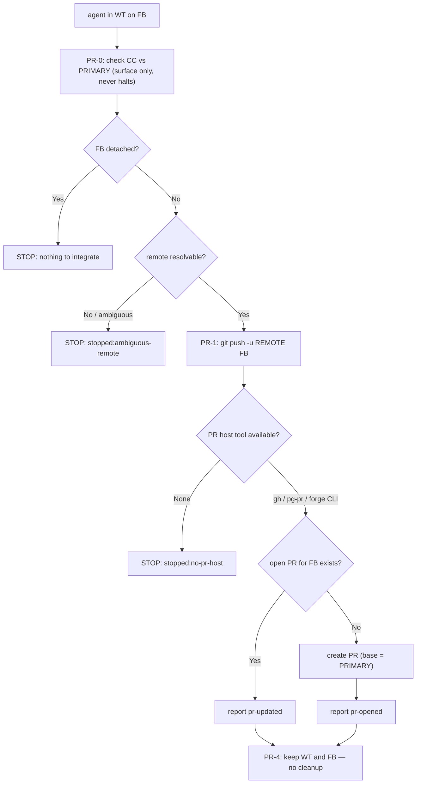

# pull-request handler

This is the **Command-style handler** for the `pull-request` integration strategy:
push the current branch to its remote, open a new pull request or update an
existing one, then stop — landing the PR is a separate, explicit human action that
this handler never performs. It is invoked by the `integrate-branch` skill (via the
`Skill` tool, using the strategy string as the skill name) — do not invoke it
directly unless you are deliberately replaying its flow outside the dispatcher.

Because that dispatch goes through the `Skill` tool, this handler MUST NOT set
`disable-model-invocation` in its frontmatter. The flag is enforced against the
`Skill` tool and also drops the entry from the model-visible skill listing, so
setting it breaks both halves of the dispatcher's Step 4 — its "is this strategy
installed" check and the dispatch itself. It was set here once as a listing-token
saving and reverted for exactly this reason (bd `pg2-okzl0`); the prose above is
the only sanctioned deterrent against invoking a handler directly.

Skills receive no typed arguments, so this handler **re-derives its own context
from git** rather than trusting values handed to it — the same discipline
`ff-merge-to-main` follows. It also re-checks the canonical clone independently
rather than trusting the caller's anomaly report, even though (unlike
`ff-merge-to-main`) that anomaly never blocks this handler.

## Step 0 — Re-derive context from git

Do not assume `<WT>`, `<FB>`, `<CC>`, or the primary branch were passed in —
compute them fresh, identically to `ff-merge-to-main`'s Step 0 (so the two
handlers always agree):

```bash
WT="$(pwd)"                                   # the current working tree
FB="$(git rev-parse --abbrev-ref HEAD)"        # the feature branch
CC="$(cd "$(git rev-parse --git-common-dir)/.." && pwd)"   # canonical clone (main worktree)
# primary branch — same resolution integrate-branch-support uses (declared → origin/HEAD → main)
PRIMARY="$(git config --get pgii-integrate-branch.primaryBranch \
  || git symbolic-ref --short refs/remotes/origin/HEAD 2>/dev/null \
  || echo origin/main)"
PRIMARY="${PRIMARY#origin/}"                    # strip the remote prefix if it came from origin/HEAD
```

- **`<WT>`** = the current working tree — wherever this handler is running.
- **`<FB>`** = the current branch. If `git rev-parse --abbrev-ref HEAD` prints
  `HEAD` (detached), there is no feature branch to integrate — **halt and report**
  "nothing to integrate: detached HEAD," and stop here.
- **`<CC>`** = the canonical clone, i.e. the **main working tree** of the common
  git dir (`git rev-parse --git-common-dir` resolved to its parent directory).
  Unlike `ff-merge-to-main`, this handler never writes to `<CC>` — it only reads it
  to surface an anomaly (PR-0 below).
- **primary branch** = the shared resolution (same one `integrate-branch-support`
  and `ff-merge-to-main` use): `git config --get
pgii-integrate-branch.primaryBranch` → else `git symbolic-ref
refs/remotes/origin/HEAD` (strip the `refs/remotes/origin/` prefix) → else `main`.
  It is the PR's base branch.

## PR-0 — Surface a canonical anomaly (non-blocking)

Re-check the canonical clone independently — do not trust the caller's report:

```bash
git -C "$CC" rev-parse --abbrev-ref HEAD   # compare to $PRIMARY
git -C "$CC" status --porcelain            # non-empty means dirty
```

If `<CC>` is off `<PRIMARY>` or dirty, this is a Tier R **R-3 anomaly** and MUST be
surfaced to the user. Unlike `ff-merge-to-main`'s FF-0, this is **not** a halt
condition here: the `pull-request` method never reads from or writes to `<CC>` — it
only pushes `<WT>`'s branch to a remote and talks to a PR host — so an off-primary
or dirty canonical clone has nothing this handler could damage. Report the note and
continue to PR-1 regardless.

## PR-1 — Push the feature branch to its remote

Resolve which remote to push to the same way `integrate-branch-support` resolves
remote ambiguity (§4.3 edge cases): prefer the branch's existing upstream; fall back
to the sole remote if there's exactly one; anything else is ambiguous.

```bash
REMOTE="$(git -C "$WT" rev-parse --abbrev-ref --symbolic-full-name "@{u}" 2>/dev/null | cut -d/ -f1)"
if [ -z "$REMOTE" ]; then
  n="$(git -C "$WT" remote | grep -c .)"
  # 2+ candidate remotes and no upstream set → AMBIGUOUS: stop and report
  # `stopped:ambiguous-remote` (do NOT fall through to the push and guess a remote).
  [ "$n" -gt 1 ] && exit 1
  REMOTE="$(git -C "$WT" remote)"   # the sole remote when n==1 (empty if none)
fi
git -C "$WT" push -u "$REMOTE" "$FB"
```

If no remote can be resolved unambiguously (no upstream, and more than one
candidate remote), **halt and report** `stopped:ambiguous-remote` rather than
guess. This should be rare in practice — `integrate-branch`'s feasibility check
(Step 4) already confirmed a `remote` exists before invoking this handler — but the
handler re-verifies rather than trusting that.

If `<FB>` already had commits pushed and an open PR exists, this push is what
"updates" that PR — most PR hosts pick up new commits on the branch automatically;
no separate "update" API call is needed for the commits themselves.

## PR-2 — Open a new PR, or confirm the existing one

Detect whichever PR host tool is available in this repo, and use it to check for an
existing **open** PR whose head is `<FB>`, rather than trusting a caller-supplied
`open_pr` value (it may be stale by the time this handler runs):

- **`gh` (GitHub CLI) present:**
  ```bash
  gh pr view "$FB" --json url,state,number
  ```
  A found PR in `state: "OPEN"` means PR-1's push already updated it — report
  `pr-updated` with its `url`. Nothing found (or a non-open state, e.g. it was
  closed/merged and this is fresh work) → open one:
  ```bash
  gh pr create --head "$FB" --base "$PRIMARY" --fill
  ```
  and report `pr-opened` with the printed URL.
- **`pg-pr` present (no `gh`):** consult its own listing (e.g. `pg-pr pr list
--json`, filtered to a head of `<FB>`) for an existing open PR. Found → report
  `pr-updated`. Not found → `pg-pr pr create --head "$FB" --base "$PRIMARY" --title
"<derived title>"` (a title is required; derive it from the branch's commit
  history — e.g. the first commit's subject — or ask the user if the branch mixes
  unrelated work) and report `pr-opened` with the returned URL.
- **Another configured forge CLI:** the same pattern — probe for an existing open
  PR on `<FB>` first; only create one if none is found; use whatever base-branch and
  title flags that CLI exposes, targeting `<PRIMARY>`.
- **None of the above installed:** **halt and report** `stopped:no-pr-host` — a
  remote existing does not mean there's a way to open a PR against it from here.

## PR-3 — Never auto-merge (hard rule)

This handler's job **ends** at opening or updating the PR. Merging a PR-driven
repo requires **explicit human permission** in this workspace — it is not this
handler's decision to make, no matter how confident the checks look or how the
request is framed (e.g. "just land it," "merge if green"). Concretely, this
handler MUST NOT run, at any point, for any reason:

- `gh pr merge` (with or without `--auto`)
- `pg-pr pr merge` or `pg-pr pr automerge on` — both of which `pg-pr` itself
  labels human-only verbs (its own CLI prints `WARNING: merge is a human-only
verb` / `WARNING: automerge is a human-only verb` if invoked)
- any other forge CLI's merge or enable-automerge equivalent

If the user wants the PR actually merged, that is a separate action outside
`integrate-branch` entirely — they merge it themselves via the PR host's UI or CLI.
This handler reports the PR as opened/updated and stops there.

## PR-4 — Keep the branch and worktree

Unlike `ff-merge-to-main`'s FF-4, this handler performs **no cleanup**. The work is
not yet integrated — the PR is open, not merged — so `<WT>` and `<FB>` MUST remain
exactly as they are. Do not run `git worktree remove`, `git branch -d`, or any
equivalent. The worktree and branch are retired later, by whichever handler
eventually lands the merged PR (or manually, once the human has merged it).

## Decision flow



## Reporting the outcome

Report the result back using the shared handler vocabulary: `pr-opened` (a new PR
was created), `pr-updated` (an existing open PR already covers `<FB>`, and PR-1's
push refreshed it), or `stopped:<reason>` (detached HEAD, an unresolvable remote, or
no PR host tool available). Always include the PR's URL when one exists. This
handler never returns `landed` — that outcome belongs to `ff-merge-to-main`, and
this handler never merges anything.

## Rules this handler enforces (Tier R, RFC 2119)

- The handler MUST re-derive `<WT>`, `<FB>`, `<CC>`, and the primary branch from
  git itself rather than trusting caller-supplied values (skills have no typed
  arguments).
- On a detached `HEAD` in `<WT>`, the handler MUST halt and report "nothing to
  integrate" rather than guess at a feature branch.
- The handler MUST re-check `<CC>`'s branch and cleanliness itself (PR-0) rather
  than trusting a caller-supplied anomaly report, and MUST surface any anomaly
  found (R-3) — but MUST NOT halt on it, because the `pull-request` method never
  reads from or writes to the canonical clone (R-8's carve-out for non-canonical-
  advancing methods).
- The handler MUST resolve the push remote itself and MUST halt rather than guess
  when it cannot resolve one unambiguously.
- The handler MUST check for an existing open PR on `<FB>` before creating a new
  one, so re-running this handler updates rather than duplicates a PR.
- The handler MUST NOT merge the PR, enable PR automerge, or invoke any
  human-only merge verb (`gh pr merge`, `pg-pr pr merge`, `pg-pr pr automerge on`,
  or a forge-CLI equivalent) under any circumstance — merging a PR-driven repo in
  this workspace requires explicit human action outside this handler.
- The handler MUST NOT remove, retire, or otherwise clean up `<WT>` or `<FB>` —
  unlike `ff-merge-to-main`'s FF-4, cleanup does not belong to this handler because
  the work is not yet integrated.
- The handler MUST report the PR's URL and one of `pr-opened` / `pr-updated` /
  `stopped:<reason>` — never `landed`.
