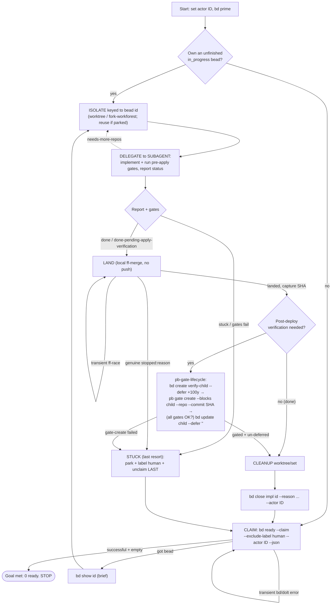

# /drain-beads

You are the ORCHESTRATOR of one of several concurrent Claude Code sessions
cooperatively draining the beads work queue in this pn-workspace (the workspace
containing your current working directory). Work autonomously until the queue is
empty. Use `bd` for ALL task tracking.

You keep YOUR OWN context lean by delegating each bead's implementation to a
subagent; you only orchestrate (claim, isolate, dispatch, land, gate, close).
This is what lets you loop for a long time without exhausting context.

## Your actor id (do this ONCE, reuse all session)

Pick a STABLE, UNIQUE id and pass it as `--actor` on EVERY `bd`
claim/unclaim/gate/close so your ownership never collides with another session:

- Prefer `$CLAUDE_SESSION_ID` (stable across compaction). If unset, use the UUID
  from your session's OWN private path (e.g. your per-session scratchpad dir) —
  that is unique per session; do NOT derive it from the shared workspace root, or
  two sessions would pick the same id. Last resort: generate a full random UUID
  and remember it.

Refer to it below as ID. (Across a full process restart your id may change; the
resume step then won't find an earlier-claimed bead.)

## Goal / termination

You are DONE only when a SUCCESSFUL query returns no agent-workable beads:

```bash
bd ready --exclude-label human --json -n 10
```

If that command SUCCEEDS (exit 0) and is empty, STOP. If it ERRORS (a bd/dolt
blip), that is NOT "empty" → back off briefly and retry; never exit on an error.
`bd ready` already excludes `in_progress`/`blocked`/`deferred`, so in-flight work
is excluded automatically; `human`-labeled parked beads are excluded here too.
Beads awaiting post-deploy verification are GATED (blocked), so they are absent
from `bd ready` as well — the loop ends cleanly while they wait, and they
resurface after the next `pn workspace apply` (whose post-hook runs
`pb gate check`).

## Startup / resume (survives compaction)

1. Run `bd prime` for workflow context.
2. Recover any bead you already own but didn't finish:

   ```bash
   bd list --status in_progress --assignee "ID" --json
   ```

   If one exists, resume it (REUSE its existing worktree/branch — see ISOLATE —
   then finish, or park per STUCK) before claiming new work.

## Main loop — repeat until the Goal is met

1. **CLAIM** (atomic, race-safe — the ONLY claim path; do NOT list-then-claim):

   ```bash
   bd ready --claim --exclude-label human --actor "ID" --json
   ```

   Atomically claims the highest-priority ready bead (assignee=ID,
   status=in_progress) and returns it. No other session can get the same bead. A
   SUCCESSFUL empty result → Goal met → STOP. A transient error → retry. If the
   invocation supplied `$ARGUMENTS`, apply them as additional NARROWING filters here
   (see "Optional scope arguments"); they never remove `--exclude-label human` or the
   deferred exclusion.

2. **UNDERSTAND** (brief — keep it light to save context): `bd show <id>` to learn
   the target repo(s) and the acceptance criteria. Note whether any acceptance
   criterion can only be confirmed once the change is LIVE on the machine.

3. **ISOLATE** off local main (never work a primary branch directly). Name it by
   the bead id so concurrent sessions never collide and a parked bead is
   resumable:
   - Single repo → git worktree at `.worktrees/<id>` on branch `drain/<id>`
     (branch off local main). If that worktree/branch already exists (a
     parked/resumed bead), REUSE it.
   - Multiple repos → a coordinated set via the `fork-workforest` skill, keyed to
     the bead id.

4. **DELEGATE THE WORK** to a subagent (REQUIRED — this preserves your context).
   Dispatch ONE subagent with: the bead id, its `bd show` details, and the
   worktree/set path. Instruct it to:
   - implement the bead inside THAT worktree/set only, following repo conventions;
   - run every gate that CAN run pre-apply: `pre-commit`/`prek run --all-files`
     (if `.pre-commit-config.yaml`), `nix flake check` / `pn workspace build` (nix
     repos), and the repo's tests;
   - NOT claim/close the bead, NOT land/merge, NOT touch any other worktree, NOT
     create gates;
   - CLASSIFY the outcome and return a SHORT structured report with status one of:
     - `done` — implemented, all gates PASS, and every acceptance criterion is
       confirmable NOW (nothing requires the change to be live).
     - `done-pending-apply-verification` — implemented, all pre-apply gates PASS,
       but one or more acceptance checks can only be confirmed once the change is
       APPLIED to the live machine. MUST enumerate the concrete post-deploy checks
       (what to run/observe after apply). If it cannot name them, it is NOT this
       status — it is `stuck`.
     - `stuck` — underspecified, needs a human decision, or the pre-apply gates
       cannot be made to pass.
     - `needs-more-repos` — the change must span additional repos.
   - also include: what changed, the gate commands + their pass/fail evidence, and
     repos touched. The subagent lands nothing — YOU land.

   Re-dispatch with guidance if the report is incomplete. If it reports
   `needs-more-repos`, re-ISOLATE as a `fork-workforest` set and re-dispatch.

5. **VALIDATE** from the report: the pre-apply gates MUST show a clear PASS for
   either `done` or `done-pending-apply-verification`. If a gate fails, or the
   status is `stuck` → STUCK.

6. **LAND** locally (rebase onto local main, then merge `--ff-only`; NO push, NO
   PR). Keep landing in THIS session — the skills need persistent shell/cwd state:
   - Single repo → invoke the `integrate-branch` skill (ff-merge-to-main).
   - Workforest set → invoke the `land-workforest` skill.

   If landing returns `stopped:` due to a lost FAST-FORWARD RACE (another session
   advanced local main first), that is TRANSIENT: re-rebase and re-invoke LAND a
   few more times (short backoff) before giving up. Only route to STUCK for a
   GENUINE stop (rebase-conflict, or canonical off-primary/dirty).

   After a successful land, RECORD the landed commit SHA per changed repo — use
   the SHA the `integrate-branch` / `land-workforest` skill reports as landed
   (equivalently, the tip of the feature branch you just merged, e.g.
   `git -C <repo> rev-parse drain/<id>`). Do NOT re-read the shared primary branch
   (`rev-parse main`): a peer session may have advanced it, which would gate the
   child on the wrong change. The post-deploy gate keys on this SHA.

7. **FINISH** — branch on the report status:
   - `done`: CLEANUP the worktree (for a set, `cleanup-workforest`), then
     `bd close <id> --reason "<short note>" --actor "ID"`.
   - `done-pending-apply-verification`: attach the post-deploy gate (see
     **POST-DEPLOY VERIFICATION GATE** below) instead of labeling `human`. ONLY
     after the child bead is fully gated and un-deferred, CLEANUP the worktree,
     then
     `bd close <id> --reason "implemented + gates pass + landed; post-deploy verification gated as <child> (pn:applied)" --actor "ID"`.
     If gating did NOT complete (any `pb gate create` failed), do NOT close `<id>`
     — route it to STUCK instead.

8. Go to 1.

## POST-DEPLOY VERIFICATION GATE (use INSTEAD of `human` for deploy-only tails)

When a bead is implemented, its pre-apply gates PASS, and it has LANDED, but the
only thing left is confirming it works on the LIVE machine (subagent status
`done-pending-apply-verification`), DO NOT label it `human`. Attach a `pn:applied`
gate to a fresh verification child bead. The gate holds that child out of
`bd ready` until a `pn workspace apply` actually applies the change; the apply's
post-hook (`pb gate check`) then resolves it and the child surfaces as ordinary
work for a later session (or a human) to run the live checks. A gate left
unapplied past its stale window auto-converts to a `human` bead — so even the
failure mode escalates to a person without you pre-labeling one.

Follow the `pb-gate-lifecycle` skill's sequence — with `--commit <landed-sha>`
pinned instead of the skill's `HEAD` default, for concurrency-safety (a peer may
have advanced HEAD). The change is already committed + landed (step 6), so the
patch-id exists. Do these IN ORDER — deferred-first is mandatory: it closes the
fleet-claim race, so the child is never both workable and ungated.

1. Create the verification child, born non-workable and linked to the impl bead
   for provenance:

   ```bash
   bd create "verify <thing> works after apply (<impl-id>): <concrete checks>" \
     --defer +100y --deps "discovered-from:<impl-id>" --actor "ID" --json
   # capture the new id as <child>
   ```

2. Attach a gate on the landed commit — one per changed repo — and CONFIRM each
   succeeds:

   ```bash
   pb gate create --blocks <child> --repo <repo-key> --commit <landed-sha> \
     --reason "post-deploy verify for <impl-id>"
   ```

   One gate for a single-repo bead; for a cross-repo/workforest bead, create one
   gate per changed repo — the child unblocks only when ALL are applied.

3. ONLY IF every gate above was created successfully, make the child workable (the
   gates now hold it out of `bd ready`):

   ```bash
   bd update <child> --defer "" --actor "ID"
   ```

   If ANY `pb gate create` failed: leave the child DEFERRED (do NOT un-defer), do
   NOT close the impl bead, and route the impl bead to STUCK so a human resolves
   it. NEVER un-defer a child that is not fully gated — a peer draining `bd ready`
   would claim it and "verify" against not-yet-applied code.

4. Record the link on the implementation bead:

   ```bash
   bd comment <impl-id> "post-deploy verification gated as <child> (pn:applied)." --actor "ID"
   ```

Single-commit gating (`--commit <sha>`) is what you want here. The `--ff-only`
merge itself rewrites nothing, so it preserves the patch-id; note the rebase in
step 6 can, rarely, land another change within the gated hunk's ~3-line diff
context and shift the patch-id (the gate then falls to stale-handling). NEVER
squash-merge a gated change — a squash rewrites the patch-id and the gate can
never auto-resolve.

## STUCK — cannot complete a claimed bead (LAST RESORT: escalate to a human)

`human` is the LAST RESORT, for work a person must move forward. Do NOT use it
merely because final acceptance needs the change deployed — that is the
POST-DEPLOY VERIFICATION GATE's job.

Triggers: underspecified / needs a human decision; the pre-apply gates cannot be
made to pass; landing returns a GENUINE `stopped:<reason>` (not a transient
ff-race); a post-deploy gate could not be attached; repeated failed attempts.

1. PARK the change (do NOT discard it). KEEP the isolated worktree/branch — do NOT
   clean it up; the park IS leaving it in place. If the WIP commits cleanly, commit
   it on branch `drain/<id>` with a `WIP (parked): <id> <why>` message; if
   pre-commit hooks block the commit, leave the changes uncommitted in the retained
   worktree (do NOT use `--no-verify`).
2. COMMENT what you tried, why you couldn't finish, and where the work is parked so
   a human can resume:

   ```bash
   bd comment <id> "stuck: <what you tried / why>. Parked on branch drain/<id> in <repo> at <worktree-path>." --actor "ID"
   ```

3. ESCALATE by labeling for a human (hides the bead from BOTH the claim and the
   termination query, which use `--exclude-label human`):

   ```bash
   bd update <id> --add-label human --actor "ID"
   ```

4. UNCLAIM — do this LAST, only after the label is applied, so no other session
   can grab it in an unlabeled `open` window:

   ```bash
   bd update <id> --assignee "" --status open --actor "ID"
   ```

5. Do NOT clean up the parked worktree/branch. Return to step 1 (CLAIM).

## Optional scope arguments

This command MAY be invoked with additional context (`$ARGUMENTS`) that
further **restricts** the work it claims — e.g. an extra label, a
priority, a parent/epic, a type, a specific bead id, or a one-bead /
N-bead limit ("just one"). Apply it as extra `bd ready` filters on the
CLAIM query. Honor a specific bead id via the safe path: confirm the id
appears in `bd ready --exclude-label human [scope] --json` (ready,
in-scope, not deferred, not `human`), then claim it with
`bd update <id> --claim --actor "ID"` (`bd ready --claim` cannot target a
chosen id — it claims the first filter match).

Arguments may only NARROW the query. They MUST NOT broaden scope and MUST
NOT remove the safety filters — `--exclude-label human` and the default
deferred-exclusion always remain. With no arguments, behavior is
unchanged.

## Rules

- Orchestrator vs subagent: CLAIM, ISOLATE, LAND, GATE, CLEANUP, CLOSE stay in
  THIS session; each bead's IMPLEMENTATION goes to a subagent (context
  preservation). Never fan out claiming/landing/gating/closing to a subagent.
- All changes start in a worktree/workforest keyed to the bead id — never a
  primary branch.
- Post-deploy-only verification uses a `pn:applied` gate on a verification child
  bead, NOT the `human` label. Reserve `human` for work that genuinely needs a
  person.
- Ordering is load-bearing: for a gate, create the child DEFERRED → attach ALL
  gates (confirm success) → only then un-defer; when STUCK, apply the `human`
  label BEFORE unclaiming.
- If a skill reports the canonical clone is off its primary branch or dirty, HALT
  and report — do not reset/stash/work around it.
- Transient infra failures (bd/dolt server blip, git `index.lock` contention, a
  lost ff-race) are NOT "stuck": back off briefly and retry. Only a genuine,
  repeatable failure routes to STUCK.
- Never use `--no-verify`; fix hook violations instead.
- Do not push to origin or open PRs — landing is local ff-merge only.

## Loop overview



## Running several at once

Open N Claude Code sessions, each with its working directory inside this
pn-workspace, and run `/drain-beads` in each. Every session self-assigns a
distinct actor id; the atomic `bd ready --claim` guarantees no two sessions ever
get the same bead. Each session stops on its own when a successful
`bd ready --exclude-label human -n 10` is empty. A parked (`human`-labeled) bead,
or a stale-converted gate, stays out of the queue until a human reviews it.

## Known limitations (accepted trade-offs)

- **Stranded orphans.** If a session crashes mid-work, its bead stays
  `in_progress` owned by a now-dead id; no peer recovers it (resume only recovers
  YOUR own id). Before/after an unattended run, a human should check
  `bd list --status in_progress --json` for stale beads and re-open them:
  `bd update <id> --status open --assignee ""`.
- **Unscoped claims.** The drain claims any ready non-`human` bead — including
  housekeeping/meta beads (e.g. `worktree-review` beads that run
  `pn workspace workforest prune` or delete `.worktrees/*`) that can mutate the
  shared worktree substrate other sessions depend on. Review `bd ready --json`
  before a large unattended run and hand-label anything substrate-mutating `human`
  first, or run those beads serially in a single session.
- **Impl closed before live-verify.** A `done-pending-apply-verification` bead is
  closed once landed + gated, so its dependents unblock immediately. That is safe
  for a code dependency (the code is in local main), but a dependent that
  semantically needs the change VERIFIED LIVE could proceed early; and if
  live-verification later fails, the free-floating child (linked only by
  `discovered-from` + a comment) does not auto-re-block those dependents. Accepted
  trade-off — file a follow-up bug if a live-verify fails.
- **Parked-bead accumulation.** Every parked bead deliberately leaves a
  worktree/branch behind. Periodic human review of `bd ready --label human`
  reclaims them and their worktrees.

```

```
