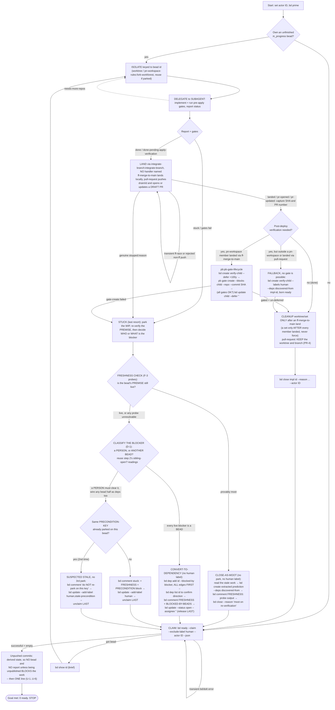

# /drain-beads

You are the ORCHESTRATOR of one of several concurrent Claude Code sessions
cooperatively draining the beads work queue in this pn-workspace (the workspace
containing your current working directory). Work autonomously until the queue is
empty. Use `bd` for ALL task tracking.

You keep YOUR OWN context lean by delegating each bead's implementation to a
subagent; you only orchestrate (claim, isolate, dispatch, land, gate, close).
This is what lets you loop for a long time without exhausting context.

## Your actor id (do this ONCE, reuse all session)

Pick a STABLE, UNIQUE id and pass it as `--actor` on EVERY `bd`
claim/unclaim/gate/close so your ownership never collides with another session:

- Prefer `$CLAUDE_SESSION_ID` (stable across compaction). If unset, use the UUID
  from your session's OWN private path (e.g. your per-session scratchpad dir) —
  that is unique per session; do NOT derive it from the shared workspace root, or
  two sessions would pick the same id. Last resort: generate a full random UUID
  and remember it.

Refer to it below as ID. (Across a full process restart your id may change; the
resume step then won't find an earlier-claimed bead.)

## Goal / termination

You are DONE only when a SUCCESSFUL query returns no agent-workable beads:

```bash
bd ready --exclude-label human --json -n 10
```

If that command SUCCEEDS (exit 0) and is empty, STOP (see "Unpushed commits when
you STOP"). If it ERRORS (a bd/dolt blip), that is NOT "empty" → back off briefly
and retry; never exit on an error. `bd ready` already excludes
`in_progress`/`blocked`/`deferred`, so in-flight work is excluded automatically;
`human`-labeled parked beads are excluded here too. Beads awaiting post-deploy
verification are GATED (blocked), so they are absent from `bd ready` as well —
the loop ends cleanly while they wait, and they resurface after the next
`pn workspace apply` (whose post-hook runs `pb gate check`).

### Unpushed commits when you STOP

Where the resolved strategy is `ff-merge-to-main` you LAND locally and never push, so
every bead you closed added commits to local `main` that this session did NOT
publish. That is EXPECTED and is NOT a problem worth the operator's attention, so
**REPORT NOTHING ABOUT IT** — no heading, no `pn workspace doctor` output, no
per-repo counts, no remediation sequence. Do not run the probe just to have something
to say. A repo whose resolved strategy is `pull-request` leaves no unpushed debt at
all — there the push IS the landing. Full contract: the always-on
`Unpushed Landing Debt` rules (**U-1..U-6**).

The ONE exception is a CONSEQUENCE for the work itself: if being unpublished
BLOCKS it — e.g. a consumer flake pins these repos as `github:` inputs, so a
closed bead's change cannot take effect on apply until they are pushed and
relocked — say that in ONE line and stop there. Still do not push (U-5); if you
probe at all, it is read-only, never `--fix` (U-4).

Do NOT `bd create` anything for this either way. There is deliberately NO
standing push bead: `pg2-5subz` became one by accident and nearly orphaned 11
commits, and `pg2-dawg2` replaced it, pushed all 12, and closed correctly — after
which the debt regenerated within a day. A bead describes one instant; the probe
describes now. If you find a standing push bead, report it as this defect (U-2)
rather than updating it.

## Startup / resume (survives compaction)

1. Run `bd prime` for workflow context.
2. Recover any bead you already own but didn't finish:

   ```bash
   bd list --status in_progress --assignee "ID" --json
   ```

   If one exists, resume it (REUSE its existing worktree/branch — see ISOLATE —
   then finish, or park per STUCK) before claiming new work.

## Main loop — repeat until the Goal is met

1. **CLAIM** (atomic, race-safe — the ONLY claim path; do NOT list-then-claim):

   ```bash
   bd ready --claim --exclude-label human --actor "ID" --json
   ```

   Atomically claims the highest-priority ready bead (assignee=ID,
   status=in_progress) and returns it. No other session can get the same bead. A
   SUCCESSFUL empty result → Goal met → STOP. A transient error → retry. If the
   invocation supplied `$ARGUMENTS`, apply them as additional NARROWING filters here
   (see "Optional scope arguments"); they never remove `--exclude-label human` or the
   deferred exclusion.

2. **UNDERSTAND** (brief — keep it light to save context): `bd show <id>` to learn
   the target repo(s) and the acceptance criteria. Note whether any acceptance
   criterion can only be confirmed once the change is LIVE on the machine.

3. **ISOLATE** off local main (never work a primary branch directly). Name it by
   the bead id so concurrent sessions never collide and a parked bead is
   resumable:
   - Single repo → git worktree at `.worktrees/<id>` on branch `drain/<id>`
     (branch off local main). If that worktree/branch already exists (a
     parked/resumed bead), REUSE it.
   - Multiple repos → a coordinated set via the
     `pn-workspace-rules:fork-workforest` skill, keyed to the bead id.

4. **DELEGATE THE WORK** to a subagent (REQUIRED — this preserves your context).
   Dispatch ONE subagent with: the bead id, its `bd show` details, and the
   worktree/set path. Instruct it to:
   - implement the bead inside THAT worktree/set only, following repo conventions;
   - run every gate that CAN run pre-apply: `pre-commit`/`prek run --all-files`
     (if `.pre-commit-config.yaml`), `nix flake check` / `pn workspace build` (nix
     repos), and the repo's tests;
   - NOT claim/close the bead, NOT land/merge, NOT touch any other worktree, NOT
     create gates;
   - CLASSIFY the outcome and return a SHORT structured report with status one of:
     - `done` — implemented, all gates PASS, and every acceptance criterion is
       confirmable NOW (nothing requires the change to be live).
     - `done-pending-apply-verification` — implemented, all pre-apply gates PASS,
       but one or more acceptance checks can only be confirmed once the change is
       APPLIED to the live machine. MUST enumerate the concrete post-deploy checks
       (what to run/observe after apply). If it cannot name them, it is NOT this
       status — it is `stuck`.
     - `stuck` — underspecified, needs a human decision, or the pre-apply gates
       cannot be made to pass.
     - `needs-more-repos` — the change must span additional repos.
   - also include: what changed, the gate commands + their pass/fail evidence, and
     repos touched. The subagent lands nothing — YOU land.

   Re-dispatch with guidance if the report is incomplete. If it reports
   `needs-more-repos`, re-ISOLATE as a `pn-workspace-rules:fork-workforest` set and
   re-dispatch.

5. **VALIDATE** from the report: the pre-apply gates MUST show a clear PASS for
   either `done` or `done-pending-apply-verification`. If a gate fails, or the
   status is `stuck` → STUCK.

6. **LAND** by the strategy the REPO declares — never a hardcoded local ff-merge.
   Keep landing in THIS session — the skills need persistent shell/cwd state:
   - Single repo → invoke the `integrate-branch:integrate-branch` skill and let IT
     resolve the strategy. You MUST NOT name a handler: the dispatcher reads
     `pgii-integrate-branch.strategy` (already set per repo by the workspace's
     `post-clone` hooks — no setup step of yours) and dispatches
     `integrate-branch:ff-merge-to-main`, `integrate-branch:pull-request`, or a
     declared custom handler. Naming a handler hardcodes ff-merge and makes this
     command UNUSABLE in a `pull-request` repo (a protected-`main` monorepo, where an
     `--ff-only` merge into local `main` would land unreviewed commits past the PR,
     CODEOWNERS and CI).
   - Workforest set → invoke the `pn-workspace-rules:land-workforest` skill; it is
     itself a per-repo orchestrator over the same dispatcher, so each member repo
     lands by ITS OWN strategy.

   **What "LANDED" means depends on the resolved strategy.** Record whichever the
   handler reports:
   - `ff-merge-to-main` → outcome `landed`: the rebase-then-`--ff-only` merge onto the
     canonical clone's primary branch succeeded. RECORD the landed commit SHA per
     changed repo.
   - `pull-request` → outcome `pr-opened` or `pr-updated`: the branch was pushed and a
     PR was created or refreshed by that push. **THAT IS THE LANDED STATE** — nothing
     further is required, and this command MUST NOT merge the PR or wait for a merge
     (the handler's PR-3 forbids it; merging is a human action). RECORD the pushed head
     SHA per changed repo AND the PR number + URL. If a PR already EXISTS for
     `drain/<id>`, the push UPDATES it and a second PR MUST NOT be opened (the handler
     probes for an open PR on the branch before creating one). The PR MUST be a DRAFT —
     `gh pr create --draft` (promotion to ready is a separate human step); if it came
     back non-draft, convert it immediately with `gh pr ready --undo <number>`.

   **Autonomy — push and draft-PR are PRE-AUTHORIZED; merging is not.** When the
   resolved strategy is `pull-request`, you MAY push `drain/<id>` and create or update
   its DRAFT PR WITHOUT per-bead operator confirmation, and you MUST NOT stop to ask:
   that push IS the landing method the repo itself declared, the PR is a draft nobody
   has merged, and review + CODEOWNERS + CI still gate the merge. You MUST NOT merge
   the PR, enable automerge, or push any PRIMARY branch. This is NOT the **U-5**
   prohibition: U-5 bars pushing on your own initiative to discharge unpushed
   local-`main` debt, whereas here the operator authorized the push in advance by
   declaring `pgii-integrate-branch.strategy = pull-request` for that repo.

   If landing returns `stopped:` due to a lost FAST-FORWARD RACE (another session
   advanced local main first), that is TRANSIENT: re-rebase and re-invoke LAND a
   few more times (short backoff) before giving up. The `pull-request` analogue is a
   REJECTED NON-FAST-FORWARD PUSH (a peer advanced the remote `drain/<id>`): also
   TRANSIENT — rebase onto the UPDATED REMOTE branch and re-invoke LAND a few more
   times. Only route to STUCK for a GENUINE stop (rebase-conflict,
   `stopped:ambiguous-remote`, `stopped:no-pr-host`, or a canonical off-primary/dirty
   halt). A canonical off-primary/dirty clone halts only a canonical-ADVANCING
   strategy: the `pull-request` handler's PR-0 SURFACES that anomaly and PROCEEDS,
   because it never reads or writes the canonical clone (R-8's carve-out). Under
   `pull-request` it MUST therefore be reported and NOT treated as a stop.

   After a successful land, RECORD the SHA per changed repo — the merged commit for
   `ff-merge-to-main`, the pushed head for `pull-request`. Use the SHA the
   `integrate-branch:integrate-branch` / `pn-workspace-rules:land-workforest` skill
   reports (equivalently, the tip of the feature branch, e.g.
   `git -C <repo> rev-parse drain/<id>`). Do NOT re-read the shared primary branch
   (`rev-parse main`): a peer session may have advanced it, which would gate the
   child on the wrong change. The post-deploy gate keys on this SHA.

7. **FINISH** — branch on the report status.

   CLEANUP IS STRATEGY-DEPENDENT: read "CLEANUP the worktree" below as "retire the
   isolation ONLY where the resolved strategy was `ff-merge-to-main`". After a
   `pull-request` land the worktree and branch MUST be KEPT (the handler's PR-4) — the
   work is pushed, not merged, so review feedback still needs that worktree, and
   whoever merges the PR retires them.

   ORDER IS LOAD-BEARING for a workforest SET: every member repo MUST have LANDED
   (step 6) BEFORE the set is retired, and the bead MUST NOT be closed while any
   member is un-landed. `pn-workspace-rules:cleanup-workforest` is safe by default —
   it removes only members whose branch is already an ancestor of their primary, and
   KEEPS plus reports the rest — so the destructive mistake is OVERRIDING it rather
   than calling it early: the agent MUST NOT pass `--force-unlanded-branch-removal`
   or `--force-dirty-worktree-removal` (nor `pn workspace workforest remove --force`)
   to force teardown past a member that did not land, because that discards work no
   other copy holds. Only an operator MAY authorize a force flag. If cleanup KEEPS
   any member, teardown is INCOMPLETE: finish landing that member (re-invoke
   `pn-workspace-rules:land-workforest`), then retire the set; if it cannot land,
   leave the set IN PLACE and route the bead to STUCK, which preserves the isolation.
   - `done`: CLEANUP the worktree (for a set,
     `pn-workspace-rules:cleanup-workforest`), then
     `bd close <id> --reason "<short note>" --actor "ID"`.
   - `done-pending-apply-verification`: attach the post-deploy gate (see
     **POST-DEPLOY VERIFICATION GATE** below) instead of labeling `human`. ONLY
     after the child bead is fully gated and un-deferred, CLEANUP the worktree,
     then
     `bd close <id> --reason "implemented + gates pass + landed; post-deploy verification gated as <child> (pn:applied)" --actor "ID"`.
     If gating did NOT complete (any `pb gate create` failed), do NOT close `<id>`
     — route it to STUCK instead. Where that section says the gate path does NOT
     APPLY (a non-pn-workspace repo, or resolved strategy `pull-request`), take its
     `human`-child FALLBACK instead and close `<id>` naming that child and the PR:
     STUCK is for a gate creation that FAILED, not for a repo where gating is
     structurally impossible.

8. Go to 1.

## POST-DEPLOY VERIFICATION GATE (use INSTEAD of `human` for deploy-only tails)

When a bead is implemented, its pre-apply gates PASS, and it has LANDED, but the
only thing left is confirming it works on the LIVE machine (subagent status
`done-pending-apply-verification`), DO NOT label it `human`. Attach a `pn:applied`
gate to a fresh verification child bead. The gate holds that child out of
`bd ready` until a `pn workspace apply` actually applies the change; the apply's
post-hook (`pb gate check`) then resolves it and the child surfaces as ordinary
work for a later session (or a human) to run the live checks. A gate left
unapplied past its stale window auto-converts to a `human` bead — so even the
failure mode escalates to a person without you pre-labeling one.

**SCOPE — this gate path applies ONLY when the changed repo is a `pn workspace`
MEMBER and its resolved strategy is `ff-merge-to-main`.** `pb gate create` resolves
`--repo` through `pn workspace info` and fails
(`repo "<x>" is not in workspace "<root>"`) for anything outside it, so in a repo with
no `pn-workspace.toml` a `pn:applied` gate can NEVER be created — and even if it
could, nothing there ever runs `pn workspace apply` / `pb gate check` to resolve one,
so it would sit until it stale-converted. A `pull-request` repo is excluded for a
second, independent reason: the `pb:pb-gate-lifecycle` skill's own squash-merge rule —
an upstream squash rewrites the patch-id, so the gate can never auto-resolve.

**FALLBACK when the gate path does NOT apply** (repo outside a pn-workspace, or
resolved strategy `pull-request`). This outcome MUST still TERMINATE: you MUST NOT
attempt `pb gate create`, MUST NOT route the bead to STUCK, and MUST NOT leave the
verification tail unrecorded. File the verification child as a `human` bead instead —
CORRECT under **D-1**, because what stands between the code and the live machine is a
PERSON's out-of-band action (merging the draft PR, then that repo's own deploy), not
another bead:

```bash
bd create "verify <thing> works once <pr-url> is merged and deployed (<impl-id>): <concrete checks>" \
  --labels human --deps "discovered-from:<impl-id>" --actor "ID" --json
# capture the new id as <child>. No --defer and NO gate: nothing here would resolve one.
```

Born ready-and-`human`, it is invisible to drain's `--exclude-label human` claim query
and visible to `/unblock-human-beads` immediately — which is intended, not noise: the
operator is the one who merges the PR, so "merge this, then verify" is exactly the
work being handed over. Then CLEANUP per FINISH step 7 (for `pull-request`, KEEP the
isolation) and close the impl bead with a reason naming `<child>` and the PR.

Follow the `pb:pb-gate-lifecycle` skill's sequence — with `--commit <landed-sha>`
pinned instead of the skill's `HEAD` default, for concurrency-safety (a peer may
have advanced HEAD). The change is already committed + landed (step 6), so the
patch-id exists. Do these IN ORDER — deferred-first is mandatory: it closes the
fleet-claim race, so the child is never both workable and ungated.

1. Create the verification child, born non-workable and linked to the impl bead
   for provenance:

   ```bash
   bd create "verify <thing> works after apply (<impl-id>): <concrete checks>" \
     --defer +100y --deps "discovered-from:<impl-id>" --actor "ID" --json
   # capture the new id as <child>
   ```

2. Attach a gate on the landed commit — one per changed repo — and CONFIRM each
   succeeds:

   ```bash
   pb gate create --blocks <child> --repo <repo-key> --commit <landed-sha> \
     --reason "post-deploy verify for <impl-id>"
   ```

   One gate for a single-repo bead; for a cross-repo/workforest bead, create one
   gate per changed repo — the child unblocks only when ALL are applied.

3. ONLY IF every gate above was created successfully, make the child workable (the
   gates now hold it out of `bd ready`):

   ```bash
   bd update <child> --defer "" --actor "ID"
   ```

   If ANY `pb gate create` failed: leave the child DEFERRED (do NOT un-defer), do
   NOT close the impl bead, and route the impl bead to STUCK so a human resolves
   it. NEVER un-defer a child that is not fully gated — a peer draining `bd ready`
   would claim it and "verify" against not-yet-applied code.

4. Record the link on the implementation bead:

   ```bash
   bd comment <impl-id> "post-deploy verification gated as <child> (pn:applied)." --actor "ID"
   ```

Single-commit gating (`--commit <sha>`) is what you want here. The `--ff-only`
merge itself rewrites nothing, so it preserves the patch-id; note the rebase in
step 6 can, rarely, land another change within the gated hunk's ~3-line diff
context and shift the patch-id (the gate then falls to stale-handling). NEVER
squash-merge a gated change — a squash rewrites the patch-id and the gate can
never auto-resolve.

## STUCK — cannot complete a claimed bead (LAST RESORT: escalate to a human)

`human` means A PERSON IS THE BLOCKER. It is the LAST RESORT, for work a person
must move forward — never a generic "not workable right now" park. Do NOT use it
merely because final acceptance needs the change deployed (that is the POST-DEPLOY
VERIFICATION GATE's job), and do NOT use it because ANOTHER BEAD must finish first
(that is a DEPENDENCY — step 3).

Triggers: underspecified / needs a human decision; the pre-apply gates cannot be
made to pass; landing returns a GENUINE `stopped:<reason>` (not a transient ff-race
or rejected non-ff push); a post-deploy gate could not be attached; repeated failed
attempts.
NOT a trigger: "another bead has to land first".

Step 1 only PRESERVES the work; the park that goes in front of a human is the
COMMENT + `human` label in steps 6–7. Steps 2 and 3 stand between the two
deliberately, and each has its OWN exit that is not a park: a bead whose premise
the probes prove MOOT leaves via **CLOSE-AS-MOOT**, and a bead whose live blockers
are all OTHER BEADS leaves via **CONVERT-TO-DEPENDENCY**. Reaching step 4 means a
person really is the blocker.

1. PARK the change (do NOT discard it). KEEP the isolated worktree/branch — do NOT
   clean it up; the park IS leaving it in place. If the WIP commits cleanly, commit
   it on branch `drain/<id>` with a `WIP (parked): <id> <why>` message; if
   pre-commit hooks block the commit, leave the changes uncommitted in the retained
   worktree (do NOT use `--no-verify`).
2. FRESHNESS CHECK — re-verify the bead's PREMISE against CURRENT reality BEFORE you
   write any park comment or apply any label. The bead body is a snapshot from FILING
   time and the reason you are stuck may already be answered: in one pass over the
   parked queue, 5 of 9 beads were already resolved or void. Follow the always-on
   `Premise Freshness` rules (F-1..F-8) and run the NAMED PROBES from F-3 — one per
   external referent this bead names — keeping each decisive output verbatim:
   - `landed?` / `pushed?` / `patch-identical?` for commits and parked branches;
     `path-exists?` / `symbol-shape?` for the files, modules, and symbols the bead's
     steps or design edit; `ticket-open?` for external tickets; `sibling-open?` for
     referenced beads; `next-free-id?` for any "next free" number the bead recorded.
   - An earlier REVIEW of this bead's plan is NOT a freshness signal (F-6). A reviewed
     snapshot ages exactly as fast as the snapshot, so "already reviewed" / "looks
     plan-ready" MUST NOT stand in for running the probes.
   - An unresolvable probe (`exit 128`, missing repo, referent too vague to probe) reads
     as STILL LIVE, never as moot (F-4).
   - Premise STILL LIVE → continue to step 3, and carry this line into the step-6
     comment so the next reader inherits the check:
     `FRESHNESS: <ISO date> — <probe>=<decisive output>; <probe>=<decisive output> ⇒ premise LIVE`
     If the bead names no external referent, record that instead (F-5):
     `FRESHNESS: <ISO date> — no external referent named ⇒ nothing to re-verify`
   - Premise PROVABLY MOOT → this bead is answered, not blocked. Do NOT park it and do
     NOT label it `human`: go to **CLOSE-AS-MOOT** below.

3. CLASSIFY THE BLOCKER — is a PERSON the blocker, or is it ANOTHER BEAD? This is the
   branch BEFORE the escalation, not a check inside it: drain claims with
   `--exclude-label human` and `/unblock-human-beads` claims with `--label human`, so
   the label simultaneously hides the bead from the queue that would work it AND puts
   it in front of the operator. If you are waiting on another bead, the operator has
   nothing to answer and the tracker can express the wait exactly. Full contract: the
   always-on `Blocker Modeling` rules (**D-1..D-8**).
   - Name every live blocker, then ask of each: could a PERSON clear this now with a
     decision, an input, an approval, or an out-of-band action? Or must ANOTHER BEAD
     finish first? Step 2's `sibling-open?` probe already answers the second half for
     every bead this one names — REUSE those readings rather than inventing a parallel
     check: `bd show <sib> --json | jq -r '.data[0].status'`. `open` / `in_progress` /
     `blocked` ⇒ a live blocker. `closed` ⇒ NOT a blocker at all, so it MUST NOT get an
     edge; if every named bead reads `closed`, the reason you were stuck has already
     died — go back to step 2 and re-read the premise.
   - A bead you WISH existed is not a dependency. If the blocking work has no bead, the
     bead you hold is underspecified or needs a decision — that is a HUMAN blocker. MUST
     NOT invent a placeholder bead to depend on (**D-1**).
   - EVERY live blocker is a bead → go to **CONVERT-TO-DEPENDENCY**. Do NOT write a
     PRECONDITION block, do NOT touch the repeat counter, and do NOT apply `human`:
     steps 4–9 are the human-escalation path and you are not on it. A prose
     PRECONDITION is for a condition the tracker CANNOT express; this one it can, and
     prose about it would rot exactly as **P-1** describes while the graph would not.
   - ANY live blocker needs a PERSON → continue to step 4. If some blockers are ALSO
     beads, this is the MIXED case: do CONVERT-TO-DEPENDENCY's step 1 for the bead half
     first, then come back here and finish the escalation (**D-7**).

4. NAME THE PRECONDITION — only when the park is blocked on something that must
   become TRUE before the bead is workable (skip it for an underspecified /
   decision-needed park). What you write here becomes an INSTRUCTION to a later
   agent and keeps being obeyed long after the implementation it describes has been
   refactored, so it MUST be drift-detectable:
   - `PRECONDITION:` MUST state an OBSERVABLE OUTCOME — something a reader can run
     and see ("`nb` run from a subdirectory opens the Gradle ROOT project"). It MUST
     NOT state a MECHANISM ("`nb` is a function defined in `~/.zshrc`"): the next
     refactor makes a mechanism claim permanently false, and every later reader then
     concludes "not applied yet" and re-parks forever.
   - `PRECONDITION-KEY:` MUST be a short kebab slug naming that OUTCOME, not this
     attempt — `nb-opens-gradle-root`, never `nb-check-2` — so a later park blocked
     on the SAME thing produces the SAME key. Step 5 counts these.
   - `DERIVED-FROM:` MUST cite the commit and the file(s) you actually read to write
     the line (`<repo>@<sha> — <path>`), so a later reader can re-derive it and see
     the drift.
   - The failure branch MUST be bounded. MUST NOT write "if not yet applied, re-park
     or wait" with no limit — step 5 IS the limit.

5. DETECT A REPEAT — before commenting, check whether this bead was already parked
   on the same precondition:

   ```bash
   bd show <id> --json | jq -r '(.data[0].comments // [])[].text' | rg -o 'PRECONDITION-KEY: .*'
   ```

   (`comments` is `null` on a bead with none, hence the `// []`; empty output — `rg`
   exit 1 — means no prior key, NOT a failure.)
   - The key you are about to write is ABSENT → ordinary park (step 6a).
   - The key is ALREADY PRESENT — this would be the SECOND park on the same unmet
     precondition → the precondition itself is the suspect, not the world: escalate
     it as stale (step 6b + step 7b). There is NO third park on one key.
   - The bead ALREADY carries the `stale-precondition` label → an earlier staleness
     escalation was released without resolving it. Write NO precondition block at
     all: comment plainly what you observed, re-apply `human` (step 7a), and leave
     `stale-precondition` in place so it stays visible as unresolved.

6. COMMENT what you tried, why you couldn't finish, and where the work is parked so
   a human can resume. Either form MUST carry the step-2 `FRESHNESS:` line.

   **6a — ordinary park**, carrying the step-4 block when there is a precondition:

   ```bash
   bd comment <id> "stuck: <what you tried / why>. Parked on branch drain/<id> in <repo> at <worktree-path>.
   FRESHNESS: <ISO date> — <probe>=<decisive output> ⇒ premise LIVE
   PRECONDITION: <observable outcome that must hold before this is workable>
   PRECONDITION-KEY: <stable-outcome-slug>
   DERIVED-FROM: <repo>@<sha> — <path(s) you read>" --actor "ID"
   ```

   **6b — staleness escalation** (step 5 found the key). Say it is a repeat, point at
   the provenance to re-derive, and record what you ACTUALLY observed — do NOT
   restate the old precondition as though it were fresh:

   ```bash
   bd comment <id> "stuck (SUSPECTED STALE PRECONDITION): SECOND park on PRECONDITION-KEY <slug>, so the precondition may be unsatisfiable rather than merely unmet. Re-derive it from its provenance (<repo>@<sha> — <path>) against CURRENT source before acting on it. Observed now: <what you ran and saw>. FRESHNESS: <ISO date> — <probe>=<decisive output> ⇒ premise LIVE. Do NOT re-park on this key. Parked on branch drain/<id> in <repo> at <worktree-path>." --actor "ID"
   ```

7. ESCALATE by labeling for a human (hides the bead from BOTH the claim and the
   termination query, which use `--exclude-label human`). Reaching here means step 3
   found a PERSON in the way — if it did not, you are on the wrong path:

   **7a — ordinary park:**

   ```bash
   bd update <id> --add-label human --actor "ID"
   ```

   **7b — after a 6b staleness escalation** — both labels in ONE call, so the
   unblocker recognizes the class mechanically instead of re-reading the churn:

   ```bash
   bd update <id> --add-label human,stale-precondition --actor "ID"
   ```

8. UNCLAIM — do this LAST, only after the label (and any step-3 dependency edge) is
   applied, so no other session can grab it in an unlabeled, unblocked `open` window:

   ```bash
   bd update <id> --assignee "" --status open --actor "ID"
   ```

9. Do NOT clean up the parked worktree/branch. Return to step 1 (CLAIM).

## CLOSE-AS-MOOT (STUCK step 2 disproved the premise)

Reached ONLY from a FRESHNESS CHECK whose probes decisively answered the bead's own
question. The bead is not blocked — it is ANSWERED, so parking it would put a
non-question in front of the operator. Close it instead. But a moot bead is not
worthless: stale work often contains a PREDICTION about the code, and a blind close
throws that away (F-7). EXTRACT first, close second.

1. READ the stale work before discarding it — the bead's description/design, its
   comments, and any WIP commit on `drain/<id>`. You are looking for a claim it makes
   that CURRENT source VIOLATES: a defect it predicted, or a decision it called
   load-bearing that the shipped version skipped. Blind-closing is forbidden.

2. EXTRACT any such claim as its own bead BEFORE closing, so the link survives:

   ```bash
   bd create "<the prediction, restated as the defect it predicts>" \
     -d "Extracted from <id> while closing it as moot. The stale work claimed <X>; CURRENT source violates it: <probe>=<decisive output> / <path:line>." \
     --deps "discovered-from:<id>" --actor "ID" --json
   # capture the new id as <extracted>
   ```

3. RECORD the check on the bead, then CLOSE — the recorded probe output IS the
   justification, so it MUST be verbatim, not paraphrased:

   ```bash
   bd comment <id> "FRESHNESS: <ISO date> — <probe>=<decisive output verbatim> ⇒ premise MOOT. Superseded by <what superseded it>. Extracted: <extracted> (or: nothing extractable)." --actor "ID"
   bd close <id> --reason "moot on re-verification: <probe>=<decisive output>; superseded by <what>; extracted <extracted>" --actor "ID"
   ```

4. The isolation — do NOT delete unlanded work. Check whether anything would be lost:

   ```bash
   git -C <worktree-path> status --porcelain; git -C <repo> cherry -v main drain/<id>
   ```

   BOTH empty → nothing to lose → CLEANUP as in the `done` path. EITHER non-empty →
   LEAVE the worktree/branch in place and file the follow-up rather than orphan it. This is
   the ENTRY point for the `worktree-review` label, so it MUST carry that label ALONGSIDE
   `human` — `/unblock-human-beads` triages on the label, and drain's own claim query excludes
   only `human`, so a `worktree-review`-only bead would be drain-claimable and never reach the
   operator (W-1). Record the entry marker at birth (W-2); `bd create` defaults to P2 and
   promotes nothing, so use the no-promotion form:

   ```bash
   bd create "worktree-review: reconcile leftover isolation for <id> (closed as moot)" \
     --labels human,worktree-review --defer +7d --deps "discovered-from:<id>" \
     --notes "[worktree-review $(date +%F)] Leftover isolation from <id>: worktree <worktree-path>, branch drain/<id> in <repo>. Unlanded: <git cherry output>. Dirty: <git status --porcelain output>. A person must rule on keep vs discard. No promotion (priority left at P2)." \
     --actor "ID"
   ```

   Whoever later adjudicates that isolation MUST remove the label and restore the recorded
   priority in the same update that releases or closes the bead — the always-on
   `Worktree-Review Label Lifecycle` rules (W-1..W-8) are the label's full contract, and
   `/unblock-human-beads`' RELEASE / CLOSE steps are where it is carried out. Drain itself
   never adjudicates isolation: such a bead is substrate-class and never enters drain's queue.

5. Return to the MAIN LOOP's step 1 (CLAIM).

## CONVERT-TO-DEPENDENCY (STUCK step 3 found the blocker is another bead)

Reached when EVERY live blocker is another bead. The bead is not waiting on a person, so
it MUST NOT be labeled `human`: the tracker can express this wait exactly, and unlike a
label a dependency edge clears ITSELF. Full contract: the always-on `Blocker Modeling`
rules (**D-1..D-8**).

1. WIRE one edge per live blocker, FIRST — while the bead is still `in_progress` and
   owned by you, so `bd ready` excludes it and the write lands in a window no peer can
   observe (**D-5**). Prefer the FLAG form: the first id is the BLOCKED bead, the second
   is the BLOCKER, and the bare positional form reads identically written either way
   round, so it is where a reversal hides:

   ```bash
   bd dep add <id> --blocked-by <blocker-id>   # once per blocker; <id> depends on <blocker-id>
   bd dep list <id>                            # CONFIRM each blocker echoes back "(open) via blocks"
   ```

   Leave the type at its default `blocks`. `discovered-from` does NOT gate readiness
   (**D-3**), so the `--deps "discovered-from:<id>"` form used elsewhere in this command
   is the WRONG tool here — it would leave the bead drain-claimable while genuinely
   blocked. Do NOT pass `--no-cycle-check`: a cycle makes BOTH beads permanently unready
   (**D-4**).

2. COMMENT what you found, carrying the step-2 `FRESHNESS:` line. Write NO `PRECONDITION`
   block — the graph IS the precondition, and prose restating it would rot exactly as
   **P-1** describes:

   ```bash
   bd comment <id> "not stuck on a person: blocked on <blocker-id>[, <blocker-id>…], now wired as bd dependencies instead of a human park. No human input is needed to move this — it returns to the drain queue by itself when the last blocker closes. Work parked on branch drain/<id> in <repo> at <worktree-path>.
   FRESHNESS: <ISO date> — sibling-open?=<status per blocker> ⇒ premise LIVE
   BLOCKED-BY-BEADS: <blocker-id>[, <blocker-id>…]" --actor "ID"
   ```

3. RELEASE in ONE call — no `human` label, `status=open`, assignee cleared (**B-2**,
   **B-3**, **D-6**). Add `--remove-label human` in this same call if an earlier park had
   already applied it:

   ```bash
   bd update <id> --status open --assignee "" --actor "ID"
   ```

   `open`, NOT `blocked`: readiness is DERIVED from the graph, so the bead is already
   absent from `bd ready` with no stored flag needed — and when the last blocker closes it
   re-enters drain's queue on its own, with nobody having to remember to re-open it. A
   stored `blocked` status is a value nothing recomputes, so it would strand the bead
   after the dependency resolved.

4. Do NOT clean up the parked worktree/branch — the work resumes there once the blockers
   clear. Return to the MAIN LOOP's step 1 (CLAIM).

**MIXED blocker (a bead AND a person) — both apply; do not let either fall through**
(**D-7**). Do step 1 above for the bead half, then go BACK to STUCK step 4 and finish the
human escalation, because a person genuinely holds part of the answer. Which of two shapes
you have decides where the `human` label goes, and the label MUST sit on the bead that
actually HOLDS the question:

- **The question is only answerable AFTER the blocker lands** → keep `human` on THIS bead
  (steps 4–8). State the consequence in the step-6 comment, because it is not obvious:
  `bd ready` excludes blocked beads, so the bead is now absent from BOTH queues until its
  blockers clear, and only then resurfaces in `bd ready --label human`. That is CORRECT —
  the question was not yet answerable — and it is why the comment must name the question,
  so the unblocker inherits it rather than re-deriving it.
- **The question is answerable NOW and independent of the blocker** → do NOT bury it
  behind the edge. File it as its OWN `human` bead with no blockers and depend on THAT, so
  the operator sees it immediately; THIS bead then takes the pure conversion path above and
  carries no label of its own (this is the `pg2-l3vdz` shape — the driver held the deps, the
  sub-beads held the questions):

  ```bash
  bd create "<the decision or input a person must supply>" --labels human \
    --deps "discovered-from:<id>" --actor "ID" --json
  # capture the new id as <question>, then wire it as a blocker like any other:
  bd dep add <id> --blocked-by <question>
  ```

## Optional scope arguments

This command MAY be invoked with additional context (`$ARGUMENTS`) that
further **restricts** the work it claims — e.g. an extra label, a
priority, a parent/epic, a type, a specific bead id, or a one-bead /
N-bead limit ("just one"). Apply it as extra `bd ready` filters on the
CLAIM query. Honor a specific bead id via the safe path: confirm the id
appears in `bd ready --exclude-label human [scope] --json` (ready,
in-scope, not deferred, not `human`), then claim it with
`bd update <id> --claim --actor "ID"` (`bd ready --claim` cannot target a
chosen id — it claims the first filter match).

Arguments may only NARROW the query. They MUST NOT broaden scope and MUST
NOT remove the safety filters — `--exclude-label human` and the default
deferred-exclusion always remain. With no arguments, behavior is
unchanged.

## Rules

- Orchestrator vs subagent: CLAIM, ISOLATE, LAND, GATE, CLEANUP, CLOSE stay in
  THIS session; each bead's IMPLEMENTATION goes to a subagent (context
  preservation). Never fan out claiming/landing/gating/closing to a subagent.
- All changes start in a worktree/workforest keyed to the bead id — never a
  primary branch.
- Land-then-teardown is ORDERED for a workforest set: every member repo MUST land
  before the set is retired, and the bead MUST NOT be closed while any member is
  un-landed. `pn-workspace-rules:cleanup-workforest` keeps un-landed members by
  design, so its force flags (`--force-unlanded-branch-removal`,
  `--force-dirty-worktree-removal`) and `pn workspace workforest remove --force` MUST
  NOT be used to force teardown past one — that discards work no other copy holds,
  and only an operator MAY authorize it. A member that cannot land leaves the set IN
  PLACE and routes to STUCK.
- Post-deploy-only verification uses a `pn:applied` gate on a verification child
  bead, NOT the `human` label on the IMPLEMENTATION bead. Reserve `human` for work that
  genuinely needs a person — which, where no gate could ever resolve, is exactly that
  verification child itself (see the gating-scope rule below).
- `human` means A PERSON IS THE BLOCKER, never "not workable right now". Before applying it
  the agent MUST classify every live blocker (STUCK step 3): a blocker that is ANOTHER BEAD
  MUST be modeled with `bd dep add <id> --blocked-by <blocker>` — default `blocks` type, the
  FIRST id being the BLOCKED bead — and MUST NOT be labeled `human`; only a blocker a person
  can clear earns the label. `discovered-from` edges do NOT gate readiness, so that form MUST
  NOT be used to mean "must finish first", and `--no-cycle-check` MUST NOT be passed (a cycle
  makes both beads permanently unready). A MIXED blocker gets BOTH treatments and the label
  MUST sit on the bead that HOLDS the question. Full contract: the always-on
  `Blocker Modeling` rules (**D-1..D-8**).
- Ordering is load-bearing: for a gate, create the child DEFERRED → attach ALL
  gates (confirm success) → only then un-defer; when STUCK, apply the `human`
  label BEFORE unclaiming; and when converting to a dependency, add ALL `bd dep add` edges
  BEFORE releasing the claim — `bd ready` hides the bead only while it is `in_progress`, so
  releasing first opens a window in which a peer claims genuinely blocked work.
- Park preconditions MUST be OUTCOME-shaped: a park comment's `PRECONDITION` MUST
  state an observable outcome, MUST carry a stable `PRECONDITION-KEY` naming that
  outcome (not the attempt), and MUST cite `DERIVED-FROM: <repo>@<sha> — <path>`. A
  MECHANISM-shaped precondition ("is a shell function", "lives in this file") rots
  into a permanent, unfalsifiable "not applied yet".
- Re-parking MUST be bounded: the SECOND park on the same `PRECONDITION-KEY` MUST
  escalate as `stale-precondition` (STUCK 6b/7b) instead of re-parking on that key
  again. An agent MUST NOT trust a precondition it did not re-derive from current
  source. A PRECONDITION block MUST NOT be written for a blocker that is another BEAD —
  that is a dependency, and prose about a condition the tracker can express itself is
  exactly the rot **P-1** describes.
- A park or re-park MUST be preceded by a RECORDED FRESHNESS CHECK (STUCK step 2): every
  external referent the bead names — commits, external tickets, files/modules/symbols,
  sibling beads, recorded "next free" ids — MUST be re-verified with the matching named
  probe from the always-on `Premise Freshness` rules (F-3), and its decisive output MUST
  be recorded verbatim as a `FRESHNESS:` line in the park comment. A bead MUST NOT be
  parked or re-parked on an unverified premise. An earlier REVIEW of the bead's plan is
  NOT a freshness signal — a reviewed snapshot ages exactly as fast as the snapshot.
- A premise the probes prove MOOT MUST route to CLOSE-AS-MOOT, never to a park: a bead
  whose own question is already answered MUST NOT be handed to the operator. An
  unresolvable or ambiguous probe MUST be read as STILL LIVE, never as moot.
- CLOSE-AS-MOOT MUST EXTRACT before it closes: read the stale work, file any claim that
  CURRENT source violates as its own bead (`--deps "discovered-from:<id>"`), and name
  that id in the close reason. A blind close is forbidden.
- A leftover-isolation follow-up MUST be born with BOTH `human` and `worktree-review`, and MUST
  carry the entry marker (`[worktree-review <date>] … No promotion (priority left at P2).`) in
  `notes`. `worktree-review` MUST NOT be applied alone: drain excludes only `human`, so a
  label-only bead is drain-claimable and bypasses the substrate guard. The label is a MARKER
  with an exit condition, not a permanent property — a recorded verdict on the isolation
  retires it, and the retiring update MUST also restore the priority the entry marker recorded.
  Full contract: the always-on `Worktree-Review Label Lifecycle` rules (W-1..W-8).
- If a skill reports the canonical clone is off its primary branch or dirty, HALT and
  report — EXCEPT under a strategy that never touches the canonical clone, where the
  handler surfaces the anomaly and proceeds (the `pull-request` handler's PR-0, R-8's
  carve-out): there it MUST be reported but MUST NOT halt the land. Either way, do not
  reset/stash/work around it.
- Transient infra failures (bd/dolt server blip, git `index.lock` contention, a
  lost ff-race) are NOT "stuck": back off briefly and retry. Only a genuine,
  repeatable failure routes to STUCK.
- Never use `--no-verify`; fix hook violations instead.
- Landing MUST go through the `integrate-branch:integrate-branch` dispatcher with NO
  handler named, so every repo lands by the strategy IT declares in
  `pgii-integrate-branch.strategy`. Where that resolves to `ff-merge-to-main`, do NOT
  push to origin and do NOT open PRs — landing is local only. Where it resolves to
  `pull-request`, pushing `drain/<id>` and creating or updating its DRAFT PR
  (`gh pr create --draft`) IS the landing, is AUTHORIZED without per-bead operator
  confirmation, and MUST NOT prompt; a created-or-updated PR is the landed state, and
  the pushed head SHA plus the PR number MUST be recorded. Merging that PR MUST NOT be
  done (the handler's PR-3), nor MAY any primary branch be pushed, and the worktree and
  branch MUST be KEPT rather than retired (PR-4).
- Post-deploy `pn:applied` gating applies ONLY to a pn-workspace member repo landed via
  `ff-merge-to-main`; `pb gate create` cannot resolve `--repo` outside a workspace and a
  squash-merged PR rewrites the patch-id. Outside that case a
  `done-pending-apply-verification` outcome MUST take the documented `human`-child
  fallback — it MUST NOT create an unresolvable gate, and MUST NOT route to STUCK.
- Landing locally leaves commits unpushed. That is expected and MUST NOT be reported —
  no heading, no probe output, no counts, no remediation path — unless being unpublished
  BLOCKS the work, which earns ONE line. Never push to clear it (read-only probes only,
  never `--fix`), and never file or update a standing push bead to track it: the debt is
  DERIVED STATE and a bead describes one instant while it regenerates on every land. Full
  contract: the always-on `Unpushed Landing Debt` rules (U-1..U-6).

## Loop overview



## Running several at once

Open N Claude Code sessions, each with its working directory inside this
pn-workspace, and run `/drain-beads` in each. Every session self-assigns a
distinct actor id; the atomic `bd ready --claim` guarantees no two sessions ever
get the same bead. Each session stops on its own when a successful
`bd ready --exclude-label human -n 10` is empty. A parked (`human`-labeled) bead,
or a stale-converted gate, stays out of the queue until a human reviews it. A bead
routed through CONVERT-TO-DEPENDENCY is different in kind: it needs NO review, and
re-enters this queue by itself as soon as its last blocker closes.

## Known limitations (accepted trade-offs)

- **Stranded orphans.** If a session crashes mid-work, its bead stays
  `in_progress` owned by a now-dead id; no peer recovers it (resume only recovers
  YOUR own id). Before/after an unattended run, a human should check
  `bd list --status in_progress --json` for stale beads and re-open them:
  `bd update <id> --status open --assignee ""`.
- **Unscoped claims.** The drain claims any ready non-`human` bead — including
  housekeeping/meta beads (e.g. `worktree-review` beads that run
  `pn workspace workforest prune` or delete `.worktrees/*`) that can mutate the
  shared worktree substrate other sessions depend on. Review `bd ready --json`
  before a large unattended run and hand-label anything substrate-mutating `human`
  first, or run those beads serially in a single session. Follow-ups this command
  FILES are covered by construction — they are born `human,worktree-review`, so the
  `--exclude-label human` claim query skips them and `/unblock-human-beads` recognizes
  them as class 1 mechanically. The residual exposure is a bead labeled
  `worktree-review` WITHOUT `human` (W-1 forbids creating one, but pre-existing beads
  such as `pg2-8u0ul` have that shape): drain does not filter on `worktree-review`, so
  such a bead is still claimable.
- **Impl closed before live-verify.** A `done-pending-apply-verification` bead is
  closed once landed + gated, so its dependents unblock immediately. That is safe
  for a code dependency (the code is in local main), but a dependent that
  semantically needs the change VERIFIED LIVE could proceed early; and if
  live-verification later fails, the free-floating child (linked only by
  `discovered-from` + a comment) does not auto-re-block those dependents. Accepted
  trade-off — file a follow-up bug if a live-verify fails.
- **Parked-bead accumulation.** Every parked bead deliberately leaves a
  worktree/branch behind. Periodic human review of `bd ready --label human`
  reclaims them and their worktrees.
- **Retained isolation in `pull-request` repos.** A `pull-request` land KEEPS the
  worktree and branch by design (PR-4), so a drain over such a repo accumulates one
  `.worktrees/<id>` per closed bead until someone merges the PRs. Retiring them is the
  merger's job, not this command's.

```

```
