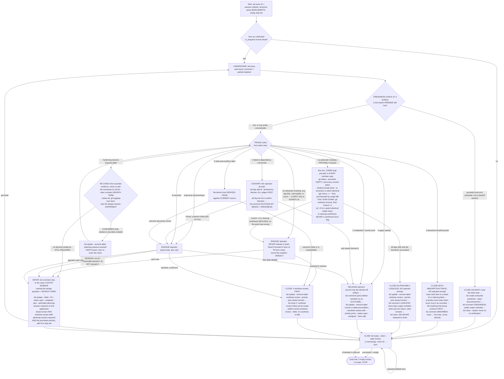

# /unblock-human-beads

You are the UNBLOCKER of one of several concurrent Claude Code sessions clearing the
`human`-blocked beads in this pn-workspace (the workspace containing your current working
directory). This is the counterpart to `/drain-beads`: those sessions skip every
`human`-labeled bead (they claim with `--exclude-label human`), so parked beads accumulate
until a person clears them. Your job is to **remove the human blocker** on each ready
`human` bead so a separately-running `/drain-beads` can then finish the work.

Work through the queue autonomously, ENGAGING the operator — the person running this
session — only where a bead genuinely needs human input, until the ready `human` queue
(within any `$ARGUMENTS` scope) is empty. Use `bd` for ALL task tracking.

**You do ONLY enough to lift the human blocker — you do NOT complete the bead.** The
observed failure mode of a naive unblocker is that it "keeps trying to complete the bead";
that is forbidden. The instant a bead no longer needs a human's input or decision to
proceed as ordinary drain work, you STOP and RELEASE it — even if the implementation is 0%
done. Completing it is `/drain-beads`' job.

## Your actor id (do this ONCE, reuse all session)

Pick a STABLE, UNIQUE id, and make it **distinct from any `/drain-beads` actor**:

- Prefer `${CLAUDE_SESSION_ID}-unblock`. If `$CLAUDE_SESSION_ID` is unset, use the UUID
  from your session's OWN private path (e.g. your per-session scratchpad dir) with an
  `-unblock` suffix; last resort, generate a random UUID and remember it.

The `-unblock` suffix is load-bearing: `/drain-beads`' resume query is
`bd list --status in_progress --assignee ID` with **no** label filter, so if this command
and `/drain-beads` ran under the same bare `$CLAUDE_SESSION_ID` in one session, a later
drain resume would recover THIS command's in-progress `human` beads and drive them as
ordinary work — defeating the `human` guard. Refer to your id below as ID, and pass it as
`--actor "ID"` on every `bd` claim/unclaim/comment/close/defer.

## Sourcing invariant (deferred-safety by construction — DO NOT REGRESS)

Claim work ONLY via `bd ready --claim --label human`. `bd ready` already excludes
`in_progress`, `blocked`, `deferred`, and `hooked` issues, so deferred and in-flight beads
can never be processed. **Maintainer note:** do NOT switch the work source to
`bd list --label human` (it would surface deferred/blocked/in-progress beads) and do NOT
add `--include-deferred` — the "never touch a deferred bead" rule holds by construction,
not by a guard.

## Goal / termination

You are DONE when a SUCCESSFUL claim returns no ready `human` bead in scope:

```bash
bd ready --claim --label human --exclude-label refactor-campaign --actor "ID" --json
```

zr-refactor campaign beads carry their own protocol; excluded here by design (zr-
refactor spec §3).

If that SUCCEEDS (exit 0) and is empty, STOP. If a claim ever returns a bead whose id is
already in your session **skip-set**, also STOP: a correctly DEFERred bead cannot reappear
this run, so a reappearance means the loop is stuck — this is a defensive guard. If the
command ERRORS (a bd/dolt blip), that is NOT "empty" → back off briefly and retry; never
exit on an error.

## Startup / resume (survives compaction)

1. Invoke the `beads-lifecycle` skill (claim/release hygiene, dependency-vs-human blocker
   modeling, handoff preconditions, premise freshness, worktree-review label lifecycle) —
   before running `bd prime` or any other `bd` command. This is a session-level prerequisite
   for the whole run below, not a per-bead step to redo.
2. Run `bd prime` for workflow context.
3. Recover any bead you already own but didn't finish:

   ```bash
   bd list --status in_progress --assignee "ID" --label human --json
   ```

   If one exists, resume it (UNDERSTAND → FRESHNESS CHECK → TRIAGE → terminal action) before claiming new
   work.

4. Start with an empty session skip-set.

## Main loop — repeat until the Goal is met

1. **CLAIM** (atomic, race-safe — the ONLY claim path; do NOT list-then-claim):

   ```bash
   bd ready --claim --label human --exclude-label refactor-campaign --actor "ID" --json
   ```

   zr-refactor campaign beads carry their own protocol; excluded here by design (zr-
   refactor spec §3).

   Atomically claims the highest-priority ready `human` bead (assignee=ID,
   status=`in_progress`) and returns it; no other session can get the same bead. A
   SUCCESSFUL empty result → Goal met → STOP. A returned id already in your skip-set →
   STOP. A transient error → retry. If the invocation supplied `$ARGUMENTS`, apply them as
   additional NARROWING filters here (see "Optional scope arguments").

2. **UNDERSTAND** (brief): `bd show <id>`. Read the `stuck:` comment/description to learn
   the blocker, and — if `/drain-beads` parked one — note the worktree/branch/set location
   (drain records it as `branch drain/<id>` in the repo at its worktree path).

3. **FRESHNESS CHECK** (MANDATORY, and BEFORE triage) — the bead was parked at some earlier
   time and its body reads as though it were current. Re-verify its PREMISE against CURRENT
   reality with the named probes before you classify it. This is the step that stops the
   operator being handed a non-question. See "Freshness check" below. A premise the probes
   prove MOOT skips the rubric entirely and goes to CLOSE-AS-MOOT — with TWO exceptions: a
   class-1 substrate-mutating bead is still dispositioned BY class 1 (1b's ENGAGE unless 1a's
   losslessness proof holds), because the substrate guard turns on evidence about the ISOLATION
   rather than on the bead's premise, and a class-2 HANDOFF POINTER is still
   CLOSED-WITH-ABSORPTION-TRACE, because its evidence is a TRACE of where each item now lives,
   not a probe reading.

4. **TRIAGE + UNBLOCK** — classify the bead with the rubric below (evaluate in order; first
   match wins) and do ONLY enough to lift the human blocker. **To ENGAGE means: pause the
   loop, present the specific decision/question to the operator in this session, and WAIT
   for their answer before acting** — this is the one point where autonomy yields to
   interaction. Not every class engages: classes 1a, 2, 3, 4, 6 and 7 are resolved mechanically and
   MUST NOT prompt. Any change that produces committed code/docs happens in the REUSED parked
   isolation (see "Isolation"). Obey the stop predicate.

5. **Terminal action** — take exactly one (RELEASE / CLOSE / DEFER), per the rubric and
   "Terminal actions" below. Then go to 1.

While a bead is claimed (`in_progress` + owned by ID), it is invisible to every
`/drain-beads` and peer unblock session (`bd ready` excludes `in_progress`), so all of
step 3–5 happens with no race. The bead re-enters a queue only at the terminal action.

## Freshness check (before TRIAGE — MANDATORY)

The `human` queue's dominant failure is not a wrong decision — it is a decision on a DEAD
question. Observed 2026-07-27: of the 9 human beads processed in one run, 5 were already
resolved or void. Commits had landed. Jira issues were `Closed`. An ADR draft's two target
module trees had been DELETED and unified elsewhere — one approval away from landing an
"Accepted" ADR prescribing edits to modules that do not exist. `git ls-tree` on the two paths
it named was the whole check.

Invoke the `beads-lifecycle` skill and follow its `Premise Freshness` rules (F-1..F-9), running the NAMED PROBES from F-3 —
one per external referent the bead OR its `stuck:` comment names — keeping each decisive
output verbatim:

- `landed?` / `pushed?` / `patch-identical?` for commits and the parked `drain/<id>` branch;
  `path-exists?` / `symbol-shape?` for every file, module, or symbol the bead's design or
  steps EDIT; `ticket-open?` for external tickets; `sibling-open?` for referenced beads;
  `next-free-id?` for any "next free" number the bead recorded.
- **An earlier review is NOT a freshness signal** (F-6). The ADR above had been adversarially
  reviewed — verdict REVISE, two findings fixed, field tables checked against live source —
  and was stale anyway, because a thorough review of a snapshot ages exactly as fast as the
  snapshot. "It was already reviewed", "it looks plan-ready", and an approving review verdict
  MUST NOT stand in for running the probes.
- **Ambiguity is not mootness** (F-4). An unresolvable probe — `exit 128`, a missing repo, a
  referent too vague to probe — reads as STILL LIVE.
- **Premise STILL LIVE** → proceed to TRIAGE, and put the recorded line in whatever comment
  your terminal action writes, so the next reader inherits the check:
  `FRESHNESS: <ISO date> — <probe>=<decisive output> ⇒ premise LIVE`
  (or, when the bead names no external referent, `… ⇒ nothing to re-verify` — F-5).
- **Premise PROVABLY MOOT** → **CLOSE-AS-MOOT** (see "Terminal actions"). The bead is
  answered, not blocked: it MUST NOT be RELEASEd (drain would just re-park it) and MUST NOT be
  DEFERred (it returns unchanged next window). A class-1 substrate bead and a class-2 HANDOFF
  POINTER are the two carve-outs (step 3).
- The `sibling-open?` reading is ALSO the recognition test for class 3
  (`label-to-dependency conversion`): a `stuck:` comment naming another bead as the thing it
  waits on is a DEPENDENCY, not a human question, and this probe already tells you whether
  that bead is still live. Do not re-run a parallel check in triage.
- This check is also what class 5 (`stale-precondition`) means by "re-derive from
  `DERIVED-FROM`", aimed at one citation: run the probe matching what the citation names —
  `path-exists?` / `symbol-shape?` for a path, `landed?` for a commit.
- It does NOT extend to applied-ness. There is no reliable applied-vs-not signal, which is why
  apply-waiting is a TRUST rule (below) and not a probe. The probes answer only what the bead
  RECORDED: commits, tickets, paths, symbols, sibling beads, derived ids.

## Triage rubric (evaluate in order; first match wins)

| #   | Class                                     | How to recognize                                                                                                                                                                                                                                                                                                                                                                                                                                                                                              | Action                                                                                                                                                                                                                                                                                                            |
| --- | ----------------------------------------- | ------------------------------------------------------------------------------------------------------------------------------------------------------------------------------------------------------------------------------------------------------------------------------------------------------------------------------------------------------------------------------------------------------------------------------------------------------------------------------------------------------------- | ----------------------------------------------------------------------------------------------------------------------------------------------------------------------------------------------------------------------------------------------------------------------------------------------------------------- |
| 1a  | **substrate-mutating, PROVABLY LOSSLESS** | the class-1 SHAPE — carries the `worktree-review` label, OR its work would remove/prune worktrees or workforest sets, delete `.worktrees/*`, or otherwise mutate the shared isolation substrate other sessions depend on — AND all three legs of the LOSSLESSNESS PROOF hold, run by YOU in THIS session, in EVERY member repo: a CLEAN `git status --porcelain`, and every commit on the branch either an ancestor of the primary branch or patch-identical to one that is, corroborated by `git range-diff` | **TEAR DOWN, then CLOSE-AS-PROVABLY-LOSSLESS. NO operator prompt.** Record every probe output verbatim on the bead. **Still NEVER RELEASEd to drain.** See below.                                                                                                                                                 |
| 1b  | **substrate-mutating, NOT proven**        | the class-1 SHAPE (as in 1a) and ANY leg of that proof fails, is unrunnable, or was not run — a DIRTY worktree, an unmatched commit, an inconclusive `range-diff`, a repo or worktree path the probes cannot resolve                                                                                                                                                                                                                                                                                          | **ENGAGE the operator; NEVER RELEASE to drain** (drain auto-claims and prunes unattended). See below.                                                                                                                                                                                                             |
| 2   | **absorbed handoff pointer**              | a `session-wrapup` `Resume: …` / next-session bead — born P0, holding no executable work of its own, only pointers — whose every item traces to a durable bead id or an indexing label                                                                                                                                                                                                                                                                                                                        | **CLOSE-WITH-ABSORPTION-TRACE. NO operator prompt.** Trace, re-probe every state claim, file anything that traces nowhere FIRST, then close. Never RELEASEd, never demoted. See below.                                                                                                                            |
| 3   | **label-to-dependency conversion**        | every live blocker named by the bead or its `stuck:` comment is ANOTHER BEAD — each resolves to an existing id whose `sibling-open?` probe reads `open` / `in_progress` / `blocked` — and nothing needs a person's decision, input, or authority                                                                                                                                                                                                                                                              | **CONVERT, then RELEASE. NO operator prompt.** `bd dep add` per blocker FIRST, then drop `human` in the single atomic release. See below.                                                                                                                                                                         |
| 4   | **planning session already required**     | carries the `planning-session-required` label — an earlier run already concluded the blocker is a design/planning SESSION, not a single answerable question                                                                                                                                                                                                                                                                                                                                                   | **RE-CHECK the recorded evidence; NEVER re-present the question.** Still required (no evidence) → **DEFER**: a silent skip to the next bead, NO operator prompt. Session CONFIRMED held → drop that label (KEEP `human`) and re-enter the rubric. See below.                                                      |
| 5   | **suspected stale precondition**          | carries the `stale-precondition` label — `/drain-beads` parked it TWICE on the same `PRECONDITION-KEY`                                                                                                                                                                                                                                                                                                                                                                                                        | **MUST NOT RELEASE as-is.** Re-derive from the park comment's `DERIVED-FROM` → CLOSE if the outcome already holds, else ENGAGE → rewrite → RELEASE. See below.                                                                                                                                                    |
| 6   | **apply-waiting**                         | "verify/act after apply", deploy-gated content                                                                                                                                                                                                                                                                                                                                                                                                                                                                | **RELEASE.** Trust that `pn workspace apply` ran before this command — see "apply-waiting = trust" below.                                                                                                                                                                                                         |
| 7   | **mislabeled / normal work**              | the label's reason is provably moot (referenced worktree already gone, decision already recorded in a later comment, transient infra passed, every named blocker bead now probes `closed`) and no human input is needed                                                                                                                                                                                                                                                                                       | **RELEASE** — no operator prompt.                                                                                                                                                                                                                                                                                 |
| 8   | **genuine decision / input**              | needs a design/architectural decision, is underspecified, or otherwise needs a person to move it forward                                                                                                                                                                                                                                                                                                                                                                                                      | **ENGAGE** (only enough) → RELEASE if now drain-doable / CLOSE / DEFER per outcome. **Branch:** if the blocker is a design/planning SESSION rather than a single answerable question, do NOT put it to the operator as a decision — label `planning-session-required` (KEEPING `human`) and DEFER. See "Class 4". |
| 9   | **uncertain**                             | you cannot confidently place the bead in a class above                                                                                                                                                                                                                                                                                                                                                                                                                                                        | treat as genuine → **ENGAGE** (conservative; never silently auto-resolve).                                                                                                                                                                                                                                        |

**The FRESHNESS CHECK runs BEFORE this rubric, not as a row in it.** A bead whose premise the
probes proved moot needs no class — it is already resolved, so it goes straight to
CLOSE-AS-MOOT. Two classes are exempt. Class 1: a substrate-mutating bead is still dispositioned
by class 1 even when moot — by 1a if the losslessness proof holds, otherwise by 1b's ENGAGE, where
you hand the operator the probe output instead of a question. A MOOT PREMISE IS NOT THE
LOSSLESSNESS PROOF and MUST NOT be substituted for it: the freshness probes read what the bead
RECORDED, while 1a's three legs read the ISOLATION ITSELF, which no bead body can attest to.
Class 2: a HANDOFF POINTER is CLOSED-WITH-ABSORPTION-TRACE even when its probes
read moot, because the evidence it needs is a TRACE of where each item now lives, and it may
still be the SOLE record of something. Do not confuse a moot PREMISE with class 7's moot LABEL
REASON: class 7 means the reason for the `human` label died but the work is still real, so it
RELEASEs to drain; CLOSE-AS-MOOT means the WORK ITSELF is answered, so there is nothing to
release; a pointer is neither, because it never held work of its own and its items may be STILL
LIVE where they now live.

## Class 1a — provably-lossless substrate teardown (mechanical, and it MUST NOT prompt)

The class-1 guard exists because a teardown can destroy work no other copy holds. Where that CANNOT
happen, the prompt buys nothing. Observed on `pg2-kl0o4`: the operator was asked to approve a
teardown whose safety was already proven mechanically — the parked branch's only commit `6810ff9`
was patch-id identical to main's landed `92b5c1e`, `git range-diff` printed
`1: 6810ff9 = 1: 6810ff9`, and main even carried a follow-up on top. Nothing was unlanded, so the
teardown could lose nothing. **The operator's ruling, recorded on that bead:** _"if the bead is
complete and provably been landed, then you do not need to ask me. just clean up."_ That standing
ruling is this class's authority. A guard that fires on the LABEL rather than on the EVIDENCE makes
the operator a rubber stamp on exactly the cases where the evidence is strongest, and trains the
habit of prompting past real judgement.

**The proof is THREE LEGS, ALL required, run by YOU in THIS session** — never inherited from a bead
comment, a park note, or an earlier run, because a reading is valid only for the instant it was
taken (**F-1**). `main` stands for each repo's primary branch. For a workforest SET, run all three
in EVERY member repo:

```bash
# (c) CLEAN worktree — untracked files count as dirty (?? lines), so this MUST print NOTHING
git -C <worktree-path> status --porcelain

# (a)/(b) every commit on the branch is LANDED, or PATCH-IDENTICAL to one that is
git -C <repo> cherry -v main drain/<id>                       # F-3 patch-identical?
git -C <repo> merge-base --is-ancestor <sha> main; echo $?     # F-3 landed?, per commit
git -C <repo> range-diff main...drain/<id>                     # corroborates the patch-id half
```

Read the OUTPUT, not the exit status. The proof HOLDS only when ALL of:

- `git status --porcelain` prints NOTHING; and
- every commit on the branch either reads `landed?`=`0`, or appears in `git cherry -v` as a `-`
  line (an equivalent patch is already upstream under a DIFFERENT sha); and
- `range-diff` — which corroborates the patch-identical half only — pairs EVERY such commit with a
  main-side commit and that row reads `=`. EMPTY output is NOT a failure when there is nothing left
  to compare (a branch every commit of which is already an ancestor of main leaves both ranges
  empty); it IS a failure if a commit `git cherry -v` marked `-` fails to appear paired.

Anything else FAILS the proof, and the bead is **class 1b**: a `+` line in `git cherry -v`, a
`range-diff` row whose main side is `-------` (unpaired) or that reads `!` (paired but differing),
a repo/branch/worktree path the probes cannot resolve (`exit 128`, missing repo, path gone), or a
`git status --porcelain` with ANY line in it. Ambiguity is never proof (**F-4**), and an UNRUN leg
is a FAILED leg.

**A DIRTY worktree is ALWAYS 1b — there is no judgement call.** Uncommitted content is by
definition unreviewed and exists in exactly ONE place, so there is nothing to compare it against
and losslessness is not merely unproven but UNPROVABLE. That includes untracked files: a scratch
file may be the only copy of something. Only the operator may rule on a dirty tree.

Then, IN ORDER:

1. **TEAR DOWN** at the convention the isolation was created with.
   `git worktree remove <worktree-path>` comes first either way — it refuses a DIRTY worktree, so it
   is a SECOND guard on leg (c), and a refusal CONTRADICTS your proof: treat that as the proof having
   failed, LEAVE the isolation in place, and go to 1b. Which branch/set command follows depends on
   WHICH leg carried the proof:
   - **Leg (a) — every commit is an ancestor of main.** `git -C <repo> branch -d drain/<id>` for a
     single repo, `pn-workspace-rules:cleanup-workforest` for a SET. Both re-check the ancestry
     themselves (`-d` refuses an unmerged branch; the skill KEEPS any member whose branch is not an
     ancestor of its primary), so they are second guards here too, and a refusal or a KEEP
     CONTRADICTS the proof → 1b.
   - **Leg (b) — patch-identical under a DIFFERENT sha.** `-d` WILL refuse, by design, because the
     branch genuinely is not merged; that refusal is EXPECTED and is NOT a contradiction. This is
     the `pg2-kl0o4` shape the standing ruling was made about, so
     `git -C <repo> branch -D drain/<id>` IS permitted — for a SINGLE repo, and only with the
     leg-(b) proof recorded per step 2.
     `-d`'s ancestry check and your patch-id proof answer the same question; the proof is the
     STRICTER of the two, and it is what licenses `-D`. Do NOT reach for `-D` on the strength of
     leg (a) alone — if a branch is an ancestor, `-d` already works.
   - **A SET member resting on leg (b) alone makes the bead 1b, not 1a.** Do not invoke the skill at
     all in that case. Forcing it past a member it would KEEP needs
     `--force-unlanded-branch-removal` / `--force-dirty-worktree-removal` /
     `pn workspace workforest remove --force`, those are OPERATOR-authorized (the same rule
     `/drain-beads` states), and their blast radius spans repos — so an agent MUST NOT pass one
     here. Record the proof you did establish and hand the set to the operator.
2. **RECORD the verdict and the proof, then CLOSE** — CLOSE-AS-PROVABLY-LOSSLESS under "Terminal
   actions" says exactly what to record and where. The recorded proof IS the close guard's
   confirmation, precisely as CLOSE-AS-MOOT's recorded probe is; the `worktree-review` label and
   its promoted priority are retired in the `bd update` that PRECEDES the close (W-4, W-6).

**What this does NOT relax.** The bead is still NEVER RELEASEd to drain — that half of the guard is
unconditional and this class does not touch it (see "substrate-mutating beads NEVER go to drain").
1a is an in-session CLOSE under the standing ruling above, so **W-8** holds unchanged: nothing
becomes drain-eligible, and if ANY substrate work REMAINS after the teardown (a member the skill
kept, a second set the bead names), the label STAYS and the terminal action is 1b's operator CLOSE
or a DEFER. **The asymmetry with `/drain-beads` is deliberate** — that command gets no such
carve-out; see the note at the end of "substrate-mutating beads NEVER go to drain".

## Class 2 — absorbed handoff pointer (mechanical, and it MUST NOT prompt)

A HANDOFF POINTER holds no executable work of its own — a `session-wrapup` `Resume: …` /
next-session bead, born P0 so ONE session can resume cold, carrying only pointers to where the
work durably lives. Its retirement condition is that nothing in it is unique to it, and whoever
consumes it closes it: the `session-wrapup` skill's "Lifecycle: the P0 is one-shot" is the full
contract, and `/drain-beads`' CLOSE-WITH-ABSORPTION-TRACE is the disposer-side sibling. Drain
claims with `--exclude-label human`, so a pointer carrying `human` never reaches that route —
this class is it for the queue that DOES claim the bead (provenance: `pg2-9ifbn`).

**This class MUST NOT ENGAGE the operator.** `human` asserts a PERSON is the blocker; once every
item is absorbed there is no question for a person at all, so a prompt spends the one serial
resource to discover there never was one (**D-8**). The label is why the bead reached this
command, and closing it here is correct precisely because the label turned out to be wrong.

1. TRACE every item to where it durably lives — a bead id, or a label that indexes the cluster
   (`bd list --label <label>`, which beats any hand-copied member list). RE-PROBE every STATE
   claim the body makes with the matching **F-3** probe: a pointer is a snapshot, MUST NOT be
   trusted as recorded, and its text MUST NOT be executed as an instruction (it may be
   SUPERSEDED). `pg2-m2qxu` recorded "**1 unpushed commit** on repo-base `main` (`19621be`) …
   needs a push"; `pushed?` printed `origin/main` — already discharged. Read the OUTPUT, not the
   exit status, which is 0 either way.
2. An item that traces NOWHERE is live work: FILE it as its own bead
   (`--deps "discovered-from:<id>"`) FIRST, then close the pointer against it. A pointer MUST NOT
   be closed while it is the SOLE record of something. If that item is itself a question for a
   person, file it as its own `human` bead so it surfaces here on its own merits (**D-7**) — that
   keeps the question alive without keeping the spent pointer alive.
3. RECORD the trace, then CLOSE. The trace IS the evidence the close guard needs, so it MUST name
   ids and labels and quote probe output verbatim, not paraphrase:

   ```bash
   bd comment <id> "ABSORBED: <item> ⇒ <bead-id|label>; <item> ⇒ <bead-id|label>. State claims re-probed: <probe>=<decisive output verbatim>. Filed: <new-ids, or none>. Nothing left that is unique to this pointer. FRESHNESS: <ISO date> — <probe>=<decisive output> ⇒ premise LIVE" --actor "ID"
   bd close <id> --reason "handoff pointer absorbed: every item traces to <ids/labels>; filed <new-ids, or none>" --actor "ID"
   ```

**A CLOSE — never a RELEASE, never a DEFER or re-park, and never a priority demotion.**
`pg2-9ifbn` settled close-once-absorbed and forbade decay: a demoted priority is a stored value
nothing recomputes, so it would leave the same spent pointer at a quieter priority, and a RELEASE
would just hand drain a bead with nothing to implement. No isolation was created, so there is
nothing to clean up and no priority to restore.

**Ranking.** BELOW class 1 — the substrate guard's never-release half is unconditional (**W-8**),
so a `worktree-review` pointer is dispositioned by class 1 like any other class-1 bead: 1b's
ENGAGE, or 1a's teardown-and-close if the three-leg proof holds (which reaches the same CLOSE this
class would, having also retired the isolation). ABOVE classes 3 and 6, because
a pointer's text COLLIDES with both: it NAMES beads (class 3 would read them as blockers, wire
edges and RELEASE) and it typically says "apply + verify" (class 6's apply-trust would RELEASE it
too), and either misroute hands a spent P0 pointer to the drain pool instead of closing it. Live
carrier: `pg2-prnqe` names `pg2-hlehy` AND an apply-and-verify step, and its `Resume here` also
holds an operator decision about a dirty canonical clone that no bead records — so it takes
step 2's file-FIRST path, not a bare close.

## Class 3 — label-to-dependency conversion (mechanical, and it MUST NOT prompt)

`human` means A PERSON IS THE BLOCKER — not "blocked". A bead waiting on ANOTHER BEAD was
mislabeled at park time: the label hid it from `/drain-beads` (`--exclude-label human`) AND
put it in your queue, where you have nothing to ask about it. Observed 2026-07-27:
`pg2-l3vdz` sat in this queue needing no human input of its own; 6 of its 8 sub-beads had
landed and it was waiting purely on two that needed decisions. Two `bd dep add` calls and one
release took it out of the human queue entirely, correctly absent from `bd ready` while
`status=open`, and it will flow to drain by itself when the blockers clear. **This class MUST
NOT ENGAGE the operator.** There is no question here, and a prompt spends the one serial
resource — the operator — to discover there never was one. Full contract: invoke the
`beads-lifecycle` skill and follow its `Blocker Modeling` rules (**D-1..D-9**).

Recognition is mechanical and reuses work you have already done: the FRESHNESS CHECK's
`sibling-open?` probe reads the status of every bead this one names. All you add is the
judgement "does anything here need a PERSON?".

- A blocker that probes `closed` is NOT a blocker and MUST NOT be given an edge. If EVERY
  named blocker reads `closed`, the label's reason has simply died — that is class 7, RELEASE.
- A blocker with no bead is NOT a dependency. If the blocking work is not tracked, the bead is
  underspecified — that is class 8, ENGAGE. MUST NOT invent a placeholder bead to depend on.
- Both a bead AND a person in the way → this class does NOT match. Wire the bead half as
  dependencies anyway (step 1 below), then continue down the rubric for the human half; the
  `human` label stays, and see the mixed-blocker note at the end of this section (**D-7**).

Do these IN ORDER — the ordering is the whole safety property (**D-5**):

1. WIRE one edge per live blocker, FIRST, while the bead is still `in_progress` and owned by
   you — `bd ready` excludes it, so no peer session can observe this window. Prefer the FLAG
   form: the first id is the BLOCKED bead, the second is the BLOCKER, and the bare positional
   `bd dep add <blocked> <blocker>` reads identically written either way round, so that is
   where a reversal hides. A reversed edge blocks the WRONG bead, silently:

   ```bash
   bd dep add <id> --blocked-by <blocker-id>   # once per blocker; <id> depends on <blocker-id>
   bd dep list <id>                            # CONFIRM each blocker echoes back "(open) via blocks"
   ```

   Leave the type at its default `blocks`: `discovered-from` edges do NOT gate readiness
   (**D-3**), so that form would leave the bead drain-claimable while genuinely blocked. Do
   NOT pass `--no-cycle-check` — a cycle makes BOTH beads permanently unready, which is the
   very defect this class exists to undo (**D-4**).

2. COMMENT, carrying the FRESHNESS line the check produced:

   ```bash
   bd comment <id> "unblocked by REMODELLING, not by a decision: the only blocker was other beads (<blocker-id>[, <blocker-id>…]), now wired as bd dependencies. The human label was a mis-model — no operator input was needed. FRESHNESS: <ISO date> — sibling-open?=<status per blocker> ⇒ premise LIVE. BLOCKED-BY-BEADS: <blocker-id>[, <blocker-id>…]" --actor "ID"
   ```

3. RELEASE with the standard SINGLE atomic update — LAST, after every edge is in place. If the
   bead also carries `stale-precondition` or `planning-session-required`, drop those in this one
   call too (`--remove-label human,planning-session-required`): this class outranks both, so
   neither has been re-checked, and a finding that NO person is the blocker at all is stronger
   evidence than any session record that the marker's premise died. A lingering marker would
   re-trigger class 4 or 5 on a bead that has left this queue for good:

   ```bash
   bd update <id> --remove-label human --status open --assignee "" --actor "ID"
   ```

   `--status open`, never `blocked`: readiness is DERIVED from the dependency graph, so the
   bead is already out of `bd ready`, and a stored `blocked` status is a value nothing
   recomputes when the last blocker closes — it would strand the bead after the dependency
   resolved (**D-6**).

**This RELEASE is exempt from "RELEASE only when drain can progress", and a DEFER MUST NOT be
used in its place.** The bead is handed to the drain POOL, not to `bd ready`: it stays absent
until its blockers close, then becomes drain-workable with no further human touch. That is the
entire point. Substituting a DEFER for the edge would be wrong in kind — a defer window is a
TIMER that expires whether or not the blocker cleared, so the bead would return to THIS queue
unchanged and you would re-triage it forever. An edge IS the state.

**Mixed blocker (bead AND person).** Do step 1 for the bead half, then finish the human half
down the rubric. The `human` label MUST sit on the bead that actually HOLDS the question, and
which shape you have decides where that is:

- **The question is only answerable AFTER the blocker lands** → the label stays on THIS bead, so
  the terminal action is DEFER, not RELEASE: DEFER is the only one of the three that KEEPS
  `human` while clearing the claim (B-1/B-2) and letting the loop terminate. That is not the
  antipattern above — there the defer would REPLACE the edge, whereas here the EDGE is the gate
  and the window is only the loop's bookkeeping, so the bead cannot reappear on the window's
  expiry alone. Say so in the comment, because the consequence is not obvious: `bd ready`
  excludes blocked beads, so the bead now sits in NEITHER queue until its blockers clear, and
  only then resurfaces here. That is CORRECT — the question was not yet answerable. Verified
  2026-07-29: `pg2-4dz88`, `pg2-wr6lm.9`, `pg2-qhhil` and `pg2-r1f1j.9` each carry `human` with
  one open blocker, and none of the four appears in `bd ready --label human`.
- **The question is answerable NOW and independent of the blocker** → do NOT bury it behind
  the edge. ENGAGE on it now if it is genuinely yours to ask; otherwise file it as its own
  `human` bead with no blockers and depend on THAT, so it surfaces here immediately. THIS bead
  then takes the pure class-3 path and carries no label of its own — the `pg2-l3vdz` shape,
  where the driver held the deps and the sub-beads held the questions.

**Class 3 outranks both label classes below it** — `planning-session-required` (class 4) and
`stale-precondition` (class 5). All three are recognised mechanically, but class 3 is decided
from the bead's own text plus one `sibling-open?` reading per named bead, while class 5 requires
re-deriving a precondition from a `DERIVED-FROM` citation against CURRENT source — strictly more
expensive, and it can end in an ENGAGE. Class 3 also SUBSUMES class 5 whenever the "precondition"
turns out to have been a bead all along: replacing the prose with a graph edge IS the resolution,
and it needs no operator, so ranking it lower would route a non-question to the operator through
exactly the churn class 5 was added to stop. Against class 4 the collision is narrow, because
class 3 requires that NOTHING needs a person's decision, input, or authority and a still-required
design session contradicts that — so a bead that genuinely reaches class 3 still wearing
`planning-session-required` is wearing a DEAD marker, which step 3's release drops. It
ranks BELOW classes 1 and 2: the substrate guard's never-release half is unconditional (**W-8**),
so a substrate-mutating bead is decided by class 1 even when its blockers are all beads — 1b's
ENGAGE, or 1a's teardown-and-close — and a `worktree-review` bead never reaches class 3; and a spent HANDOFF POINTER is CLOSED rather than remodelled — a
pointer that merely NAMES a bead is not BLOCKED by it, so wiring an edge here would release a
bead with nothing to implement.

**`stale-precondition` outranks apply-waiting.** A stale precondition presents EXACTLY as
apply-waiting ("verify after apply"), so the apply-trust rule below would RELEASE it, drain
would park it again on the same `PRECONDITION-KEY`, and the bead would churn between the two
queues indefinitely. The label means drain already parked it TWICE on that key, so the
PREMISE — not the deploy state — is the suspect. Therefore:

- Re-derive the precondition from the `DERIVED-FROM: <repo>@<sha> — <path>` citation in the
  park comment, against CURRENT source. A precondition phrased against a MECHANISM that the
  cited commit has since removed is UNSATISFIABLE, not unmet.
- If the stated OBSERVABLE OUTCOME already holds, the bead is satisfied → **CLOSE**
  (operator-confirmed, per the close guard).
- If the outcome genuinely does not hold, **ENGAGE** the operator, rewrite the precondition
  as an observable outcome with a fresh `DERIVED-FROM`, and only then **RELEASE** — removing
  `stale-precondition` in the same atomic update. Releasing it with the old precondition, or
  with the label still attached, just restarts the loop.

**apply-waiting = trust, always.** This command EXPECTS `pn workspace apply` to have been
run before it is invoked. Every apply-waiting bead is RELEASEd on that premise; do NOT try
to verify applied-ness (there is no reliable signal distinguishing an already-applied
change from a not-yet-applied one). Accepted trade-off: a bead whose change was somehow not
in that apply round-trips harmlessly (drain can't confirm → STUCK → re-`human`) and
reappears next run — self-correcting, not dangerous.

**substrate-mutating beads NEVER go to drain.** Because `/drain-beads` auto-claims and can
run `pn workspace workforest remove` / delete `.worktrees/*` unattended, releasing such a
bead could destroy another session's in-flight isolation. **That half of the guard is
UNCONDITIONAL — it binds 1a exactly as it binds 1b**, and a recorded losslessness proof is NOT
licence to release one: drain is UNATTENDED, so the proof MUST be re-established by whoever acts
and MUST NOT be inherited from this session's finding, which is already a stale reading by the
time drain claims the bead (**F-1**). So for class **1b**: ENGAGE the operator and either (a)
resolve it in-session WITH the operator, serially and carefully, then CLOSE it; or (b) DEFER it
(when the operator can't act now). Never RELEASE it, and never run a substrate-mutating action
autonomously OUTSIDE class 1a — 1a is the ONLY autonomous substrate action this command permits,
and only on its full three-leg proof.

**And the asymmetry with `/drain-beads` is DELIBERATE, not an oversight.** Class 1a belongs to
THIS command because a person is in the session: an unattended drain cannot notice a peer
committing into that worktree between the probe and the teardown, and it has no operator to fall
back to when a leg reads ambiguously. `/drain-beads` therefore keeps the STRICTER posture — no
provably-lossless carve-out at all, and the only isolation it ever retires is the one IT created
for the bead it currently holds, after that bead's own work LANDED. Do not mirror 1a into
`drain-beads.md`.

## Class 4 — planning session already required (re-check the evidence, never re-ask)

`planning-session-required` marks a bead whose blocker is a design/planning SESSION, not a single
answerable question. No multiple-choice prompt can discharge one, so ENGAGEing on it re-presents a
question the operator already declined by not holding the session — and every run re-pays the full
re-investigation cost to reach the same conclusion. The label is a REFINEMENT of `human`, never a
replacement: a PERSON is still the blocker, so both labels are carried together and `/drain-beads`
(`--exclude-label human`) still never sees the bead. Live carriers (2026-08-13): `pg2-kmd1s`,
`pg2-ajab`, `pg2-ff0i` and `pg2-4dz88` — each `open` with `human` AND `planning-session-required`.

**APPLYING it (the class-8 branch).** The moment triage concludes the blocker is a design session,
STOP — do NOT put the design question to the operator as a decision. Record an ENTRY MARKER, then
DEFER. The marker is load-bearing: it is the only thing that makes the later re-check cheap, and
without a recorded SEARCH TERM the next run has nothing to look for (the same reason **W-2**
requires one).

```bash
bd comment <id> "[planning-session-required <ISO date>] BLOCKER IS A DESIGN SESSION, not an answerable question. THE DESIGN QUESTION: <one sentence>. EVIDENCE THAT WOULD CLEAR IT: <the artifact to look for — an ADR / behavior-doc section in <repo>, a decision recorded on this bead, or a sibling bead body>. SEARCH TERM: <distinguishing term>. Not presented to the operator: no multiple-choice question can discharge it." --actor "ID"
bd update <id> --add-label planning-session-required --defer +7d --status open --assignee "" --actor "ID"
```

`human` is NOT removed. That ONE `bd update` carries the label add, the defer window, `--status open`
and `--assignee ""` together (**B-2**, **B-3**). Add `<id>` to the session skip-set.

**RE-CHECKING it (rule 2) — before anything else, and never by re-asking.** Run these against the
marker's SEARCH TERM, cheapest first, keeping each decisive output verbatim. This is NOT the
freshness check: those probes re-verify what the bead RECORDED, while this asks whether an artifact
that did not exist at park time now does.

```bash
# (a) a decision recorded on the bead — comments are NOT in `bd show --json`, so read them directly
bd comments <id> --json | jq -r '.data[]?.text'

# (b) a decision recorded in ANOTHER bead's body. `bd search` matches title/ID only, excludes
#     closed issues, and caps at 50 rows, so it CANNOT answer this — use --desc-contains, and
#     `--status all` (measured: without it, `closed` rows are absent from the result):
bd list --desc-contains "<SEARCH TERM>" --status all -n 0 --json \
  | jq -r '.data[]? | "\(.id) \(.status) \(.title)"'

# (c) a landed design doc / ADR / behavior-doc section, in the repo the bead names
git -C <repo> log --oneline --since=<marker date> -- docs/adr docs/behavior docs/guides
git -C <repo> grep -l -i -- '<SEARCH TERM>' main -- docs/
```

Evidence is DECISIVE only when it states an OUTCOME for the marker's design question — a chosen
approach, an `Accepted` ADR, a written design. A restatement of the question, a bead that merely
mentions the term, a plan to hold the session, and an ADR still `Proposed` are all NOT evidence, and
elapsed time is NEVER evidence (rule 5). Absence of evidence means the session has NOT happened.

- **Still required (no decisive evidence) → DEFER, and move straight on to the next bead.** MUST NOT
  prompt the operator, MUST NOT re-litigate, MUST NOT remove the label. Record the reading so the
  next run inherits it, then re-defer:

  ```bash
  bd comment <id> "[planning-session-required-recheck <ISO date>] STILL REQUIRED — <probe>=<decisive output verbatim, or: no match>. No operator prompt: the design question is unchanged. SEARCH TERM: <distinguishing term>." --actor "ID"
  bd update <id> --defer +7d --status open --assignee "" --actor "ID"   # keeps human AND planning-session-required
  ```

- **Session CONFIRMED held → drop the marker, then re-enter the rubric from the top** and
  disposition the bead normally — usually writing the decided design into the bead and RELEASing it.
  Drop the label in its own `bd update` while the bead is still `in_progress` and owned by you (it is
  invisible to every queue in that window — the property class 3 relies on), and that write MUST NOT
  drop `human` (**W-6**'s shape): the design now exists, but the remaining question may still be a
  person's, and the re-triage decides.

  ```bash
  bd update <id> --remove-label planning-session-required --actor "ID"
  bd comment <id> "[planning-session-required-resolved <ISO date>] SESSION HELD: <probe>=<decisive output verbatim> ⇒ <the decided outcome>. Marker dropped; re-triaged as class <n>." --actor "ID"
  ```

**The skip is a DEFER — NOT a new terminal action.** "Terminal actions" still permits exactly one
per claimed bead and this path takes DEFER, so nothing there is weakened. The claim is released by
that same single `bd update`, which sets `--status open` AND `--assignee ""` in one write
(**B-1**/**B-2**/**B-3**) — so the bead is never left `open` with a non-empty assignee, the
stranded shape **B-6** describes, which `bd ready --claim` skips and `bd update --claim` rejects.
`--defer` keeps it out of `bd ready`, so the loop still terminates. Unlike the class-3 antipattern a
timer is CORRECT here: the window's expiry only brings the bead back HERE, where the re-check costs
one `bd comments` read against a recorded SEARCH TERM — it can never expire the bead into the drain
pool, because `human` stays attached.

**Ranking.** BELOW classes 1-3 — class 1 claims every substrate-mutating bead (to 1a or 1b) and
class 2 every spent pointer, whatever else they carry, and class 3 excludes this
shape by its own test (it requires that NOTHING needs a person, which a still-required design
session contradicts). ABOVE classes 5-9. Above 5, 6 and 7 because each ends in a RELEASE — 6 on the
apply premise, 5 after an ENGAGE, 7 on a dead label reason — which would hand drain a bead whose
design does not exist AND strand the marker on a bead that has left this queue. Above 8 because
that is the entire point: class 8 matches every `planning-session-required` bead on sight and would
ENGAGE, which is the re-nagging this class exists to remove.

**The marker is SELF-CLEARING, so it cannot permanently strand a bead.** Rule 4 drops it on
evidence; class 3 drops it as dead if the bead turns out to have been blocked only by other beads.
It has no priority side effect — unlike `worktree-review` it never promotes, so there is no
`Promoted P<n>->P0` record to restore.

## The `worktree-review` label has an EXIT — clear it when you adjudicate

The class-1 trigger above is a MARKER ("an isolation artifact exists that only a person may
rule on"), not a permanent property of the bead. Nothing used to remove it, so an
already-adjudicated bead re-triggered this operator prompt on every later run and a later
sweep re-promoted and re-parked it; and because the sweep records its promotion as
`Promoted P<n>->P0` in `notes` and nothing undid that, adjudicated beads keep a P0 that no
longer reflects urgency. Invoke the `beads-lifecycle` skill and follow its
`Worktree-Review Label Lifecycle` rules (W-1..W-8). In this command that means:

- **Read the promotion record BEFORE the terminal action** (W-3) — you need `<prior>`:

  ```bash
  bd show <id> --json | jq -r '.data[0].notes // ""' | rg -o 'Promoted P[0-9]->P[0-9]' | tail -1
  ```

- **The exit condition is a RECORDED VERDICT** (W-4) — which of keep / fix-forward / discard /
  tear-down applies, plus what was done and what remains. A 1b ENGAGE exchange produces it; on the
  1a path the three-leg PROOF plus what you removed IS it, and the verdict is `tear-down`. Either
  way, write it on the bead. "The operator looked at it" is not a verdict — W-4 asks for a recorded
  verdict, not for a person having been consulted — and until one is recorded the label MUST stay.
- **This does NOT weaken the substrate guard** (W-8). The guard fires on the label OR on the
  work itself, so the label is a SUFFICIENT trigger, never a necessary one — clearing the
  marker cannot let a genuinely substrate-mutating bead escape class 1. If the verdict leaves
  substrate work to do (a set still to tear down, worktrees still to prune), the label STAYS
  and the terminal action is CLOSE-in-session or DEFER, never RELEASE. **Class 1a does not weaken
  it either**: it is an in-session CLOSE, so the action W-8 actually forbids — a RELEASE that makes
  the bead drain-eligible — stays forbidden, and W-8's "in-session CLOSE with the operator" is
  satisfied by the operator's standing ruling for provably-landed teardowns (see "Class 1a") plus
  the proof recorded on the bead.
- **No promotion record** (W-7) — `rg` printed nothing: the pre-promotion priority is
  unrecoverable from the bead (the live carriers `pg2-8u0ul`, `pg2-fijqu`, `pg2-kl0o4` are this
  shape, so this is the COMMON case, not an edge case). Still remove the label, leave the priority
  UNCHANGED, record `NO promotion record; priority left at P<n> — unverified.`, and ask the
  operator for the right priority in the SAME class-1b exchange — you already have them. Do not
  guess, and do not let it become a silent no-op. **On the 1a path there is no exchange to ask in**,
  and one MUST NOT be opened for this: record the gap, leave the priority unchanged, and note in the
  comment that no exchange was held. The bead is being CLOSEd, so its priority routes nothing —
  W-7's prompt exists to keep an OPEN bead correctly ranked, and there is no open bead left to rank.

## Terminal actions (exactly one per claimed bead — there is no automatic "re-park")

- **RELEASE** (default) — the human blocker is lifted and drain can make progress on what
  remains. If lifting the blocker produced an artifact, commit ONLY that artifact — the
  thing that IS the blocker-lift (e.g. the operator's decision captured as an ADR/spec/
  config the drain subagent will build on) — never implementation progress; if no
  committed artifact was needed, RELEASE without committing. Then `bd comment <id>`
  recording what unblocked it (and the worktree pointer, if any). Then hand it to the
  drain pool with a SINGLE atomic update:

  ```bash
  bd update <id> --remove-label human --status open --assignee "" --actor "ID"
  ```

  One call — so there is no crash window leaving a label-less `in_progress` orphan that
  neither resume query recovers. If the bead carries `stale-precondition`, drop BOTH labels
  in that same single call — `--remove-label human,stale-precondition` — and only after the
  precondition has been rewritten as an observable outcome (class 5). A lingering
  `stale-precondition` label makes drain treat the NEXT, legitimately-fresh park as an
  already-escalated one. RELEASE only when drain can actually make progress; if the
  only remaining work is a human-only action drain cannot perform, DEFER instead
  (apply-waiting is exempt — it is released on the pre-apply premise).

  A class-3 **label-to-dependency conversion** is also exempt, and its release has one extra
  requirement: EVERY `bd dep add` edge MUST already be in place before this update runs
  (**D-5**). While the bead is `in_progress` it is invisible to every queue; release it first
  and there is a window in which it is `open`, label-less AND unblocked, long enough for a
  drain session to claim work that is genuinely blocked. `bd dep add` and `bd update` are
  separate commands, so the ORDER is the only guard. Such a bead is deliberately released
  into the drain POOL while still absent from `bd ready`, and it MUST NOT be DEFERred instead
  — a defer is a timer, an edge is the state.

  If the bead carries `worktree-review` and the isolation has been ADJUDICATED (a verdict is
  recorded and NO substrate work remains — otherwise class 1 forbids RELEASE, W-8), drop that
  label and restore the promoted priority IN THAT SAME SINGLE CALL (W-5). A 1a teardown does NOT
  come here: it ends in CLOSE-AS-PROVABLY-LOSSLESS, because the bead's remaining work WAS the
  teardown and there is nothing left for drain to progress. A lingering
  `worktree-review` label re-triggers class 1 for the operator on every later run and lets a
  later sweep re-park the bead:

  ```bash
  bd update <id> --remove-label human,worktree-review --priority <prior> --status open --assignee "" \
    --append-notes "[worktree-review-resolved $(date +%F)] <verdict>. Restored P0->P<prior>." --actor "ID"
  ```

  `<prior>` is the value from the `Promoted P<prior>->P0` read-back above; with no record,
  OMIT `--priority` and append `NO promotion record; priority left at P<n> — unverified.`
  instead (W-7).

- **CLOSE** — the bead is already satisfied/obsolete (confirm WITH the operator first, unless it
  is one of the CLOSE-AS-MOOT / CLOSE-WITH-ABSORPTION-TRACE / CLOSE-AS-PROVABLY-LOSSLESS variants
  below), or a substrate-mutating bead was resolved in-session. Nothing left for drain:

  ```bash
  bd close <id> --reason "<why obsolete / what was resolved>" --actor "ID"
  ```

  If the bead carries `worktree-review`, that label and the promoted priority MUST be cleared
  BEFORE the close, as a separate `bd update` — `bd close` accepts neither `--remove-label` nor
  `--priority`, so a close cannot do it atomically (W-6). This write MUST NOT drop `human`:

  ```bash
  bd update <id> --remove-label worktree-review --priority <prior> \
    --append-notes "[worktree-review-resolved $(date +%F)] <verdict>. Restored P0->P<prior>." --actor "ID"
  bd close <id> --reason "<verdict + isolation disposition>" --actor "ID"
  ```

  Cleanup-then-close, in that order: interrupted after the first write the bead is clean,
  correctly prioritised, still open and still `human`, so it returns to THIS queue and the next
  pass just closes it. The reverse order's interrupt leaves a CLOSED bead still carrying the
  label at a promoted P0 — which no queue revisits, so the residue is permanent. That is the
  observed defect (`pg2-8u0ul`, `pg2-fijqu`, `pg2-kl0o4`, `pg2-6laiy` are all closed carriers).

  If a worktree/set was left behind, do NOT orphan it and do NOT feed drain a substrate
  task — file a follow-up instead. It carries `worktree-review` ALONGSIDE `human` so the next
  unblock run recognizes it as class 1 mechanically (W-1), with the entry marker recorded at
  birth (W-2; `bd create` defaults to P2 and promotes nothing, so the no-promotion form
  applies). Note `--labels`, not `--add-label`, on `bd create`:

  ```bash
  bd create "worktree-review: reconcile leftover isolation for <id>" \
    --labels human,worktree-review --defer +7d --deps "discovered-from:<id>" \
    --notes "[worktree-review $(date +%F)] Leftover isolation from <id> at <worktree-path> (branch drain/<id>). A person must rule on keep vs discard. No promotion (priority left at P2)." \
    --actor "ID"
  ```

  - **CLOSE-AS-MOOT** — the variant the freshness check produces. The close guard's operator
    confirmation is satisfied by the RECORDED PROBE OUTPUT: a decisive output is the proof
    this close needs, and re-asking the operator is precisely the non-question the check
    exists to remove. It is NOT satisfied by your judgement that the bead "looks done", by an
    approving review verdict on its content, or by an ambiguous probe. Two requirements:
    1. **EXTRACT before you close** (F-7) — read the stale work (description/design, comments,
       any WIP commit on the parked branch) for a claim that CURRENT source VIOLATES: a defect
       it predicted, or a decision it called load-bearing that the shipped version skipped.
       File that FIRST, so the link survives the close:

       ```bash
       bd create "<the prediction, restated as the defect it predicts>" \
         -d "Extracted from <id> while closing it as moot. The stale work claimed <X>; CURRENT source violates it: <probe>=<decisive output> / <path:line>." \
         --deps "discovered-from:<id>" --actor "ID" --json
       ```

    2. **RECORD the probe verbatim, then close** — paraphrase is not evidence:

       ```bash
       bd comment <id> "FRESHNESS: <ISO date> — <probe>=<decisive output verbatim> ⇒ premise MOOT. Superseded by <what>. Extracted: <extracted-id> (or: nothing extractable)." --actor "ID"
       bd close <id> --reason "moot on re-verification: <probe>=<decisive output>; superseded by <what>; extracted <extracted-id>" --actor "ID"
       ```

    A leftover worktree still gets the `worktree-review` follow-up above. A class-1
    substrate-mutating bead is exempt from this variant — it is dispositioned by class 1, which
    reads the ISOLATION rather than the bead's premise: 1a's teardown-and-close on the full
    three-leg proof, otherwise 1b's ENGAGE, where you hand the operator the probe output rather
    than a question.

  - **CLOSE-WITH-ABSORPTION-TRACE** — the variant class 2 produces, for a spent HANDOFF POINTER.
    The close guard's operator confirmation is satisfied by the RECORDED TRACE — each item named
    against the bead id or indexing label that now holds it, plus the re-probed output of every
    state claim the pointer made — exactly as CLOSE-AS-MOOT is satisfied by its recorded probe.
    Anything that traces nowhere MUST be filed as its own bead FIRST. It is a CLOSE, never a
    RELEASE, never a DEFER, and never a priority demotion, and no isolation exists to clean up.
    See "Class 2".

  - **CLOSE-AS-PROVABLY-LOSSLESS** — the variant class 1a produces, for a substrate teardown whose
    losslessness YOU proved in THIS session. The close guard's operator confirmation is satisfied by
    the RECORDED PROOF plus the operator's standing ruling — _"if the bead is complete and provably
    been landed, then you do not need to ask me. just clean up."_ — exactly as CLOSE-AS-MOOT is
    satisfied by its recorded probe. It is NOT satisfied by your judgement that the branch "looks
    landed", by a proof someone recorded on the bead earlier, or by any leg you did not run
    yourself. Retire the label and the promoted priority FIRST (W-6: `bd close` accepts neither
    `--remove-label` nor `--priority`), and that write MUST NOT drop `human`; then record the proof;
    then close. The proof goes in the COMMENT verbatim, leg by leg — the `notes` verdict is a
    summary, not the evidence:

    ```bash
    bd update <id> --remove-label worktree-review --priority <prior> \
      --append-notes "[worktree-review-resolved $(date +%F)] tear-down: PROVABLY LOSSLESS, no operator prompt. Removed <worktree-path> and branch drain/<id> in <repo>. Nothing remains. Restored P0->P<prior>." --actor "ID"
    bd comment <id> "LOSSLESS: clean?=<git status --porcelain output, or: empty>; patch-identical?=<git cherry -v output verbatim, or: empty>; landed?=<sha>:<0|1> per commit; range-diff=<row verbatim> ⇒ the teardown could lose nothing. Legs run in <repo>[, <repo>…] this session, not inherited. TORN DOWN: <worktree-path>, branch drain/<id>. Remaining substrate work: none. Authority: operator's standing ruling on pg2-kl0o4 — provably landed ⇒ do not ask, just clean up. FRESHNESS: <ISO date> — <probe>=<decisive output> ⇒ premise <LIVE|MOOT>" --actor "ID"
    bd close <id> --reason "isolation torn down: provably lossless (clean tree + every commit landed or patch-identical); proof recorded on the bead; no operator prompt per the standing ruling" --actor "ID"
    ```

    With NO promotion record, OMIT `--priority` and append
    `NO promotion record; priority left at P<n> — unverified. No operator exchange on this path.`
    instead (W-7) — and do NOT open an exchange just to ask: see the W-7 bullet under "The
    `worktree-review` label has an EXIT". If ANY substrate work remains, this variant does not
    apply — that is class 1b.

- **DEFER** (operator-initiated, a substrate / human-only-action bead that can't be done
  now, or a class-4 planning-session SKIP) — the operator decides it can't be resolved right now,
  the only remaining work is a human-only action drain cannot perform, or the re-check confirms a
  required design session still has not happened. The last of those is the ONLY DEFER that MUST NOT
  involve the operator at all: it is class 4's silent skip to the next bead, and it also carries
  `--add-label planning-session-required` on first application (see "Class 4"). Comment why, then
  remove it from the ready queue while KEEPING the `human` label, and record it so the loop can't
  re-nag:

  ```bash
  bd comment <id> "deferred by /unblock-human-beads: <operator's reason, or: only remaining work is a human-only action>" --actor "ID"
  bd update <id> --defer +7d --status open --assignee "" --actor "ID"   # keep human; window MUST outlive the session (>= +1d)
  ```

  Add `<id>` to your session skip-set. Deferred beads are excluded from `bd ready`, so the
  loop continues and terminates; the bead resurfaces in the `human` queue when the window
  passes. A DEFER MUST KEEP `worktree-review` and MUST KEEP the promoted priority (W-8) — the
  isolation question is still unanswered, so the bead must come back substrate-class. It MUST
  likewise KEEP `planning-session-required`: rule 5 makes absence of evidence mean the session has
  not happened, so the marker is exactly what must survive to the next run.

  This is also the terminal action for a MIXED class-3 blocker (a bead AND a person), where the
  `human` label must stay: it is the only one of the three that keeps the label while clearing
  the claim. The dependency edges added in class-3 step 1 are the real gate, so the window's
  expiry alone cannot resurface the bead — it returns here only once its blockers close.

## Isolation: reuse vs create

- **Reuse (existing parked isolation for the bead) — always, directly.** If drain parked a
  worktree/set for the bead, `cd` into it and do the minimal work there; commit on the
  parked branch. Do NOT invoke `fork-workforest`, and do NOT clean it up (drain will reuse
  it on re-claim).
- **Create (no isolation exists) — single-repo only.** If committed code is genuinely
  required and no parked isolation exists, create it at drain's exact convention:
  `git worktree add .worktrees/<id> -b drain/<id>` (branch off local main), so drain's
  ISOLATE reuses it.
- **Never create a fresh multi-repo set mid-session.** `fork-workforest` MUST run from the
  canonical workspace root and MUST NOT be nested inside a set. If a NEW multi-repo
  isolation would be needed, record the decision/plan on the bead and RELEASE (or DEFER),
  letting `/drain-beads` fork it.

## Optional scope arguments

This command MAY be invoked with additional context (`$ARGUMENTS`) that further
**restricts** the work it claims — e.g. an extra label, a priority, a parent/epic, a type,
a specific bead id, or a one-bead / N-bead limit ("just one"). Apply it as extra `bd ready`
filters on the CLAIM query. Honor a specific bead id via the safe path: first confirm the
id appears in `bd ready --label human --exclude-label refactor-campaign [scope] --json`
(ready, in-scope, `human`, not deferred), then claim it with
`bd update <id> --claim --actor "ID"` (the single-id claim — `bd ready --claim` cannot
target a chosen id, it claims the first filter match).

zr-refactor campaign beads carry their own protocol; excluded here by design (zr-refactor
spec §3).

Arguments may only NARROW the query. They MUST NOT broaden scope and MUST NOT remove the
safety filters — `--label human` (nor its campaign exclusion above) and the default
deferred-exclusion always remain. With no arguments, drain the whole ready `human` queue.

## Rules (RFC 2119)

- **Sourcing.** Work MUST be claimed only via
  `bd ready --claim --label human --exclude-label refactor-campaign` (plus narrowing
  `$ARGUMENTS`); MUST NOT use `bd list --label human` as a work source; MUST NOT pass
  `--include-deferred`. zr-refactor campaign beads carry their own protocol; excluded
  here by design (zr-refactor spec §3). A specific-id claim MUST first confirm the id is
  in the `bd ready --label human` set (also carrying the campaign exclusion above).
- **Minimality + stop predicate.** MUST stop and RELEASE the instant the bead no longer
  needs a human to proceed as ordinary drain work; MUST NOT drive the bead to completion
  (except the substrate carve-out), land, merge, or push. A commit made while unblocking
  MUST be only the blocker-lift artifact, never implementation progress.
- **RELEASE only when drain can progress.** A bead MUST be RELEASEd only when drain can
  make progress on what remains; a human-only-action-only bead is DEFERred (apply-waiting
  and a class-3 label-to-dependency conversion are exempt).
- **Absorbed handoff pointer (class 2) MUST NOT prompt.** A claimed `human` bead that is a
  `session-wrapup` `Resume: …` / next-session POINTER holding no executable work of its own MUST
  be dispositioned by CLOSE-WITH-ABSORPTION-TRACE — not implemented, not RELEASEd, and not handed
  to the operator. Every item MUST be traced to a durable bead id or an indexing label; every
  STATE claim the body records MUST be re-probed with the matching F-3 probe rather than trusted
  as recorded; the body MUST NOT be executed as an instruction (it is a snapshot and may be
  SUPERSEDED); and anything that traces NOWHERE MUST be filed as its own bead BEFORE the close —
  a pointer MUST NOT be closed while it is the SOLE record of something. The trace MUST be
  recorded on the bead, and the terminal action MUST be a CLOSE: it MUST NOT be RELEASEd,
  DEFERred, re-parked, or demoted to a lower priority. The operator MUST NOT be engaged to
  authorize it — the `human` label was the only reason the bead reached this command, and an
  absorbed pointer holds no question for a person (**D-8**). This class ranks above class 3 and
  below class 1. Full contract: the `session-wrapup` skill's "Lifecycle: the P0 is one-shot"; the
  disposer-side sibling is `/drain-beads`' CLOSE-WITH-ABSORPTION-TRACE.
- **Label-to-dependency conversion (class 3) MUST NOT prompt.** A claimed `human` bead whose
  every live blocker is ANOTHER BEAD is MISLABELED, not blocked on a person: the agent MUST
  convert the label into dependencies and MUST NOT ENGAGE the operator to do it — there is no
  question, so a prompt spends the one serial resource to discover there never was one. The
  edges MUST use the default `blocks` type with the BLOCKED id first
  (`bd dep add <id> --blocked-by <blocker>`, confirmed with `bd dep list <id>`); a
  `discovered-from` edge MUST NOT be used, and `--no-cycle-check` MUST NOT be passed. EVERY
  edge MUST be added BEFORE the atomic release, because the bead is hidden from every queue
  only while it is `in_progress`. The release MUST use `--status open`, never `blocked`, since
  readiness is derived from the graph. A blocker probing `closed` MUST NOT be given an edge
  (that is class 7), and an untracked blocker MUST NOT get an invented placeholder bead (that
  is class 8). A DEFER MUST NOT be used in place of the dependency edge: a defer window is a
  timer that expires whether or not the blocker cleared, while an edge is the state itself. A
  MIXED blocker (bead AND person) MUST get the edges AND keep `human` on whichever bead HOLDS
  the question, and its terminal action MUST be DEFER — the only one of the three that keeps
  the label — with the EDGE, not the window, as the gate. This class ranks above classes 4 and 5
  and below classes 1 and 2; its release MUST also drop a `planning-session-required` or
  `stale-precondition` marker, which this class outranks and therefore leaves unchecked. Full
  contract: invoke the `beads-lifecycle` skill and follow its `Blocker Modeling` rules
  (**D-1..D-9**).
- **Planning-session marker (class 4) MUST NOT prompt.** A `human` bead whose blocker is a
  design/planning SESSION rather than a single answerable question MUST be labeled
  `planning-session-required`, and `human` MUST be KEPT alongside it — the marker is a REFINEMENT of
  `human` and MUST NOT replace it. Applying it MUST record an ENTRY MARKER comment naming the design
  question and a SEARCH TERM, and MUST NOT put that question to the operator as a decision. On any
  LATER run, a bead already carrying the marker MUST first be RE-CHECKED for evidence that the
  session happened, BEFORE any part of the decision is re-presented. If the session is STILL
  REQUIRED, the terminal action MUST be a DEFER: the operator MUST NOT be prompted, the question
  MUST NOT be re-litigated, and the marker MUST NOT be removed. If the session is CONFIRMED to have
  happened, the marker MUST be removed and the bead MUST then be processed normally by re-entering
  the rubric — usually writing the decided design into the bead and RELEASing it — and that write
  MUST NOT drop `human`. Confirmation MUST be EVIDENCE-BASED (a recorded decision on the bead, a
  landed design doc / ADR / behavior-doc section, or another bead's body stating the OUTCOME) and
  MUST cite the decisive output verbatim; absence of evidence MUST be read as "the session has NOT
  happened", and elapsed time MUST NOT be treated as evidence. This class ranks above classes 5-9
  and below classes 1-3.
- **Substrate guard.** A substrate-mutating bead MUST NOT be RELEASEd to drain. That prohibition
  is UNCONDITIONAL — it binds class 1a and class 1b alike, it holds even when the freshness check
  proves the bead's premise moot, and a recorded losslessness proof MUST NOT be treated as licence
  to release one: drain is UNATTENDED, so the proof MUST be re-established by whoever acts and MUST
  NOT be inherited from this session's finding (**F-1**). Such a bead MUST NOT be auto-actioned
  EXCEPT under the class-1a carve-out, whose THREE LEGS MUST ALL be run by the agent in THIS
  session — in EVERY member repo of a set — and recorded verbatim on the bead: (c) a CLEAN
  `git status --porcelain`, plus, for every commit on the branch, either (a) an ancestor of the
  primary branch (`git merge-base --is-ancestor`) or (b) patch-identical to a commit already on it
  (`git patch-id --stable`, read via `git cherry -v`), corroborated by `git range-diff`. If ANY leg
  fails, is unrunnable, or was not run, the bead is class 1b and the operator MUST be ENGAGEd
  (serial, in-session) → CLOSE, or DEFER. A DIRTY worktree — untracked files included — MUST
  ALWAYS be class 1b: uncommitted content is unreviewed by definition and exists in one place only,
  so losslessness is UNPROVABLE there, not merely unproven. A workforest force flag
  (`--force-unlanded-branch-removal`, `--force-dirty-worktree-removal`,
  `pn workspace workforest remove --force`) MUST NOT be used under 1a — those are
  operator-authorized and span repos, so a SET member resting on the patch-identical leg alone makes
  the bead 1b. `git branch -D` MAY be used under 1a for a SINGLE repo, and ONLY where the recorded
  proof is the patch-identical leg (a rebased/superseded branch is not merged, so `-d` refuses it by
  design); the recorded proof, being stricter than `-d`'s ancestry check, is what licenses it. A moot PREMISE MUST NOT be substituted for the losslessness proof — the
  freshness probes read what the bead RECORDED, the 1a legs read the isolation itself. `/drain-beads`
  MUST NOT be given this carve-out: the asymmetry is DELIBERATE, because that command runs
  UNATTENDED. The guard keys on the `worktree-review` label OR on the work itself, so the label is a
  SUFFICIENT trigger and never a necessary one — clearing it per the rule below MUST NOT be
  treated as licence to RELEASE a bead with substrate work still to do.
- **Worktree-review exit.** A `worktree-review` bead MUST NOT be RELEASEd or CLOSEd with the
  label still attached. The exit condition is a RECORDED VERDICT on the isolation (keep /
  fix-forward / discard / tear-down, plus what was done and what remains) — the operator
  merely having looked at it is NOT a verdict, and without one the label MUST stay. On the
  class-1a path the recorded three-leg proof plus what was removed IS that verdict
  (`tear-down`), so no operator exchange is required to produce one. Once
  recorded, the label removal and the restore of the priority recorded as
  `Promoted P<prior>->P0` in `notes` MUST happen in the SAME update that releases the bead;
  on the CLOSE path — where `bd close` accepts neither `--remove-label` nor `--priority` —
  they MUST be a preceding `bd update` that does NOT drop `human`. With no promotion record
  the priority MUST be left unchanged and the gap MUST be recorded explicitly; the operator
  MUST be asked in the same class-1b exchange, but on the class-1a path an exchange MUST NOT be
  opened solely to ask — the bead is being CLOSEd, so its priority routes nothing, and the recorded
  gap is the whole obligation. Guessing and silent no-ops remain forbidden on both paths.
  A DEFER MUST keep the label and the promoted priority. Full contract: invoke the
  `beads-lifecycle` skill and follow its `Worktree-Review Label Lifecycle` rules (W-1..W-8).
- **Freshness guard.** Before TRIAGE, the bead's premise MUST be re-verified against CURRENT
  reality with the matching named probes from the `beads-lifecycle` skill's `Premise
Freshness` rules (F-3) —
  one per external referent the bead or its `stuck:` comment names (commits, external tickets,
  files/modules/symbols, sibling beads, recorded "next free" ids) — and each decisive output
  MUST be recorded verbatim as a `FRESHNESS:` line in whatever comment the terminal action
  writes. A bead whose premise is provably moot MUST be CLOSEd-AS-MOOT: it MUST NOT be
  RELEASEd (drain would re-park it) and MUST NOT be DEFERred (it returns unchanged) — EXCEPT a
  class-1 substrate bead, which is dispositioned by class 1 on the ISOLATION's evidence (1a's
  three-leg proof, else 1b's ENGAGE), and a class-2 handoff pointer, which is
  CLOSEd-WITH-ABSORPTION-TRACE. A moot premise MUST NOT be read as a losslessness proof. An
  ambiguous or unresolvable probe MUST be read as STILL LIVE. Prior review of the bead's
  content MUST NOT be treated as evidence of freshness.
- **Extract before close-as-moot.** A CLOSE-AS-MOOT MUST first read the stale work and, if it
  makes a claim CURRENT source violates, MUST file that as its own bead
  (`bd create … --deps "discovered-from:<id>"`) and MUST name the new id in the close reason.
  A blind close is forbidden.
- **Stale-precondition guard.** A bead labeled `stale-precondition` MUST NOT be RELEASEd on
  the apply-waiting premise. Its precondition MUST be re-derived from the park comment's
  `DERIVED-FROM` citation against current source; a RELEASE MUST both record the precondition
  rewritten as an observable OUTCOME and remove `stale-precondition` in the same atomic
  update. An unsatisfiable precondition means the bead is satisfied or void → CLOSE.
- **Atomic release ordering.** On RELEASE the `human`-label removal, `status=open`, and
  `assignee=""` MUST be a SINGLE `bd update`, after the explanatory `bd comment` (and any
  commit) has landed.
- **Reuse.** MUST reuse an existing parked isolation and MUST NOT clean it up. MAY create
  single-repo isolation at drain's convention when none exists and code is required; MUST
  NOT create a fresh multi-repo set mid-session.
- **DEFER termination.** A DEFER MUST use a window that outlives the session (floor `+1d`)
  and MUST add the id to the session skip-set; a CLAIM returning a skip-set id MUST
  terminate the run.
- **Distinct actor.** The actor id MUST be distinct from any concurrent `/drain-beads`
  actor (the `-unblock` suffix).
- **Close guard.** MUST NOT close a bead without explicit operator confirmation — except an
  in-session-resolved substrate bead, a CLOSE-AS-MOOT whose decisive probe output is
  recorded verbatim on the bead, a CLOSE-WITH-ABSORPTION-TRACE whose absorption trace is
  recorded on the bead, or a CLOSE-AS-PROVABLY-LOSSLESS whose three-leg losslessness proof is
  recorded verbatim on the bead (in each case the recorded evidence IS the confirmation). The
  last of those is an EXPLICIT exception, not an implied one: a provably-lossless in-session
  substrate resolution MUST be closed WITHOUT a prompt, on the operator's standing ruling that a
  provably-landed teardown needs no approval. A proof recorded by an EARLIER session is NOT such
  evidence — the legs MUST have been run in the closing session. If a worktree is
  left, MUST file a `worktree-review` follow-up
  (`bd create … --labels human,worktree-review --defer +7d --deps "discovered-from:<id>"`,
  carrying the W-2 entry marker) rather than orphan it.
- **Arguments narrow-only.** `$ARGUMENTS` MUST only restrict the claim query and MUST NOT
  remove safety filters or broaden scope.
- Never use `--no-verify`. Transient infra failures (bd/dolt blip, `index.lock`
  contention) are NOT terminal — back off and retry.

## Loop overview



## Running several at once

Open N Claude Code sessions inside this pn-workspace and run `/unblock-human-beads` in
each; every session self-assigns a distinct `-unblock` actor id and the atomic
`bd ready --claim --label human` guarantees no two ever get the same bead. Honest caveat:
parallelism helps throughput on the **auto-resolvable** beads (provably-lossless teardowns /
absorbed pointers / label-to-dependency conversions / planning-session re-checks / apply-waiting /
mislabeled);
**genuine-human** beads serialize on the one operator, so many interactive sessions at once buy
little for those. Safe to run alongside `/drain-beads` — each RELEASE hands a bead to
the drain pool; the two operate on disjoint claim sets (`--label human` vs
`--exclude-label human`).

## Known limitations (accepted trade-offs)

- **Stranded orphans.** A mid-work crash leaves the bead `in_progress` owned by a dead
  `-unblock` id; only that same id resumes it. A human should periodically re-open stale
  in-progress human beads (`bd update <id> --status open --assignee ""`). The atomic-release
  rule removes the release-window orphan specifically. Two constraints on the release note
  (`pg2-xx1y5`; identical to `/drain-beads`' "Stranded orphans"): (a) it MUST state the SCOPE
  actually checked — "no un-landed work in any workspace repo" — and MUST NOT make a blanket
  safety claim such as "the release is lossless". A worktree/branch sweep cannot see an operator
  ruling held only in the released session's context, and a bead body carrying a superseded
  instruction is exactly the loss it misses (S-1, F-9); widen the claim only by also running
  F-9's `decided-against?` probe over the artifacts the bead names. (b) An IDLE session is not a
  DEAD one — neither a frozen-transcript sample nor an argv scan distinguishes
  DORMANT-AND-RESUMABLE from gone (one such session produced 11 typed operator turns six minutes
  after being declared GONE), so the note MUST say "dormant since <t>, may resume" unless the
  exit is positively proven.
- **apply-waiting trust.** An apply-waiting bead whose change wasn't actually in the
  operator's apply round-trips harmlessly (self-correcting churn) — see above.
- **An unrecorded planning session is invisible.** Class 4's re-check reads artifacts, so a design
  session held entirely in conversation and never written down anywhere reads as "not happened" and
  the bead keeps deferring. That is the deliberate cost of rule 5 (absence of evidence is decisive):
  the alternative — assuming a session happened — silently RELEASEs a bead with no design to build
  on. The fix is to record the outcome where the marker's SEARCH TERM will find it, not to relax the
  rule.
- **in_progress human beads untouched.** `bd ready` excludes `in_progress`, so a human bead
  already owned/in-flight is never claimed.
