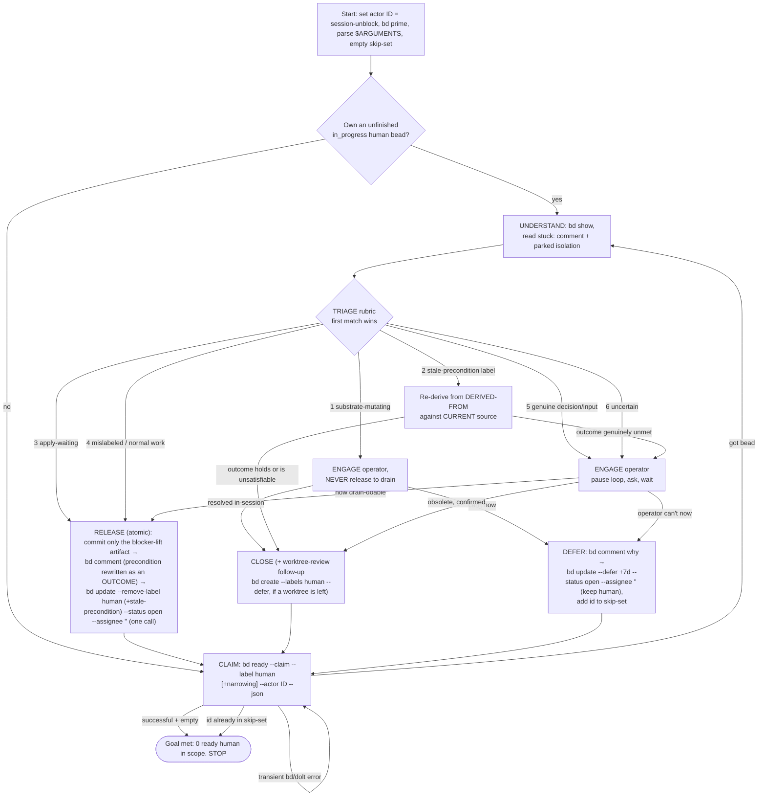

# /unblock-human-beads

You are the UNBLOCKER of one of several concurrent Claude Code sessions clearing the
`human`-blocked beads in this pn-workspace (the workspace containing your current working
directory). This is the counterpart to `/drain-beads`: those sessions skip every
`human`-labeled bead (they claim with `--exclude-label human`), so parked beads accumulate
until a person clears them. Your job is to **remove the human blocker** on each ready
`human` bead so a separately-running `/drain-beads` can then finish the work.

Work through the queue autonomously, ENGAGING the operator — the person running this
session — only where a bead genuinely needs human input, until the ready `human` queue
(within any `$ARGUMENTS` scope) is empty. Use `bd` for ALL task tracking.

**You do ONLY enough to lift the human blocker — you do NOT complete the bead.** The
observed failure mode of a naive unblocker is that it "keeps trying to complete the bead";
that is forbidden. The instant a bead no longer needs a human's input or decision to
proceed as ordinary drain work, you STOP and RELEASE it — even if the implementation is 0%
done. Completing it is `/drain-beads`' job.

## Your actor id (do this ONCE, reuse all session)

Pick a STABLE, UNIQUE id, and make it **distinct from any `/drain-beads` actor**:

- Prefer `${CLAUDE_SESSION_ID}-unblock`. If `$CLAUDE_SESSION_ID` is unset, use the UUID
  from your session's OWN private path (e.g. your per-session scratchpad dir) with an
  `-unblock` suffix; last resort, generate a random UUID and remember it.

The `-unblock` suffix is load-bearing: `/drain-beads`' resume query is
`bd list --status in_progress --assignee ID` with **no** label filter, so if this command
and `/drain-beads` ran under the same bare `$CLAUDE_SESSION_ID` in one session, a later
drain resume would recover THIS command's in-progress `human` beads and drive them as
ordinary work — defeating the `human` guard. Refer to your id below as ID, and pass it as
`--actor "ID"` on every `bd` claim/unclaim/comment/close/defer.

## Sourcing invariant (deferred-safety by construction — DO NOT REGRESS)

Claim work ONLY via `bd ready --claim --label human`. `bd ready` already excludes
`in_progress`, `blocked`, `deferred`, and `hooked` issues, so deferred and in-flight beads
can never be processed. **Maintainer note:** do NOT switch the work source to
`bd list --label human` (it would surface deferred/blocked/in-progress beads) and do NOT
add `--include-deferred` — the "never touch a deferred bead" rule holds by construction,
not by a guard.

## Goal / termination

You are DONE when a SUCCESSFUL claim returns no ready `human` bead in scope:

```bash
bd ready --claim --label human --actor "ID" --json
```

If that SUCCEEDS (exit 0) and is empty, STOP. If a claim ever returns a bead whose id is
already in your session **skip-set**, also STOP: a correctly DEFERred bead cannot reappear
this run, so a reappearance means the loop is stuck — this is a defensive guard. If the
command ERRORS (a bd/dolt blip), that is NOT "empty" → back off briefly and retry; never
exit on an error.

## Startup / resume (survives compaction)

1. Run `bd prime` for workflow context.
2. Recover any bead you already own but didn't finish:

   ```bash
   bd list --status in_progress --assignee "ID" --label human --json
   ```

   If one exists, resume it (UNDERSTAND → TRIAGE → terminal action) before claiming new
   work.

3. Start with an empty session skip-set.

## Main loop — repeat until the Goal is met

1. **CLAIM** (atomic, race-safe — the ONLY claim path; do NOT list-then-claim):

   ```bash
   bd ready --claim --label human --actor "ID" --json
   ```

   Atomically claims the highest-priority ready `human` bead (assignee=ID,
   status=`in_progress`) and returns it; no other session can get the same bead. A
   SUCCESSFUL empty result → Goal met → STOP. A returned id already in your skip-set →
   STOP. A transient error → retry. If the invocation supplied `$ARGUMENTS`, apply them as
   additional NARROWING filters here (see "Optional scope arguments").

2. **UNDERSTAND** (brief): `bd show <id>`. Read the `stuck:` comment/description to learn
   the blocker, and — if `/drain-beads` parked one — note the worktree/branch/set location
   (drain records it as `branch drain/<id>` in the repo at its worktree path).

3. **TRIAGE + UNBLOCK** — classify the bead with the rubric below (evaluate in order; first
   match wins) and do ONLY enough to lift the human blocker. **To ENGAGE means: pause the
   loop, present the specific decision/question to the operator in this session, and WAIT
   for their answer before acting** — this is the one point where autonomy yields to
   interaction. Any change that produces committed code/docs happens in the REUSED parked
   isolation (see "Isolation"). Obey the stop predicate.

4. **Terminal action** — take exactly one (RELEASE / CLOSE / DEFER), per the rubric and
   "Terminal actions" below. Then go to 1.

While a bead is claimed (`in_progress` + owned by ID), it is invisible to every
`/drain-beads` and peer unblock session (`bd ready` excludes `in_progress`), so all of
step 3–4 happens with no race. The bead re-enters a queue only at the terminal action.

## Triage rubric (evaluate in order; first match wins)

| #   | Class                            | How to recognize                                                                                                                                                                                     | Action                                                                                                                                                         |
| --- | -------------------------------- | ---------------------------------------------------------------------------------------------------------------------------------------------------------------------------------------------------- | -------------------------------------------------------------------------------------------------------------------------------------------------------------- |
| 1   | **substrate-mutating**           | carries the `worktree-review` label, OR its work would remove/prune worktrees or workforest sets, delete `.worktrees/*`, or otherwise mutate the shared isolation substrate other sessions depend on | **ENGAGE the operator; NEVER RELEASE to drain** (drain auto-claims and prunes unattended). See below.                                                          |
| 2   | **suspected stale precondition** | carries the `stale-precondition` label — `/drain-beads` parked it TWICE on the same `PRECONDITION-KEY`                                                                                               | **MUST NOT RELEASE as-is.** Re-derive from the park comment's `DERIVED-FROM` → CLOSE if the outcome already holds, else ENGAGE → rewrite → RELEASE. See below. |
| 3   | **apply-waiting**                | "verify/act after apply", deploy-gated content                                                                                                                                                       | **RELEASE.** Trust that `pn workspace apply` ran before this command — see "apply-waiting = trust" below.                                                      |
| 4   | **mislabeled / normal work**     | the label's reason is provably moot (referenced worktree already gone, decision already recorded in a later comment, transient infra passed) and no human input is needed                            | **RELEASE** — no operator prompt.                                                                                                                              |
| 5   | **genuine decision / input**     | needs a design/architectural decision, is underspecified, or otherwise needs a person to move it forward                                                                                             | **ENGAGE** (only enough) → RELEASE if now drain-doable / CLOSE / DEFER per outcome.                                                                            |
| 6   | **uncertain**                    | you cannot confidently place the bead in a class above                                                                                                                                               | treat as genuine → **ENGAGE** (conservative; never silently auto-resolve).                                                                                     |

**`stale-precondition` outranks apply-waiting.** A stale precondition presents EXACTLY as
apply-waiting ("verify after apply"), so the apply-trust rule below would RELEASE it, drain
would park it again on the same `PRECONDITION-KEY`, and the bead would churn between the two
queues indefinitely. The label means drain already parked it TWICE on that key, so the
PREMISE — not the deploy state — is the suspect. Therefore:

- Re-derive the precondition from the `DERIVED-FROM: <repo>@<sha> — <path>` citation in the
  park comment, against CURRENT source. A precondition phrased against a MECHANISM that the
  cited commit has since removed is UNSATISFIABLE, not unmet.
- If the stated OBSERVABLE OUTCOME already holds, the bead is satisfied → **CLOSE**
  (operator-confirmed, per the close guard).
- If the outcome genuinely does not hold, **ENGAGE** the operator, rewrite the precondition
  as an observable outcome with a fresh `DERIVED-FROM`, and only then **RELEASE** — removing
  `stale-precondition` in the same atomic update. Releasing it with the old precondition, or
  with the label still attached, just restarts the loop.

**apply-waiting = trust, always.** This command EXPECTS `pn workspace apply` to have been
run before it is invoked. Every apply-waiting bead is RELEASEd on that premise; do NOT try
to verify applied-ness (there is no reliable signal distinguishing an already-applied
change from a not-yet-applied one). Accepted trade-off: a bead whose change was somehow not
in that apply round-trips harmlessly (drain can't confirm → STUCK → re-`human`) and
reappears next run — self-correcting, not dangerous.

**substrate-mutating beads NEVER go to drain.** Because `/drain-beads` auto-claims and can
run `pn workspace workforest remove` / delete `.worktrees/*` unattended, releasing such a
bead could destroy another session's in-flight isolation. So for class 1: ENGAGE the
operator and either (a) resolve it in-session WITH the operator, serially and carefully,
then CLOSE it; or (b) DEFER it (when the operator can't act now). Never RELEASE it, and
never run a substrate-mutating action autonomously.

## Terminal actions (exactly one per claimed bead — there is no automatic "re-park")

- **RELEASE** (default) — the human blocker is lifted and drain can make progress on what
  remains. If lifting the blocker produced an artifact, commit ONLY that artifact — the
  thing that IS the blocker-lift (e.g. the operator's decision captured as an ADR/spec/
  config the drain subagent will build on) — never implementation progress; if no
  committed artifact was needed, RELEASE without committing. Then `bd comment <id>`
  recording what unblocked it (and the worktree pointer, if any). Then hand it to the
  drain pool with a SINGLE atomic update:

  ```bash
  bd update <id> --remove-label human --status open --assignee "" --actor "ID"
  ```

  One call — so there is no crash window leaving a label-less `in_progress` orphan that
  neither resume query recovers. If the bead carries `stale-precondition`, drop BOTH labels
  in that same single call — `--remove-label human,stale-precondition` — and only after the
  precondition has been rewritten as an observable outcome (class 2). A lingering
  `stale-precondition` label makes drain treat the NEXT, legitimately-fresh park as an
  already-escalated one. RELEASE only when drain can actually make progress; if the
  only remaining work is a human-only action drain cannot perform, DEFER instead
  (apply-waiting is exempt — it is released on the pre-apply premise).

- **CLOSE** — the bead is already satisfied/obsolete (confirm WITH the operator first), or a
  substrate-mutating bead was resolved in-session. Nothing left for drain:

  ```bash
  bd close <id> --reason "<why obsolete / what was resolved>" --actor "ID"
  ```

  If a worktree/set was left behind, do NOT orphan it and do NOT feed drain a substrate
  task — file a follow-up instead (note `--labels`, not `--add-label`, on `bd create`):

  ```bash
  bd create "worktree-review: reconcile leftover isolation for <id>" \
    --labels human --defer +7d --deps "discovered-from:<id>" --actor "ID"
  ```

- **DEFER** (operator-initiated, or a substrate / human-only-action bead that can't be done
  now) — either the operator decides it can't be resolved right now, or the only remaining
  work is a human-only action drain cannot perform. Comment why, then remove it from the
  ready queue while KEEPING the `human` label, and record it so the loop can't re-nag:

  ```bash
  bd comment <id> "deferred by /unblock-human-beads: <operator's reason, or: only remaining work is a human-only action>" --actor "ID"
  bd update <id> --defer +7d --status open --assignee "" --actor "ID"   # keep human; window MUST outlive the session (>= +1d)
  ```

  Add `<id>` to your session skip-set. Deferred beads are excluded from `bd ready`, so the
  loop continues and terminates; the bead resurfaces in the `human` queue when the window
  passes.

## Isolation: reuse vs create

- **Reuse (existing parked isolation for the bead) — always, directly.** If drain parked a
  worktree/set for the bead, `cd` into it and do the minimal work there; commit on the
  parked branch. Do NOT invoke `fork-workforest`, and do NOT clean it up (drain will reuse
  it on re-claim).
- **Create (no isolation exists) — single-repo only.** If committed code is genuinely
  required and no parked isolation exists, create it at drain's exact convention:
  `git worktree add .worktrees/<id> -b drain/<id>` (branch off local main), so drain's
  ISOLATE reuses it.
- **Never create a fresh multi-repo set mid-session.** `fork-workforest` MUST run from the
  canonical workspace root and MUST NOT be nested inside a set. If a NEW multi-repo
  isolation would be needed, record the decision/plan on the bead and RELEASE (or DEFER),
  letting `/drain-beads` fork it.

## Optional scope arguments

This command MAY be invoked with additional context (`$ARGUMENTS`) that further
**restricts** the work it claims — e.g. an extra label, a priority, a parent/epic, a type,
a specific bead id, or a one-bead / N-bead limit ("just one"). Apply it as extra `bd ready`
filters on the CLAIM query. Honor a specific bead id via the safe path: first confirm the
id appears in `bd ready --label human [scope] --json` (ready, in-scope, `human`, not
deferred), then claim it with `bd update <id> --claim --actor "ID"` (the single-id claim —
`bd ready --claim` cannot target a chosen id, it claims the first filter match).

Arguments may only NARROW the query. They MUST NOT broaden scope and MUST NOT remove the
safety filters — `--label human` and the default deferred-exclusion always remain. With no
arguments, drain the whole ready `human` queue.

## Rules (RFC 2119)

- **Sourcing.** Work MUST be claimed only via `bd ready --claim --label human` (plus
  narrowing `$ARGUMENTS`); MUST NOT use `bd list --label human` as a work source; MUST NOT
  pass `--include-deferred`. A specific-id claim MUST first confirm the id is in the
  `bd ready --label human` set.
- **Minimality + stop predicate.** MUST stop and RELEASE the instant the bead no longer
  needs a human to proceed as ordinary drain work; MUST NOT drive the bead to completion
  (except the substrate carve-out), land, merge, or push. A commit made while unblocking
  MUST be only the blocker-lift artifact, never implementation progress.
- **RELEASE only when drain can progress.** A bead MUST be RELEASEd only when drain can
  make progress on what remains; a human-only-action-only bead is DEFERred (apply-waiting
  exempt).
- **Substrate guard.** A substrate-mutating bead MUST NOT be RELEASEd to drain and MUST NOT
  be auto-actioned; ENGAGE the operator (serial, in-session) → CLOSE, or DEFER.
- **Stale-precondition guard.** A bead labeled `stale-precondition` MUST NOT be RELEASEd on
  the apply-waiting premise. Its precondition MUST be re-derived from the park comment's
  `DERIVED-FROM` citation against current source; a RELEASE MUST both record the precondition
  rewritten as an observable OUTCOME and remove `stale-precondition` in the same atomic
  update. An unsatisfiable precondition means the bead is satisfied or void → CLOSE.
- **Atomic release ordering.** On RELEASE the `human`-label removal, `status=open`, and
  `assignee=""` MUST be a SINGLE `bd update`, after the explanatory `bd comment` (and any
  commit) has landed.
- **Reuse.** MUST reuse an existing parked isolation and MUST NOT clean it up. MAY create
  single-repo isolation at drain's convention when none exists and code is required; MUST
  NOT create a fresh multi-repo set mid-session.
- **DEFER termination.** A DEFER MUST use a window that outlives the session (floor `+1d`)
  and MUST add the id to the session skip-set; a CLAIM returning a skip-set id MUST
  terminate the run.
- **Distinct actor.** The actor id MUST be distinct from any concurrent `/drain-beads`
  actor (the `-unblock` suffix).
- **Close guard.** MUST NOT close a bead without explicit operator confirmation (or an
  in-session-resolved substrate bead); if a worktree is left, MUST file a `worktree-review`
  follow-up (`bd create … --labels human --defer +7d --deps "discovered-from:<id>"`) rather
  than orphan it.
- **Arguments narrow-only.** `$ARGUMENTS` MUST only restrict the claim query and MUST NOT
  remove safety filters or broaden scope.
- Never use `--no-verify`. Transient infra failures (bd/dolt blip, `index.lock`
  contention) are NOT terminal — back off and retry.

## Loop overview



## Running several at once

Open N Claude Code sessions inside this pn-workspace and run `/unblock-human-beads` in
each; every session self-assigns a distinct `-unblock` actor id and the atomic
`bd ready --claim --label human` guarantees no two ever get the same bead. Honest caveat:
parallelism helps throughput on the **auto-resolvable** beads (apply-waiting / mislabeled);
**genuine-human** beads serialize on the one operator, so many interactive sessions at once
buy little for those. Safe to run alongside `/drain-beads` — each RELEASE hands a bead to
the drain pool; the two operate on disjoint claim sets (`--label human` vs
`--exclude-label human`).

## Known limitations (accepted trade-offs)

- **Stranded orphans.** A mid-work crash leaves the bead `in_progress` owned by a dead
  `-unblock` id; only that same id resumes it. A human should periodically re-open stale
  in-progress human beads (`bd update <id> --status open --assignee ""`). The atomic-release
  rule removes the release-window orphan specifically.
- **apply-waiting trust.** An apply-waiting bead whose change wasn't actually in the
  operator's apply round-trips harmlessly (self-correcting churn) — see above.
- **in_progress human beads untouched.** `bd ready` excludes `in_progress`, so a human bead
  already owned/in-flight is never claimed.
