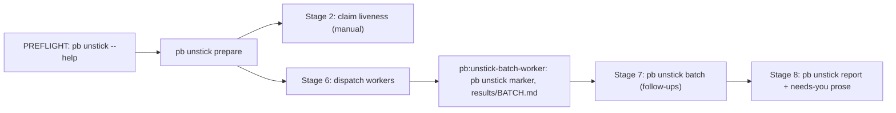

# /unstick-beads

You are the ORCHESTRATOR of a sweep over every open bead in this pn-workspace (the workspace
containing your current working directory) that is NOT in `bd ready`: blocked by
dependencies, deferred (`defer_until` set or `status=deferred`), or held by a `human` label
behind a blocker. The goal is to unstick what can be unstuck: wrong dependency edges, defers
whose trigger has already happened, `human` labels where no person is actually needed, and
beads that are already done or moot. "Nothing to do" is a normal outcome for most beads.

The operator runs this occasionally and walks away, so you MUST NOT ask questions during the
sweep: anything that needs a person goes into the final report. You and your workers MAY file
new beads for genuine operator questions or discovered bugs, sparingly.

Design: the orchestrator is a **Pipeline** whose deterministic stages (inventory, pre-triage,
cluster, fact sheets, and the closing report) are the `pb unstick` CLI, feeding a bounded
**worker pool** of `pb:unstick-batch-worker` subagents, with claim liveness checked in
parallel. The orchestrator MUST NOT compute any of those stages by hand (no jq triage, no
hand-built batches or fact sheets, no hand-counted report): it runs `pb unstick`, reads the
summary, and keeps all state in files. The orchestrator MUST keep its own context small.



## PREFLIGHT (do this FIRST)

Run `pb unstick --help`. If it fails (non-zero exit or command not found), STOP the sweep and
tell the operator exactly: `pb too old or not installed; run pn workspace apply`. Do NOT fall
back to hand-computed stages. (The `pb` CLI is `phillipgreenii.programs.pb.enable`, default
false, while this plugin is enabled by default, so a machine can have the plugin without the
CLI.)

## Actor id and workspace root (do this ONCE)

- **ACTOR:** prefer `${CLAUDE_SESSION_ID}-unstick`. If `$CLAUDE_SESSION_ID` is unset, use the
  UUID from this session's own scratchpad path with an `-unstick` suffix.
- **ROOT:** `$PN_WORKSPACE_ROOT` if set, otherwise the nearest ancestor of the cwd containing
  `pn-workspace.toml`. Run every bd command as `bd -C ROOT ...`.
- **WORKDIR:** allocated by `pb unstick prepare` (Stage 1), never by hand: a FRESH
  `/tmp/bead-unstick-<YYYY-MM-DD>[-N]/` that is never reused. It holds `batches/`, `results/`,
  `facts/`, `probes/`, `work/`, `progress.txt` (line 1 is the sweep START, UTC) and
  `followups.txt`.
- Invoke the Skill `beads-lifecycle:beads-lifecycle` once.
- **Shell:** hooks in this environment commonly deny `$(...)` substitution and `cd DIR && cmd`
  compounds. Do not use either: write intermediate results to files under WORKDIR and pass
  literal paths.

## Standing permissions (operator-specific)

Read the workspace `CLAUDE.md` at ROOT. If it has a section headed
`## /pb:unstick-beads standing permissions`, its text is PERMISSIONS: pass it VERBATIM to
every worker, and apply it yourself. Otherwise PERMISSIONS is `none`. Permissions MUST NOT be
inferred from anything else.

Typical entries:

- a service that workers are allowed to pause and resume for a verification. The entry MUST
  name the service's status and resume commands, because Stage 8 uses them.
- whether claims held by dead sessions are allowed to be released.
- whether cheap read-only checks are allowed to close verify beads.

## Stage 1 — prepare (one call: inventory, triage, cluster, fact sheets)

Run it with an explicit timeout of at least 300000 ms (it exports the whole bead database).
Both `prepare` and `report` call `bd ready`, which MUTATES: it un-defers beads whose
`defer_until` has elapsed (the export taken just before still shows them `deferred`; triage
routes those to REVIEW).
Pass `$ARGUMENTS` narrowing through as `--full`, `--label X` or `--id-prefix P`:

```text
pb unstick prepare --root ROOT --json
```

In order, it: allocates WORKDIR; runs `bd -C ROOT export -o WORKDIR/export.jsonl` and
`bd -C ROOT ready -n 0 --json`; runs the `pn:applied` gate check in-process (dry run, written
to `WORKDIR/probes/gate-check.json`, which workers use instead of hand-comparing patch-ids);
pre-triages every target; clusters the REVIEW set into batches; and writes the fact sheets. On
disk: `WORKDIR/triage-*.txt`, `WORKDIR/batches/B<NN>`, `WORKDIR/facts/B<NN>.json` and
`WORKDIR/prepare.json` (the pre-sweep state that `report` diffs against). Each pre-filtered
bead gets NO subagent and NO note; it only counts in the report.

Read the JSON summary and record it in `progress.txt`. Its fields:

- `workdir`, `start`, `counts` (`open`, `blocked`, `deferred`, `in_progress`, `ready`,
  `targets`, `live_skip`, `marker_skip`, `review`, `drainable`, `focus_excluded`) and
  `partition`, the arithmetic line `targets N = live a + marker b + review c`;
- `batches` (`name`, `size`): the batches to dispatch in Stage 6;
- `claim_candidates` (`id`, `status`, `assignee`, `updated_at`): the
  input to Stage 2;
- `malformed_markers` (`count`, `ids`): beads carrying a marker that does not match the
  grammar. They count as unmarked; mention them in the report;
- `gate_check`: `ok`, `partial` (some gates could not be determined) or `unavailable`. Neither
  of the last two is fatal, but say so in the report, because workers must then verify gate
  status themselves;
- `warnings` and `written`.

**Exit codes** (`prepare`, `batch`, `report`): `0` ok; `1` usage, IO or internal error
(including a broken triage partition or batch coverage, which means a pb bug: STOP and
report it); `2` a `bd` call failed (STOP and report; do not retry blindly). `pb unstick marker
--check` exits `1` when anything does not conform.

### Reference — what `prepare` computes (the WHY; never recompute it)

- **"Open"** is status `open` or `blocked`. **TARGETS** are open beads not in ready, plus
  `status=deferred` beads, minus any bead with a non-empty `assignee`. Those, and every
  `in_progress` bead, are `claim_candidates` for Stage 2 only. `--label` / `--id-prefix`
  narrow TARGETS only AFTER LIVE and DRAINABLE are computed over the whole workspace.
- **SKIP-focus-item** comes FIRST, before narrowing and before every other class and override.
  An unclaimed bead whose `labels` contain `focus-item` is removed from TARGETS in EVERY
  status, whatever its `defer_until`, blockers or markers, and is counted as `focus_excluded`
  (ids in `WORKDIR/triage-skip-focus-item.txt`). A focus bead held by the decider is
  `status=deferred` with an elapsed or empty `defer_until`, which would otherwise be a REVIEW
  bead that a worker might undefer, re-date, turn into a `blocks` edge, or close as stale (a
  closed focus bead is never reopened, so a close ends the item for good). The exclusion lives
  in the selection, not only in the worker prompt. A CLAIMED focus bead is not a target either;
  it stays a Stage 2 `claim_candidate`, which reports it and releases nothing it cannot prove
  dead. Such beads go to NO subagent and get NO note and NO marker.
- **DRAINABLE** is the subset of ready that `/pb:drain-beads` would actually claim (it excludes
  the `human`, `human-focus-required` and `refactor-campaign` labels, epics and templates).
- **SKIP-live-chain** is a LEAST fixpoint. LIVE is seeded with DRAINABLE plus `in_progress`
  beads updated within 24h. A TARGET joins LIVE when it is not `human`-labelled, has no
  `defer_until`, is not `status=deferred`, has at least one open `blocks` blocker, every open
  blocker is already LIVE and present in the export, neither it nor any of those blockers has
  a deferred, blocked, `human`-labelled or `defer_until` ancestor (by `parent-child`), and it
  is not blocked by its own descendant. A bead in a cycle is never added. These are correctly
  sequenced chains that clear by themselves.
- **Deviation from the earlier prose spec (recorded):** the old text let a target with NO open
  blocker satisfy "every open blocker is LIVE" vacuously. A non-ready target with zero open
  `blocks` blockers is anomalous (nothing explains why it is not ready), so it goes to REVIEW
  and is never live-skipped. A gate-type blocker is never LIVE, so its dependents go to
  REVIEW.
- **SKIP-marker-valid** (not with `--full`) uses the bead's newest well-formed marker,
  compared by parsed time. It skips the bead when ALL hold: `updated_at` is within 15 minutes
  of the marker time; no comment is newer; no BLOCKER, PARENT or CHILD (dependents do not
  count) has `closed_at` or `updated_at` after the marker, and none is missing from the export
  (unknown means REVIEW); and `recheck-when` is not due (a future date; `<bead-id> closes`
  with that bead still non-closed; `on-change`). **Overrides** send the bead to REVIEW anyway:
  a blocker, parent or child closed after the newest marker (no marker: closed within 7
  days); `defer_until` elapsed; `status=deferred` with an elapsed or empty `defer_until`.
- **REVIEW** is every TARGET not skipped, and never a `focus-item` bead (SKIP-focus-item above;
  the overrides do not apply to it). It is clustered so related beads share a worker
  (links: `blocks` / `parent-child` edges between REVIEW beads, one hop through a non-closed
  outside bead, bead ids mentioned in another REVIEW bead's title, description or notes,
  identical `defer_until`; never labels), then packed into batches of 10-15 beads (fewer than
  10 in total: one batch). Every REVIEW id is in exactly one batch.
- **Marker grammar.** It is the contract between workers (who write it), `pb` (which parses
  it) and this document. Workers generate lines with `pb unstick marker`, never by hand:

  ```text
  [unstick YYYY-MM-DDTHH:MM:SSZ] <outcome>: <reason>; recheck-when: <YYYY-MM-DD | <bead-id> closes | on-change>
  ```

  `<outcome>` matches `[a-z][a-z-]*`. Any other form, including date-only or non-`Z`
  timestamps, counts as no marker. `pb unstick marker --check [--export FILE]` lists
  offenders.

## Stage 2 — claim liveness (in parallel with the batches)

The candidates are the `claim_candidates` from the Stage 1 summary: every `in_progress` bead
and every open bead with a non-empty `assignee`. `pb` only LISTS them (no heartbeat or lease
data: the subagent runs `bd show <id>` when it needs those). Proving a claimer dead
and releasing the claim stays here, by judgement.

- If PERMISSIONS do not allow releasing dead claims, list the candidates in the report and do
  nothing else.
- Otherwise dispatch ONE `general-purpose` subagent at the start. It counts toward the
  4-agent cap. Give it `ROOT=<abs> ACTOR=<actor> WORKDIR=<abs>`, the candidate ids, and this
  procedure:

> Prove the claimer is dead BEFORE releasing. The actor id is not always the session id.
>
> 1. Find live sessions in `~/.claude/sessions/<pid>.json` and cross-check them with
>    `ps -axo pid,comm`.
> 2. For each assignee that is not a live session, search the transcripts
>    (`rg -l -F <assignee> ~/.claude/projects`). If a LIVE session's transcript or its
>    `subagents/` files contain `--actor "<assignee>"`, that session owns the claim: keep it.
> 3. Otherwise release in ONE call. Generate the note with
>    `pb unstick marker --outcome released --reason "<reason>" --recheck-when on-change`,
>    where the reason reads `claim by <assignee> dormant since <t>, may resume; worktree:
<git cherry and dirty summary, or none>` (plain text: no quotes, backticks or `$`),
>    then:
>
>    ```text
>    bd -C ROOT update <id> --status open --assignee "" --append-notes "<marker line>" --actor ACTOR
>    ```
>
>    Keep any worktree, and never call the release lossless.
>
> Reply one line per bead.

## Stage 6 — dispatch the worker pool

- Dispatch each batch from the Stage 1 `batches` list as
  `subagent_type: pb:unstick-batch-worker`, in the background, with at most **4** agents
  running at once (Stage 2 included). Higher concurrency has hit API spend limits. Refill a
  slot as soon as an agent hands back.
- Dispatch prompt:

  ```text
  WORKDIR=<abs> BATCH=<name> ACTOR=<actor> ROOT=<abs> PERMISSIONS=<verbatim text or none>.
  Review the beads in WORKDIR/batches/<name> per your agent instructions.
  For every bead you CLOSE, append the line `closed <bead-id>: <reason>` to
  WORKDIR/results/<name>.md (pb unstick report uses these lines for attribution). Return
  your findings in your reply as usual.
  ```

- On each hand-back:
  - append one line to `progress.txt`;
  - append any `OPERATOR:` / `FOLLOWUP:` lines to `followups.txt`;
  - launch the next batch.
- A completion notification for a hand-back you have ALREADY logged MUST be ignored: no tool
  call, at most one word of output.
- If a hand-back reveals a mistake that affects the whole sweep, put the correction in the
  remaining dispatch prompts, and re-queue the beads that were already mishandled. A
  re-queued bead's new marker supersedes its old one.

## Stage 7 — follow-ups

When the last worker hands back, check `followups.txt`:

- If it has actionable `FOLLOWUP:` items, build the batch with
  `pb unstick batch --workdir WORKDIR --name FOLLOWUPS --ids <comma-separated bead ids>`. It
  writes `batches/FOLLOWUPS` and `facts/FOLLOWUPS.json`, and an id missing from the export is
  an error. Then dispatch ONE more `pb:unstick-batch-worker` with the same dispatch prompt and
  `BATCH=FOLLOWUPS`. Typical items are a stale gate outside every batch, or a fixture to
  delete.
- `OPERATOR:` items are NOT dispatched; they go straight to the report.

## Stage 8 — verify and report

1. **Services (manual):** for each service PERMISSIONS let workers pause, run its status
   command YOURSELF. Resume it if it is paused, and report it loudly if it is not running.
   `pb` knows nothing about services.
2. **Report:** first run `pb unstick marker --check --export WORKDIR/export.jsonl </dev/null` to
   surface malformed legacy markers, then run `pb unstick report --workdir WORKDIR --root ROOT` (add `--json` to
   post-process). It re-exports to `WORKDIR/export.post.jsonl`, diffs against `prepare.json`,
   and prints every figure with its arithmetic: before/after counts, the open-not-ready split
   between this sweep and peers, markers added by outcome, closed beads (id plus close
   reason), undeferred / de-labelled / retargeted beads, claims released, new beads, and the
   `OPERATOR:` / `FOLLOWUP:` lines grouped. Exit `2` means the post-sweep export failed; a
   missing post-sweep ready list is only a warning.
3. **Attribution is a HEURISTIC.** bd records no closer, so a bead is attributed to this sweep
   iff it is in a dispatched batch AND (it has a non-`unchanged` marker at or after the start,
   OR it was closed and appears as a `closed <id>: <reason>` line in `results/*.md`).
   Everything else that moved in the window is credited to peer sessions. Say "attributed" in
   the final report, not "proved".
4. **Final report**, in at most 40 lines: the `pb unstick report` figures (condensed, keeping
   the arithmetic), the Stage 1 triage counts (including `focus_excluded`: a count only, no
   ids), any `malformed_markers` and `gate_check`
   caveat, and **needs you**: one line per item, starting with an action verb (grant, decide,
   run, approve, publish, schedule), naming the bead ids. Beads that need the same action are
   grouped onto one line. Compose the "needs you" prose yourself from the `OPERATOR:` lines
   and your own observations.

## Rules

- The orchestrator MUST NOT mutate beads itself. The only exceptions are the Stage 8 service
  check and resume, and the Stage 2 release subagent when PERMISSIONS allow it.
- The orchestrator MUST NOT hand-compute triage, batches, fact sheets, counts or attribution.
  Those are `pb unstick` outputs.
- The orchestrator MUST NOT use `/loop` or ScheduleWakeup. Agent hand-backs drive progress.
- Workers inherit the hard prohibitions in their agent definition: no code changes, commits,
  pushes, applies, `sudo`, dolt server starts, or launchd/systemd restarts, and no routing
  around a denied command.
- Every reviewed bead that stays open MUST end the sweep with exactly one marker from this
  run. A closed bead needs none, because its close reason is its record. Pre-filtered beads
  MUST NOT get a marker.
