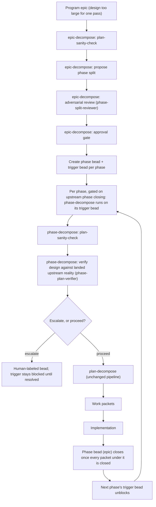

# plan-decompose

`plan-decompose` turns an approved design into curated, self-contained work-packet beads that an
implementer agent can execute without reading the full design. For a design too large to
decompose in one pass, two wrapping skills split the work into ordered rounds first:
`epic-decompose` sketches a program epic's remaining, not-yet-phased scope into phase boundaries
(subject to an adversarial review and a human approval gate) and creates one `plan-decompose`
docket per phase, plus a sibling trigger bead; `phase-decompose` is what a later claimant runs
against each trigger bead in turn — it verifies that phase's design text against what actually
landed from its upstream phases, then hands off to `plan-decompose` itself, unchanged, to curate
that phase's packets. All three, plus `plan-decompose` itself, share one cheap guard,
`plan-sanity-check`, which each runs first to confirm the plan text it has been handed is
well-formed enough to act on. All four skills and their agents live in this one existing plugin —
`epic-decompose` and `phase-decompose` are not a separate plugin, and `plan-decompose` itself is
not renamed.

## Lifecycle



## Glossary

- **Program epic** — the bead holding a design too large for one `plan-decompose` pass; the
  authoritative mechanics live in `skills/epic-decompose/SKILL.md`. "Program epic" names a
  _concept_, not a bead type or a second label — the only marker `epic-decompose` applies is the
  `phased-epic` label, once at least one round of phases has split off it.
- **Phase bead** — one phase's own `plan-decompose` docket: an epic-typed bead created by
  `epic-decompose` and consumed by `phase-decompose`/`plan-decompose`; see
  `skills/epic-decompose/SKILL.md` (creation) and `skills/phase-decompose/SKILL.md` (consumption).
  It carries the `phase` label.
- **Trigger bead** — a plain task, sibling of its phase bead (same parent, not its child),
  created alongside it by `epic-decompose` and later claimed and run by `phase-decompose`; see
  `skills/phase-decompose/SKILL.md`. It carries the `phase-trigger` label — a _different_ bead
  from its phase-bead sibling, despite the similar names.
- **Packet** — one self-contained work-packet bead created by `plan-decompose` itself; the
  authoritative mechanics live in `skills/plan-decompose/SKILL.md`.

## Worked example

A 2-phase split of program epic `xyz-100`:

| Bead      | Type | Labels            | Depends on (`--blocked-by`) |
| --------- | ---- | ----------------- | --------------------------- |
| `xyz-100` | epic | `phased-epic`     | —                           |
| `xyz-101` | epic | `docket`, `phase` | `xyz-102` (its own trigger) |
| `xyz-102` | task | `phase-trigger`   | —                           |
| `xyz-103` | epic | `docket`, `phase` | `xyz-104` (its own trigger) |
| `xyz-104` | task | `phase-trigger`   | `xyz-101` (phase 1's bead)  |

`xyz-101`/`xyz-102` are phase 1 and its trigger; `xyz-103`/`xyz-104` are phase 2 and its trigger,
wired so phase 2's trigger cannot unblock until phase 1's bead actually closes (every packet under
it closed), not merely once phase 1 is decomposed. `epic-decomposer` (packet C's own step 8)
authors each trigger bead's `description` field with this exact literal text:

```
Run `phase-decompose` on `xyz-101`.
```

Running `bd show xyz-102` shows exactly that description.

## FAQ / troubleshooting

**My phase-trigger bead won't unblock, why?**
Its phase-bead dependency (an epic) can't close until every packet under it is closed — check
whether the _prior_ phase is actually fully implemented, not just decomposed.

**`epic-decompose` ran in the background and I don't see any new beads — where's the phase split
it proposed?**
Check the program epic for the `human` label and a report comment; it halted for approval rather
than creating beads.

**A human-labeled bead showed up under my phase — what do I do?**
Read it (it's self-contained by design); edit the named phase bead's design field per its "To
resolve" instructions, then close it.

## Why this shape exists

An earlier attempt to phase a design by hand, ad hoc, produced a docket that `plan-decompose`
could not resume: one round was manually restricted to a subset of the design's scope, and once
that round landed and closed, `find-docket` matched the unchanged design text against the now-
released docket and resolved to "nothing to do" — the one routing branch that cannot represent
"there is more of this design left to decompose." `epic-decompose` and `phase-decompose` exist so
that phasing itself is tracked as live bead state (a phase inventory, a synthetic `pd_source` per
phase) rather than left implicit in a design document no tool re-checks.
