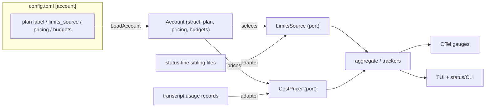

# pa-monitor: Account/Plan model with pluggable limits + cost sources

**Status**: Accepted
**Date**: 2026-07-01
**Deciders**: phillipg, Claude

> Accepted 2026-07-01 after the Phase 0 validation gate PASSED — `rate_limits` is
> emitted on this account and `five_hour` is authoritative and exact. `seven_day`
> was observed absent, which sharpens (does not block) the design: every
> `rate_limits` field is treated as **independently optional**. See
> [Validation Gate](#validation-gate-blocks-acceptance) for the captured evidence.

## Context

pa-monitor displays Claude Code **5h-block** and **7-day** usage. Today those
percentages are derived from `ccusage blocks/weekly --json --offline`, which
computes a **USD cost** from local transcript tokens
(`~/.claude/projects/**/*.jsonl`) and divides it by a **hardcoded, unpublished
per-plan USD cap** (`internal/core/ccusage/plan_caps.go`).

This is structurally wrong, not a misconfiguration:

- Anthropic's real 5h/7d limits are **model-weighted "compute-hour" windows**,
  pooled across Claude Code / claude.ai / Cowork and across every machine.
  Dollars-of-local-tokens has no defined relationship to that window.
- The caps are guesses (the source comments say so), and Anthropic publishes
  only multipliers (Pro 1x, Max 5x/20x) and hour _ranges_, never a quota.
- `--offline` sees only the local machine's transcripts, so the numerator is a
  lower bound even ignoring the metric mismatch.

Measured on the live daemon: **5h 114.2%** (`$102.77 / $90`) and **7d 83.3%**
(`$1666.45 / $2000`) while the claude.ai UI showed **13%** — an overstatement of
`83.3 / 13 ≈ 6.4×`.

Two facts change what is possible:

1. Claude Code now emits an authoritative `rate_limits` object in the
   **status-line stdin JSON** — `rate_limits.five_hour.used_percentage` +
   `.resets_at` and `rate_limits.seven_day.used_percentage` + `.resets_at`. This
   is the same server-side number the claude.ai UI shows.
2. This account is a **grandfathered enterprise plan, not API-priced**, behaving
   ~Max-20x, authenticated via OAuth (Keychain `Claude Code-credentials`).

The primary goal is **better visibility, with the 5h block as the most important
metric**. Cost is currently notional on this plan but MUST remain in the system
for future use.

The current code binds directly to the concrete `ccusage.Block` /
`ccusage.WeeklyEntry` types across ~15 files (`aggregate`, `proto`, the SQLite
schema in `store/sqlite`, the OTel gauges in `otel/emitter.go`, and the TUI).
There is no seam between "where usage data comes from" and "how it is
aggregated, stored, and displayed."

## Decision

### 1. Source 5h/7d from the status-line `rate_limits`, via a sibling capture file

The status-line **wrapper** (`home/programs/claude-status-line/scripts.nix`
`mkWrapperScript` — the only component that sees the raw stdin JSON) MUST, on
each render, write a small record to a JSONL file that lives **next to the
transcript** in the session directory, named `<session_id>.status.jsonl`.

- The write MUST be best-effort and MUST NOT affect the render: wrapped
  `{ … } 2>/dev/null || true`, using `$EPOCHSECONDS` (no `date` fork), performed
  synchronously (no background fork).
- The record MUST contain only an allowlisted field set: `ts`, `session_id`,
  `hostname`, and whichever `rate_limits` window values are present — each window
  is **independently optional** (see the robustness clause below; Phase 0 observed
  `seven_day` absent on this account, so "the four values" is an upper bound, not a
  guarantee). It MUST NOT capture the process environment generically (secret-leak
  risk — Phase 0 confirmed the status-line command runs with the **full user env**,
  151 names including `SSH_AUTH_SOCK` and `STARSHIP_SESSION_KEY`; see
  `2026-06-12-nix-agent-support-deepdive.md` finding "allowlist env at capture").
- The file MUST be created mode `0600`.
- **Missing-field robustness (load-bearing — proven by Phase 0).** Every level of
  `rate_limits` is independently optional: the whole object, either `five_hour` /
  `seven_day` window, and each window's `used_percentage` / `resets_at`. Phase 0
  observed `seven_day` entirely absent and `five_hour` `null` before the first
  server response on this account. The wrapper MUST treat any missing level as
  **absent** — skip that field — and MUST NOT substitute `0` (a real "unused"
  reading) or a `1970` timestamp. A window present in one render and gone the next
  MUST be handled without emitting a spurious change. No consumer — wrapper,
  sibling-file reader, daemon, proto, or TUI — may assume a field exists; each
  independently degrades to "unknown/stale". (The existing status-line render
  already meets this: `limitsPart` hides the whole segment when both windows are
  absent and omits the countdown when `resets_at` is missing; the `jq` extraction
  defaults each field to `""`.)
- The wrapper MUST validate `used_percentage ∈ [0,100]` and treat out-of-range
  values as absent (Claude Code bug #52326 can return an epoch-sized number for
  an empty window; unclamped it renders as garbage and defeats write-on-change).
- Writes MUST be **append-on-change**, in this order: (1) clamp/validate;
  (2) if absent, skip; (3) compare the clamped value to _this file's_ last
  record; (4) append iff changed. Ordering matters — clamp must precede the
  compare, or bug #52326's epoch value reads as a change every render and floods
  the file. Dedup is necessarily _per-file_; the reader dedups across files. A
  `<session_id>.status.last` hash sidecar (to avoid re-reading the tail) also
  lives in `projects/` and MUST be added to the exclusion predicate (§2).

**Reader contract (current value, not history).** `rate_limits` is
**account-global**, so the `LimitsSource` reader MUST return the **single
most-recent record across all `*.status.jsonl` files, ordered by embedded `ts`**
— it MUST NOT correlate by `session_id` (Claude rewrites `session_id` on resume /
compact / fork; see `internal/core/session/transcript.go:15-28`), and it MUST
ignore the near-duplicate records that concurrent sessions emit for the same
global value.

**Burn-rate/projection is derived by the daemon from its own periodic sampling**
of that current value — the same way it already trends block cost — NOT by
parsing the file's historical series. Append-on-change is therefore chosen to
avoid per-render rewrites and keep an audit trail, not as the burn-rate data
source; the reader needs only the newest record. (This resolves the contradiction
a review raised: reading "newest record only" cannot itself yield a trajectory.)

**Staleness.** A `stale_after` duration lives in config. The capture `ts` MUST
round-trip through a new proto field to the (possibly remote) TUI; age is computed
at render via the guarded `timeFromTS` helper — an _unset_ timestamp MUST NOT
decode as 1970 (this already bit `from_proto.go:184-204`, rendering sessions as
paused; add a regression guard). A value older than `stale_after` renders as
`stale (age)`.

### 2. Fix pa-monitor's `.jsonl` consumers to ignore status files

pa-monitor MUST define one shared predicate — `isTranscriptFile(name) =
HasSuffix(".jsonl") && !HasSuffix(".status.jsonl")` (also `!HasSuffix(".status.last")`
if the sidecar is used) — in the `session` package, and apply it at the two sites
that actually enumerate `.jsonl` files:

- `internal/core/session/transcript.go:47` (`ResolveTranscript`) — **load-bearing**:
  its newest-by-mtime fallback would otherwise pick a frequently-rewritten
  `<id>.status.jsonl` **as** the transcript and corrupt token counts, model, and
  Working/Idle/Dormant state.
- `internal/daemon/gc.go:128` (`listSessionFiles`) — strips the extension to derive
  a session ID; a `<id>.status.jsonl` yields a phantom session.

Two sites the first review listed need **no** change (verified):
`internal/core/session/session.go:87` only _derives_ the name `<id>.jsonl` (it
never lists a directory), and `internal/core/poller/poller.go:118` delegates to
`ResolveTranscript`. The poller's one independent lister — `maxActivity`
(`poller.go:436-444`) — is already prefix-scoped to `agent-*.jsonl` under
`subagents/`, so a top-level status file cannot match; add a guard test anyway.

### 3. Introduce source ports + a config-loaded Account (decouple from ccusage)

Define **two ports** — `LimitsSource` and `CostPricer` — that the
aggregation/storage/OTel/TUI layers depend on instead of the concrete `ccusage.*`
types, so implementations can change without touching consumers. The `Account`
(plan / pricing / budgets) is a **plain struct** built by `LoadAccount(cfg)`, not
a port — a discovery interface is added only if/when runtime discovery is actually
specified (Go interfaces are cheap to add later):

- `Account` is a **plain struct** — plan identity/label, which `LimitsSource` to
  use, the price data for cost, and optional budgets — built by `LoadAccount(cfg)`
  from `[account]` in the nix-rendered `config.toml`. If runtime discovery (from an
  API or from observed `rate_limits`) is later required, wrap it behind an
  `AccountProvider` interface **then**, defined at the consumer — not now.
- `LimitsSource` yields current 5h/7d `used_percentage` + `resets_at` + capture
  `ts`. Default adapter: the sibling-file reader. Alternate adapters (HTTP proxy
  header capture, direct API) MAY be added later without touching consumers.
- `CostPricer` yields cost from transcript usage, reading prices **from the
  `Account`** (so pricing can later be discovered dynamically, not just from
  config). Default adapter: **native** — sum per-model input/output/cache tokens
  × prices.
- Consumers MUST depend on the ports, not on any concrete provider. Existing
  OTel metric names (`pa_monitor.block.cost.usd`, `week.cost.usd`,
  `session.cost.usd`, `block.usage.*`, `week.usage.*`) MUST be preserved.

**ccusage disposition:** retire the ccusage _adapter_ once the native `CostPricer`
is in place. The unused `toktrack` / `goccc` packages (`packages/toktrack`,
`packages/goccc` — present in the tree but with **no** Go references from the
daemon) can be deleted immediately. Note: `ccusage.Block` / `ccusage.WeeklyEntry`
are also used as the internal DTO across ~16 files; retiring the ccusage _pricer_
while keeping those types leaves a misleadingly-named `ccusage` package — rename
them to neutral domain types (e.g. `usage.Block`) as part of the port refactor.
ccusage MAY be retained as an alternate `CostPricer` adapter if maintaining a
local price table proves undesirable.

> **Resolved:** `Account` is a plain struct (`LoadAccount`); only `LimitsSource`
> and `CostPricer` are interfaces. A YAGNI review flagged an `AccountProvider` port
> as premature (one config-read adapter, no second implementation yet), so the
> discovery interface is deferred until a second adapter actually exists.

### 4. Requirements & trade-offs (what we're accepting)

| Need                                          | Chosen approach                                      | Trade-off accepted                                                                                                                                      |
| --------------------------------------------- | ---------------------------------------------------- | ------------------------------------------------------------------------------------------------------------------------------------------------------- |
| Accurate 5h block % (primary)                 | Authoritative `rate_limits`                          | Refreshes only during interactive renders → `stale` labeling. Block is account-global, so any active session covers it.                                 |
| Accurate 7d %                                 | Same source                                          | Same coverage caveat.                                                                                                                                   |
| Keep cost in-system                           | Native `CostPricer` from transcripts + config prices | Price table is manually maintained; requires ingesting full usage (today only output tokens are stored). Acceptable: cost is notional on this plan now. |
| Change limits/prices later without a refactor | Config-loaded `Account` struct (`LoadAccount`)       | Config drift is possible (a data fix, not code); a discovery interface can wrap it later if needed.                                                     |
| Decoupling / testability                      | Ports + adapters                                     | ~15-file refactor to thread ports through aggregate/proto/store/otel/tui.                                                                               |
| Coverage of headless/`-p` agent pools         | (none — they render no status line)                  | Their consumption is invisible to the limits source; the account-global value still reflects it once any interactive session renders.                   |

### 5. Telemetry surface (a percentage is not a cost)

"Preserve OTel metric names" MUST mean "do not break existing series," NOT "reuse
a dollar gauge for a percent." `pa_monitor.block.cost.usd` / `week.cost.usd` are
`Float64ObservableGauge`s fed by real USD (`otel/emitter.go:191-198,418-441`,
driven from `lifecycle.go:472-483`). Therefore:

- `*.cost.usd` gauges MUST keep emitting **native cost** (the honest value).
- Add **new** gauges for the authoritative signal: `pa_monitor.block.usage.percentage`,
  `pa_monitor.week.usage.percentage`, and `…resets_at` epoch gauges. These are
  **account-global** and MUST NOT carry a `session_id` label.

The wire percentage today is `CostUSD / capUSD` (`proto/translate.go:137-160`); that
derivation is replaced by the authoritative `used_percentage`, and any client reading
`WindowPct` MUST be audited for the semantic change.

### 6. Persistence & wire migration

`store.Block` and the `blocks` table model USD only (`plan_cap_usd`, `total_cost_usd`,
…); there is no percentage column, and the migration framework is forward-only (no
down-migrations). This work MUST:

- Add a numbered migration (`003_*.sql`) with **nullable** `five_hour_pct`,
  `seven_day_pct`, `seven_day_resets_at`, `limits_captured_at` — `NULL` means
  "unknown/stale", explicitly distinct from `0`. Phase 0 observed `seven_day`
  absent on this account, so `seven_day_pct` / `seven_day_resets_at` MUST tolerate
  being **long-lived `NULL`** — the common case, not an edge case — and the TUI/OTel
  MUST render/omit them as unknown rather than `0%`.
- Add corresponding proto3 fields (new field numbers — wire-compatible additions)
  and re-thread `state_convert.go` (store→tree) + `translate.go` / `from_proto.go`.
  New fields MUST use **distinct** names (e.g. `five_hour_resets_at` /
  `seven_day_resets_at`): the existing `rate_limit_resets_at` / `window_resets_at`
  proto fields mean the daemon's _pause / limit-hit_ concept, not the status-line
  windows.
- Prove `003` applies cleanly on a DB already at `002`, and old rows read back as
  `NULL`/stale (round-trip tests — see Test Strategy).

## Consequences

### Positive

- 5h/7d match claude.ai exactly (same source) when fresh.
- Status line and pa-monitor stay decoupled — a plain file, any reader.
- Limits need **no** cap config at all (Anthropic reports the %).
- Prices/plan/budgets become config; future changes don't touch code.
- The two ports (limits, cost) enable mocked sources in tests and swappable
  adapters — e.g. a proxy/API limits source — with no consumer changes; `Account`
  stays a plain struct, wrappable behind a port later only if discovery is needed.

### Negative

- ~15-file refactor to introduce the ports and Account/Plan model.
- pa-monitor must be taught to exclude `*.status.jsonl` (2 sites need code changes —
  `ResolveTranscript` + `gc`; `maxActivity` needs only a guard test) — the cost of
  keeping the file beside the transcript rather than in a private location.
- Native cost requires new full-usage ingestion + a maintained price table, and it
  lands on a hot path: `Snapshot` is single-pass over whole transcripts (16 MB
  buffer, `snapshot.go:85-91`) and today stores output tokens only
  (`snapshot.go:207`). Adding cumulative per-category / per-model token sums MUST be
  budgeted; since cost is notional now, computing it lazily / less often is an option.
- Limits are blank/stale with no active session (headless-only periods).
- `LimitsSource` and `CostPricer` ship with one adapter each initially; `Account`
  is kept a plain struct to avoid premature abstraction (a discovery port is added
  only when a second adapter exists).

### Neutral

- Append-on-change needs the wrapper to read the last record each render (or a
  `.last` hash sidecar); on local `~/.claude` this is cheap and atomic for
  ~190-byte records.
- Retiring ccusage removes a subprocess dependency but shifts price maintenance
  in-repo.

## Test Strategy

Tests MUST match repo conventions (table-driven Go with `t.TempDir()`; bats for the
wrapper). Capture logic MUST be extracted into a sourced `.bash` lib with its own
bats file, mirroring `strip-ansi.bash` / `test-strip-ansi.bats`, so clamp and
append-on-change are unit-testable without a filesystem.

- **Unit (Go):** status-JSON parse/clamp (0 / 100 / >100 / negative / #52326 epoch →
  absent / missing / malformed); **per-field optionality** — `rate_limits` absent,
  one window absent (the observed `seven_day` case), a window present but its
  `used_percentage` / `resets_at` absent — each MUST yield `NULL`/skip, never `0`
  or `1970`, and MUST NOT emit a spurious append-on-change; `LimitsSource` newest-across-files by `ts` with
  churned `session_id`, equal-`ts` tiebreak, empty / only-stale dirs; staleness
  boundary + the unset-timestamp→1970 regression guard; `isTranscriptFile` truth
  table; `ResolveTranscript` / `gc.listSessionFiles` ignore `*.status.jsonl`;
  `maxActivity` guard; native `CostPricer` vs a **pinned** ccusage baseline (per-model
  - cache split, zero-token, unknown-model policy); `Snapshot` cumulative token sums;
    port fakes prove consumers depend only on interfaces; `[account]` parse + price
    validation + legacy `plan_tier` still parses.
- **Integration (Go):** store round-trip of the new nullable columns (`NULL` ≠ `0`;
  `003` applies on a `002` DB); proto round-trip of new limits fields (unset → stale,
  not 1970); OTel — new percentage gauges observe, `*.cost.usd` stays honest,
  account-global gauges carry no `session_id`.
- **Bats (wrapper):** writes `<id>.status.jsonl` at `0600` next to the transcript;
  append-on-change (unchanged → no line, changed → one line); clamp → absent; capture
  never alters render output / exit; **secret non-leak** (only allowlisted fields
  appear); unwritable / missing dir → still exits 0.
- **Hard to test (flagged):** cross-file `ts` ordering under real concurrent renders
  (use deterministic fixtures, not live races); native-vs-ccusage parity (pin a
  recorded number, never shell out in CI); global-value-vs-per-session display (assert
  the reader ignores `session_id` entirely — there is no mapping to test).

## Validation Gate (blocks acceptance)

This ADR MUST NOT be accepted or implemented until a **Phase 0 spike** confirms
`rate_limits.five_hour/seven_day.used_percentage` is present and realistic in the
status-line stdin JSON **on this grandfathered enterprise account** (Claude Code
bug #40094 reports `rate_limits` missing for some Max-20x/OAuth plans). If it is
absent, this approach is abandoned in favor of the proxy or estimate
alternatives below. The `statusline-probe.sh` shim captures one payload for this
check.

### Result — PASSED (2026-07-01)

A throwaway `statusLine.command` shim (`claude --settings <throwaway>`, no
nix-managed file touched) captured two live renders on this account (Claude Code
`2.1.196`, model "Opus 4.8 (1M context)"):

| Signal                       | Observed                                                                                              | Verdict                             |
| ---------------------------- | ----------------------------------------------------------------------------------------------------- | ----------------------------------- |
| `rate_limits` emitted at all | Yes — **not** the bug #40094 "missing entirely" case                                                  | ✅ gate passes                      |
| `five_hour.used_percentage`  | `34` — **exact** match to the claude.ai usage UI (34%) at capture time                                | ✅ authoritative                    |
| `five_hour.resets_at`        | present (epoch `1782958200`)                                                                          | ✅                                  |
| `seven_day`                  | **absent** — the key is not emitted (only `five_hour` present) in both renders                        | ⚠️ see below                        |
| pre-first-response render    | `rate_limits: null` before the first server round-trip, populated after                               | ⚠️ absent→skip needed               |
| `transcript_path`            | present (`~/.claude/projects/…/<session>.jsonl`)                                                      | ✅                                  |
| env-name allowlist evidence  | status line runs with the **full user env** — 151 names incl. `SSH_AUTH_SOCK`, `STARSHIP_SESSION_KEY` | ✅ allowlist-only capture mandatory |

**Decision:** GREEN. The gate's core question — is `rate_limits` present and
realistic on this account? — is answered yes, and `five_hour` (the ADR's primary
metric) is authoritative and exact. The status-line path is **not** abandoned.

**`seven_day` caveat (folded into the design, not a blocker):** it was absent in
both renders. This is why every `rate_limits` field is treated as independently
optional (see §1 "Missing-field robustness" and §6 long-lived-`NULL`). The
per-model claude.ai view showing `0` used is a separate UI breakdown (Fable-only)
and does not contradict the aggregate 5h reading.

> Two renders 14s apart cannot prove `seven_day` is _permanently_ absent; the
> design does not depend on that conclusion. Whether `seven_day` appears under
> heavier 7-day usage MAY be re-observed opportunistically, but the missing-field
> robustness above makes the answer immaterial to correctness.

## Sequencing (each phase compiles and the daemon keeps running)

0. **Phase 0 — gate (above). ✅ PASSED 2026-07-01.** `rate_limits` appears for this
   account; `five_hour` present and exact (34% vs UI 34%), `seven_day` absent
   (design treats every window as independently optional). Phases 1–4 unblocked.
1. **Persistence + wire.** Add migration `003` (nullable columns, `NULL` ≠ `0`) and
   the new proto3 fields (backward-readable; unset → stale, not 1970). No consumer
   reads them yet.
2. **Ports, no behavior change.** Introduce `LimitsSource` + `CostPricer` and route
   the _existing_ ccusage path through the `CostPricer` port as its first adapter —
   consumers now depend on ports; output is unchanged.
3. **Capture + `LimitsSource` adapter.** Land the wrapper capture, the sibling-file
   reader, the `*.status.jsonl` exclusion, and the new `*.usage.percentage` gauges.
   5h/7d now come from `rate_limits`; `*.cost.usd` still from ccusage.
4. **Native cost + retire ccusage.** Land the native `CostPricer` (full-usage
   ingestion + config prices), validate parity against a pinned ccusage figure, flip
   the default, then delete the ccusage adapter and rename the `ccusage.*` DTO types
   to `usage.*`.

ccusage is removed only in Phase 4, after native cost is proven; every phase is
independently shippable.

## Alternatives Considered

### Fix `plan_tier` / the USD caps

Rejected: even the correct tier leaves the caps guessed, and the dollar metric
is not the compute-hour metric — it cannot match claude.ai.

### Swap ccusage for toktrack or goccc

Rejected: all three are local-cost estimators of the same class; none exposes the
server rate-limit %. Swapping changes nothing about the limits problem.

### Single per-account file outside `projects/` (atomic overwrite)

Strong option — dissolves the glob-pollution and session-id concerns without
touching pa-monitor, and (since burn-rate is derived from the daemon's own sampling,
not the file's history — see §1) it would **not** lose the trajectory. Not chosen
because placement beside the transcript is a firm requirement and pa-monitor "must
be changed anyway"; append-on-change is retained for its per-session audit trail.
If that preference softens, this is the lower-complexity option.

### Daemon polls an Anthropic usage endpoint (Option B)

Rejected as the primary source: depends on an undocumented endpoint and on
reusing an OAuth credential outside its issued scope; updates without a session
but is fragile and a ToS gray area. Retained as a possible future
`LimitsSource` adapter.

### Local HTTP proxy reading `anthropic-ratelimit-unified-*` headers

Rejected as primary: same active-only coverage as the status line, but puts an
interceptor in every request's critical path and MITMs credentialed traffic.
Retained as a possible future `LimitsSource` adapter.

### Local weighted-token estimate as the limits fallback

Rejected: the daemon does not ingest per-model/cache tokens today
(`transcript/snapshot.go:207` stores output tokens only), and any local estimate
re-creates the guessed-cap flaw while staying un-pooled. Idle gaps render as
`stale` instead. MAY be revisited as a separate, explicitly-directional feature.

## Related Decisions

- Supersedes the USD-cap limit model in `internal/core/ccusage/plan_caps.go`.
- Builds on ADR 0011 (pa-monitor daemon + OTel split) and ADR 0016 (config-sourced
  OTel) — the Account/Plan config extends the existing `config.toml` pattern.
- Touches the status-line contract from ADR 0019 / 0020 (adds a wrapper-level
  capture, independent of the rendered parts).
