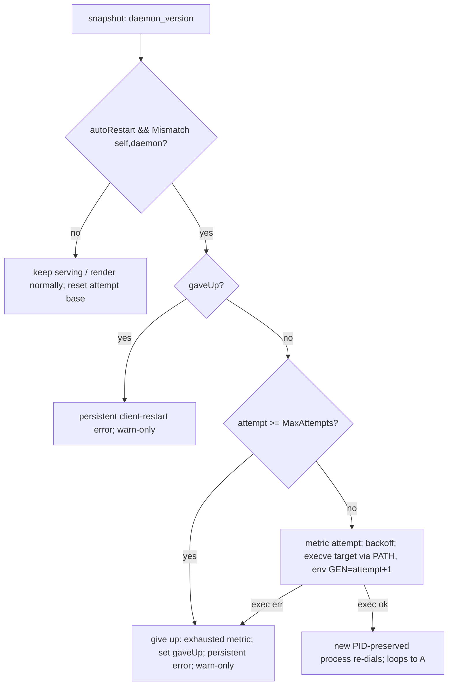

# pa-monitor client self-restart on daemon version mismatch

**Status**: Accepted
**Date**: 2026-07-13
**Deciders**: Phillip Green II

## Context

`pa-monitor` ships as a single Go binary run in three long/short-lived roles. The **daemon** is
launchd-supervised and is restarted automatically during `darwin-rebuild` (a wrapper-hash change).
The **cmux-bridge** and **tui** are _not_ supervised — the user starts them interactively in arbitrary
terminals / cmux panes, and several can run at once.

When a rebuild restarts the daemon on a new build, every running bridge/TUI keeps executing the
**old** binary against the **newer** daemon. The daemon already reports its build id on the wire
(`DaemonState.daemon_version`), both clients already receive it, and `versioncmp.Mismatch()` already
computes the skew — but the bridge merely logged a warning and the TUI showed a help-modal note.

Two problems motivated this ADR:

1. **The version string was silently broken.** `packages/pa-monitor/default.nix` passed no
   `versionPath`, so `mkGoApp`'s default `-X main.Version=` targeted a symbol the code does not
   declare (`cmd/pa-monitor/main.go` declares lowercase `var version`). The linker dropped the
   ldflag and every role reported the `"dev"` fallback. Because both sides reported `"dev"`,
   `Mismatch()` was a permanent false — even the existing warning could never fire.

2. **Detection did nothing actionable.** Even with versions stamped, a stale client only _warned_;
   the user had to notice and restart it by hand, per pane, after every rebuild.

## Decision

### D0 — Fix version injection and lock it with an automated check (prerequisite)

`packages/pa-monitor/default.nix` MUST set `versionPath = "main.version"` so the build stamps the
lowercase symbol the code declares. Because this is build-time linker behavior invisible to the Go
unit tests (`main_test.go` only asserts `version != ""`, which `"dev"` passes), a `nix flake check`
(`test-pa-monitor-version-stamped`) MUST assert `pa-monitor --version` matches
`pa-monitor 0.0.0-<8hex>` (baseVersion + the ADR 0006 per-source digest). This check is the sole
regression guard for the injection.

### D1 — Opt-in client self-restart via `execve(2)`, guarded on version only

On a wire-version mismatch, the `cmux-bridge` and `tui` MAY re-execute themselves in place via
`syscall.Exec` (execve): same PID, same controlling TTY, same stdio — the process _becomes_ the new
binary. Go opens its fds `O_CLOEXEC`, so live gRPC/OTel/poller sockets auto-close on exec. Same-PID
matters: cmux keeps tracking the bridge as the same pane descendant.

- The mechanism lives in a build-tag-free `internal/reexec` package (pure decision logic; the single
  `syscall.Exec` call is isolated behind a `//go:build unix` file) so it is table-testable.
- The exec **target** MUST be resolved via `exec.LookPath(base(argv0))` — the `PATH` lookup picks up
  the `darwin-rebuild`-flipped profile symlink → new build — and MUST NOT use `os.Executable()`
  (which resolves to the running build's old `/nix/store` path). The resolved target MUST be
  absolute (fail-safe guard).
- The child is re-exec'd with the ORIGINAL `os.Args` (argv[0] pinned) and an env whose
  `PA_MONITOR_REEXEC_GEN` is REPLACED-IN-PLACE at attempt+1 (never appended — a duplicate key would
  make the child's `os.Getenv` read the stale first copy).

The guard is the wire-version mismatch plus a bounded attempt counter — **no binary comparison**.
Dropping a pre-exec binary check is deliberate: during the activation race (the daemon reports the
NEW build before the profile symlink flips) an attempt MAY re-exec into the same old build. A short
pre-exec `backoff` spaces `MaxAttempts` tries across ~`MaxAttempts × backoff` of wall-clock so a
normal activation flip is caught.

### D2 — Bounded retries; give up to a persistent error

`reexec.MaxAttempts` (a small fixed cap) bounds consecutive re-execs. The attempt count is carried
across execve in `PA_MONITOR_REEXEC_GEN` and parsed fail-safe (absent/malformed/negative → 0). When
the count reaches the cap, or an exec syscall fails, the client MUST **give up**: revert to the
disabled warn-only behavior for the rest of its life and surface a **persistent** client-restart
error. A connection that reports `!Mismatch` (converged) MUST reset the in-memory attempt base to 0,
so a client legitimately restarted `MaxAttempts` times over its lifetime never permanently disables
itself.

### D3 — Default off; per-config-key opt-in

Behavior MUST default **off**, gated by a new config key `auto_restart_on_version_mismatch` (bool,
Go zero value `false`, mirroring the `cmux_sidebar_enable` precedent). This machine
(`phillipg-mbp-02`) turns it on via the nix home module. Config is read once at startup, so a client
already running when the flag is first enabled only warns on the first upgrade (a one-time manual
restart is required); every later upgrade auto-restarts.

### D4 — Observability

A new counter `pa_monitor.client.reexec{component,attempt,outcome}` MUST be emitted once per
self-restart decision, with `outcome ∈ {attempt, exhausted, exec_failed}`. The `exhausted`/
`exec_failed` increments make the give-up state alertable — a persistent condition, not a one-shot
log. A companion `client.reexec` log event carries trace context.

### D5 — Scope

| Role                         | In scope? | Reason                                                                                                                  |
| ---------------------------- | --------- | ----------------------------------------------------------------------------------------------------------------------- |
| `cmux-bridge`, `tui`         | **Yes**   | Long-lived, unsupervised clients — the stale-vs-newer-daemon target case.                                               |
| `wait-until-agents-finished` | **No**    | Long-lived streamer, but survives daemon restarts via reconnect-grace; a re-exec would reset its idle streak — harmful. |
| `daemon`                     | **No**    | Already restarted by launchd on rebuild.                                                                                |
| one-shot CLIs                | **No**    | Short-lived (dial → one RPC → exit); no skew window.                                                                    |

## Restart / give-up flow

## Consequences

- **Accepted:** during the activation race a re-exec MAY land on the still-old build, costing up to a
  few visible restarts before the profile symlink flips (the bridge/TUI reappears each cycle; it
  never "dies"). If activation is slower than the `MaxAttempts × backoff` budget the client gives up
  and the persistent error tells the user to restart manually. This is the price of the simpler
  version-only guard (no binary comparison).
- **Messaging reworded:** this feature targets the _newer-daemon_ case, where the fix is to restart
  the **client**. The bridge warning, TUI help-modal note, mismatch alert, and the persistent
  give-up error all advise restarting the client, not the daemon.
- **Testability limit:** the safety-critical ordering (terminal restored before execve in
  `runTUIRemote`; the sentinel-intercept wire in `runCmuxBridge`) lives in un-seamed `main`-adjacent
  functions, covered by injected-seam decisions plus manual E2E rather than fully by unit tests. The
  decision logic (`internal/reexec`, `evalDaemonVersion`, `classifyBridgeResult`, the TUI
  `evalReexec`) is table-tested, and one E2E exercises the real `execve`.
- **Completions unchanged:** the flag is a TOML key, not a CLI flag — a conscious decision.
