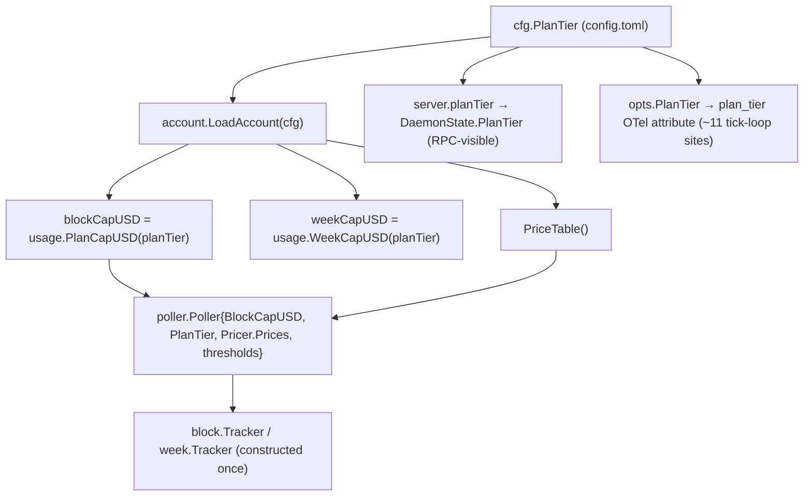

# pa-monitor general daemon config hot-reload

**Status**: Proposed
**Date**: 2026-07-15
**Deciders**: Phillip Green II

## Context

The `pa-monitor` daemon loads `~/.config/pa-monitor/config.toml` **once** at startup
(`cmd/pa-monitor/daemon.go`). Bead `pg2-r1f1j.8` added a narrow hot-reload: `configReloader`
(`internal/daemon/config_reload.go`) fingerprints the config file each tick and, on change, rebuilds
**only the decorator pipeline** (`RunOptions.ReloadDecorators`), swapping `decorators` and clearing
`labelCache` in the tick goroutine (`internal/daemon/lifecycle.go:538-539`).

Every **other** config-only field still requires a daemon restart, and the launchd restart is keyed
on the package (wrapper) hash — not on the config file — so a config-only edit applied by
`pn workspace apply` never restarts the agent. This bead (`pg2-z6pff`) asks to close that gap
generally, using `plan_tier` as the motivating case (confirmed live: after `pn workspace apply`,
`plan_tier` stayed `max_5x` until a manual `launchctl kickstart -k`).

### Why `plan_tier` is not a "just reload the label" change

Investigation shows `plan_tier` is **not** a passive reported value — it drives caps that are baked
into long-lived components at construction:

The `*poller.Poller`, its `NativePricer`, and the `block`/`week` trackers are built **once** in
`buildPoller` (`cmd/pa-monitor/daemon.go:368`) with `BlockCapUSD = acct.BlockCap()`,
`Pricer.Prices = acct.PriceTable()`, `PlanTier`, and the config thresholds
(`WorkingThreshold`, `IdleThreshold`, `WaitingFreshWindow`, `BurnWindowShort/Long`) all captured by
value. They are then consumed via the `Poller` interface each tick.

Consequently a **label-only** hot-reload (updating `DaemonState.PlanTier` and the OTel `plan_tier`
attribute but not the caps) would be **actively misleading**: the daemon would _report_ the new tier
while still _computing_ limit-hit and burn state against the **old** tier's caps and price table.
That is worse than the current honest "needs a restart" behaviour, so it MUST NOT be landed as an
interim step.

### The general shape of the problem

`plan_tier` is one instance of a broader class: config fields whose effect is **baked into a
constructed component** (poller, account/caps, pricer, thresholds), versus fields **re-read fresh
each tick** (decorators; the caffeinate user toggle, already re-read from shared state). Only the
latter are safely hot-swappable in place today. This is the same root cause as the `pg2-bw30` class
(`pg-pr-sync`'s `review.enabled` needing a restart): a config change that a long-lived process read
once.

## Decision drivers

- A hot-reload MUST NOT leave the daemon in a self-inconsistent state (reported tier ≠ computed
  caps).
- Config-only edits SHOULD take effect without a manual `launchctl kickstart`.
- Concurrency: `DaemonState.PlanTier` is read by `buildState()` from RPC handler goroutines while
  the tick goroutine owns the reload — any in-place field swap MUST be race-free.
- Minimise blast radius and per-field bespoke wiring; prefer a mechanism that generalises to future
  config fields.
- Avoid reconstructing components whose reset would lose in-flight state (e.g. the `block`/`week`
  trackers' `block.id` correlation state) unless that reset is actually intended on a tier change.
  The account-level limit-hit latch itself (`blockLimitHit`/`weekLimitHit`) is a tick-goroutine-local
  `limitHitLatch` in `RunWith`, not held inside the trackers, and re-arms on a changed reset time —
  not on a cap change.

## Options

### Option A — In-place runtime reconstruction of config-derived components

Broaden the tick reload to, on any config change: rebuild `account.Account`, then push the new
`BlockCapUSD` / `PriceTable` / `PlanTier` / thresholds into the already-running poller and pricer
through a new thread-safe setter seam, update `server.planTier` (moved into the mutex-guarded
`sharedState`), and update `opts.PlanTier` (tick-goroutine-local, so the OTel sites need no change).

- PRO: no process restart; fastest possible apply; keeps unsupervised bridge/TUI sessions attached.
- CON: requires a new mutable, thread-safe configuration seam on the poller/pricer (today their
  fields are set-once and read lock-free on the tick goroutine); each future config field needs a
  matching setter; risk of subtle races and of half-applying a multi-field change mid-tick.
  Reconstructing the `block`/`week` trackers mid-run would also drop their `block.id` correlation
  state, and a mid-block cap swap raises a semantic question against the tick-local limit-hit latch
  (does crossing the _new_ cap re-arm?).

### Option B — Graceful daemon self-restart on a reconstruction-requiring change

Keep the in-tick reload for fields that are safe in place (decorators). For any change to a
reconstruction-requiring field, the tick reloader triggers a **graceful** daemon self-restart:
initiate the bounded graceful stop delivered by bead `pg2-fcjpr` (prompt shutdown even with live
WatchState/BridgeChannel streams), then simply **exit** and let launchd respawn the agent — the
darwin module already sets `keepAlive = true` (`darwin/modules/pa-monitor/default.nix`), and a
config-only change leaves the binary unchanged so no re-exec is needed. (`internal/reexec` /
ADR 0027 is today a client-only path that resolves a NEW binary via `PATH` for the
`darwin-rebuild` profile-symlink flip; it would only apply if a config change coincided with a
binary change.)

- PRO: the daemon re-runs its normal, already-correct startup construction — zero bespoke per-field
  reload wiring; no new mutable seams; impossible to half-apply. Directly leverages `pg2-fcjpr`.
- CON: a brief daemon outage per config change (bounded by graceful-stop + boot); must still solve
  the apply/write race (the daemon must restart _after_ home-manager writes the file — the reloader's
  fingerprint poll already handles "file changed" correctly, so the self-restart keys on the new
  content, not on wall-clock).

### Option C — launchd `watchPaths` on the config file (nix-darwin)

Address the root cause at the OS layer: add `watchPaths = [ config.toml ]` to the launchd agent (and
order the activation so the daemon reload runs _after_ the config write) so launchd restarts the
daemon whenever the file changes. Generalises to the `pg2-bw30` class across all config-on-restart
daemons.

- PRO: no daemon code; one declarative mechanism for every config-keyed daemon (pa-monitor, pg-pr);
  fixes the `pn workspace apply` write/restart ordering race generally.
- CON: lives in the nix-darwin module, not the Go daemon; `watchPaths` fires on _any_ write
  (including atomic-rename churn) so it needs debounce/idempotence; still a full restart (same outage
  as B) and still relies on getting the activation ordering right.

### Option D — Hybrid (recommended)

Split by field class:

- **In-place (extend Option A minimally)**: fields consumed fresh each tick with no reconstruction —
  decorators (done); trivially, any pure "reported/label" field that has NO downstream computation.
  `plan_tier` does **not** qualify (it drives caps), so it is explicitly out of the in-place set.
- **Restart (Option B, or C at the OS layer)**: any reconstruction-requiring field (`plan_tier` and
  its caps, thresholds, burn windows, price table). The tick reloader classifies the change and, for
  this class, triggers the graceful self-restart.

## Recommendation

Adopt **Option D** with **Option B** as the restart mechanism: keep the safe in-place reload, and
for reconstruction-requiring fields (starting with `plan_tier`) trigger a graceful self-restart built
on `pg2-fcjpr`'s bounded shutdown plus an exit-for-launchd-`keepAlive`-respawn. This keeps the daemon's construction logic
as the single source of truth (no duplicated, race-prone per-field reload), makes half-application
impossible, and composes cleanly with work already in the tree. Option C MAY be added later as a
belt-and-suspenders OS-level guard for the whole `pg2-bw30` class, but is not required for
`pa-monitor` alone.

Explicitly **rejected**: landing a `plan_tier` label-only reload as an interim step — it would report
a tier the daemon is not actually computing against.

## Consequences

- A follow-up implementation bead should wire the tick reloader to classify config diffs and invoke
  the graceful-self-restart path for the reconstruction class; scope the exact re-exec-vs-exit
  mechanism against ADR 0027 and the launchd `KeepAlive`/`watchPaths` config.
- Human decision required: confirm Option D+B (vs. the in-place Option A, or leaning on Option C at
  the nix-darwin layer) before implementation, since it commits to a "restart on cap-affecting
  config change" behaviour and a brief daemon outage per such change.

## Related

- Bead `pg2-z6pff` (this ADR); `pg2-r1f1j.8` (decorator-only in-tick reload).
- Bead `pg2-bw30` (pg-pr `review.enabled` needs a restart) — same config-read-once class.
- Bead `pg2-fcjpr` (prompt graceful daemon shutdown with live streams) — enables a clean self-restart.
- ADR 0027 (client self-restart on version mismatch via `reexec`); ADR 0021 (Account/Plan model +
  caps).
