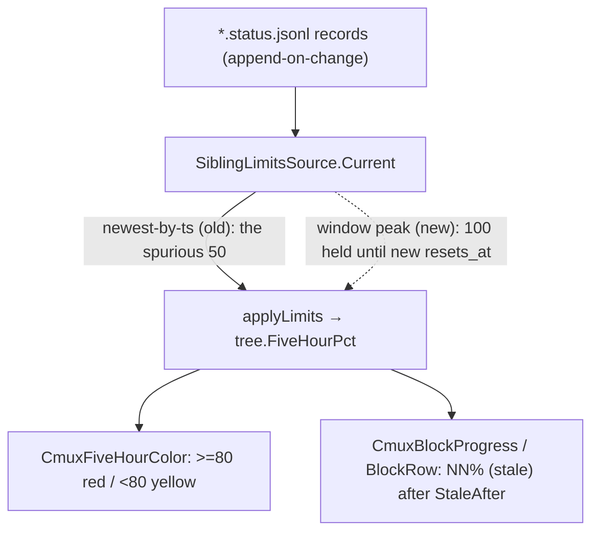

# pa-monitor: rate-limit reader holds the current window's peak, not the newest record

**Status**: Accepted
**Date**: 2026-07-15
**Deciders**: Phillip Green II

## Context

ADR 0021 §1 sourced the account-global 5h/7d usage from Claude's status-line
`rate_limits`, captured to `<ClaudeHome>/projects/**/<session_id>.status.jsonl`, and
fixed the reader contract as: return the **single most-recent record across all files,
ordered by embedded `ts`** ("current value, not history").

Bead `pg2-itdwk` reported that after the 5h window was hit (100%, red, correct), the
cmux sidebar and TUI flipped **on their own** to "yellow, block 50% (stale)" — with no
new window having actually started. The reporter's acceptance criterion: once the 5h
window is hit, the daemon/bridge/TUI MUST keep indicating the window is hit until it can
**confirm a new window** and clear the block — no fallback to some other output state.

### Root cause (from the live on-disk record trail)

Claude's per-render `five_hour.used_percentage` is **non-monotonic near the cap**.
Within a single fixed window (constant `five_hour_resets_at = 1784135400`), the captured
records were:

| `ts`       | `five_hour_pct` |
| ---------- | --------------- |
| 1784122281 | 100             |
| 1784122635 | 47              |
| 1784122637 | 100             |
| 1784122786 | 50              |

The mechanism (confirmed from the raw records — each carries `ts`, `session_id`,
`hostname`, `five_hour_pct`, `five_hour_resets_at`): **`five_hour_pct` is a session's
last-seen server value** (from its API rate-limit headers), but **`ts` is the
status-line render time**. A session re-renders — advancing `ts` — without making a
fresh API call, so it emits a fresh-`ts` record carrying a **stale** percentage. The
`ts=1784122786` record above was session `90b2b35e`'s only render for that window: a
`50%` snapshot it kept showing (it had been rate-limited and stopped making successful
calls) while other sessions had already driven the account to `100%`. Six-plus distinct
sessions wrote this one window; the newest `ts` was simply whichever session rendered
last, not the most current value. The sub-100 readings are therefore **stale per-session
snapshots of a monotonically-accumulating global value**, not a real decrease (the ADR
0021 §1 wrapper already validates `used_percentage ∈ [0,100]`, so each is server-"valid",
just late). `SiblingLimitsSource.Current` returned the newest-`ts` `50`; `applyLimits`
(`internal/daemon/lifecycle.go`) copied it onto the tree with no latch. The reporter's
agents then stopped for ~3.8h, so **no fresher record arrived** — `50` froze, aged past
`StaleAfter` (10m) into `block 50% (stale)`, and `CmuxFiveHourColor`
(`internal/render/cmux_five_hour_color.go`) flipped red→yellow because `50 < 80`. When a
genuinely new window later started, a record with a **new** `five_hour_resets_at` reported
a legitimately lower value.

## Decision drivers

- Correctness of the reported window value is the root cause; the red→yellow flip and the
  `(stale)` label are downstream symptoms of the wrong percentage, not separate bugs.
- The fix MUST be **restart-robust**: the daemon restarts (e.g. on `darwin-rebuild`), and
  the reporter explicitly did not restart it precisely so state could be inspected.
- The fix MUST NOT introduce a self-inconsistent or fabricated state (the acceptance
  criterion forbids fallbacks to some other output).
- Minimise blast radius: fix once at the source so every consumer (cmux color, cmux
  progress, TUI 5h row) agrees, rather than patching each renderer.

## Decision

`SiblingLimitsSource` (the `LimitsSource` adapter) MUST report the account-global
**current-window peak**, refining ADR 0021 §1:

1. **Load-bearing assumption.** Within a fixed window (constant `resets_at`), the
   account-global usage only **accumulates**; `used_percentage` is therefore monotonic
   non-decreasing. Per-session _reported_ values lag (a session shows its last-seen
   snapshot), so a later-but-lower reading for the same `resets_at` is a staler snapshot,
   not a real decrease. _This ADR is wrong iff the account-global `used_percentage` ever
   legitimately decreases within a fixed `resets_at`_ (e.g. if the 5h limit were a rolling
   window — but `resets_at` is a fixed per-window epoch, ruling that out). The evidence
   (monotonic global climb 1→100 under a constant `resets_at`; the dips explained by
   per-session render-vs-data staleness above) supports it.
2. **Current window = the greatest `resets_at` observed** across all records. Windows only
   advance (a later window has a later reset), so max-`resets_at` always names the newest
   window. It is deliberately NOT "the `resets_at` of the newest-`ts` record": a lagging
   session reports an OLD `resets_at` together with its stale percentage (both from the
   same API response) and can render after a new window has begun — keying on `ts` would
   let that straggler mask the new window; keying on max-`resets_at` cannot.
3. **Reported percentage = peak.** The window's `used_percentage` is the **max** non-nil
   value across all records sharing that `resets_at` (account-global, across every
   session/file) — the max being the freshest true reading among lagging snapshots. It
   MUST be `nil` (unknown) — never a fabricated `0` — when the window carries a `resets_at`
   but no percentage at all.
4. **Release only on a new window.** A record carrying a **greater** `resets_at` re-scopes
   the peak to that window, so a genuine reset (even to a higher value than a prior
   window) releases correctly; an older window's records never leak forward.
5. **`CapturedAt` = the newest record's `ts` across all records** — reading-stream
   liveness, NOT the instant the reported peak was captured. This is the correct clock for
   the existing `StaleAfter` staleness feature: during a headless gap `CapturedAt` freezes
   and the value correctly renders `(stale)` while still holding the peak.
6. The 7d window (`seven_day_resets_at` / `seven_day_pct`) is treated symmetrically.
7. No `session_id` correlation (unchanged from ADR 0021 §1); the degenerate "no record
   carries a `resets_at`" case falls back to the globally-newest record's value, preserving
   pre-0029 behaviour.

This is in the spirit of ADR 0021 §1's existing mandate to "ignore the near-duplicate
records that concurrent sessions emit for the same global value" — it corrects the
_mechanism_ (newest-by-`ts` is not robust to that noise).

### Rejected alternatives

- **Store/merge-level latch (never-decrease the persisted `five_hour_pct`).** Rejected as
  **wrong**, not merely heavier: the persisted limits ride on the ccusage **cost-block**
  row (`blockToStoreBlockWithLimits`), whose boundary is a different clock from Anthropic's
  `five_hour_resets_at`. At a cost-block rollover mid-window a fresh row starts with no
  prior pct, resetting the peak to the noisy value exactly when it must be held. The
  disk-scanning source spans block boundaries and keys on the true window, so it dodges
  this. `applyLimits` and the store COALESCE are therefore left unchanged.
- **In-memory tick-loop latch.** Rejected: not restart-robust. A restart mid-gap would
  latch the first (spurious) value it sees and never recover.
- **Render/color-layer fix.** Rejected: `CmuxFiveHourColor` / `CmuxBlockProgress` are pure
  functions of a single value with no history; the flip is a symptom of the wrong value.
- **Gating on per-session `rate_limit` blocker / `WindowResetsAt`.** Rejected: those
  signals evaporate during the multi-hour headless gap (no live session carries them);
  only the durable `five_hour_resets_at` survives, which is what this fix keys on.
- **Soft "last-non-decreasing with K-confirmation before downgrade".** Considered and
  rejected: it blunts the residual spurious-upward-spike risk but adds state, defeats
  restart-robustness, and contradicts the acceptance criterion (no fallbacks; hold until a
  confirmed new window). Hard max is the correct simplification.

## Consequences

- **Positive.** The reported 5h/7d value is stable within a window; the cmux color, cmux
  progress, and TUI 5h row all agree because they read one corrected source. A hit window
  correctly renders `NN% (stale)` during a headless gap (red held), never a fabricated
  recovery, and releases only when a new `resets_at` appears.
- **Negative / residual risk.** A single spurious **upward** spike would pin a too-high
  value for up to the window's length. Given usage is accumulate-only and the observed
  noise is downward, this is the conservative failure (over-report a hit, never fabricate a
  recovery) and matches the acceptance criterion. If the load-bearing assumption is ever
  falsified, revisit.
- **Neutral.** `CapturedAt` now denotes reading-stream liveness rather than the shown
  value's capture instant; in an actively-noisy window the held peak can render as "fresh".
  Documented in `internal/daemon/ports.go` and `sibling_limits.go`.
- Two **separate** display inconsistencies surfaced during investigation are out of scope
  here and tracked as follow-up beads: `CmuxFiveHourColor` ignores staleness, and the
  TUI-push vs cmux-bridge paths diverge on the `WindowResetsAt` pause latch.

## Related

- Bead `pg2-itdwk` (this ADR).
- ADR 0021 (Account/Plan model + pluggable limits source) — refines its §1 reader contract.
- ADR 0024 (session status/blocker model + authoritative limit-hit).
- `internal/daemon/sibling_limits.go`, `internal/daemon/ports.go`,
  `internal/daemon/lifecycle.go` (`applyLimits`, `blockToStoreBlockWithLimits`),
  `internal/render/cmux_block_progress.go`, `internal/render/cmux_five_hour_color.go`.
