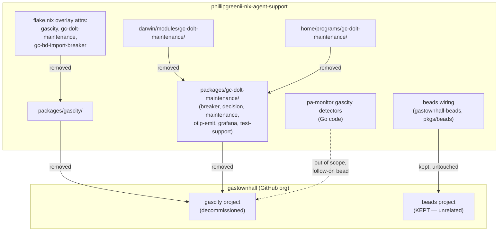

# Decommission gascity + gc-dolt-maintenance

**Status**: Accepted
**Date**: 2026-07-15
**Deciders**: Phillip Green II

## Context

`packages/gascity` packaged the upstream `gc` binary (the gascity background-agent
orchestrator) as a single source of truth for the workspace, consumed via
`overlays.default`. `packages/gc-dolt-maintenance` (plus its `breaker/`, `decision/`,
`maintenance/`, `otlp-emit/`, `grafana/`, and `test-support/` subtrees) built the
gascity-bead-import circuit-breaker (`gc-bd-import-breaker`) and the dolt-database
maintenance timer/OTel-emitter, and was wired into `darwin/modules/gc-dolt-maintenance/`
and `home/programs/gc-dolt-maintenance/`.

`update-locks.sh` already carried a `# DISABLED 2026-06-22` note on its `update-gascity`
step: gascity's modules were disabled downstream, and the latest upstream gascity release
requires a Go toolchain newer than what nixpkgs 26.05 / nixpkgs-unstable ship, making the
version bump unbuildable. The package was pinned at a stale buildable version with no
active consumer.

With gascity fully out of service workspace-wide, the package, its overlay wiring, and
everything that exists solely to support it (`gc-dolt-maintenance`,
`gc-bd-import-breaker`) are dead code: unreachable derivations that still evaluate, still
appear in `nix flake check`, and still have to be carried through every future refactor
for zero operational benefit.

`gastownhall` is the GitHub org that hosts **both** the gascity project (being
decommissioned here) and **beads** (`gastownhall-beads`), the issue tracker this
workspace depends on and continues to use for every repo, including this one. The two
are unrelated products sharing a host org; removing gascity MUST NOT be read as, or
executed as, touching beads.

pa-monitor (`packages/pa-monitor`) still carries Go-level `gascity` label-detection code
(`internal/labels/detectors/gascity.go` and its tests) and a Grafana panel description
mentioning gascity sessions. That is intentionally **out of scope** for this decision —
it is tracked as a separate, follow-on piece of work.

## Decision

The workspace MUST fully decommission gascity and everything that exists only to serve
it, in this repo (`phillipgreenii-nix-agent-support`):

1. `packages/gascity/` MUST be deleted, along with the `gascity` overlay attribute in
   `flake.nix` and every reference to it (`inherit (final) gascity`, `inherit (pkgs)
gascity`, and the `packages.<system>.gascity` export).
2. `packages/gc-dolt-maintenance/` MUST be deleted in its entirety — including its
   `breaker/`, `decision/`, `maintenance/`, `otlp-emit/`, `grafana/`, and
   `test-support/` subtrees — because every one of those subtrees exists solely to
   support gascity's dolt-backed bead import and maintenance workflow.
3. `darwin/modules/gc-dolt-maintenance/` and `home/programs/gc-dolt-maintenance/` MUST
   be deleted, and their imports MUST be removed from `darwin/default.nix` and
   `home/default.nix` respectively.
4. The `gc-dolt-maintenance` and `gc-bd-import-breaker` overlay attributes, their
   `checks` wiring, and their `packages.<system>` exports MUST be removed from
   `flake.nix` — `gc-bd-import-breaker` exists only to gate gascity's bead import and
   has no reason to exist once gascity is gone.
5. The disabled `update-gascity` step (and its dangling rationale comment) MUST be
   removed from `update-locks.sh` rather than left as inert dead code.
6. Comments elsewhere in the tree that reference gascity or `gc-dolt-maintenance` purely
   as a description of prior behavior (e.g. `packages/pg-pr/cmd/pg-pr/changes.go`,
   `darwin/modules/ollama/default.nix`) MUST be updated so they no longer dangle on a
   removed subject.
7. Any `beads` / `gastownhall-beads` / `pkgs/beads` reference, and any `beads`-input
   flake wiring, MUST NOT be touched by this decision — beads is a distinct, actively
   used product that happens to share a GitHub org with gascity.
8. pa-monitor's Go-level gascity label detectors and its Grafana panel copy are
   explicitly OUT OF SCOPE here; they MAY be removed by separate, dedicated follow-on
   work, not folded into this decommission.

## Consequences

### Positive

- `nix flake check` no longer evaluates or builds dead derivations
  (`gascity`, `gc-dolt-maintenance`, `gc-bd-import-breaker`) that had no live consumer.
- `update-locks.sh` no longer carries a disabled step whose own comment already
  documented that it was unbuildable and unconsumed.
- Future contributors reading `darwin/default.nix`, `home/default.nix`, or `flake.nix`
  no longer have to reason about a module family that was already effectively dead.

### Negative

- If gascity (or an equivalent orchestrator) is reintroduced later, the package,
  overlay wiring, and the dolt-maintenance/breaker circuit have to be rebuilt from
  scratch rather than re-enabled — there is no dormant module to flip back on.
- ADRs 0007, 0009, and 0011 still describe gascity as a live mixed-mode actor
  (alongside claude sessions and human CLI use) in their Context/Decision sections;
  those historical records are intentionally left unedited (ADRs are a record of the
  decision at the time it was made, per `docs/adr/0000-use-architecture-decision-records.md`),
  so a reader of those three ADRs alone would not know gascity has since been removed
  without also consulting this ADR.

### Neutral

- pa-monitor's Go-level gascity workspace-scope detector and its Grafana panel text are
  unaffected by this ADR and remain exactly as they were; removing them is deferred to
  separate follow-on work.

## Related

- Supersedes in part [0007](0007-pg-pr-go-cli-consolidation.md) (pg-pr Go CLI
  consolidation) and [0009](0009-pg-pr-bead-schema.md) (pg-pr bead schema): both
  describe gascity as one of the mixed-mode actors (alongside claude sessions and human
  CLI use) sharing pg-pr's bead-driven workflow. That assumption no longer holds — pg-pr
  and its bead schema remain valid for the actors that are still live (claude sessions,
  human CLI use); the gascity actor is removed. Those ADRs are left unedited as a
  historical record.
- Supersedes in part [0011](0011-pa-monitor-daemon-otel-split.md) (pa-monitor Daemon +
  OTel Split): its rejected-alternatives section discusses a `gascity.*` OTel label
  namespace in the context of an active gascity consumer. The namespace question is now
  moot for this repo's overlay/package surface (though pa-monitor's Go-level gascity
  label detector itself is untouched here — see Context above).
- `docs/adr/0000-use-architecture-decision-records.md` (ADR process: historical ADRs are
  not rewritten).
