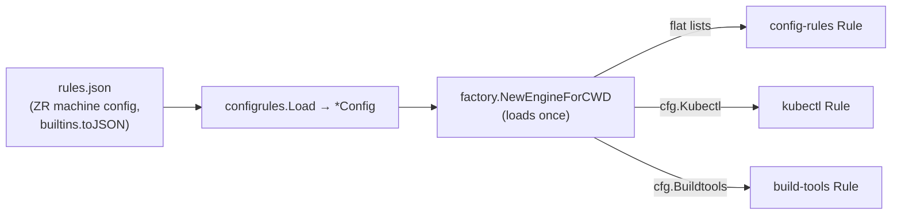

# CETA: Config-Driven kc/kubectl + build-tools Rules (No ZR Literals in the Base)

**Status**: Accepted
**Date**: 2026-07-25
**Deciders**: phillipg

## Context

ADR [0004](0004-ceta-configrules-xdg-config-for-consumer-rules.md) extracted the
_flat_ consumer command lists (`approvedCommands` / `blockedCommands`) into
`$XDG_CONFIG_HOME/claude-extended-tool-approver/rules.json`, consumed by the
`config-rules` rule. It did NOT cover two rules that still hardcoded
employer-specific (ZR) literals in the base Go source:

- **`kubectl`** — the `kc` executable alias, the kc-plugin verbs
  (`wslogs`/`toollog`/`wsfirstpod`, `exe`/`shell`/`wsexec`,
  `sync`/`syncdev`/`workspace`), the personal dev-workspace prefix `d-`, the
  `KC_CLUSTER` env var and its `d1-`/`dd1-` dev-cluster prefixes, the `--ws`/
  `--workspace` kc-plugin flags, and the non-dev AWS account names.
- **`build-tools`** — the Perl runners `prove`/`yath`, `generate-build-deps`,
  and five project scripts (`proto-regenerate.sh`, `pre-merge-protobuf-check`,
  `fix-ai-tools-ownership`, `pre-merge-py-check`, plus `generate-build-deps`),
  several of which were _also_ duplicated in the flat `approvedCommands`.

The flat `config-rules` schema cannot express these: it matches only
`filepath.Base(executable)` and, critically, **abstains whenever the command
carries any environment-variable prefix** (`len(EnvVars) > 0`) — but kc dev-scope
detection is entirely env-driven (`AWS_PROFILE`/`KC_CLUSTER`), so routing kc
through the flat matcher would defeat dev-scope entirely.

## Decision

Extend `configrules.Config` into the single, auditable **schema** for all
consumer rule extensions, and consume the two structured blocks via **Dependency
Injection** rather than a second config-reader:

1. **Schema (in `configrules`).** Grow `Config` with structured `kubectl {}` and
   `buildtools {}` sub-objects (`KubectlConfig` / `BuildtoolsConfig`), alongside
   the existing flat lists. Add an exported loader `Load(path) *Config` (and
   `DefaultPath()`), returning the whole config; the flat `config-rules` `Rule`
   is now built from it via `NewFromConfig(*Config)`.

2. **Injection (in `factory.go`).** `NewEngineForCWD` loads the config **once**
   and injects the sub-configs into the rule constructors — signatures change to
   `kubectl.New(eval, pe, cfg.Kubectl)` and `buildtools.New(cfg.Buildtools)`.
   The rules keep their base generic behavior as compiled-in defaults and treat
   the injected config as **additive** (an empty config MUST leave base behavior
   unchanged).

3. **The kubectl block is evaluated BY the kubectl rule**, never by the flat
   `config-rules` matcher — so the `len(EnvVars) > 0` abstain does not defeat the
   env-driven dev-scope detection. `AWS_PROFILE` stays a hardcoded (generic) env
   var; only the non-dev _account names_ are config.

4. **The five duplicated scripts move to `buildtools.approvedScripts`** and are
   **removed from the flat `approvedCommands`**. Because the `build-tools` rule
   ignores env-var prefixes, `FOO=bar proto-regenerate.sh` still approves —
   whereas the flat matcher would abstain on the env prefix. `prove`/`yath`/
   `generate-build-deps` were Go-only before, so the ZR `buildtools {}` block
   MUST newly author them or ZR loses their approval.

### Generic-vs-consumer boundary

- **kubectl STAYS base-generic**: `kubectl` executable + `*kubectl` suffix, the
  standard read-only verbs, `rollout status`/`history`, `exec`, generic
  `-n`/`--namespace`; modifying verbs abstain.
- **kubectl MOVES to config**: `executableAliases`, `readOnlyVerbs`, `execVerbs`,
  `scopedApproveVerbs`, `positionalWorkspaceVerbs`, `devWorkspaceFlags`,
  `clusterEnvVar`, `devClusterPrefixes`, `devWorkspacePrefix`, `nonDevAccounts`.
- **build-tools STAYS base-generic**: `go`, `gradle`, `gradlew`, `pre-commit`,
  `prek`, `bats`, `bd`, `tilt`, plus `devbox search` / `cue vet` / `jar xf`.
- **build-tools MOVES to config**: `approvedTools` (`prove`/`yath`),
  `approvedScripts` (the five scripts), and an additive `verbScopedApprovals`
  schema for future consumer verb-scoped tools.

### `positionalWorkspaceVerbs` (load-bearing)

`sync`/`syncdev` read the dev workspace as a **bare positional** argument
(`kc sync -f <path> d-phillipg01`), whereas `workspace` reads it from a
`--ws`/`-n` flag. This is a distinct config key from `scopedApproveVerbs`;
without it, positional dev-scope would require a `d-` literal baked into the
base and would collide with the no-ZR-literals guard.

## Consequences

### Positive

- The base CETA binary carries **no ZR literals** in `kubectl`/`build-tools`;
  behavior is fully config-driven and identical across consumers with the same
  config. A config-fixture-driven **golden set** preserves the pre-refactor
  verdicts exactly, and empty-config guards (plus a source scan) prove the base
  abstains on `kc`/`d-`/`wslogs`/`prove`/`zr-*`.
- One auditable schema (`configrules.Config`) holds every consumer extension.

### Negative

- `kubectl.New`/`buildtools.New` signatures changed; every call site
  (`factory.go`, tests) MUST pass the injected config. A rule now imports the
  `configrules` package for the config type.
- The ZR schema in `rules.json` remains machine-local and **untyped** (no typed
  home-manager module option). This was a deliberate pragmatic choice; a typed
  option MAY be added later.

### Neutral

- Config absence remains a no-op (base generic behavior) — safe to deploy the
  binary on machines without the file, exactly as in ADR 0004.

## Alternatives Considered

- **Each rule reads `rules.json` itself.** Rejected: three readers, three parse
  points, and no single injection seam; DI keeps a single load and testable
  seams.
- **A new shared package for the schema type.** Rejected: ADR 0004 already
  established `configrules` as the consumer-config home; growing it keeps the
  schema in one auditable place.
- **Route the kubectl block through the flat `config-rules` matcher.** Rejected
  as unworkable: its `len(EnvVars) > 0` abstain would defeat the env-driven kc
  dev-scope detection (decision #3).
