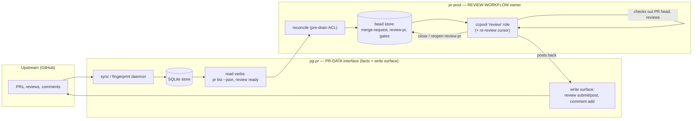

# pg-pr / pr-pool review-ownership split: pg-pr is the PR-data interface, pr-pool owns the review workflow

**Status**: Proposed
**Date**: 2026-07-25
**Deciders**: Phillip Green II

## Context

Historically `pg-pr` owned both **PR data** (syncing GitHub facts into a local store) **and**
the **review workflow** (an in-daemon draft-review consumer: `reviewHookCycle` → mine/team
sinks → GitHub PENDING posts → `reopenStaleReviews` → a 3-strike dead-letter). Meanwhile
`pr-pool` had grown into a generic drain-based orchestrator (see
[0026](0026-pr-pool-behavior-scope-orchestrator-only.md): pr-pool is a bare orchestrator that
runs queries, dispatches roles through an agent-runner under a budget, and drains to empty).
Running review workflow inside the `pg-pr` daemon coupled backend-agnostic PR-data concerns to
a specific review lifecycle and put a second workflow engine beside pr-pool.

The epic **pg2-ynhr** refactored this boundary: make `pg-pr` a pure, backend-agnostic **PR
DATA interface** (pull facts + accept write-backs) and move **all** review workflow + bead
lifecycle into `pr-pool`. The split is implemented and shipped in the built-in defaults
(children `pg2-ynhr.1`/`.11`/`.2`/`.3` closed; `.4` transition; `pg2-3ho1r` flipped the
resting default). This is a structural ownership change that establishes the pattern future
review-adjacent work follows, which per the ADR process ([0000](0000-use-architecture-decision-records.md))
warrants a record — but none exists. The living implementation reference
[`docs/pr-review-flow.md`](../pr-review-flow.md) currently cites only the epic and in-repo
specs, not an ADR. This ADR records the decision, its rationale, and the kill-switch/strip
transition mechanism.

A hard constraint drove the transition design: exactly **one** review owner may be active
against a given shared bead store. Running the legacy `pg-pr` hook and the `pr-pool` review
role concurrently double-writes that store (design hazard **H1**, bead `pg2-3ho1r`).

### The split, concretely

## Decision

**Split review ownership: `pg-pr` is the backend-agnostic PR-data interface; `pr-pool` owns
the entire review workflow and its bead lifecycle.**

### `pg-pr` — the PR-data interface

- `pg-pr` **MUST** confine itself to PR **data**: syncing GitHub facts into its store, exposing
  read verbs, and accepting write-backs. It **MUST NOT** drive review workflow in the intended
  end state.
- The read seam **MUST** be network-free and side-effect-free: `pg-pr pr list --json` (base,
  no `--reviewers`) **MUST** read from the store with no network call and no store mutation
  (`packages/pg-pr/cmd/pg-pr/pr_list.go`; consumed by `pr-pool` at `packages/pr-pool/internal/prpoolacl/acl.go`).
- The write surface — `pg-pr review submit` / `review post` / `comment add`
  (`packages/pg-pr/cmd/pg-pr/review.go`) — **MUST** remain the sole path through which `pr-pool` posts review
  output upstream. Inline comments **MUST** anchor to the reviewed head SHA (`commit_id`) so a
  head advance does not 422 (`packages/pg-pr/pkg/provider/vcs/github/github.go` `PostReview`).
- `pg-pr` **MUST** remain the **sole creator** of `merge-request` beads
  (`packages/pg-pr/cmd/pg-pr/pr_write.go`); `pr-pool` reconcile **MUST** only find-or-reuse them, never create
  them.
- Posted bodies **MUST** continue to carry the visible + invisible attribution
  ([0023](0023-agent-pr-comments-visible-bot-attribution.md)); that decision is unchanged by
  this split.

### `pr-pool` — the review-workflow owner

- `pr-pool` **MUST** own review selection, the `review-pr` bead lifecycle, execution, and the
  re-review cursor. It **MUST** derive its work solely from `pg-pr` facts via the read seam —
  it **MUST NOT** reach GitHub directly for review data.
- A **pre-drain reconcile ACL** (Anti-Corruption Layer, `packages/pr-pool/internal/prpoolacl/acl.go`,
  `packages/pr-pool/cmd/pr-pool/reconcile_cmd.go`) **MUST** idempotently project `review-pr` beads (+ a
  `pg-pr:active-pr` gate) from the `pr list --json` snapshot. It **MUST** be idempotent
  (find-or-reuse), **MUST** create the gate on the birth path and resolve it in a **separate**
  pass (so a crash between create and resolve self-heals), and **MUST** exit `0` on
  partial/transient `pg-pr` failure (a `pr list` failure is treated as zero PRs) so the
  following drain is never stranded.
- Execution **MUST** run through the built-in ccpool **`review` role**
  (`packages/pr-pool/internal/roles/builtin.go`), which ships `Enabled: true`, selects beads by the
  `review-pr: ` title prefix, checks out the untrusted PR head in a **per-bead scratch
  worktree** (`packages/pr-pool/internal/worktree/worktree.go`), reviews it, posts back via `pg-pr review
submit`, and closes the bead. A failing review **MUST** escalate via a `human` label
  (`OnFailure=AddHuman`) rather than silently retry.
- The **re-review cursor** on the `review-pr` bead is authoritative and lives in the ACL
  (`packages/pr-pool/internal/beads/issue.go` `ReopenReview`): a closed `review-pr` bead **MUST** be reopened
  **only** when the PR `head_sha` differs from the bead's recorded `head_sha` and **both** are
  non-empty; on reopen `head_sha`/`branch` **MUST** be overwritten and the assignee cleared; a
  bead with no recorded `head_sha` **MUST NOT** be resurrected.
- Consistent with [0026](0026-pr-pool-behavior-scope-orchestrator-only.md), the **generic**
  `pr-pool` code and behavior docs **MUST** stay tool- and deployment-agnostic; the concrete
  review _workflow_ semantics (what a good review is, which tool fills each contract) belong to
  the deployment overlay, not this repo.

### Transition: the `review.enabled` kill switch, and the deferred strip

The two implementations coexist during migration; the transition is governed by a single kill
switch **on the legacy `pg-pr` side only** (scope below), and the legacy code strip is
deferred.

- `review.enabled` is a **tri-state pointer** whose resting default is **`false`**
  (`packages/pg-pr/internal/config/config.go` `ReviewConfig`/`ReviewEnabled`): a `nil` config, an absent
  `review` section, or an absent `enabled` key all resolve to `false`. A bare consumer that
  materializes no `pg-pr` config therefore gets the legacy path **off** by default.
- When `review.enabled=false`, the kill switch **MUST** disable the **entire** legacy `pg-pr`
  review chain — **both** ends:
  - **Producer:** the beadsbridge stops producing `draft-review` beads on `pr.opened`/`updated`
    (`packages/pg-pr/cmd/pg-pr/sync.go` → `beadsbridge.WithoutDraftReviews()`); `merge-request` /
    attention / process-feedback beads are still produced.
  - **Consumer:** the hook's deps are wired **unconditionally** at startup
    (`SetReviewHook` in `packages/pg-pr/cmd/pg-pr/sync.go` `syncCmd`); the gate is a **live-config
    check per poll** — `reviewHookEnabled()` re-reads `review.enabled` each cycle
    (`packages/pg-pr/internal/sync/reviewhook.go` `reviewHookEnabled`), so it stays false and no
    `reviewHookCycle` runs while the switch is off, and a flip takes effect on the next poll
    without a daemon restart (`pg2-bw30`).
- What **MUST** stay active regardless of the switch: PR-data sync and the read/write CLI
  surface that `pr-pool` depends on. The kill switch gates **only** the legacy review
  workflow, never the PR-data interface.
- **Scope: `review.enabled` is `pg-pr`-scoped, NOT system-wide.** It gates `pg-pr`'s own
  review chain and nothing else. `pr-pool`'s reconcile ACL
  (`packages/pr-pool/cmd/pr-pool/reconcile_cmd.go` `reconcileACL` →
  `packages/pr-pool/internal/prpoolacl/acl.go` `Reconcile`) is an **independent producer** of
  review work (`review-pr` beads) that this switch deliberately **MUST NOT** gate:
  `review.enabled=false` is precisely the state in which `pr-pool` is the intended **sole**
  review owner, so gating the ACL on it would leave **zero** review owners at the resting
  default and invert the single-owner property this transition exists to establish.
- **Mechanism: `pr-pool` does not learn the switch state, and MUST NOT.** The only seam
  between the two tools is the `pg-pr pr list --json` CLI
  (`packages/pg-pr/cmd/pg-pr/pr_list.go` `prListCmd` →
  `packages/pr-pool/internal/prpoolacl/acl.go` `ReadPRList`). It carries PR **facts** only
  (`prpoolacl.PR`) and **MUST NOT** be extended to carry `pg-pr` configuration state — that
  would recouple the two owners the split separated.
- **Cutover rule:** the `pg-pr` review hook **MUST** be off (`review.enabled=false`) **before**
  `pr-pool` drains against the same shared bead store. As of `pg2-3ho1r` this is the built-in
  default, so the hazard to avoid is **re-enabling** the legacy path against a store `pr-pool`
  also drains — not the default state. Enabling **both** owners against one shared store is
  prohibited.
- The **full code strip** of the legacy `pg-pr` review path (and the mine-path store→beads
  relocation) is **deferred** to `pg2-ynhr.5`. Until then `review.enabled` **MUST** remain the
  opt-in switch that can re-enable the legacy path for rollback, and it **MUST NOT** be removed
  before that strip lands.

## Consequences

### Positive

- Clean separation of concerns: `pg-pr` is a reusable, backend-agnostic PR-data interface;
  `pr-pool` is the single review-workflow engine, reusing its generic orchestrator
  ([0026](0026-pr-pool-behavior-scope-orchestrator-only.md)) instead of a second bespoke
  engine inside the `pg-pr` daemon.
- The resting-safe default (`review.enabled=false`) yields a **single** review owner with no
  out-of-repo override required, closing the double-write hazard (H1 / `pg2-3ho1r`).
- The re-review cursor, reconcile idempotency, and gate-resolve-in-a-separate-pass give a
  crash-safe, self-healing projection from PR facts to review work.
- Review output still funnels through one write surface with attribution and `commit_id`
  anchoring preserved.

### Negative

- Two review implementations exist simultaneously until the strip (`pg2-ynhr.5`), so the
  kill switch and its cutover discipline are a standing operational hazard if misconfigured.
- **There is no single switch that stops all review work.** Because the switch is
  `pg-pr`-scoped (above), `review.enabled=false` silences `pg-pr` only; `pr-pool` keeps
  producing `review-pr` beads. An operator who wants **no** review work produced must
  additionally stop `pr-pool`: stop invoking `pr-pool reconcile` (the ACL runs **only** inside
  that verb — `packages/pr-pool/cmd/pr-pool/main.go` `main`; the verb takes no flags
  (`packages/pr-pool/cmd/pr-pool/args.go` `parseReconcileArgs`) and there is no config key
  that disables the ACL), and declare the `review` role with `enabled = false` in
  `<RepoRoot>/.pr-pool/config.toml` so already-emitted `review-pr` beads are not drained
  (`packages/pr-pool/internal/config/registry.go` `buildRole`;
  `packages/pr-pool/internal/roles/builtin.go` `BuiltinRoleSet` — start from
  `pr-pool config --print-defaults`, since a config file's `[[role]]` array **replaces** the
  built-in set rather than overlaying it). That is two levers in two
  tools, by design — unifying them is out of scope for a transition switch that disappears at
  the strip.
- Reviewed-state is tracked in **two unsynchronized stores** during the transition — `pg-pr`
  on the SQLite revision (`reviewed_by_agent_at`) and `pr-pool` on the bead `head_sha`; only
  the **active** owner's cursor is authoritative.
- Known parity gaps carried by path B: there is no classic dead-letter in the `pr-pool` review
  path (failures escalate via `human` label instead). Skip-if-present is **no longer** a gap —
  `postStaged` (`packages/pg-pr/cmd/pg-pr/review.go`) now owns the viewer-pending guard
  (`skipExistingPendingReview`, fail-closed) at the choke-point both `review post` and
  `reviewSubmitCmd` funnel through, so a re-run does not stack a second PENDING review
  (`pg2-3fo3c`, closed).
- Review-executor **isolation** is only partially satisfied — the tool allowlist is
  pool-wide (not per-role) and still permits code-executing verbs on untrusted checked-out
  content, and the session inherits ambient credentials with no scrub (`pg2-f9vcg`,
  `pg2-jpfw.9`).

### Neutral

- `review.enabled` becomes a rollback lever, not a feature flag, for the life of the
  transition; it disappears when the strip lands.
- Live end-to-end verification of path B is deploy-gated (`pg2-ynhr.16`) and not completable
  in a worktree; this ADR records the decision, not that verification.
- Legacy old-schema held dead-letter beads are reconciled separately at cutover
  (`pg2-ynhr.10`, deferred).

## Alternatives Considered

### Keep review workflow inside the `pg-pr` daemon

Rejected. It couples backend-agnostic PR-data concerns to a specific review lifecycle and
maintains a second workflow engine beside `pr-pool`, duplicating drain/role/budget machinery
that `pr-pool` already provides generically.

### Hard cutover — delete the legacy path in the same change as the split

Rejected. A tri-state kill switch defaulting off gives a single-owner resting state
**and** a rollback lever while path B parity/isolation work (`pg2-3fo3c`, `pg2-f9vcg`,
`pg2-jpfw.9`, `pg2-ynhr.16`) completes. The strip is sequenced after, as `pg2-ynhr.5`.

### Let both owners run and de-duplicate downstream

Rejected. Two writers against one shared bead store is the H1 double-write hazard; a
skip-if-present/dedup layer is a mitigation, not a boundary, and would not make concurrent
ownership safe.

## Related Decisions

- [0026](0026-pr-pool-behavior-scope-orchestrator-only.md) — pr-pool as a bare orchestrator;
  workflow/domain behavior is a deployment overlay. This split is the concrete review
  application of that model.
- [0009](0009-pg-pr-bead-schema.md) — the bead schema the `review-pr` / `merge-request` beads
  use.
- [0012](0012-pg-pr-fingerprint-driven-daemon-sync.md) — the fingerprint-driven roster
  detection that feeds the read seam.
- [0023](0023-agent-pr-comments-visible-bot-attribution.md) — attribution on posted
  reviews/comments, preserved by this split.
- Epic `pg2-ynhr` (split) and children `pg2-ynhr.1`/`.11`/`.2`/`.3`/`.4`, `pg2-3ho1r`
  (default flip); deferred `pg2-ynhr.5` (strip), `pg2-ynhr.10` (dead-letter reconcile).
- See also: [`docs/pr-review-flow.md`](../pr-review-flow.md) — the living implementation
  reference (`file:line` anchors, tests, transitional state).
