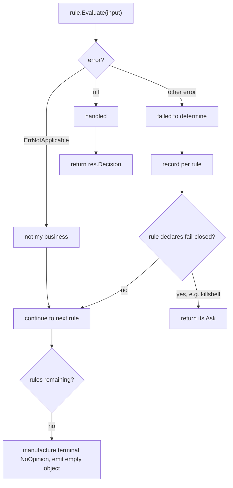

# CETA rule verdicts: separate "does not apply" from "no opinion" from "failed to determine"

**Status**: Accepted (resolves `pg2-4yy4r` item 1)
**Date**: 2026-07-30
**Deciders**: Phillip Green II

## Context

A rule module's entire vocabulary is one enum. `internal/hookio/types.go` declares:

```go
type RuleModule interface {
	Name() string
	Evaluate(input *HookInput) RuleResult
}

type RuleResult struct {
	Decision Decision // Approve | Abstain | Ask | Reject
	Reason   string
	Module   string
	Trace    []TraceEntry
}
```

`Decision` has one channel, and the rule chain needs it to answer three unrelated questions.
`internal/engine/engine.go`'s `Engine.Evaluate` uses `Abstain` for two of them, two lines apart in
control flow:

```go
if result.Decision != hookio.Abstain { // (1) LOOP SENTINEL: rule did not handle this
	// ...
	return result
}
// ...falls out of the loop...
result := hookio.RuleResult{Decision: hookio.Abstain} // (2) TERMINAL VERDICT: emit {}
return result
```

Role (1) is the only one a rule can produce. Role (2) is manufactured solely by the engine falling
off the end of the loop, so **a rule cannot express "I handled this and my answer is 'no opinion'"**
— that is byte-identical to "I am not involved."

A third meaning also rides on `Abstain`: **evidence-gathering failure**. The `gh` rule shells out
(`internal/rules/gh/resolver.go`'s `ExecBranchResolver.CurrentBranch` runs `git rev-parse` under a
timeout) and `internal/rules/gh/gh.go`'s `Rule.Evaluate` folds the failure into the sentinel,
discarding the error:

```go
currentBranch, err := r.resolver.CurrentBranch(input.CWD)
if err != nil {
	return hookio.RuleResult{
		Decision: hookio.Abstain,
		Reason:   "gh run rerun: cannot determine current branch",
		Module:   r.Name(),
	}
}
```

A fourth role exists inside `Engine.EvaluateExpression`, where several `Abstain`s are deliberate
**restrictiveness floors** rather than any of the above — see "The fold is a different machine".

### Error sites: 35 occurrences, and one deliberately fails closed

`grep -o 'err != nil'` over non-test files under `internal/rules/` yields **35** occurrences.
**28** of those produce a `RuleResult`: **27** return `Abstain`, and **one returns `Ask`** —
`internal/rules/killshell/killshell.go`'s `Rule.Evaluate`:

```go
if err := json.Unmarshal(input.ToolInput, &ti); err != nil || ti.ShellID == "" {
	return hookio.RuleResult{
		Decision: hookio.Ask,
		Reason:   "KillShell missing shell_id — cannot determine ownership",
		Module:   r.Name(),
	}
```

That rule's package doc states the intent — "the rule fails secure: Ask" — and
`internal/setup/factory.go`'s `RuleChain` repeats it. **This is a deliberate fail-closed path and it
MUST survive this ADR.** Note the form: `if err := f(); err != nil || ...`. A scan for the literal
`if err != nil` does not match it, which is how an earlier draft of this ADR wrongly concluded that
no fail-closed site existed.

The remaining 7 occurrences produce no verdict (resolvers in `gh` and `primarycommit`,
`configrules.Load`, `curl.allURLsAllowed`). Separately, `internal/rules/gitdir/gitdir.go` handles its
error with `break`, falling into that function's **shared** final `Abstain` return — so one literal
there carries both "no match" and "BashCommand failed".

### Why the missing verdict costs prompts

Because first-match-wins treats `Abstain` as "keep going", the only way an early-band rule can stop
a later rule from approving a leaf is to be decisive, i.e. `Ask`.

Measured 2026-07-30 by replaying the logged corpus through the engine as built from `main`:

```bash
# window: rows from the last 3 days; excluded=0 probe rows filtered by evaluate itself
claude-extended-tool-approver evaluate --days 3 --format json > replay.json
# then re-run each replay_result=="ask" row through the binary in hook mode and
# group on the FINAL permissionDecisionReason (not the first TRACE line)
```

268 rows replay to `ask`, attributed per site (the eight rows sum to exactly 268):

| Site                              | Asks |
| --------------------------------- | ---- |
| envvars: unevaluated-substitution | 115  |
| secrets                           | 59   |
| gitdir: read                      | 51   |
| pathtraversal                     | 17   |
| git: reset --hard                 | 10   |
| envvars: sensitive-var            | 8    |
| gh: pr create                     | 5    |
| git: destructive                  | 3    |

This is a **replay** count and MUST NOT be compared to a `SELECT COUNT(*) WHERE
hook_decision='ask'` over the same window — the logged rows were decided by older binaries. The
`envvars: sensitive-var` row is the clearest case: 44 logged, 8 on replay.

The top four (242) are cases where the rule genuinely cannot prove the leaf safe — a `.git/` read, a
secret-_shaped_ path, an unclassifiable `$(...)`. They ask because the vocabulary offers no
non-approving alternative, not because a human is wanted.

### Why widening `Approve` is not a general answer

Three beads closed on that axis (`pg2-qfuto`, `pg2-0q99a`, `pg2-5huwx`), taking `envvars:
sensitive-var` from 44 logged asks to 8 on replay. `pg2-0q99a`'s title records the constraint
plainly: "Abstain is NOT an option". That approach MUST remain preferred where a class is _provably_
benign (`pg2-0q99a` cleared 984 rows with 0 true positives). It does not extend to the 242, where
there is nothing to prove safe — widening `Approve` there would assert a safety property the rule
cannot demonstrate.

### Why a new decision level was rejected

`pg2-4yy4r` proposed a `Defer` level between `Abstain` and `Ask`. `types.go` warns against exactly
that: "Do not reorder without re-auditing the fold in internal/engine/engine.go and every
`Decision`-ordering comparison." Inserting a member renumbers the iota and changes the meaning of
every ordering comparison, including `MostRestrictive`.

That cost is an artifact of the framing. "Did this rule handle the input?" is **orthogonal** to "how
restrictive is the verdict?" The proposal pushed an orthogonal concern into a totally-ordered enum.
Separating the axes removes the cost: the restrictiveness order and `MostRestrictive` are untouched.

### Ordering dependencies run in BOTH directions

`internal/engine/engine_integration_test.go` and `internal/setup/factory.go`'s `RuleChain` encode two
opposite shapes, and the distinction decides every conversion:

**Shape A — an earlier rule MUST win.** The early band (`gitdir`, `secrets`, `envvars`,
`pathtraversal`) must stop `safecmds` from approving a leaf. A terminal verdict PRESERVES this
because it short-circuits. Converting such a site to the continue sentinel breaks it — this is
precisely the error in the refuted `Ask` -> `Abstain` design.

**Shape B — an earlier rule MUST NOT win.** `engine_integration_test.go`'s
`TestIntegration_KillShellThroughChain` has a subtest "does not shadow the later path-safety rule"
whose comment reads verbatim:

> `// ORDERING, the other direction: killshell precedes path-safety, and a non-Bash tool that path-safety owns must still reach it.`

`internal/rules/claudetools/claudetools.go`'s `Rule.Evaluate` is the same shape by design: it
abstains on `mcp__*`, on file tools and on search tools **specifically so** the later `pathsafety`
and `mcp` rules act. For Shape B a terminal `NoOpinion` is the BREAKING conversion and
`ErrNotApplicable` is the safe one — the exact inverse of Shape A.

### The fold is a different machine

The chain is first-match across rules, but `Engine.EvaluateExpression` folds leaves WITHIN one
expression via `hookio.MostRestrictive`, seeded at **`Approve`**. Inside a fold, "contribute
nothing" is `Approve`, not `Abstain`. Several of engine.go's `Abstain`s are floors that exist
because absence of evidence was once read as safety: `unparseableSubstitutionFloor`'s comment records
that reading the scan's silence as "nothing to object to" MANUFACTURED an `allow` (`pg2-wguam`), and
`isDynamicRedirectTarget` records the same class (`pg2-2u5jf`). Routing an error to "continue"
inside a fold would contribute `Approve` and reinstate both holes.

## Decision

Rules MUST report participation and failure out of band from the verdict.

```go
// ErrNotApplicable reports that this rule does not govern this input. It is a
// control signal, not a failure (cf. fs.SkipDir).
var ErrNotApplicable = errors.New("rule does not apply")

type RuleModule interface {
	Name() string
	Evaluate(input *HookInput) (RuleResult, error)
}
```

`Engine.Evaluate` MUST discriminate three cases at one chokepoint, and MUST still manufacture a
terminal `NoOpinion` when the loop is exhausted:



1. **`Abstain` MUST be renamed `NoOpinion`** as a Go identifier, and MUST mean only "handled, no
   opinion". It stays terminal and still emits `{}`, so auto-approve mode, then settings
   pre-authorization, then the prompt run in their documented order. This is the verdict the `Defer`
   proposal was reaching for. Its position in the restrictiveness order is UNCHANGED.
   **The serialized string MUST remain `"abstain"`.** Four non-test sites emit it —
   `hookio/types.go`'s `Decision.String`, `asklog/recorder.go`'s `hookDecisionString`,
   `cmd_evaluate.go`'s `decisionToDBString`, and `cmd_set_correct_decision.go`'s input allowlist —
   and the live log holds tens of thousands of rows keyed on that value. Renaming the string would
   break historical joins and the replay differential in Consequences.
2. **A site whose `Abstain` means "not mine" MUST return `RuleResult{}, ErrNotApplicable`.** A site
   whose `Abstain` exists so a **LATER** rule can act (Shape B) MUST become `ErrNotApplicable` and
   MUST NOT become `NoOpinion`. `claudetools`' abstains on `mcp__*` / file tools / search tools are
   named instances.
3. **A site that today returns `Ask` MAY become `NoOpinion` only when demonstrated.** The
   demonstration is operational and MUST be run per site: remove the rule from the chain and show
   the leaf then reaches `allow`. That proves the `Ask` exists to block a later approval (Shape A)
   rather than to request a human. A site that does NOT reach `allow` MUST keep its `Ask`.
4. **`Ask` and `Reject` MUST be retained** where the rule does have a strong understanding — real
   credentials, force-pushes, remote-ref deletion. `NoOpinion` is auto-approved in `auto` mode, so
   it MUST NOT be used for anything that must stop. `internal/rules/pathsafety/pathsafety.go`'s
   agent-config write branch MUST become terminal `NoOpinion` and MUST NOT become
   `ErrNotApplicable`: ADR 0041's Decision requires path-safety itself to stop approving, and its
   in-code comment notes that a preceding rule returning the continue sentinel would be a silent
   no-op.
5. **Wrapping `ErrNotApplicable` is FORBIDDEN.** It MUST be returned bare so `errors.Is` cannot be
   defeated, and MUST NOT be produced by `fmt.Errorf("%w")` anywhere. A wrap that buries it, or one
   that accidentally makes a genuine failure match it, is not a compile error and no test would
   catch it — the failure mode is a silent auto-approval.

### Error policy: continue by default, with a declared fail-closed carve-out

**A genuine error MUST result in `continue` in the first-match chain, EXCEPT where the rule's whole
purpose is an identity or ownership check it could not complete.** `killshell` is such a rule and
**MUST retain its `Ask`**; routing it to `continue` would yield `{}` and auto-approve the
termination of an unverifiable background shell in `auto` mode, which decision 4 forbids.

**Inside a `MostRestrictive` fold an error MUST contribute the `NoOpinion` floor, never the
`Approve` identity.** The fold's seed is `Approve`, so "continue" is not available there without
manufacturing an approval — see "The fold is a different machine".

Blanket fail-closed was considered and rejected. A rule that cannot gather evidence would emit
`Ask`, and evidence-gathering failures are transient and load-correlated (subprocess timeouts), so
they cluster exactly when an agent is busiest — regenerating the prompt-volume defect this ADR
exists to relieve.

This policy is **near**-behavior-preserving, not a no-op: 27 of the 28 verdict-producing error sites
already fold to `Abstain`, and `killshell` is the one exception, which this ADR preserves by name.
Because a corpus replay cannot reach rare error paths (subprocess timeout, malformed `tool_input`),
each error site MUST get a unit test asserting its post-change verdict. The replay differential
below MUST NOT be cited as evidence for the error paths.

**Genuine errors MUST be recorded per rule** so a systematically-failing resolver is detectable.
Today they are silent. The sink MUST be named in the implementing change — there is no `metrics`
package in this module today, so the implementer MUST either add one or extend `asklog`, and MUST
NOT leave the requirement satisfied by a stderr line alone.

### Alternatives considered for the participation channel

- **`(RuleResult, bool)` comma-ok.** More conventional Go for "does not apply", since `error`
  idiomatically means the operation failed; `internal/inputproc/inputproc.go` uses exactly this
  shape internally for the same problem. Rejected because it cannot also carry the third meaning:
  a genuine failure still has nowhere to go, so `Abstain` would remain overloaded with two meanings
  instead of three. `(RuleResult, bool, error)` was rejected as a three-value signature whose two
  out-of-band channels can disagree.
- **A `Handled bool` field on `RuleResult`.** Rejected because it is silently defaultable: a site
  that forgets it compiles and reads as not-handled. The interface change, by contrast, breaks every
  implementation at compile time.
- **A new enum member.** Rejected as described in "Why a new decision level was rejected".

The chosen design's cost is decision 5's unenforceable-by-compiler wrap hazard, accepted because
`error` is the only channel that carries participation and failure without adding a third return
value.

## Consequences

- The interface change breaks every implementation, so the compiler enumerates the 25 rules that
  MUST be visited. **`*engine.Engine` is an exception**: it structurally satisfies `RuleModule`
  today, so changing the interface silently un-satisfies it with no compile error. The implementer
  MUST verify the engine's own conformance explicitly.
- **A literal scan is NOT a sufficient audit.** There are 143 `Decision: hookio.Abstain` literals
  under `internal/rules/` and 11 in `internal/engine/`, but 17 further returns are aliased behind
  helpers (`return r.abstain()` in `ssh` and `vault`, `return abstain` in `primarycommit`) and are
  invisible to it. A literal reached by two different meanings — `gitdir`'s shared final return —
  MUST be split before conversion.
- `hookio.Evaluator.EvaluateExpression` returns a bare `RuleResult`, and `nix`, `docker` and
  `kubectl` return a recursion result directly as their own verdict while `envvars` folds it. The
  implementing change MUST state how a recursing rule translates an inner error, or an inner
  `ErrNotApplicable` and an inner genuine failure will arrive indistinguishable — the very defect
  this ADR removes, preserved at the recursion boundary.
- **Per-site attribution does not exist today and is a BLOCKING prerequisite.**
  `cmd/claude-extended-tool-approver/cmd_evaluate.go`'s `evalResult` carries neither `Module` nor
  `Reason`, and `asklog.ApprovalSource` never sees either. So the replay tool cannot execute
  decision 3's per-site demonstration, and could not have produced the ask table above unaided.
  `evaluate`'s output MUST be extended to carry `Module` and `Reason` BEFORE any conversion under
  decision 3.
- The rename MUST land as its own commit with no decision change, verified by a full-corpus replay
  differential that comes back byte-identical. **Its blind spots MUST be disclosed**: `runEvaluate`
  builds the engine via `setup.NewEngineForCWD`, so the shell store is nil and `killshell` behaves
  differently than in production, and the synthetic input omits `PermissionMode`, so
  `primarycommit`'s mode-gated branch cannot fire. Those two rules MUST be covered by unit tests
  instead.
- Each `NoOpinion` conversion under decision 3 MUST land separately with its own before/after
  measurement. They MUST NOT be batched — the two ordering shapes make per-site evidence the only
  way to attribute a regression.
- The ordering tests are the guard rail for those conversions and MUST continue to pass unmodified.
  A conversion that requires editing one is a signal the conversion is wrong. The error-policy
  carve-out for `killshell` exists precisely so this ADR does not itself require editing
  `TestIntegration_KillShellThroughChain`.
- `Approve` is currently the zero value of `Decision`, so `RuleResult{}` is a silent auto-approval
  held safe only by a standing audit. Under this decision a not-applicable return is
  `RuleResult{}, ErrNotApplicable` and the engine ignores the struct when the error is non-nil, so
  the zero value stops being reachable as a verdict. Making `NoOpinion` the zero value would retire
  the audit obligation outright and SHOULD be considered separately.
- `git`- and `gh`-family rulings need none of this. Probes confirm `safecmds` does not approve those
  commands, so a plain non-decisive verdict already reaches `{}`: `git bisect start`,
  `git notes list`, `gh browse` and `gh pr merge --auto` all emit `{}` today. Those rulings are
  implementable independently and MUST NOT be sequenced behind this ADR.
