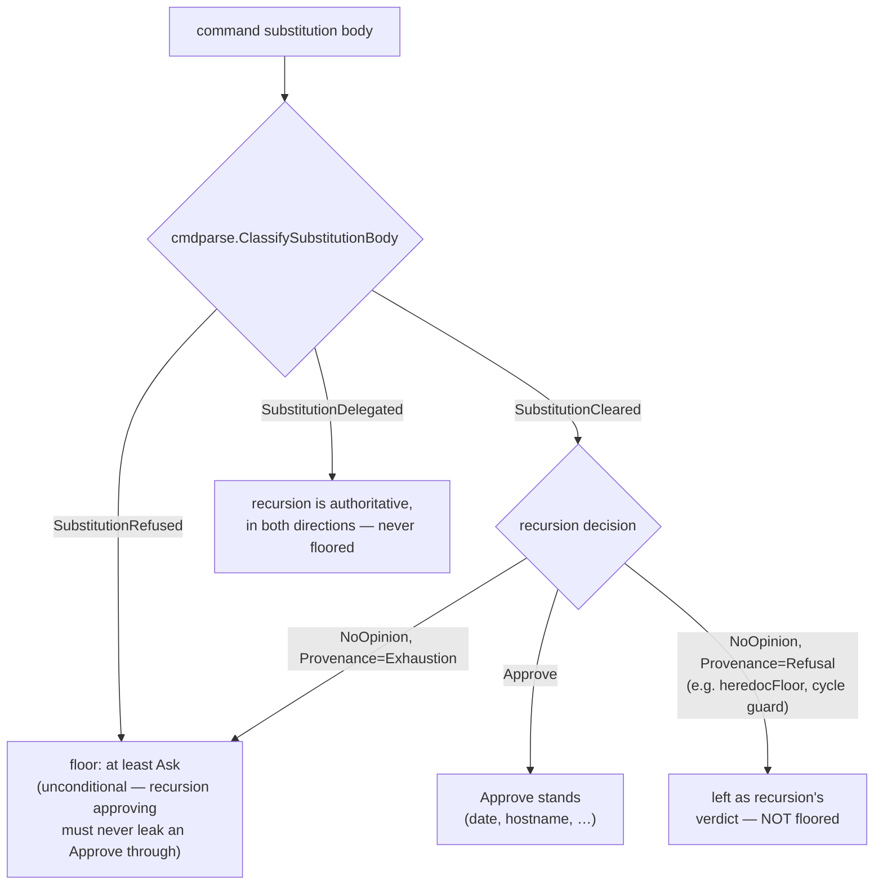

# CETA never clears the exhaustion half of a captured substitution (harmonize up)

**Status**: Accepted (resolves `pg2-gwp57`); Decision item 1 IMPLEMENTED 2026-08-19 (`pg2-whumr`)
**Date**: 2026-08-13 (operator ruling; recorded as an ADR 2026-08-17, previously held in a bd memory)
**Deciders**: Phillip Green II

> **Later note (2026-08-19, `pg2-whumr`).** Decision item 1 — "the COMMAND-position
> substitution floor MUST be RAISED" — is now IMPLEMENTED, measured, and left in a worktree
> for landing. `pg2-phtl3` (landed `dd50eb6c`) cleared the benign cohorts this ruling's
> command-position floor would otherwise have turned into prompts, which is what unblocked
> this item. See "Implementation" and "Consequences" below for the mechanism and the
> replay-gate measurement; the LANDING decision (whether the measured residual prompt volume
> is acceptable now, or should wait on `pg2-1019a`/`pg2-x9452`'s pipeline relief) is left to
> the orchestrator/operator and is NOT settled by this note.

## Context

Exhaustion means "ceta has no model for this command" (vocabulary: ADR 0043/0044). ceta models NO
interpreter, so `X=$(bash -c "rm -rf /")`, `X=$(python3 -c ...)`, `X=$(ssh host ...)`, and
`X=$(curl evil)` are exhaustions EXACTLY like `X=$(seq 1 3)` — the exhaustion half IS arbitrary
code execution, and it is not separable by provenance (ADR 0044).

At ruling time the two positions diverged: env-value position gave a decisive Ask while
command-position substitutions could reach `NoOpinion` — and ADR 0043 states `NoOpinion` is
auto-approved in auto mode, so `echo $(bash -c "rm -rf /")` was PERMITTED. A live hole, not a
hypothetical.

## Decision

ceta MUST NOT clear the EXHAUSTION half of a captured substitution. Consequences:

1. The COMMAND-position substitution floor MUST be RAISED so
   `echo $(bash -c "rm -rf /")` stops reaching `NoOpinion`.
2. env-value position keeps its decisive Ask; the two positions converge UPWARD, never downward.
3. Relieving prompt volume by widening the static safe-substitution allowlist for an exhaustion
   body is FORBIDDEN by this ruling; `pg2-xl79d`'s exhaustion cohort (`seq`, `[`) is therefore
   not clearable.
4. A REFUSAL body MUST NOT be cleared either (`pg2-2ke04`/`pg2-2u5jf`).

## Rejected alternatives

- **Harmonize DOWN**: would relieve 214 of 1647 env-vars asks but EXTENDS the auto-mode hole into
  env-value position.
- **Ratify the asymmetry**: freezes the command-position hole and grows the allowlist per
  basename forever.

## Implementation (`pg2-whumr`, 2026-08-19)

`internal/engine/engine.go`'s `foldSubstitutionScan` gains `commandSubstitutionFloor`, a floor
folded through `hookio.MostRestrictive` alongside the existing `unparseableSubstitutionFloor` and
`heredocFloor` (same file, same idiom — SEEDED, folded, never returned early, so it stays
order-independent). A command substitution ($()/backtick) reaches `Approve` only when BOTH gates
positively clear it — the static safe-substitution seam (`cmdparse.ClassifySubstitutionBody`) did
NOT refuse it, AND full-engine recursion of the body independently approved it — or its
contribution is no LESS restrictive than a decisive `Ask`:

Two refinements the ruling's text did not spell out, found while implementing and measuring:

1. **A `SubstitutionCleared` body can ALSO be an exhaustion.** `seq` and `mktemp` are on
   `cmdparse`'s static allowlist precisely BECAUSE no rule approves them standalone — env-value
   position's `ExpansionSafeCmd` fast path exploits that by skipping recursion entirely, but
   command position always recurses, so `echo $(seq 1 3)` / `echo $(mktemp)` reached recursion's
   own terminal exhaustion `NoOpinion` with nothing left to raise it: the SAME auto-approved
   hole this ADR closes for `SubstitutionRefused` bodies, wearing a different clearance. The
   floor now applies there too, GATED ON `Provenance == ProvenanceExhaustion` specifically (ADR 0044) so it does not also catch a `SubstitutionCleared` body some OTHER mechanism already
   examined and declined for its own recorded reason — a quoted-heredoc-into-`cat` body
   `pg2-phtl3` admitted onto this list still recurses through `heredocFloor()`'s own
   unconditional `NoOpinion` (`pg2-u65fu`'s own, separately-scoped gap), and the
   substitution-cycle guard's `NoOpinion` is the same shape. Both are `ProvenanceRefusal`, not
   `ProvenanceExhaustion`, so this floor correctly leaves them alone.
2. **`SubstitutionDelegated` still never floors**, exactly as the pre-existing
   `foldSubstitutionScan` comment already documented for the narrower `SubstitutionRefused`-only
   floor this supersedes — but see "Known, out-of-scope asymmetry" under Consequences: that
   design choice has a real, measured cost this ADR does not close.

### Fixture: the relation, not a verdict table

`internal/engine/whumr_position_relation_test.go` asserts the ruling's actual invariant — for a
given substitution body, COMMAND position is never LESS restrictive than ENV-VALUE position — as
a property over a body corpus (`TestWhumr_CommandPositionNeverLessRestrictiveThanEnvValue`) and as
a native Go fuzz target
(`FuzzWhumr_CommandPositionNeverLessRestrictiveThanEnvValue`, 632k+ executions, zero violations)
so the relation survives retuning either side, per the acceptance criteria. A second test,
`TestWhumr_EnumeratedDangerousBodiesNeverAutoApprove`, pins acceptance criterion 1 directly:
every body `pg2-gwp57` names verbatim (`bash -c`, `sh -c`, `python3 -c`, `node -e`, `ssh`,
`npm install`, `curl`, `crontab -r`, `mount`) reaches a decisive `Ask`, never `Approve` or
`NoOpinion`, in command position.

## Consequences

- **Existing fail-closed suites pass unmodified**: `pg2-d0ja3`'s
  `FuzzADR0044_EnvValueIsNeverLessRestrictiveThanItsBody` (666k+ fuzz executions) and
  `TestADR0044_ExhaustionVsRefusal`, and `pg2-zpct4`'s
  `TestZpct4_CapturedReadIsNeverLooserThanTheBareRead` /
  `TestZpct4_UnclassifiablePathCannotReachApproveThroughASubstitution`, all pass with NO edits.
  A handful of pre-existing verdict-table rows in `engine_test.go` / `engine_integration_test.go`
  DID need updating — every one is a row this ADR's own floor directly retargets from `NoOpinion`
  to `Ask` (e.g. `TestIntegration_F3NextFreeIdProbeStillPrompts`, the `git ls-files`/`-c
core.fsmonitor` rows of `TestIntegration_FsmonitorReachingGitReadsApprove`, and the heredoc/
  pipeline rows of `TestIntegration_UnparseableSubstitutionNeverApproves` — the last one is named
  in its own doc comment as "the `pg2-wguam` guard"; only its `NoOpinion`-vs-`Ask` baseline value
  moved, its actual invariants (never `Approve`, position-independent) are asserted unchanged and
  still pass).
- **Known, out-of-scope asymmetry, measured while building the relation fixture and NOT fixed
  here**: a `SubstitutionDelegated` body whose bare recursion is a JUDGED REFUSAL (not an
  exhaustion) still violates this ADR's own relation. Measured:
  `echo $(cat /etc/shadow)` is `abstain` in command position while `X=$(cat /etc/shadow) echo hi`
  is `ask` in env-value position — same shape for `cat /etc/passwd`, `head -1 /etc/shadow`,
  `wc -l < /etc/shadow`, and any other `SubstitutionDelegated` body `safe-commands`' path model
  refuses rather than approves. It PREDATES this ADR (the narrower pre-`pg2-whumr` floor never
  touched `SubstitutionDelegated` either, so this is not a regression), and `pg2-gwp57`'s ruling
  is scoped to the EXHAUSTION class specifically — a judged Delegated refusal is the opposite case
  by ADR 0044's own vocabulary. Extending the floor to cover it is a materially different, uncosted
  widening and deserves its own measurement and its own ruling, the same way `pg2-u65fu` was filed
  for the heredoc-into-argument-position gap `pg2-phtl3` left. NOT filed as a bead by this session;
  recorded here so a future reader does not have to rediscover it.
- **Replay-gate measurement** (`TestCorpusVerdictReplay`, `internal/setup`; two compiled trees —
  base = `aa4f553d`, patched = this ADR's implementation — over ONE read-only `VACUUM INTO`
  snapshot of the production asklog taken from a `?immutable=1` connection, isolated
  `XDG_DATA_HOME` per run, per `pg2-cbihz`): 212,128 distinct non-excluded Bash
  `(command, cwd, permission_mode)` triples, 148,151 replayable (63,977 skip-stale-cwd). The
  FULL transition matrix, every cell:

  | base → patched          | rows    |
  | ----------------------- | ------- |
  | `approve` → `approve`   | 104,834 |
  | `abstain` → `abstain`   | 36,658  |
  | `abstain` → `ask`       | 3,567   |
  | `ask` → `ask`           | 2,651   |
  | `reject` → `reject`     | 441     |
  | `skip-stale-cwd` (both) | 63,977  |

  **Zero rows moved in the less-restrictive direction** — `approve` and `reject` counts are
  byte-identical before and after; the ONLY transition category is `abstain` → `ask`, attributed
  100% to `Module: engine` (this floor). The 3,567 newly-asking shapes, by cohort (distinct
  shapes / all-time occurrences / occurrences in the last 30 days / last 7 days — no cap, every
  transitioning row is in one of these eleven buckets):

  | cohort                                     | shapes | all-time |   30d |  7d |
  | ------------------------------------------ | -----: | -------: | ----: | --: |
  | pipeline body (`$(… \| …)`)                |  3,156 |    3,258 | 1,281 | 543 |
  | other / long tail (267 of 269 distinct)    |    269 |      279 |    93 |  32 |
  | heredoc body                               |     84 |       85 |    33 |  15 |
  | `seq`                                      |     35 |       37 |    13 |   4 |
  | `git -c … status` (config-injection shape) |      7 |        7 |     4 |   2 |
  | `mktemp`                                   |      4 |        4 |     0 |   0 |
  | `git show`                                 |      4 |        4 |     1 |   0 |
  | `ssh`                                      |      3 |        3 |     0 |   0 |
  | `curl`                                     |      3 |        3 |     1 |   1 |
  | `git ls-files`                             |      1 |        1 |     0 |   0 |
  | `bash -c`                                  |      1 |        1 |     0 |   0 |

  **~597 genuine new operator prompts/week**, ~91% of it the `pipeline` cohort — `pg2-mgs91`'s
  already-declined pipeline relaxation, explicitly deferred to `pg2-1019a`/`pg2-x9452`'s
  AST-subtree recursion rather than re-decided here (per `pg2-phtl3`'s own grooming note, landing
  those is expected to shrink this cohort toward zero). The "other / long tail" cohort (269
  distinct shapes, 267 of them singletons) is dominated by one-off orchestration idioms —
  `until [ … ]; do sleep N; done` polling loops and `which`/`command -v` chained with further
  processing — none repeating enough to warrant its own named bucket. This residual is
  substantially smaller than `pg2-phtl3`'s own pre-measurement ceiling (8,700 rows / 910 in 7
  days), consistent with `pg2-phtl3` having relieved the cohorts it targeted; it is NOT
  negligible, and this ADR does not decide whether to land it now or wait on the pipeline-relief
  beads — that call is left to whoever integrates the branch.
