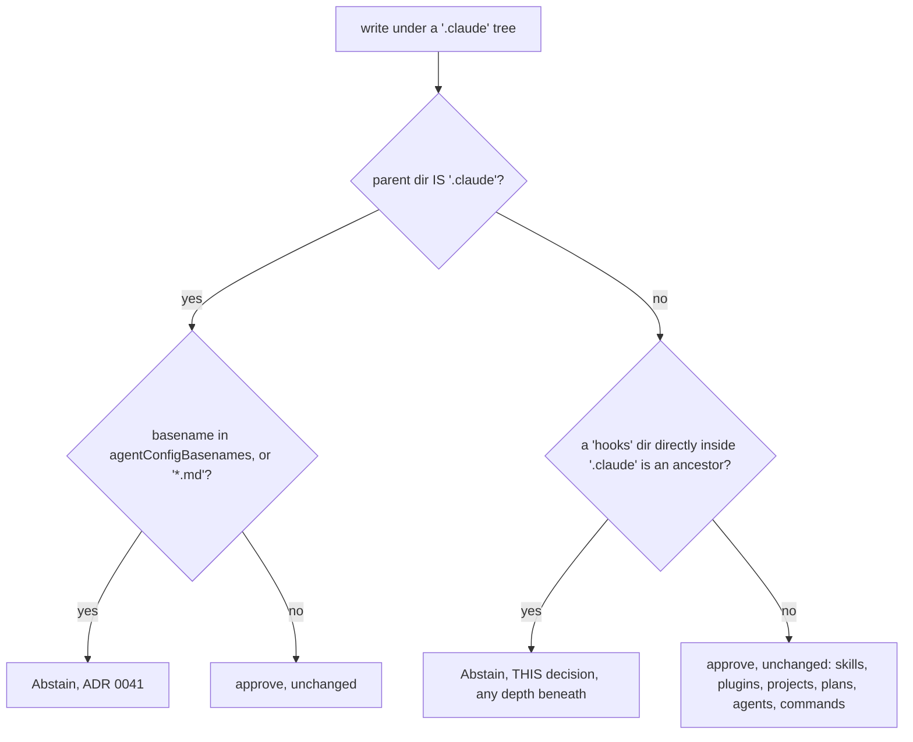

# CETA's agent-config carve-out extends to `.claude/hooks/`, and stops there

**Status**: Accepted (resolves `pg2-k1nxo`)
**Date**: 2026-08-12 (operator ruling; recorded as an ADR 2026-08-18, previously parked as an
unlanded draft on branch `drain/pg2-k1nxo`)
**Deciders**: Phillip Green II

Extends [0041](0041-ceta-abstains-on-agent-config-writes.md). ADR 0041 decided that CETA MUST NOT
approve writes to agent-config files under `.claude/`; this decision settles which directories one
level deeper are covered by that reasoning. It changes no verdict semantics — the carve-out still
abstains, and Claude Code still owns the verdict.

## Context

ADR 0041's carve-out is **depth-1 only**: `isAgentConfigPath` requires the path's parent directory
to _be_ `.claude`, implemented as
`strings.EqualFold(filepath.Base(filepath.Dir(path)), agentConfigDir)` in
`packages/claude-extended-tool-approver/internal/rules/pathsafety/pathsafety.go`. That predicate is
what bounds the blast radius, and ADR 0041's Decision requires the bound: `.claude/skills/**`,
`.claude/plugins/**`, `.claude/projects/**` (transcripts, memory) and `.claude/plans/**` are all a
level deeper and stay approved. Those are user-authored artifacts, and blocking them was what made a
subtree-wide `denyWrite` unusable.

`.claude/hooks/` is a level deeper too, and it is **not** a user-authored artifact in the same
sense: **a hook is arbitrary code executed on every tool call.** That is the same
privilege-escalation shape ADR 0041 was written to address for `settings.local.json` — arguably
stronger, because a hook _runs code_ where `settings.local.json` only _grants permissions_.
`.claude/agents/` and `.claude/commands/` occupy the same structural position but are materially
weaker: they steer agent behavior without executing on every call.

ADR 0041 does not mention `hooks`, `agents` or `commands` anywhere. It did not weigh them, so its
depth-1 rationale — "deeper paths are user-authored artifacts" — was never tested against a deeper
path that executes. This decision supplies that test.

### What the corpus said (measured 2026-08-12)

Measured over all 337,053 rows of `tool_decisions` in the asklog, counting `Write`, `Edit` and
`MultiEdit` whose input names each directory:

| directory           | historical writes | reading                                       |
| ------------------- | ----------------: | --------------------------------------------- |
| `.claude/hooks/`    |             **0** | covering it costs no measured friction at all |
| `.claude/agents/`   |                73 | routinely authored on request                 |
| `.claude/commands/` |                49 | routinely authored on request                 |

The `0` is a genuine zero, not a query artifact: a deliberately looser probe for writes whose
`file_path` merely contains `hooks` returns 227 rows, and every one is a git-hook or plugin-hook
path (`modules/zm/zm-install-hooks/**`, `packages/ccpool/ccpool-plugin/**`,
`/tmp/ccpool-spike/plugin/hooks/hooks.json`), never `<root>/.claude/hooks/`.

Two facts about this machine sharpen the reading. `~/.claude/hooks/` does not exist, and neither
does any `*/.claude/hooks` directory anywhere in the pn-workspace. `~/.claude/settings.json` has no
`hooks` key at all — hooks reach this machine through `enabledPlugins` and the nix-built
marketplace, whose hook definitions live under `.claude/plugins/**`.

So covering `.claude/hooks/` is **preventive, not remedial**. That is the point: the directory is
empty _now_, and the cost of covering it is zero _now_, which is exactly when a guard is cheapest to
install. Waiting for the first write is waiting for the escalation.

## Decision

**CETA MUST NOT approve a write to any path under a `.claude/hooks/` directory. It MUST abstain,
deferring the verdict to Claude Code, on precisely the terms ADR 0041 sets out.**

**The carve-out MUST NOT extend to `.claude/agents/` or `.claude/commands/`.** Writes there remain
approved by path-safety. The distinction is **execution**, and it MUST be stated that way rather
than as "agent configuration": a hook runs code on every tool call, while an agent definition or a
slash command shapes behavior only when something invokes it. 122 historical writes to those two
directories are the friction the distinction buys back, against zero for `hooks/`.

The following MUST hold of the implementation, and does (see
`packages/claude-extended-tool-approver/internal/rules/pathsafety/pathsafety.go`,
`isAgentHooksPath` / `isAgentHooksWrite`):

1. The check MUST live **inside `pathsafety`**, in the write branch, ahead of the `CanWrite`
   approve — for the reason ADR 0041's "Implementation constraint — the obvious approach is a silent
   no-op" gives: `Abstain` means "continue to the next rule", so a _separate_ abstaining rule placed
   ahead of `pathsafety` is a silent no-op that still approves.
2. The verdict MUST be `Abstain` (`hookio.NoOpinion`), never `Ask` or `Reject`. CETA encodes no
   verdict of its own here; that is ADR 0041's division of responsibility and this decision does not
   revisit it.
3. Unlike the depth-1 predicate, this one MUST match at **any depth beneath** `hooks/`, because hook
   scripts nest (`.claude/hooks/lib/foo.sh` is as executable as `.claude/hooks/foo.sh`). The
   `hooks` directory itself MUST still be required to sit **directly** inside `.claude`, so an
   unrelated `packages/ccpool/ccpool-plugin/hooks/` is untouched.
4. The matched set MUST stay **explicit and closed** — one enumerated directory name, not a pattern
   that grows silently.
5. Scope MUST cover both project-local `.claude/` and user-global `~/.claude/`, and writes only
   (`Write`, `Edit`, `MultiEdit`, `Delete`) — identical to ADR 0041.

## Consequences

- **The four ADR-0041 rows' ground truth is unaffected; this decision adds no new corpus rows.**
  With zero historical writes under `.claude/hooks/`, the whole-corpus A/B replay this
  implementation owes (deferred to the orchestrating session, per `pg2-cbihz`'s replay-gate rule —
  read-only against an isolated copy of the asklog, never `ceta evaluate`/`baseline`/`compare`
  against production) should report zero transitions in either direction. That is a strong
  acceptance signal and a weak one at once: it confirms nothing regresses, and it cannot confirm the
  new branch is reachable. The blast-radius tests therefore carry the whole burden of proving the
  predicate fires, and they pin what stays approved — `agents/`, `commands/`, `skills/`, `plugins/`,
  `projects/`, `plans/` — not merely what newly abstains.
- **`agents/` and `commands/` stay a known, accepted gap.** An agent can still write its own
  subagent definitions and slash commands without a prompt. This is deliberate, priced at the 122
  writes above, and it is the part of this decision most likely to want revisiting — if a
  self-modification incident ever traces to either directory, that evidence reverses this half
  without disturbing the `hooks/` half.
- **This decision alone does not cover the plugin tree**, which was the live hook-escalation path on
  this machine when it was written: `~/.claude/plugins/` is a real, writable tree
  (`marketplaces/`, `cache/`, `data/`, `installed_plugins.json`), and plugin hook definitions inside
  it execute on every tool call exactly as a script under `.claude/hooks/` would. ADR 0041
  deliberately leaves the plugin subtree approved as the collateral that made subtree-wide
  `denyWrite` unusable, and that trade-off is not reopened here — a plugin checkout is a large tree
  of legitimately-written files, so the enumerated-directory carve-out used for `hooks/` does not
  transfer to it. That gap is what [0049](0049-ceta-plugin-hooks-execution-path-carveout.md) closes,
  with a narrower execution-path rule rather than a subtree rule.
- **Bypass mode still passes through**, and the protection remains only as strong as the classifier
  on any given call. Both limitations are ADR 0041's, restated because this decision inherits them
  unchanged.

## Alternatives Considered

### Widen to `.claude/hooks/`, `agents/` and `commands/` together

Structurally consistent — all three are a level deep and all three shape agent behavior — and it
needs no judgement about which are dangerous. Rejected because the corpus prices it: 122 historical
prompts for two directories that do not execute on every tool call, against 0 for the one that does.
Consistency here would buy uniformity of _shape_ at the cost of uniformity of _justification_, and
ADR 0041's whole argument is that the carve-out earns its friction case by case.

### Leave the carve-out at depth-1 and record why

Defensible on the facts: `.claude/hooks/` does not exist on this machine, nowhere in the workspace,
and hooks arrive via plugins instead — so the guard protects a directory nothing uses. Rejected
because that is an argument about _today's_ layout, not about the escalation shape. The cost of
covering it is measurably zero, the directory is a documented Claude Code convention that any future
setup may adopt, and "nothing writes there yet" is the state in which a guard is free rather than
the state in which it is unnecessary.

### A `sandbox.filesystem.denyWrite` entry instead of a code carve-out

Rejected for the reason ADR 0041 already establishes in its Context: `denyWrite` matches by subtree
containment only, with no globs, so expressing "`.claude/hooks` in every present and future
project" needs one absolute entry per clone and silently misses the next one. It also produces a
hard denial where this decision deliberately produces a deferral.

## Related Decisions

- [0041](0041-ceta-abstains-on-agent-config-writes.md) — the carve-out this extends, and the source
  of the `Abstain`-not-`Ask` stance, the in-`pathsafety` placement constraint, and the
  bypass-mode/classifier limitations inherited here.
- [0043](0043-ceta-rule-verdict-vocabulary.md) — the verdict vocabulary that gives "no opinion" its
  distinct meaning, which is the verdict this carve-out returns.
- [0049](0049-ceta-plugin-hooks-execution-path-carveout.md) — extends the same reasoning to
  plugin-supplied hooks, the directory that actually executes hooks on this machine, via a narrower
  execution-path rule rather than a subtree rule.

## Provenance

This decision was ruled by the operator on 2026-08-12/13 (bead `pg2-k1nxo`) and drafted as an
unlanded ADR, numbered 0044 at draft time, on branch `drain/pg2-k1nxo` (commit `a496c54c`, "Decision
only -- no implementation"). That number was taken by a different, unrelated decision by the time
this landed (`0044-ceta-verdict-provenance-and-the-refusal-outcome.md`, `pg2-d0ja3`), so this
document renumbers to the next free slot at land time (`pg2-7mors`, consolidating `pg2-k1nxo` and
`pg2-m0uza`) rather than reusing the stale number. The policy call itself is unchanged from the
parked draft; only the number and this provenance note are new.
