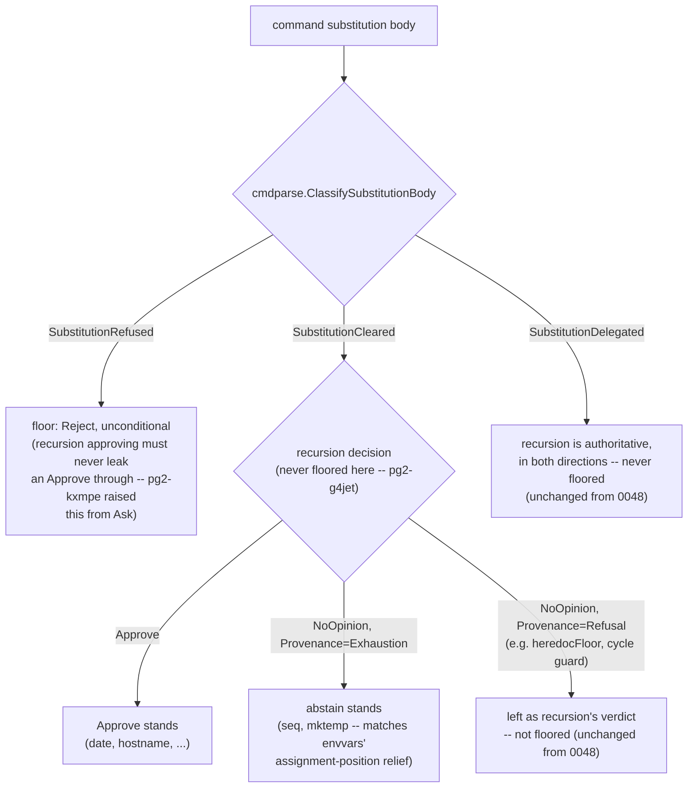

# CETA harmonize-up amendment: Cleared+Exhaustion abstains, Refused floor raised to Reject

**Status**: Accepted (amends 0048)
**Date**: 2026-08-28
**Deciders**: Phillip Green II
**Tracking**: `pg2-g4jet`, `pg2-kxmpe`

## Context

ADR [0048](0048-ceta-exhaustion-never-cleared-harmonize-up.md) decided that ceta MUST NOT clear
the exhaustion half of a captured substitution, and specifically that (Decision item 2)
"env-value position keeps its decisive Ask; the two positions converge UPWARD, never downward."
Its Implementation section's mermaid diagram matched that: a `SubstitutionCleared` command
substitution whose recursion landed on `NoOpinion, Provenance=Exhaustion` (e.g. `seq`, `mktemp`)
was floored to "at least Ask", the same floor applied to a `SubstitutionRefused` body.

Two operator-ruled changes have since landed to `main` that move the mechanism away from what
that Decision item and diagram describe. Neither landing touched the ADR 0048 file itself, per
this repo's convention that an old ADR is an immutable historical snapshot — the same shape as
ADR [0018](0018-pb-tool-and-pn-applied-contract.md) being amended by ADR
[0046](0046-pn-applied-gate-requires-apply-and-lock.md) rather than rewritten in place.

1. **`pg2-g4jet`** (`internal/engine/engine.go`'s `foldSubstitutionScan`/`commandSubstitutionFloor`,
   landed to `main` @ `45210acc64a64f82f0cb242bc22e3e4299c86fd2`) removed the
   `SubstitutionCleared`+`ProvenanceExhaustion` floor entirely. `seq`, `mktemp`, and any other
   statically-cleared-but-unmodelled command-substitution body no longer floors to Ask; it now
   stays at whatever recursion already concluded (`NoOpinion`/abstain). This aligns command
   position with envvars' own assignment-position relief for the identical cohort — `pg2-et8ns` /
   `pg2-o7l2f` (landed @ `57f3d3bbf1e93f0cfe95a0db85b3bf16372be248`, 2026-08-27), which `pg2-g4jet`
   itself reconciles the engine floor against. The `SubstitutionRefused` branch (the unconditional
   floor covering `git show`, `paste`, and anything else off the curated per-command allowlist) is
   untouched by this change.
2. **`pg2-kxmpe`** (same file, plus `internal/rules/envvars/envvars.go`, landed to `main` @
   `d9e0926a45dc1731382f92a7e12eb88a32a15a47`) raised what remained of the floor — the
   `SubstitutionRefused` branch's `commandSubstitutionFloor`, and envvars' own residual
   genuine-refusal `default:` fallback — from a decisive **Ask** to a decisive **Reject**. Neither
   case becomes approvable by retrying a rephrased variant, so holding it at Ask only invited an
   agent spinning on denied rewordings of the same shape.

Together, Decision item 2 and the diagram's `SubstitutionCleared -> ... NoOpinion,
Provenance=Exhaustion -> floor` edge are now stale. Code comments citing ADR 0048
(`engine.go`, `envvars.go`, and their test files) remain internally accurate — they narrate both
the original ruling and these deltas inline — but ADR 0048's own file, read on its own, now
misdescribes current behavior.

## Decision

This ADR does **not** reopen ADR 0048's core invariant — ceta still MUST NOT clear the exhaustion
half of a captured substitution — and Decision items 1, 3, and 4 stand unchanged. It amends
Decision item 2 and the Implementation diagram as follows.

1. **The `SubstitutionCleared`+`ProvenanceExhaustion` floor is REMOVED.** A command-substitution
   body the static allowlist positively clears (`cmdparse.SubstitutionCleared`) is now governed
   entirely by recursion, in both directions: an unmodelled ("exhaustion") verdict from recursion
   is left exactly as recursion returned it (abstain), never raised to Ask. This applies ONLY to
   the Cleared+Exhaustion cohort — a Cleared body some OTHER mechanism already examined and
   declined (`ProvenanceRefusal`: the substitution-cycle guard, `heredocFloor`'s own narrowed case)
   was never floored by this mechanism and is unaffected; `SubstitutionDelegated` bodies were
   already governed by recursion alone and are unaffected.
2. **The `SubstitutionRefused` floor, and envvars' residual genuine-refusal fallback, are RAISED
   from Ask to Reject.** Both are unconditional and decisive, and neither becomes approvable by
   rephrasing.

Restated as the corrected position relation (replacing ADR 0048's Decision item 2):

- **Command position, `SubstitutionRefused`** (`git show`, `paste`, and anything else off the
  curated allowlist — including every exhaustion body that also fails the static allowlist, e.g.
  `bash -c`, `python3 -c`, `ssh`, `curl`, `npm install`): floors unconditionally to **Reject**.
- **Command position, `SubstitutionCleared`** (`date`, `hostname`, `seq`, `mktemp`, a qualifying
  quoted-heredoc-into-`cat` body): never floored. Stands at recursion's own verdict — Approve for a
  body a rule independently approves, abstain (`NoOpinion`) for an unmodelled exhaustion body, and
  whatever a non-exhaustion `ProvenanceRefusal` mechanism already decided.
- **Command position, `SubstitutionDelegated`**: unaffected — governed by recursion alone in both
  directions, exactly as ADR 0048 already decided.
- **Env-value position** (`envvars.go`'s post-recursion assignment fallback): a genuinely unmodelled
  ("exhaustion-only") value is relieved to whatever the NAME-derived verdict already was —
  `NoOpinion` for an ordinary variable, unchanged Ask/Reject for `PATH`/`HOME`/an injector
  (`pg2-et8ns`/`pg2-o7l2f`, the antecedent envvars-side ruling `pg2-g4jet`'s own engine change
  aligns against). The residual genuine-refusal cohort — refusals not covered by the
  exhaustion-only or the narrower dynamic-path-read relief (`pg2-4x2mu`, unaffected by this ADR) —
  escalates to **Reject** (`pg2-kxmpe`), not Ask.

The two positions still converge UPWARD relative to each other for the cohort that remains
decisive (neither position resolves less restrictively than the other), but the shared decisive
floor itself moved from Ask to Reject, and the Cleared+Exhaustion cohort was removed from the
floor altogether rather than harmonized into it.

### Corrected mechanism diagram (replaces ADR 0048's Implementation diagram)

## Consequences

### Positive

- ADR 0048's Decision item 2 and diagram now have a durable amendment record instead of the
  original ADR silently misdescribing current behavior.
- The corrected diagram matches `engine.go`'s own extensive doc comments on
  `commandSubstitutionFloor` and `foldSubstitutionScan` as of `d9e0926a`, so a reader following
  either source lands on the same mechanism.

### Negative

- A reader of ADR 0048 alone — without checking `docs/adr/index.md`'s status column — will not see
  this correction; that is the accepted cost of treating old ADRs as immutable snapshots rather
  than rewriting them in place.

### Neutral

- ADR 0048 is **amended, not superseded**: Decision items 1, 3, and 4, the Context, the Rejected
  alternatives, and the Consequences/measurement sections all stand unchanged. Only Decision item 2
  and the Implementation diagram's `SubstitutionCleared`+`ProvenanceExhaustion` edge are corrected
  here.
- `docs/adr/0048-ceta-exhaustion-never-cleared-harmonize-up.md`'s own file is left untouched, per
  this repo's convention (ADR 0018/0046 precedent) and `docs/adr/index.md`'s "Accepted (amended by
  NNNN)" status-column marker, which is updated to point here.
