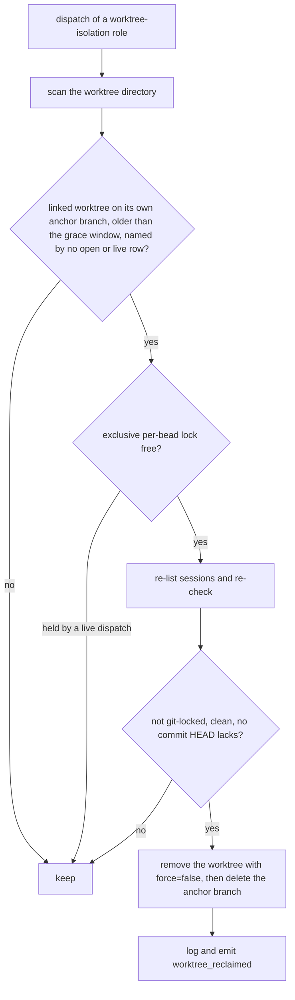

# A worktree-keyed sweep reclaims per-bead worktrees no session row leads to

**Status**: Accepted (amends 0083; follows `pg2-w3usi`)
**Date**: 2026-10-06
**Deciders**: Phillip Green II

## Context

A `pg-router-ccpool-handler` dispatch creates a per-bead git worktree and its `pg-router/<bead>`
anchor branch (`isolation.Ensure`) before it creates the `ccpool` session (`CC.Ensure`). Every
cleanup of that worktree is keyed on a session row: the dispatch's own cleanup, the closed-bead
reconcile, the orphan reconcile of ADR 0083, and the pre-shutdown sweep. Bead `pg2-w3usi` closed the
in-process leak paths (a failed `CC.Ensure`, a confirmed-dropped nudge). Two leaks remain that no row
can lead to:

- A handler SIGKILLed or crashed between the two steps leaves the worktree and branch with no row at
  all, and cannot be handled in-process.
- A row closed by `idle_ttl`, a cap eviction, or the operator before the same role next dispatched
  leaves its worktree behind: the closed-bead reconcile skips rows that are not `idle`/`needs_input`,
  and the orphan reconcile acts only on open rows.

Observed 2026-10-05 (`zr-nbk23.2`): the handler was killed, the row closed by `idle_ttl` 35 minutes
later, and the worktree stayed.

The dispatch runs as concurrent processes, so a sibling between its own two steps looks exactly like a
leak: it has a worktree and no row yet. A sweep therefore needs a reliable "a live dispatch is using
this" signal, not just an age.

## Decision

Add a worktree-keyed sweep to the dispatch-time reconcile, and give every dispatch a liveness lock.

1. **The sweep scans the worktree directory.** After the orphan reconcile and before the capacity
   check, a dispatch of a role with worktree isolation lists the worktree directory and considers each
   linked worktree whose checked-out branch is exactly `pg-router/<directory name>`. It removes at
   most five per dispatch, so a backlog drains over several dispatches. `gitclient` needs no change:
   the registration (the `.git` file and the admin directory's `gitdir` back-link) and git's own lock
   (`<admin dir>/locked`) are read from the files git writes, and branch, status and commit count use
   `Locator`, `StatusReader` and `RefReader`.
2. **Guards.** A worktree is removed only when it is older than the launch wait plus the lease TTL;
   no open or live session row of the role's pool names it (a closed, not-live row does not
   protect it); git does not hold it locked; its working tree is clean; the branch holds no commit
   the canonical clone's `HEAD` lacks; and removal runs with `force=false`. Anything unreadable
   keeps the worktree. The anchor branch is deleted only after the worktree is gone.
3. **Liveness is a flock, not a timer.** Every dispatch of a role with worktree isolation takes a
   SHARED `flock` on `<handler state dir>/locks/worktree--<bead>.lock` before it creates the
   worktree and holds it until `run()` returns. The sweep takes the same lock EXCLUSIVE and
   non-blocking, and re-lists the sessions while holding it. The kernel releases a flock when its
   holder dies, so a killed handler stops protecting its worktree at the instant it dies, and a live
   one, in any role, always does. Shared holders coexist, so two roles dispatching the same bead
   never block each other; a dispatch that meets a sweep mid-action waits for it (bounded at ten
   seconds, the sweep holds the lock for a few git calls) and then proceeds without the lock if it
   still cannot take it. The age grace stays as a second guard, for a handler of an older build that
   does not take the lock.
4. **`reconcileClosedBeadSessions`'s `reconcilableState` is not changed.** A killed handler's row is
   typically stuck `starting`/`ready`/`working`/`errored`, which that reconcile excludes on purpose
   because it runs while the daemon keeps running. ADR 0083's lease already covers such a row (its
   handler is gone, so the lease expires): an `idle` or `errored` one is reclaimed, a `working` one
   past its time budget is hard-stopped. A row with no lease is bounded by `ccpool`'s idle timeout,
   after which this sweep reclaims its worktree. Widening `reconcilableState` would race a live
   session.
5. **Observability.** Each removal is an INFO log line and a `worktree_reclaimed` event naming the
   bead, role, worktree, branch and age. Each kept worktree logs its reason.

## Consequences

- A handler killed between worktree creation and session creation no longer leaks its worktree and
  branch: the next dispatch of any worktree-isolation role reclaims them. A row closed before anyone
  reclaimed its worktree no longer pins it either.
- Known limitation: reclaim happens only when a worktree-isolation role next dispatches; until
  then the leak costs disk, and `pg-disk-reclaimer` remains the independent backstop.
- Known limitation: only the dispatching role's pool is visible, and a per-bead worktree is shared by
  every role's session for the bead. A clean, commit-free worktree used by an idle or orphaned session
  of another role's pool, whose handler is gone, is removable. The closed-bead reconcile and the
  dispatch cleanup (`INV-CCH-15`) have the same blind spot; a dirty tree or unique commits are never
  lost.
- Known limitation: a dispatch that cannot take the shared lock proceeds unprotected (logged). The
  age grace and the other guards still apply.
- The unique-commit check compares against the canonical clone's `HEAD`, not against every ref, so a
  branch merged elsewhere but not into `HEAD` is kept; that errs toward keeping.
- Rejected: a worktree-keyed sweep guarded only by an age or mtime threshold. A long-running live
  dispatch is old too, and a sibling inside its launch wait looks identical to a leak.
- Rejected: adding list-worktrees, lock and ahead-count APIs to `gitclient`. Those live in another
  repository and the files git itself writes answer the same questions here.
- Rejected: a live end-to-end kill of a real handler as the only test. The unit tests kill a real
  child process that holds the lock and a real git repository, and assert the next sweep reclaims.
