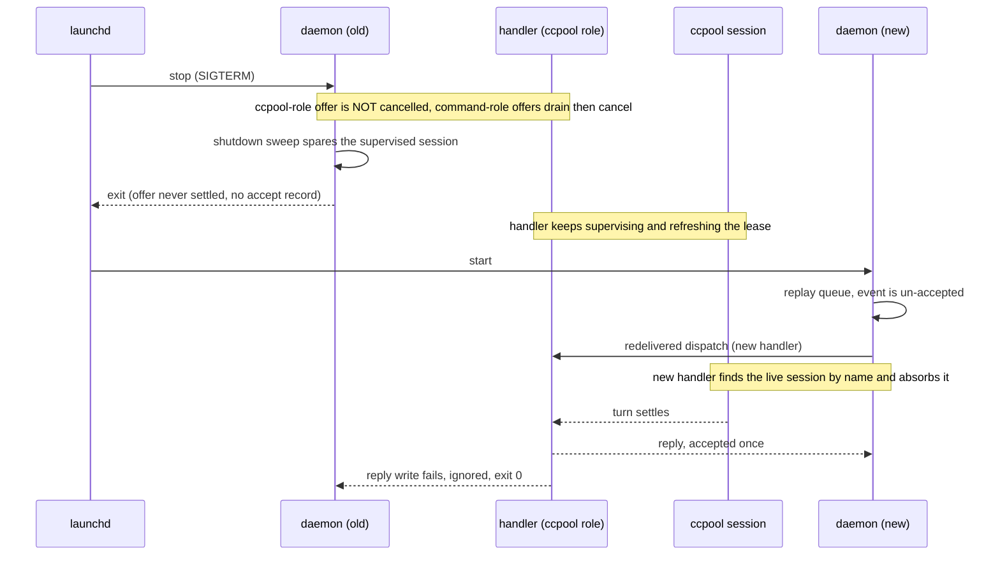

# A daemon restart leaves ccpool-backed dispatches running

**Status**: Accepted (amends 0083; resolves `pg2-dtigc`)
**Date**: 2026-10-07
**Deciders**: Phillip Green II

## Context

Operator requirement (Phillip, 2026-10-07, verbatim): "we need to ensure that restarts don't kill
existing sessions."

The 2026-10-07 router health review found 14 daemon starts in 48 hours, 8 of which logged
`in-flight dispatch(es) did not finish before the drain timeout; cancelling them`, and 11 dispatches
lost (8 review, 2 escalation-triager, 1 desk-reconcile). The mechanism, read from code:

- On SIGTERM the daemon waits `shutdownDrainTimeout` (20 seconds, a compile-time constant in
  `packages/pg-router/cmd/pg-router/run.go`), then cancels `dispatchCtx`. `wireclient.OSRunner` runs
  each handler under `exec.CommandContext`, whose default cancel is SIGKILL, so the HANDLER process
  dies (`exited -1`). The claude session, its tmux server and its worktree are separate processes
  and survive.
- The killed offer is still ACCEPTED (`roleListener.Offer` reports acceptance whatever the handler
  returned), so its event is settled and never redelivered, and a failure is counted.
- The session keeps its pool slot with nobody supervising it, until ADR 0083's lease expires and its
  own role next dispatches.
- A longer drain cannot help. ccpool-backed dispatches last 25 minutes and more, and launchd clamps
  `ExitTimeOut` at 60 seconds (`pg2-s3fzr`), of which drain 20 + sweep 30 + tail 5 are already spent.

Three questions were left open by the bead and are answered here, from code and tests, before any
code change.

## Evidence: the three open questions

### 1. Does the durable queue redeliver an unacked offer at startup? Yes.

- `eventqueue.Queue.settleOfferLocked` is the only place an accept is recorded, and it runs in
  phase 3, after `Offer` returns. The durable `opAccept` record is appended there and nowhere else.
  An offer that is still blocked inside `Offer` when the process dies has therefore written no
  accept record.
- `Queue.replay` restores every enqueued, non-evicted event and marks it accepted only if an
  `opAccept` record exists, so the event replays UN-accepted. It restores events past their
  `expiresAt` too ("the log is authoritative": only an `opEvict` record drops one).
- `Queue.Expire` cannot evict such an event meanwhile: `retainedLocked` keeps an expired event while
  any bound listener is not settled for it, and an in-flight offer is not settled.
- Existing test `TestCrashWindowRedeliversAcceptedEventAtLeastOnce` pins the replay-then-re-offer
  half (one re-offer per crash window). The code change adds a test for the in-flight half: an offer
  that never settles replays as un-accepted and is re-offered to the next queue.

So today the redelivery path exists but is never exercised by a restart, because the cancel makes
every restart-time offer return and settle. Letting the offer stay unsettled is what engages it.

### 2. What does the orphan handler do when its stdout pipe closes? It dies at the reply write, after all its work.

- `OSRunner.Run` sets `cmd.Stdout = &bytes.Buffer`, so Go allocates an OS pipe whose read end the
  daemon owns. When the daemon exits the read end closes. stderr is `os.Stderr` (an inherited
  `*os.File`, the launchd log file), so it is NOT a pipe and does not break. stdin is fed by a Go
  goroutine and the handler reads it to EOF at the start (`runDispatch`), so it is not read again.
- The handler writes to stdout in exactly one place on the dispatch path, the final `writeReply` /
  `writeErrorReply` / `writeBusyReply`, after `executor.Dispatch` returned (the wait, the watchdog,
  the worktree cleanup and the settled-session close are all done by then). Its subprocess runners
  (`ccpool`, `bd`, `git`) capture into their own buffers and never inherit fd 1.
- Measured on this machine (Darwin 25.6.0), a Go child writing to a stdout pipe whose read end is
  closed dies with `signal: broken pipe` (the Go runtime raises SIGPIPE for a write to fd 1 or 2),
  and when the process has called `signal.Notify` for SIGPIPE (or `signal.Ignore`) the write returns
  `EPIPE` and the process exits 0. The two differ for the process's CHILDREN: after `signal.Ignore`
  a child `perl` reported `SIGPIPE = IGNORE` (an ignored disposition is inherited across exec, so
  `ccpool`, `bd` and the claude session would all run with SIGPIPE ignored), whereas after
  `signal.Notify` it reported the default, because a caught signal resets to default on exec.
- Conclusion: the handler is NOT killed mid-work; it is killed at the very last instruction, losing
  only a reply nobody can read. That is harmless but untidy (a signalled exit, no log line), so the
  handler subscribes to SIGPIPE with `signal.Notify` (never `signal.Ignore`) on `dispatch` and logs
  that the reply was undeliverable. The code change carries a test that re-executes the test binary
  against a closed pipe.

### 3. How do a new dispatch and a still-running old handler coexist? The new dispatch absorbs the session.

The bead's premise ("the sessionlock flock is non-blocking per session, so the new dispatch would
skip") does not match the code:

- A running dispatch does NOT hold the per-session lock for its lifetime. Only the orphan reconcile
  and an absorbing dispatch's `takeOverForAbsorb` take it, and briefly. `lockSession` retries for up
  to `absorbLockWait` (30 seconds); it does not skip.
- The redelivered dispatch (question 1) runs `findSessionByName` before the capacity gate. The live
  session carries the stable per-bead name, so it is found, `takeOverForAbsorb` refreshes its lease,
  and `absorbDuplicate` waits on the EXISTING session. No second session is launched and no pool slot
  is consumed (`INV-EVT-2`, `INV-CCH-2`, `INV-CCH-18`).
- `reconcileOrphanSessions` leaves the session alone: the old handler keeps refreshing the lease
  every poll, so it is not an orphan. The per-bead worktree is protected by the old handler's SHARED
  worktree lock (ADR 0084), which lives as long as the old handler does.
- Two processes then supervise one session. Both refresh the lease; both reach `finishWait`, whose
  worktree removal and session close are best effort and idempotent, so the second finds nothing to
  do. The OLD handler's reply is the one that is discarded (question 2); the NEW dispatch's reply is
  the one the new daemon accepts, so the outcome is accounted exactly once, by the daemon that is
  actually running.

## Decision

1. **A role may declare that its dispatch survives a daemon shutdown.** The per-role JSON file the
   daemon already resolves for each role (`<PG_ROUTER_HANDLER_COMMAND_DIR>/<role>.json`) gains an
   optional top-level `survivesShutdown` boolean. The deployment module renders it `true` for every
   ccpool-type role and omits it for command-type roles. The Go `roleFile` ignores unknown keys, so
   the handler is unaffected. Absent, unreadable, or `false` means today's behavior (cancelled after
   the drain). The core reads only that generic flag, never the role's kind or the handler's name.
2. **The daemon does not cancel a surviving role's dispatch.** In daemon mode only, the listener of
   a role that survives is built on `context.WithoutCancel(dispatchCtx)`, so `cancelDispatch` does
   not reach its `exec.CommandContext`. `run-until-idle` and `run-role` are unchanged: an interactive
   interrupt still stops a handler.
3. **Shutdown waits only for what it will cancel.** The drain step and the store-close step wait for
   in-flight offers EXCLUDING surviving roles (`eventqueue.Queue.WaitForInFlightDrainExcept`), so a
   25-minute review no longer burns the 20-second drain plus the 5-second tail on every restart.
   Command roles keep the existing 20-second drain then cancel. The shutdown logs how many surviving
   dispatches it is leaving running.
4. **The handler subscribes to SIGPIPE on `dispatch`** (`signal.Notify`, which does not leak an
   ignored disposition to its children) and logs when the reply could not be delivered.
5. **The shutdown sweep spares a session whose supervision lease is still valid.** The sweep already
   spares `starting`/`ready`/`working`; a session that is `idle` but still inside its handler's
   settle step (worktree cleanup, settled-session close) is also supervised, so closing it would pull
   the session out from under a live handler. The sweep now treats an unexpired lease as "supervised
   by a live handler" and spares it, whatever its state. A session with no lease, or an expired one,
   is handled as before.
6. **Behavior docs and module comments are updated in the same change.** `INV-CCH-14` and
   `INV-CCH-18` (the spared session's handler no longer dies with the daemon, for ccpool roles) and
   `journeys` 2d; the darwin module's `ExitTimeOut`/`AbandonProcessGroup` comment (survivors are now
   adopted by redelivery rather than untracked).

## Consequences

- A restart with a review, worker, feedback or escalation-triager dispatch in flight leaves the
  session and the old handler running, records no failure, and does not strand the pool slot. The
  new daemon re-offers the event, absorbs the live session, and accounts the outcome once.
- Command roles are unchanged: still 20 seconds then SIGKILL. They are short, and killing a stuck one
  is the point of the cancel.
- Known limitation: if the old handler is still inside its launch (`ccpool new`, before the session
  row exists) when the event is redelivered, the new dispatch may not find a session to absorb. The
  per-pool capacity gate (`INV-CCH-6`) declines it for a `max_sessions = 1` pool and a later
  re-offer absorbs; for a larger pool a second session for the same bead is possible. The window is
  one launch wait and is the same exposure a crash-window redelivery already has.
- Known limitation: if the surviving session ends in a failure outcome, both the old and the new
  handler may apply the role's failure action (an idempotent label or unclaim) once each.
- Known limitation: the surviving handler's reply, and so its final outcome as the OLD daemon would
  have logged it, is lost by design. The new daemon's absorbing dispatch reports it.
- The launchd budget is unchanged: drain (20) + sweep (30) + tail (5) = 55 of 60 seconds is now an
  upper bound that a restart with only ccpool-backed work in flight does not approach.
- Not verified in this change: how the apply path issues the actual stop (nix-darwin's agent reload
  in `phillipgreenii-nix-personal`'s launchd helper). The design does not depend on it: a SIGKILLed
  daemon leaves exactly the same state (handlers surviving via `AbandonProcessGroup`, an un-accepted
  event in the log). Post-apply verification is therefore a post-deploy check, listed on the bead.
- Rejected: a longer drain. launchd caps `ExitTimeOut` at 60 seconds and the dispatches run longer.
- Rejected: deciding survival from the handler binary. Command-type and ccpool-type roles both run
  through `pg-router-ccpool-handler`, so the binary cannot tell them apart.
- Rejected: asking the handler to opt out of SIGTERM. `exec.Cmd` kills the child after `WaitDelay`
  and the core would still block on the process, so it cannot exit while a session runs.
- Rejected: `Setpgid`/`Setsid` in `wireclient`, for the reasons recorded at `AbandonProcessGroup` in
  the darwin module (it changes how CLI invocations spawn handlers, and the plist key already covers
  launchd).
- Not done here, still available as a stopgap: a pre-apply `SYSTEM_PAUSE` gate that waits for
  `dispatch.busy` to reach 0. It blocks an apply for up to 25-30 minutes and needs a mandatory
  resume, so it is only worth building if the post-deploy verification fails.
