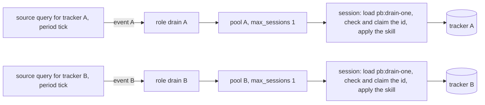
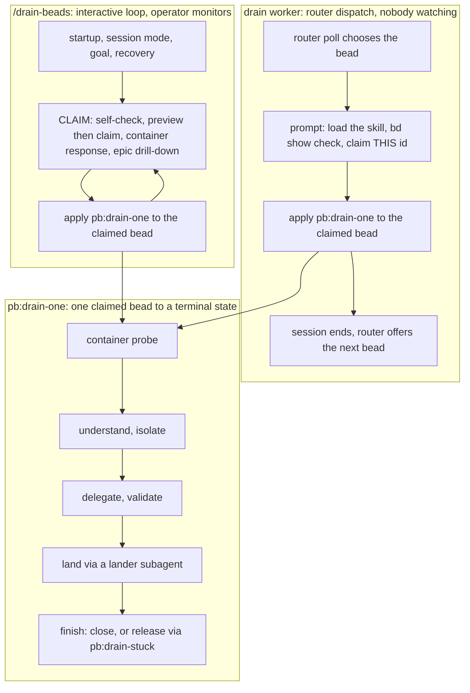

# Drain roles apply the shared pb:drain-one skill, one pool per tracker

**Status**: Accepted (extends 0065, 0083 and 0085; resolves `pg2-nk6th.7`)
**Date**: 2026-10-09
**Deciders**: Phillip Green II

## Context

`/drain-beads` is an interactive orchestrator. An operator runs it, watches it, and stops it. It
selects a bead, claims it, works it end to end (isolate, delegate, validate, land, close) and loops.
The operator wanted the same work done by a background process that is always trying to drain
beads, one at a time, with nobody watching. Operator rulings (Phillip, 2026-10-07 and 2026-10-08;
verbatim, typos kept):

```text
R1 "bump the maxwait to be larger than budget"
R2 "refactor-campaign can be ahndled by these workers"   (sic: "ahndled")
R3 "a draft PR can be created by an agent unattended"
R4 "1 per tracker. both enabled. extra exclusions are fine for right now."
R5 "the worker will treat all beads the same. if there is somethign special about it, it should be written into the bead or should not be given to the worker."   (sic)
R6 "is it possible to refactor the prompt so that the dynamic bits are at the end and not the top so that we have better cache hits?"
R7 "i dont' want the workers to call `/drain-beads`.  i want the workers to run as if they were called by `/drain-beads`.  ie, instead of me running `/drain-beads` and monitoring it to know when to stop it, i want  a background process which is constantly trying to drain beads, one at a time."   (sic; the first sentence of that message is omitted)
R8 "if it helps, we can create a "drain-bead" skill which can be used for both drain-beads and this situation.  woudl that work? less duplication"   (sic; the agent's name pb:drain-one was accepted by the operator's "yes, make the plan on what you are doing to do so we can review it with subagents")
```

pg-router already supervises ccpool-backed roles through `pg-router-ccpool-handler` (ADR 0065):
a source query offers an event, a role's handler starts a Claude session in a pool, waits for the
bead to complete, and applies a failure policy (ADR 0083's supervision lease and orphan reconcile,
ADR 0085's restart absorb). Four gaps stood between that machinery and a drain worker:

1. A drain session runs up to two hours, but the handler stopped waiting at a fixed 30 minutes and
   then applied `on_failure` (add `human`) to a bead a live session still held.
2. The router's per-listener queue is a serial FIFO with head-of-line blocking, so while a long
   dispatch runs, later events wait and are offered later as stale snapshots. By then the bead may
   be closed, claimed, parked, deferred or blocked, and a session started for it is wasted.
3. A drain worker legitimately gives a bead back unfinished (park, defer, convert, refuse a stamp).
   The existing completion modes read an `open` bead after a claim as a hand-back, but had no notion
   of a bead that was NEVER claimed, and their claim latch fired on any `in_progress` bead, so a
   peer's claim would have made the handler add `human` to the peer's bead.
4. The per-bead protocol lived inside the 80,801-byte `/drain-beads` command, mixed with the loop,
   so the only way to reuse it was to call the command or copy it into a role prompt.

## Decision

### 1. The drain-role pattern: Producer, Consumer, Bulkhead per tracker

Each tracker gets its own source query (the Producer), its own ccpool role and its own pool (the
Consumer). One bead is in flight per tracker. A failure, a slow bead or a saturated pool in one
tracker cannot starve another, which makes each pool a Bulkhead. The router supplies what the
interactive command's loop supplies: selection (the source query), repetition (the period tick) and
stopping (pool size and budget).



Rules for the pattern (RFC 2119):

- A drain role MUST NOT invoke `/drain-beads`. It MUST load the `pb:drain-one` skill, check the bead
  the router chose with one `bd show`, claim that id, and apply the skill (R7, R8).
- A drain role MUST have a pool of size 1 per tracker (R4) and a time budget. The roles are
  declared per deployment: this repo ships the mechanism, and the deployment supplies the queries,
  prompts, per-tracker addenda and the enable flag. A role MUST be enabled only after the
  mechanism has been exercised live.
- The worker MUST treat all beads the same. No bead-class rules belong in its prompt, and no
  `DRAIN-RESULT` line is emitted because nothing consumes it (R5). Anything special about a bead
  MUST be written into the bead.
- The drain-ready query SHOULD NOT exclude `refactor-campaign` (R2). The interactive command's
  claim path is unchanged and still excludes it.
- A drain worker MAY push its own branch and create or update a draft pull request where its
  tracker addendum grants that, and MUST NOT merge, mark ready or enable automerge (R3).

The prompt SHOULD put what is constant across dispatches first and the per-dispatch values (the
bead id, the actor) last, so the model's prompt cache is reused (R6). The role prompts live in the
deployment, so that is a rule for them, not code in this repo.

### 2. Extract `pb:drain-one`, and why

The per-bead protocol moved out of `/drain-beads` into a shared skill at
`claude-marketplace/pb/skills/drain-one/`. `/drain-beads` gained no argument and no mode, and its
behavior is unchanged. This is the Extract Function refactoring applied to a command: the skill is
a shared subroutine with parameterised variation. It is not a strict Template Method, because it
never calls back into caller code. Each caller runs its own selection-and-claim Strategy BEFORE the
skill, and the skill varies only through four caller inputs.

The seam is SELECTION versus EXECUTION. Whatever exists only because a human runs a loop stays in
the command, and whatever works ONE already-claimed bead to a terminal state is the skill.



Why a shared skill, and not the alternatives:

- **Not "the worker calls `/drain-beads`"** (R7). That command is a loop with an operator in it:
  selection, `--monitor-if-empty`, session mode, wakeups. A router dispatch has no use for any of
  it, and the router already chooses the bead.
- **Not a `--dispatched <id>` mode on the command.** An earlier revision of the design had one. It
  grows the command a second personality, so every future edit to the loop has to be checked
  against a mode it does not own, and the argument is a new interface for a caller that wants no
  loop. R7 and R8 superseded it. There is no dispatched mode.
- **Not a copy of the protocol in the role prompt.** Two copies of a 50 KB protocol drift, and the
  interactive command's reviewed behavior would no longer be the worker's behavior (R8: "less
  duplication").

What stayed in the command: the actor id, template exclusion, goal and termination, startup and
resume, CLAIM with its freshness self-check and preview-then-claim, the loop's RESPONSE to a
container hit (the consecutive-release budget, demotion, escalation), the epic drill-down (which
runs before the skill), scope arguments, and the loop-only rules. What moved into the skill: the
container PROBE, UNDERSTAND, ISOLATE, DELEGATE, VALIDATE, LAND, FINISH, the post-deploy
verification gate, STUCK routing, close-with-absorption-trace and the per-bead rules.

**The container guard is split, not moved.** Whether a claimed bead is a container is a property of
the bead, so the probe is the skill's first step. What to DO about a hit differs by caller, so the
response is an input (below). The probe is read-only.

**Four caller inputs.** The caller states them in prose when it applies the skill. The defaults ARE
`/drain-beads`' own behavior, so the command states none of them.

| Input           | Default (`/drain-beads`)                                                                           | A drain worker sets                                                                                      |
| --------------- | -------------------------------------------------------------------------------------------------- | -------------------------------------------------------------------------------------------------------- |
| actor           | `<session-id>-drain`                                                                               | the role's literal actor id, so the handler's orphan reconcile can recognize its own claim (ADR 0083)    |
| release policy  | `release`: a container hit returns `container-hit` still claimed, and the caller owns the response | `park`: NO path leaves the bead `open`, unclaimed and ready, because the router would re-offer it        |
| session mode    | `loop`: an operator is reachable                                                                   | `unattended`: operator-addressed lines become a bead comment, and the turn MUST NOT end while work runs  |
| tracker section | none: `pb drain isolate`, branch `drain/<id>`, the default push policy                             | a per-tracker addendum giving isolation, work branch, worktree, and the ONLY push and draft-PR authority |

A literal actor overrides the `-drain` suffix rule (the operator ruling recorded by `pg2-mcp1j`),
which makes the subagent-ownership check a no-op, so only the brief ban on subagent claims protects
them. ADR 0076 owns the claim-identity rule itself.

**The outcome contract.** The skill takes a claimed bead and returns exactly one of `closed`,
`released`, `container-hit` (release policy `release` only, still holding the claim) or `not-mine`
(the first action is one `bd show`, and a bead that is not `in_progress` under the actor is changed
in NO way). The bead MUST NEVER be left `in_progress`, except on `container-hit`. A release goes
through `pb:drain-stuck`: PARK (`open`, `human`), CONVERT-TO-DEPENDENCY (`open`, a blocker edge),
DEFER-ON-EVENT (`open` plus a future deferral date), CLOSE-AS-MOOT (`closed`), or step 4's
stamp-refusal (`deferred`, unassigned). `pb:drain-stuck` returns to "the caller" rather than to the
loop's CLAIM step, and gained a CONTAINER PARK entry for release policy `park`: it parks with a
comment carrying the probe evidence and the `human` label, with NO deferral and NO blocker edge,
because a deferral or blocker on a container propagates down and hides its whole subtree.

**Compaction drives the file layout.** Claude Code truncates an invoked skill to 20,000 characters
at compaction, and a two-hour worker at high effort can compact. So `SKILL.md` holds the routine
path and stays under 18,000 characters, and the bulky branches live in `references/` files read on
demand: `delegate.md`, `land.md`, `post-deploy-gate.md` and `rules.md`. The skill and the command
both say that a held body ending in `skill content truncated for compaction` means Read the
skill's path. `/drain-beads` loads the skill lazily at its FIRST successful claim and applies it to
later beads without re-invoking it, because re-invoking re-injects the body per bead.

**Behavior preservation is mechanical.** `claude-marketplace/pb/skills/drain-one/scripts/line-accounting.sh`
shows that every line of the old command is present exactly once across the command, the skill and
its references, or is on an explicit allowlist of edited lines. The flake check that greps for the
isolation text was retargeted from the command to the skill.

### 3. The derived wait deadline (R1)

The handler's wait for a ccpool role's bead MUST be `max(handler-wide maximum wait, budget.time +
10 minutes)` when the role has a time budget, and the handler-wide maximum otherwise. It is derived
only: there is deliberately no per-role wait option, because derivation removes the way to
misconfigure a wait shorter than the budget. The ten minutes let the budget's hard stop and the
session's own wrap-up land first, so the wait expiring is the fallback for a session the budget did
not stop. The failure text names the wait actually applied. Existing roles change as a consequence
(a 25-minute budget now waits 35 minutes, a 30-minute budget 40), and roles with no time budget do
not. The invariant is `INV-CCH-27`.

### 4. The opt-in precheck

A role MAY set `precheck = "ready"`. Before any capacity, isolation or launch cost, the handler then
reads the bead it was just handed and declines the dispatch, writing nothing to the bead, when the
bead is no longer workable: not `open` (a deferred or blocked status has its own reason), assigned
to another actor, now carrying `human`, `human-focus-required`, `needs-split-review` or `escalated`,
no longer carrying `has-acceptance-criteria`, deferred to a future date, or carrying an open
`blocks` dependency. The decline reasons start with `skipped-` so the failure-rate alert excludes
them (`skipped-bead-not-open`, `-claimed`, `-human`, `-not-groomed`, `-deferred`, `-blocked`).
Because the router queue is head-of-line blocking and every queued event is offered later as a stale
snapshot, the precheck is the dominant case for a drain role, not an edge case.

Two cases MUST proceed: a bead `in_progress` under the role's OWN actor (the live session of an
earlier dispatch, which the restart-absorb path of ADR 0085 re-adopts), and any bead the handler
cannot read (the precheck MUST fail open). The default is no precheck, and the role named `review`
keeps its own, so existing roles are unchanged. The invariant is `INV-CCH-22`.

### 5. close-or-release and the assignee-aware latch

A role MAY use the completion mode `close-or-release`, beside the four existing modes, which are
unchanged. The dispatch is done when the bead is closed, or when the session has ENDED and the bead
was handed back: `open` or `deferred` and unassigned. The handler MUST NOT turn a worker's own
release into `human`.

- **Session ended** means ccpool no longer reports the session active AND the transcript and
  subagent quiet check holds. A bare `idle` MUST NOT count, because an orchestrator that ends its
  turn while an asynchronous subagent runs reads as idle and would otherwise look dead.
- **The claim latch is assignee-aware.** The older modes latch "the session claimed its bead" on
  any `in_progress` read. In this mode the latch is set only when the assignee equals the role's own
  actor. A peer can win the claim between the precheck and the worker's own claim; a latch that
  fires on the peer's bead would make the handler add `human` to a bead a peer owns. A bead held by
  anyone else ends with NO bead write and NO strike.
- **An unclaimed end** (the session ended and never claimed the bead: it refused on a check, lost a
  race, or died first) earns two strikes through the plain label `drain-unclaimed-end`: the first
  adds the label and NOT `human`, the second adds `human`, so the drain query stops offering it.
  Neither strike is a session failure. The label is deliberately not the `budget-stop:` prefix,
  which `INV-CCH-11` owns. A worker's own park, defer-on-event or conversion is not an unclaimed
  end even when the latch was lost to a daemon restart or a claim-and-release inside one poll
  interval: a `human` label, a future deferral date or an open blocker marks it as a release.
- A handed-back bead leaves its settled row non-absorbable, so a same-event re-request does not
  re-adopt it, and the orphan reconcile treats the mode as one that claims its bead (ADR 0083).

The invariant is `INV-CCH-28`, and the journey is `USECASE-CCH-RELEASE-END`.

### 6. Per-role extra tool grants

The session runs deny-by-default, and the handler-wide tool list lacks what a drain worker needs
(for a deployment that lets it push a draft PR: `git push` and narrow `gh pr` grants). A role MAY
set `extraAllowedTools`, merged onto the handler-wide list for that role only, handler-wide grants
first and duplicates dropped. A grant only one role needs MUST NOT be added to the handler-wide
list. A grant is a prefix match, so "no push" or "no merge" behind a prefix grant is enforced by
the role's prompt only; that is an accepted limitation. The invariant is `INV-CCH-25`.

## Consequences

- One protocol has two callers. A fix to the per-bead protocol lands once and reaches both the
  interactive command and the router worker. The cost is that the interactive command now depends
  on a skill it loads lazily, and that a live interactive run is the only complete regression check
  of the extraction (it needs the skill applied to the operator's machine, because skills are
  served from the nix store).
- The command's freshness SELF-CHECK diffs `drain-beads.md` only. It does not diff the skill or its
  references, so a stale skill body is not detected by it. This is a recorded limitation, not a fix.
- `drain-stuck/SKILL.md` was not split under the compaction limit. It carries a "Read the path"
  line instead, so a worker that compacted mid-release re-reads it.
- The mechanisms land before any role is enabled. Wiring the roles into a deployment, verifying
  them live, and enabling them are separate steps that follow this ADR, and a deployment MUST
  exercise a new role live before enabling it.
- The completion mode, precheck and tool-grant invariants, the behavior docs and the unclaimed-end
  journey are owned by `packages/pg-router-ccpool-handler/docs/behavior/` (`invariants.md` and
  `journeys.md`). This ADR records the decisions and their reasons and does not restate those
  invariants. Where this ADR and that behavior doc disagree, the behavior doc wins.
- A claim made and released inside one 10-second poll interval can miss the latch. The guard that
  the bead is `open`, not `human`, not deferred and without a blocker keeps a worker's own release
  in that window from being struck, but a bare release with no such mark reads as an unclaimed end
  and earns a strike.
- A read-only template bead that slips past the drain query earns the strikes but cannot be given
  `human`, so it would be re-offered without bound. The query is expected to exclude templates, and
  the worker's own `bd show` check ends without claiming one. Accepted.
- An orphan reconcile of a `close-or-release` role unclaims a lost handler's bead, which leaves it
  `open` and ready for any worker. Accepted as the outcome of a lost handler.
- Rejected: a per-role wait option (derivation suffices). Rejected: a Dispatched mode on
  `/drain-beads`. Rejected: a result line for the router, since nothing consumes it (R5).
- Not done now, by operator ruling ("keep it simple. don't do more than is necessary right now"):
  a plugin version bump, a sweep of the other pb commands for prose that still describes the old
  layout, splitting `drain-stuck`, and extending the self-check to the skill.

## Cross-references

- ADR 0065 (participant extraction into `pg-router-ccpool-handler`): the handler this ADR extends.
- ADR 0083 (handler supervision lease and orphan reconcile): why the role's actor is literal and why
  `close-or-release` counts as a mode that claims its bead.
- ADR 0085 (a daemon restart leaves ccpool-backed dispatches running): the restart-absorb path the
  precheck's own-actor exception protects.
- ADR 0082 (a gated dispatcher closes the sessions it settles): the incomplete marker on a settled
  row whose bead is still open, which a handed-back `close-or-release` row also carries.
- ADR 0076 (agent claim identity and the per-session actor): the actor rule the worker's literal
  actor overrides, by operator ruling.
- ADR 0046 (the `pn:applied` gate requires apply and lock): the post-deploy verification gate the
  skill's `references/post-deploy-gate.md` applies.
- Behavior docs: `INV-CCH-22`, `INV-CCH-25`, `INV-CCH-27`, `INV-CCH-28` and
  `USECASE-CCH-RELEASE-END` in `packages/pg-router-ccpool-handler/docs/behavior/`.
- Skill and command: `claude-marketplace/pb/skills/drain-one/SKILL.md`,
  `claude-marketplace/pb/skills/drain-stuck/SKILL.md` and
  `claude-marketplace/pb/commands/drain-beads.md`.
