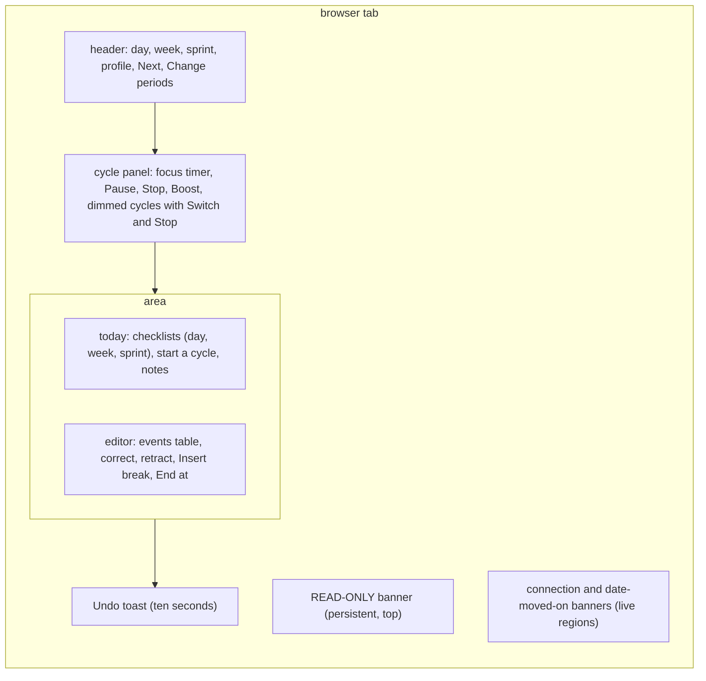
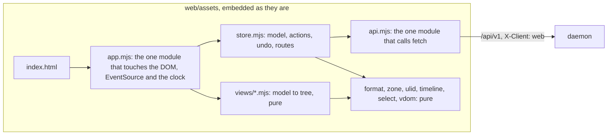

# The pg-task-focus web UI is dependency-free ES modules embedded in the daemon, with its logic testable without a browser

**Status**: Accepted (resolves `pg2-t7me1.3`). The framework and layout choices are the web UI designer's, not the operator's, and await the operator's confirmation: see "To reverse it".
**Date**: 2026-10-10
**Deciders**: phillipg (the interface rulings of 2026-10-08 on epic `pg2-t7me1`); the sub-project 3 designer for the framework and the layout

This ADR records how the `pg-task-focus` web client is built, served and tested. It amends ADR 0091,
whose placeholder page at the root it replaces. The behavior it produces is in
`docs/behavior/pg-task-focus/web-ui.md`; this ADR carries the reasons. The key words MUST, MUST NOT,
SHOULD and MAY are used as in RFC 2119.

## Context

The design left two things to this sub-project: the web UI framework and its visual layout. Five facts
decide them:

- The daemon embeds the UI in its binary and serves it (design: "static assets embedded in the daemon
  binary"), and the Nix build of this repository has no network and no JavaScript toolchain. No package
  of this repository builds front-end code, and a bundler or `node_modules` tree would have to be
  vendored into a fixed-output derivation just for this one page.
- The page is for one person on a loopback service, and it is a safety-relevant client: it must show
  read-only mode, must never guess which cycle an action means, and must show the daemon's own error
  sentences. Those rules are about what the page says and which controls it enables, not about
  rendering throughput.
- The Go build must stay the only gate that always runs (`checks.<system>.pg-task-focus-go-tests`, plus
  the commit-time test runner). A UI whose logic only a browser can exercise would be untested in both.
- Free text the operator types (a skip reason, a note, a label) must never reach a log or telemetry.
  A page that logs to the console, stores to the browser, or loads a third-party script is a leak path
  the daemon's own canary test cannot see.
- The deep-link scheme is fixed by the design: `<public_url>/#/tasks/<task_id>` and
  `<public_url>/#/cycles/<cycle_id>`.

## Decision

1. **No framework, no bundler, no npm: native ES modules served as they are written.** The client is
   about thirty `.mjs` files under `packages/pg-task-focus/web/assets/` and one stylesheet, loaded by
   `index.html` with `<script type="module">`. Nothing is compiled, minified or fetched at build time, so
   nothing has to be vendored and the Nix build is unchanged except that the assets are in the source
   tree it already copies. The browsers the operator uses support native modules, `<dialog>`, `Intl`
   and `EventSource`; there is no polyfill and no support for a browser without them. This is the
   conservative option for this repository, and the reasons it is not a regret are that the UI has five
   screens and one small state tree, and that a framework would be the largest thing in the page.
2. **A tiny virtual-tree renderer makes the whole view a pure function.** Views are functions from a
   model to a tree of plain objects (`h(tag, props, ...children)`), and a patcher of about 150 lines applies the
   tree to the DOM, reusing elements by key and leaving a focused field alone. Because a view produces
   data and not DOM nodes, node's built-in test runner can assert on what the page says and which
   controls are enabled (the read-only rule, the dimmed cycles, the period modal's blocked confirm)
   without a browser, and a fake DOM of about 150 lines tests the patcher itself. This is the main
   substitute for a browser test.
3. **A control that changes something must say so when it is built.** The one function that makes a
   button takes `mutates`, and throws when it is missing. While the store is read-only every control that
   mutates is disabled by that one function, so the rule "every mutating control is disabled or hidden"
   is enforced where a control is made and checked by walking a fully populated tree.
4. **The page is served by two routes and a strict content security policy.** `GET /` serves
   `index.html` and `GET /assets/{name}` serves one embedded file from a fixed list; any other name is
   the existing `not_found` problem. Both go through the same Host and Origin defences as every route.
   The policy allows scripts and styles from the page's own origin only, no inline script, no inline
   style, no frames, no form posts and connections to its own origin only, so a page cannot load or send
   anything elsewhere. The route's metric label is the template `/assets/{name}`, so a probe cannot make
   labels. `api/openapi.yaml` documents the new route, which the route-parity test requires.
5. **Hash routing, in the scheme the design fixes.** The routes are `#/` (today), `#/tasks/<id>`,
   `#/cycles/<id>`, `#/events` and `#/events/<id>`. A deep link to a task or cycle that is not in the
   current state is answered from its events (a stopped cycle, a task of an earlier period), so a link
   in an attention item never lands on nothing.
6. **The browser's own clock never decides anything but how a timer moves between reads.** A timer shows
   the server's remaining seconds at the server's read, less the time since the page received that read
   on the page's own clock, so a skewed browser clock shows the right time. Every instant sent is an
   RFC 3339 instant, and every time the operator types is read in a named zone (the active day
   period's, shown beside the input), converted by an explicit rule that follows the design's
   nonexistent and repeated civil-time rules.
7. **The before-and-after timeline of "Insert break" and "End at" is computed in the page.** The daemon
   has no dry run for these two requests, only candidate replay at confirm. The page derives the cycle's
   running segments from its events, applies the proposed change, and shows both, and says that the
   daemon checks the change when the operator confirms. The page does not copy the daemon's rules: it
   shows an arithmetic result, and every refusal is the daemon's own. If the operator wants the preview
   itself validated, the smaller change is a `dry_run` on those two endpoints, not more rules in the
   page (a reversible follow-up, recorded as a realization gap in the behavior docs).
8. **The page emits nothing but its requests.** It has no telemetry, writes nothing to the console, and
   uses no browser storage, beacon or cookie. Every request carries `X-Client: web` and no `traceparent`
   (the design: "the browser has no OpenTelemetry"); the daemon makes the trace id and returns it in
   `traceresponse` and in a problem body, and the page shows that id beside an error so a bug report
   can name the request. Recently used skip reasons are read back from the corrected event log, not
   stored in the browser. A test fails if a source file uses the console, storage, a beacon, a
   cross-origin URL or a request outside the API client.
9. **Node tests run inside the Go test gate.** The client logic is tested with `node --test` (no
   dependencies). A Go test runs it when `node` is on `PATH` and fails the build when it is not and
   `PG_TASK_FOCUS_REQUIRE_NODE=1` is set, which the Nix check sets by adding `nodejs` to `testDeps`
   (the same shape as `pg-desk-shadow-go-tests`'s `sqlite`). A second Go test starts the real daemon
   with its fake clock and runs the page's own store and API client against it, so a field named wrong in
   the page fails the build, not the operator's morning.

## Layout

The cycle panel sits above both areas, so the running timer and its controls are visible without
scrolling in every area. On a wide screen the checklists and the cycle panel sit side by side and the
panel stays in view while the checklists scroll.

## Consequences

### Positive

- Nothing to install, vendor or update: no `package.json`, no lock file, no network, no new Nix
  derivation, and nothing a dependency bump can break.
- The rules that matter (read-only disables everything that mutates, a cycle is always named, the
  daemon's sentence is shown) are asserted by tests that run on every commit and in the Nix check.
- One origin, one strict policy, no third-party code: a page the operator opens can neither send what
  they type elsewhere nor load code that could.

### Negative

- No browser engine in the gate: layout, focus order as a screen reader announces it, colour contrast
  and real `EventSource` reconnection are not exercised by any automated test here. The behavior doc
  lists them and the hand-over names the checks to run once after `pn workspace apply`.
- Hand-written view code is more verbose than a template language, and the patcher is a second thing to
  maintain; its tests are its only guard.
- The timeline preview is arithmetic in the page, so it can differ from the daemon's verdict. The
  daemon's refusal at confirm is authoritative, and the page says so.
- Modern-browser only. An old browser shows the page's `<noscript>` text and a blank app.

### Neutral

- The assets are served with `Cache-Control: no-cache` and a content hash as `ETag`, so a new binary's
  page is picked up on the next load and a cached page costs one conditional request.
- `public_url` is still the consuming flake's: the deep links the daemon builds already point at the
  routes above.

## To reverse it

To adopt a framework later, replace `web/assets/views/*.mjs` and `vdom.mjs`: `store.mjs`, `api.mjs` and the
pure modules take no part in rendering, and the node tests of them stay valid. To drop the page's own
timeline preview, add `dry_run` to `POST /cycles/break` and `POST /cycles/stop` in the contract and make
`timeline.mjs` render the daemon's answer. Nothing in the log, the API's existing endpoints or the
library changes either way.

See also: `phillipgreenii-nix-agent-support` ADR 0088 (the library this shows), ADR 0091 (the daemon
that serves it and the contract it speaks).
