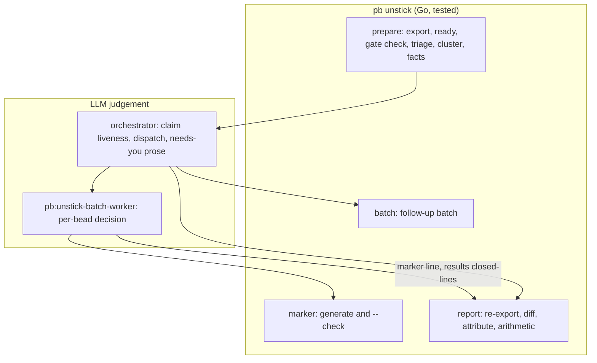
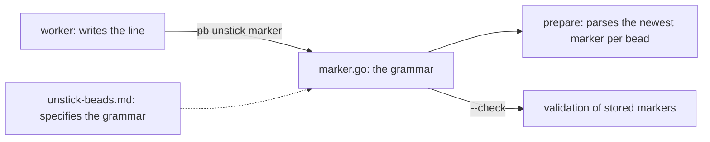

# The unstick sweep's deterministic stages live in pb, and the marker grammar is an inter-component contract

**Status**: Accepted (extends 0089; resolves `tc-w08kk`)
**Date**: 2026-10-10
**Deciders**: Phillip Green II

## Context

`/pb:unstick-beads` sweeps the open-but-not-ready beads of a pn-workspace. Until now its command
document specified eight stages in prose, and the orchestrating model executed the mechanical ones
(inventory, pre-triage, clustering, fact sheets, and the closing arithmetic) by hand with jq. A
prototype script reproduced thirteen defects against that prose (a non-ready bead with no open
blocker skipped silently, an O(n^2) scan, an oversize cluster chopped by slice rather than by
adjacency, in-place label sorting, locale-dependent ordering, a marker regex whose outcome class
could span newlines, dependents wrongly counted as marker-skip inputs, and others). Operator ruling
(Phillip, 2026-10-10, verbatim): "deterministic work should be in a script; it needs tests and must
ship in the plugin."

Two things were true of the old design. First, the sweep marker was already a contract between three
components that never saw each other: a batch worker WROTE it (hand-built, with a hand-read `date`),
the next sweep's triage PARSED it, and the command document SPECIFIED it. Second, nothing checked
that the three agreed, so a worker that wrote a date-only marker silently made its bead look
unmarked forever.

## Decision

### 1. The deterministic stages are `pb unstick`

The Pipeline's mechanical stages become subcommands of `pb`, tested in Go against synthetic
fixtures. The LLM keeps only judgement.

| Stage                        | Owner now                 | Why                                                          |
| ---------------------------- | ------------------------- | ------------------------------------------------------------ |
| inventory, triage, cluster   | `pb unstick prepare`      | pure functions of an export plus an injected clock           |
| fact sheets                  | `pb unstick prepare`      | an explicit projection of the export                         |
| follow-up batch              | `pb unstick batch`        | same projection, for ids named later                         |
| marker authoring, validation | `pb unstick marker`       | one grammar, one implementation                              |
| closing counts, attribution  | `pb unstick report`       | arithmetic and a documented heuristic                        |
| claim release, dispatch      | the orchestrator (manual) | proving a claimer dead and sequencing workers are judgements |
| per-bead decision, services  | worker / orchestrator     | needs reading the bead and the world                         |
| "needs you" prose            | orchestrator              | composition                                                  |



This extends ADR 0089's pattern: ADR 0089 pulled the per-bead protocol out of an interactive command
into a shared skill so that two callers share one reviewed body (Extract Function applied to a
prompt). This decision applies the same seam one level down: whatever has a single correct answer
for a given input is extracted from the prompt into code behind a CLI (the prompt keeps SELECTION
and JUDGEMENT; the code holds the deterministic EXECUTION). The command document becomes the caller
that invokes the subroutine, plus a short reference that explains WHY the rules are what they are.

Rules (RFC 2119):

- The orchestrator MUST run `pb unstick --help` before anything else and MUST stop with "pb too old
  or not installed; run pn workspace apply" if it fails. The pb package is default-off while the
  plugin is default-on, so the plugin can exist without the CLI, and the command MUST NOT fall back
  to hand-computed stages.
- The orchestrator MUST NOT hand-compute triage, batches, fact sheets, counts or attribution.
- `pb unstick` commands MUST exit `0` ok, `1` usage, IO or internal error, `2` a `bd` call failed.
- Outputs MUST be deterministic: sorted by id, and the same export with the same clock MUST yield
  byte-identical files. The clock is injected, never read inside pure logic.
- Domain packages MUST import `internal/bd`, and `internal/bd` MUST NOT import a domain package
  (the dependency runs one way). `bd` therefore returns raw output and the domain package parses it.

### 2. The marker grammar is a contract, owned in one place

```text
[unstick YYYY-MM-DDTHH:MM:SSZ] <outcome>: <reason>; recheck-when: <YYYY-MM-DD | <bead-id> closes | on-change>
```

The three components relate as follows.



- The grammar MUST be defined once, in `packages/pb/internal/unstick/marker.go`. The writer
  (`pb unstick marker`), the reader (`prepare` triage) and the validator (`marker --check`) MUST all
  use that definition.
- A worker MUST generate a marker with `pb unstick marker` and MUST NOT build one by hand or read
  the clock itself. A marker that does not match the grammar (date-only, non-`Z` timestamp, missing
  `recheck-when`, an outcome outside `[a-z][a-z-]*`, a reason holding a newline, backtick, `$`, a
  quote or the text `; recheck-when:`) MUST count as no marker, and `prepare` MUST report such beads
  as malformed rather than hide them.
- The command document and the worker document MAY show example marker lines, and every example
  MUST parse under `pb unstick marker --check`.
- A second, narrower contract rides with it: for every bead a worker closes it MUST append a line
  `closed <bead-id>: <reason>` to `WORKDIR/results/<BATCH>.md`. Everything else in that file is free
  text and ignored. `report` uses these lines for attribution.

### 3. Attribution is a heuristic, and that is stated

bd records no closer. `report` therefore attributes a change to the sweep only when the bead is in a
dispatched batch AND it carries a non-`unchanged` marker at or after the sweep start, or it was
closed and is listed as closed in a results file. Every other change in the window is credited to
peer sessions. Reports MUST say "attributed", not "proved".

### 4. One recorded deviation from the earlier prose

The old LIVE rule let a target with no open blocker satisfy "every open blocker is LIVE" vacuously.
A non-ready bead with no open `blocks` blocker is unexplained, so it MUST go to REVIEW and MUST NOT
be live-skipped. Also, a blocker absent from the export is unknown and MUST force REVIEW, in the
marker-skip path as well as the LIVE path.

## Consequences

- The behavior is covered by unit, golden and (tag-gated) real-`bd` contract tests, and ships
  in the pb package, so a plugin fix and a rule fix land in one change.
- The plugin needs the `pb` CLI on PATH. Where it is missing the sweep stops loudly rather than
  degrading silently. The operator fixes it with `pn workspace apply`.
- The command document shrinks to dispatch, judgement and a short rationale. The rationale can
  drift from the code; the example-marker rule above is the part that is checked.
- Accepted: no plugin version bump. The plugin's `version` field was not bumped by the earlier
  command-only changes (the `/drain-beads` edits and ADR 0089's extraction), and the marketplace
  content is served from the nix store, so a changed command body is picked up on apply without it.
- A drift test tying the documents' example markers and the excluded-label list to the code is a
  follow-up, not part of this decision.
- Rejected: leaving the stages in prose (the prototype's defects came from exactly that). Rejected:
  a `pb unstick log` command (a single writer can append with a plain echo). Rejected: a flag to
  name the actor on `report` (attribution does not use it).

## Cross-references

- ADR 0089 (drain roles apply the shared `pb:drain-one` skill): the extraction pattern this
  decision applies one level down.
- Command, worker and CLI: `claude-marketplace/pb/commands/unstick-beads.md`,
  `claude-marketplace/pb/agents/unstick-batch-worker.md`, and `packages/pb/internal/unstick/`
  with `packages/pb/cmd/pb/unstick*.go`.
