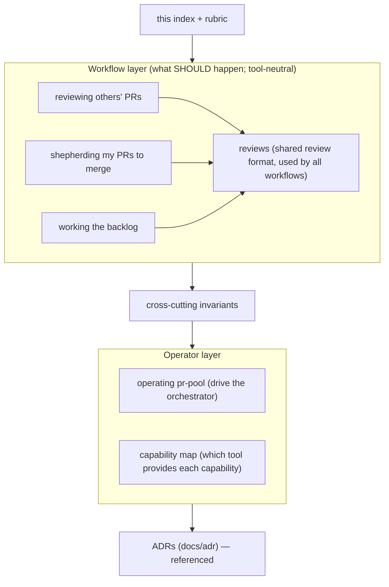

# Source-of-truth docs

These documents describe **how the system should work** — from my perspective as a
user — in terms of user stories, journeys, constraints, goals, and invariants.
They are the **source of truth**. They sit **above** specs, designs, plans, and
code.

## How to use them

- **Start here.** Any question about intended behavior is answered here.
- **Change here first.** A new feature or behavior change begins by editing the
  relevant truth doc; then a spec → design → plan is derived to reach the new
  described state, and code is changed to match.
- **Downstream is disposable.** Specs, designs, and plans are working artifacts;
  once the code matches the truth docs again, they can be thrown away. The truth
  docs persist.
- **Tie decisions back here.** Decisions of lasting consequence are recorded as
  ADRs (in `docs/adr/`) and referenced from the relevant truth doc.
- **Gaps and contradictions are expected.** These docs are evolving; where
  something is undecided it's captured as an explicit **Open question** rather than
  guessed.

## What belongs in a truth doc (and what doesn't)

| In a truth doc                                          | Not here (lives downstream: spec/design/plan/code) |
| ------------------------------------------------------- | -------------------------------------------------- |
| User stories ("As a user, I want…")                     | File/function entry points, `file:line`            |
| Journey narratives + mermaid diagrams                   | Test names, code-coverage goals                    |
| Invariants / business rules (MUST / MUST-NOT)           | "current vs past vs future" state of the code      |
| Goals & constraints (incl. the budget concept + limits) | Which tool implements it (→ capability map only)   |
| Example user-visible output & error messages            | Internal data schemas, function signatures         |
| Usage scenarios (commands to do & verify a thing)       | Sequencing/phasing of the work                     |
| Failure conditions per workflow                         | Retry counts / timeouts as constants               |
| Open questions (gaps are OK)                            |                                                    |

## The map

## Documents

- **[reviewing others' PRs](reviewing-others-prs.md)** — team/requested/labeled PRs
  I don't own; first-pass agent draft reviews.
- **[shepherding my PRs to merge](shepherding-my-prs.md)** — my authored PRs from
  creation to merge; stacked PRs; only I merge.
- **[working the backlog](working-the-backlog.md)** — pulling, triaging, routing,
  and doing backlog work with a do→review→resolve loop; not all work ends in a PR.
- **[reviews](reviews.md)** — what a review is and its output format
  (whole-review / per-file / per-block comments); shared by every workflow above.
- **[cross-cutting invariants](invariants.md)** — rules that hold across every
  workflow (continuity, authority, tracking-object lifecycle, budget,
  observability).
- **[operating pr-pool](operating-pr-pool.md)** — how you drive the orchestrator
  (drain, config-defined roles, run-to-empty); workflow-agnostic.
- **[capability map](capability-map.md)** — which tool provides each capability
  today; the one place tool names concentrate.

## Relationship to downstream docs

The prior `docs/pr-review-flow.md` (code paths, tests, tool details, current-state
framing) is **downstream** of these truth docs — an implementation reference that
maps invariants to how they're realized today. It is **not** a source of truth and
may lag; when it and a truth doc disagree, the truth doc wins.
