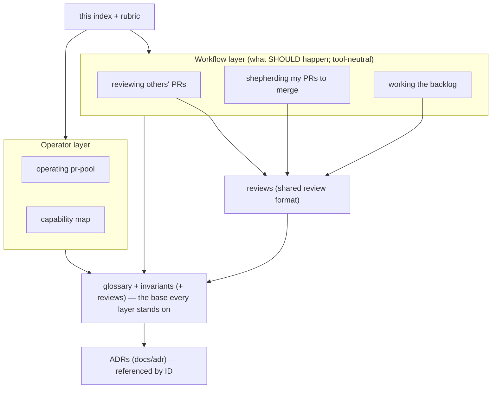

# Source-of-truth (behavior) docs

These documents describe **how the system should work** — from my perspective as a
user — in terms of user stories, journeys, constraints, goals, and invariants.
They are the **source of truth**. They sit **above** specs, designs, plans, and
code. New to the vocabulary? Start with the [glossary](glossary.md).

## How to use them

- **Start here.** Any question about intended behavior is answered here.
- **Change here first.** A feature or behavior change begins by editing the
  relevant behavior doc; then a spec → design → plan is derived to reach the newly
  described state, and code is changed to match.
- **Downstream is disposable.** Specs, designs, and plans are working artifacts;
  once the code matches these docs again they can be thrown away. These docs persist.
- **Cite invariant IDs.** Every invariant has a stable ID (e.g. `INV-TRACK-2`);
  downstream specs/designs/ADRs/tests reference the ID they implement or verify, so
  the durable `invariant → check` link outlives the disposable spec.
- **Tie decisions back here.** Decisions of lasting consequence are recorded as
  ADRs (`docs/adr/`) and referenced from the relevant doc. **Adding or changing an
  invariant SHOULD reference an ADR** recording the decision.
- **Gaps and contradictions are expected.** Where something is undecided it's an
  explicit **Open question**, not a guess.

## Design principles for the system these docs describe

- **Keep the orchestrator minimal.** `pr-pool` orchestrates and nothing more; _how_
  work happens is defined by **configuration and extensions**, not baked into the
  tool. See [operating pr-pool](operating-pr-pool.md).
- **Org/repo-specific behavior lives in org/repo-specific repositories** — never in
  the generic tools. This is also why the doc set splits into a shareable base and
  a per-project overlay (below).

## What belongs in a behavior doc (and what doesn't)

| In a behavior doc                                       | Not here (lives downstream: spec/design/plan/code) |
| ------------------------------------------------------- | -------------------------------------------------- |
| User stories ("As a user, I want…")                     | File/function entry points, `file:line`            |
| Journey narratives + mermaid diagrams                   | Test names, code-coverage goals                    |
| Invariants / business rules (MUST / MUST-NOT) with IDs  | "current vs past vs future" state of the code      |
| Goals & constraints (incl. the budget concept + limits) | Which tool implements it (→ capability map only)   |
| Example user-visible output & error messages            | Internal data schemas, function signatures         |
| Usage scenarios (commands to do & verify a thing)       | Sequencing/phasing of the work                     |
| Failure conditions per workflow                         | Retry counts / timeouts as constants               |
| Open questions (gaps are OK)                            |                                                    |

Examples are **illustrative** unless labeled **golden** (asserted by a real test).
Illustrative examples show intent; they are not guaranteed byte-accurate.

## Shared base vs. per-project overlay

To scale to multiple tools/repos without copy-paste drift, the set is layered:

- **Shared base** (reusable across projects): [glossary](glossary.md),
  [invariants](invariants.md), [reviews](reviews.md). Other projects import these
  by reference (cite the invariant IDs) rather than copying them.
- **Per-project overlay** (specific to _this_ orchestrator + its repos): the
  workflow docs, [operating pr-pool](operating-pr-pool.md), and the
  [capability map](capability-map.md). Organization-specific configuration lives
  in that organization's own repositories, not here.

## The map

## Documents

- **[glossary](glossary.md)** — shared vocabulary; read first.
- **[reviewing others' PRs](reviewing-others-prs.md)** — team/requested/labeled PRs
  I don't own; first-pass agent draft reviews.
- **[shepherding my PRs to merge](shepherding-my-prs.md)** — my authored PRs to
  merge; stacked PRs; merge authority per integration style.
- **[working the backlog](working-the-backlog.md)** — pulling, triaging, routing,
  and doing backlog work with a do→review→resolve loop; not all work ends in a PR.
- **[reviews](reviews.md)** — what a review is and its output format
  (whole-review / per-file / per-block comments); shared by every workflow.
- **[cross-cutting invariants, goals & concepts](invariants.md)** — the ID'd rules
  that hold across every workflow.
- **[operating pr-pool](operating-pr-pool.md)** — how you drive the (deliberately
  minimal) orchestrator; workflow-agnostic.
- **[capability map](capability-map.md)** — which tool provides each capability
  today; the one place tool names concentrate.

## Keeping these docs honest

- **Drift anchor.** These docs describe intended behavior; reality can lag. A
  periodic conformance pass reconciles each invariant and each open question against
  what the code actually does, and closes questions already decided elsewhere. Open
  questions have an owner and a resolution path (resolve → update the doc → ADR if
  consequential).
- **Downstream reference.** `docs/pr-review-flow.md` (code paths, tests, tool
  detail, current-state framing) is **downstream** — how the review flow is realized
  today. It is not a source of truth and may lag; when it and a behavior doc
  disagree, the behavior doc wins.
