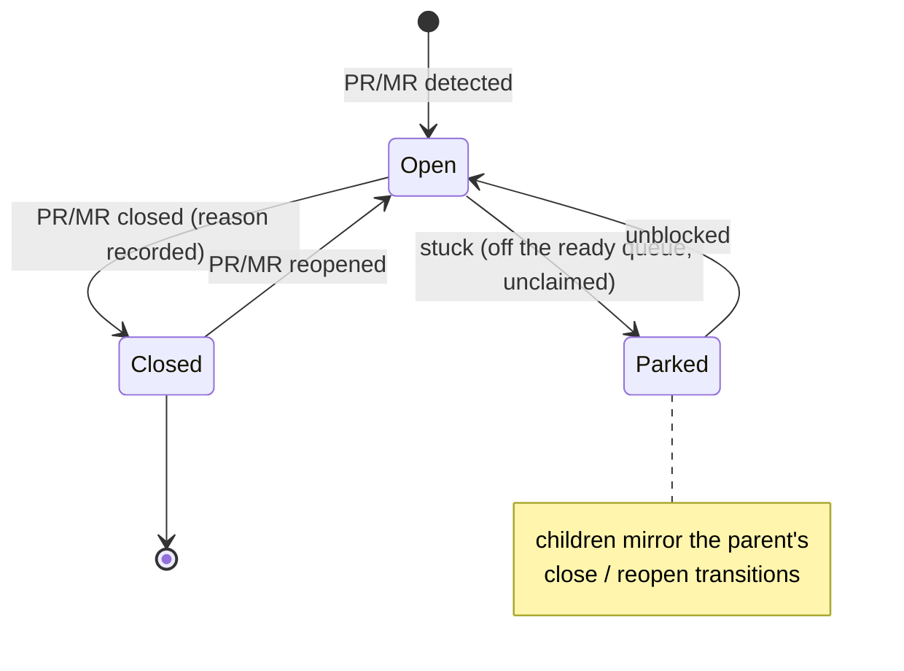

# Truth: Cross-cutting invariants

**Status:** Living source of truth. These rules hold across **every** workflow;
the workflow docs reference them rather than restate them.

## Continuity

- **Work is never lost.** On error or failure, the system does reasonable retries.
  If it still can't proceed, it loops me in — nothing in flight is silently dropped.
- **A stuck item does not stop the system.** When an item gets stuck: save and
  clean up anything related to it, record the situation on a tracking object
  (existing or new), **mark it so it does not surface as ready** until it's
  unblocked, unclaim it, and **continue with other work**. Concurrency is expected
  — the tracker supports many items in flight.
- **Usage limits are handled automatically.** When a provider limit is hit (e.g. a
  rolling multi-hour window), the affected work pauses until the next window and
  then retries. Continuous operation is expected: the only reasons to idle are a
  usage limit or no work to do.
- **A drain runs to empty.** A run keeps working ready items until there is none
  left.

## How work is done

- **Computation over inference.** Prefer deterministic/computational means; use
  inference only for what genuinely requires it. Each capability should be explicit
  about which it uses and why. Work will typically be a mix — the split is a design
  decision, not a default to inference.
- **Do → review → resolve.** Any substantive activity (code, plan, design,
  troubleshooting) passes at least one **independent** review-and-resolve pass
  before it's considered done. Some situations warrant more than one reviewer.
- **Right-sized units.** A change is split so a PR is not too large and does not
  mix concerns; stacked PRs are used when a change is naturally sequential.
- **Clean up.** Completed work leaves no stray branches, worktrees, or tracking
  objects.

## Authority & escalation

- **Feedback authority hierarchy: me > human > agent.** On conflict, the higher
  authority wins.
- **I am the release/merge authority.** Agents never merge or mark external
  tracker items done on my behalf; they escalate to me instead of guessing.
- **Escalation is explicit.** When an agent isn't confident, it flags the item for
  me (the tracker's human signal) rather than proceed.

## Tracking objects

- **One tracking object per PR/MR**, its lifecycle **bound** to the PR/MR:
  - created when the PR/MR is first detected,
  - closed when the PR/MR closes (with the reason recorded),
  - reopened if the PR/MR reopens.
- **Children mirror the parent:** child tracking objects close when the parent
  closes (reason recorded as "parent closed") and reopen when the parent reopens —
  so an accidental close/reopen loses nothing.
- Tracking objects also represent **backlog work items**; the same continuity and
  readiness rules apply.

## Budget

- Work runs under a **budget**. Approaching the budget triggers an orderly
  wind-down (save progress, hand back cleanly); exceeding it stops the work safely
  rather than spending without bound. The budget concept and its limits live here;
  the exact thresholds are downstream configuration.

## Observability

- I can **track and monitor** the system's status from outside it (e.g. a
  dashboard). The system emits the information needed to do that. _(The emission
  mechanism is a downstream/implementation concern.)_
