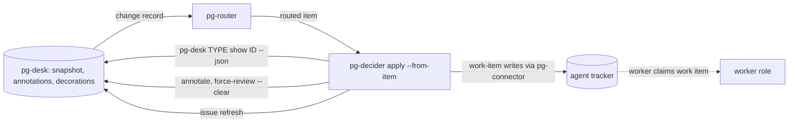

# pg-decider — behavior docs

`pg-decider` decides which work items an entity's current state calls for, and applies them. It
lives at `packages/pg-decider` in this repo and is generic: it MUST contain no organization
identifiers; a deployment repo supplies configuration and role wiring only.

This set describes intended behavior only, at product level: stories, journeys and invariants, with
no implementation detail below that floor. It lands in the same change window as the decider it
describes, and a behavior change to the decider MUST edit these docs in the same change.

## Place in the flow

Three tools cooperate, and each owns one concern:

- **pg-desk** holds state: the entity snapshot, the annotations and the decorations. It decides
  nothing about what work should exist.
- **pg-router** delivers: it routes a changed entity to the decider as an item. It stays generic
  and names no concrete tool or entity rule.
- **The decider** decides and applies: it reads the entity's composite view, works out the work
  items that view calls for, and writes them to the agent tracker.

A decider's write produces a change record that routes back to it. Because a decider is idempotent
(re-running on an unchanged view writes nothing), the next run produces no actions and the loop ends.

## Actors

| Actor       | Interest                                                                              |
| ----------- | ------------------------------------------------------------------------------------- |
| Operator    | Runs `plan` to see what the decider would do and why; reads the audit trail           |
| pg-router   | Hands the decider a routed item that names the entity; it never decides what to apply |
| Worker role | Claims the work items the decider creates and does the work they describe             |
| Reviewer    | Reads the audit comment on a work item to learn which rule wrote it and why           |
| Tracker     | The source of truth for work items; the decider never rolls a tracker write back      |
| pg-desk     | Serves the view the decider reads and stores the annotations the decider writes       |

## The docs

| Doc                                      | Covers                                                                                                       |
| ---------------------------------------- | ------------------------------------------------------------------------------------------------------------ |
| [`work-items.md`](work-items.md)         | The work-item contract: the six kinds, the bead shapes, the dedup key and the same-context rule              |
| [`plan-and-apply.md`](plan-and-apply.md) | `pg-decider plan` and `apply`, exit codes, precedence, skip reasons, audit, failure escalation, run counters |
| [`config.md`](config.md)                 | The decider configuration file: location, format and keys                                                    |

## The rules

The PR decider evaluates a set of rules against the view. Rule behavior is specified in exactly one
place, the PR rule table of the entity-change-flow design (its decisions are recorded in
`docs/adr/0077-entity-change-flow.md`), and these docs MUST NOT restate any rule's condition. They cite rule ids and state the invariants the rules
uphold. The rule ids registered so far, in evaluation order:

| Rule id                   | Work-item kind it governs |
| ------------------------- | ------------------------- |
| `review.head-advanced`    | `review-pr`               |
| `feedback.digest-changed` | `process-feedback`        |
| `fixci.failing-on-head`   | `fix-ci`                  |
| `focus.item`              | `focus-item`              |

A rule is added to this table in the change that registers it.

The single-home statement above covers the PR rules. One rule lies outside the PR rule table: the
condition of the `focus.item` rule (the rule of the `focus-item` kind, which mints, holds and
releases focus beads) is specified in exactly one durable place, the section "The `focus.item`
rule" of [`work-items.md`](work-items.md). The design document that first described that rule is
not durable, so these docs MUST NOT point a reader there for the condition.

## Invariants

The invariants of this set are numbered `INV-DECIDER-<n>` across the docs, in RFC 2119 language:

- `INV-DECIDER-1` to `INV-DECIDER-6` are in [`work-items.md`](work-items.md).
- `INV-DECIDER-7` to `INV-DECIDER-20` and `INV-DECIDER-25` are in [`plan-and-apply.md`](plan-and-apply.md).
- `INV-DECIDER-21` to `INV-DECIDER-24` are in [`config.md`](config.md).

## Scope

In scope: the `pr` entity type, which carries the PR rules, and the `issue` entity type, whose only
rule is `focus.item` (which also runs for a `pr`). `pg-decider plan` and `apply` accept the types
`pr`, `issue` and `thread`; for a type with no registered rules (`thread`), both exit `1` with a
message saying no decider is registered for that type.

Out of scope for the whole set:

- The conditions of individual rules (the design's PR rule table).
- The pg-desk `sync` stage that the decider replaces; its retirement belongs to the cutover phase.
- The pg-desk annotation verbs and the composite view contract; see
  [`../pg-desk/annotate.md`](../pg-desk/annotate.md) and [`../pg-desk/show.md`](../pg-desk/show.md).
- The deployment wiring that binds pg-router to the decider and renders its configuration file.
