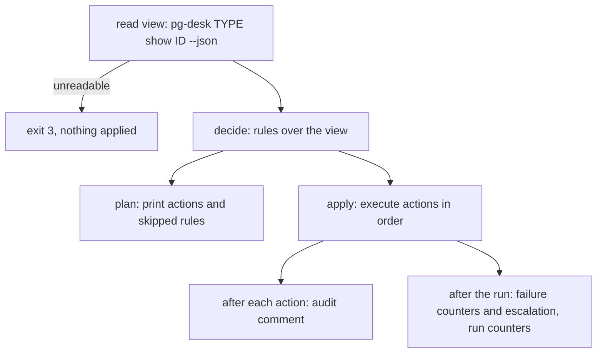

# pg-decider — plan and apply

`pg-decider` has two commands. Both take an entity type and id and decide from the entity's
composite view; only `apply` writes.

```text
pg-decider plan  <type> <id> [--json]
pg-decider apply <type> <id> [--from-item <path|->]
```

`<type>` is `pr`, `issue` or `thread`; today only `pr` has a decider (see
[`README.md`](README.md)). Both commands read the view with `pg-desk <type> show <id> --json` and
nothing else: the decider reads no tracker or forge data directly.



## Deciding

Deciding is a pure function of the view alone. It does not look at why pg-router routed the item,
because delivery is at-least-once and possibly reordered, so the routed kind is only a hint that
something changed. Every run re-derives the whole action set from current state, which is what
makes a decider idempotent: re-running on an unchanged view writes nothing.

The result is an ordered list of actions plus the list of rules that produced no action.

### Actions

Each action names its operation, the work-item kind (empty for an annotation), its target, its
fields, the rule that produced it and the facts the rule keyed on.

| Operation  | Effect                                                                                         |
| ---------- | ---------------------------------------------------------------------------------------------- |
| `create`   | Create a work item; its parent may be the anchor created earlier in the same list              |
| `update`   | Change fields, metadata or labels of an existing work item                                     |
| `reopen`   | Reopen a closed work item; the previous claimant and any deferral are cleared in the same call |
| `close`    | Close a work item, recording the rule id and a summary as the close reason                     |
| `annotate` | Set a decider annotation on the entity, or clear the one-shot force-review flag                |

Actions follow rule order and, within a rule, the order the rule returned them. An anchor create
always precedes every action that is parented to it.

### Precedence

Two stops are evaluated before any rule runs:

1. **hidden**: a hidden entity skips every rule; no rule is evaluated and no action is produced.
2. **suppressed**: a suppressed kind skips only the rules of that kind; every other rule is
   evaluated normally. A rule tied to no kind is never suppressed.

Otherwise each rule is evaluated against the current view.

### Skip reasons

A rule that produced no action is listed with exactly one of five reasons:

| Reason            | Meaning                                                                                        |
| ----------------- | ---------------------------------------------------------------------------------------------- |
| `hidden`          | The entity is hidden, so no rule ran                                                           |
| `suppressed`      | The rule's kind is suppressed on the entity                                                    |
| `already handled` | A work item of the rule's kind already exists for the current context, so nothing is recreated |
| `review-pending`  | `review.head-advanced` only: an open review item already covers the current head               |
| `not matched`     | The rule's own condition is false (also the reason when a rule reports no outcome)             |

The vocabulary is closed. A rule MUST NOT report any other reason.

## `pg-decider plan`

`plan` prints what the decider would do and writes nothing: no tracker write, no annotation, no
comment. It exits `0` for any plan that could be computed, whether or not it lists an action.

The default output is text: a header line with the entity, its relationship, state, readiness,
short head, CI status and conflict flag; a `linked work:` line grouping the linked work items by
kind with their state; an `actions:` block; and a `skipped:` block.

```text
pr acme/widgets#42  co-owned  open  ready  head=9f3c1e2  ci=failing  conflict=no
linked work: anchor (open), process-feedback (open, fbsum:ab12), review-pr (closed, reviewed_head=4b7a0d1)

actions:
  reopen    review-pr         rule=review.head-advanced     head_sha=9f3c1e2 reviewed_head=4b7a0d1
  update    process-feedback  rule=feedback.digest-changed  unaddressed=[c-881, c-902]
  create    fix-ci            rule=fixci.failing-on-head    check=unit

skipped:
  fixci.failing-on-head  suppressed   kind=fix-ci
```

`--json` prints exactly `{"actions": [...], "skipped": [{"rule", "reason", "facts"}]}`, both lists
always arrays (never null), so a program can parse the plan.

## `pg-decider apply`

`apply` re-reads the view, decides, and executes the actions in order. Nothing is printed on
stdout; diagnostics go to stderr.

### The routed item

`--from-item` names the routed pg-router item that triggered the run: a file path, or `-` for
stdin. It identifies the trigger only; it never decides what is applied, and a run without it
applies exactly what the view calls for. Its change-record sequence number (`seq`) is recorded in
the audit comment and used to count failures (below). An unreadable or unparseable item exits `1`
before anything else happens.

### Executing actions

- **Dedup before create.** A `create` that carries a `dedup_key` first looks the key up in the
  tracker's work items, in either key form (see [`work-items.md`](work-items.md)). A hit applies
  nothing and is reported as `deduped`. A lookup that fails or returns an unreadable result fails
  the action rather than creating, because creating without a trustworthy lookup could duplicate.
- **Best effort, in order.** Each action's outcome is `applied`, `deduped`, `failed` or
  `skipped-dependency`. A failure is captured and later actions continue, except those that depend
  on it: a child whose parent is an anchor create that did not apply, and an action marked as
  requiring every earlier action of its own rule.
- **No rollback.** The tracker is the source of truth. A write that was applied stands even when a
  later action or hook fails; the failed work is re-derived by the next item or sweep.
- **Refresh after an external write.** After a `create`, `update`, `reopen` or `close`, the decider
  refreshes the work item in pg-desk (`pg-desk issue refresh`). A failed refresh is staleness that
  a later run repairs, not an apply failure: it is reported on stderr and does not change the exit
  code. Annotations go through pg-desk and need no refresh.
- **Annotations.** An annotation is written through pg-desk's annotate verb with the origin
  `decider:<type>-decider` (for a PR, `decider:pr-decider`) and the configured actor, so the change
  log and `pg-desk <type> history` show who wrote it. The only annotation a decider may clear is
  `force_review` on a PR, through pg-desk's force-review clear path.

### Exit codes

| Code | Meaning                                                                                                      |
| ---- | ------------------------------------------------------------------------------------------------------------ |
| `0`  | Every action was applied or deduped, or none was needed                                                      |
| `1`  | Usage or other error: bad arguments, unknown entity type, no decider for the type, unreadable item or config |
| `2`  | Some actions failed or were skipped for a failed dependency, or a hook failed; captured and retried next run |
| `3`  | The view could not be read; nothing was applied                                                              |

`plan` uses `0`, `1` and `3` the same way; it never exits `2` because it executes nothing.

### The audit comment

Every applied external action appends one comment to the work item it wrote. It is the history the
removed ledger used to hold; together with the change log's origin and `pg-desk <type> history`, it
answers "which rule wrote this, and why".

```text
pg-decider audit
rule: review.head-advanced
op: create
facts: {"head_sha":"abc123","pr":"acme/widgets#42","round":2,"unresolved":["c1","c2"]}
seq: 42
at: 2026-10-05T12:00:00Z
```

- `rule` is the rule id and `op` is the action's operation.
- `facts` is the compact JSON object of the facts the rule keyed on, keys sorted.
- `seq` is the routed item's sequence number, or `none` for a run without `--from-item`.
- `at` is the time of the run in UTC, RFC 3339.

A comment is written for an applied `create`, `update`, `reopen` or `close`. None is written for a
`deduped`, `failed` or `skipped-dependency` action, nor for an `annotate` (pg-desk's change log
already records its origin and actor). If posting the comment fails, the tracker write stands, the
comment is not retried, and the run exits `2`, because the next idempotent run will not re-derive a
comment whose write has already happened.

### Force-review consumption

The one-shot force-review flag asks for a review at the current head regardless of whether the
head moved. The review rule consumes it in a fixed order, once per request:

1. the item actions: create the review item, or reopen and refresh it;
2. the consumption record: an annotation recording the head the request was made at, under the
   key `decider.pr-decider.force_review_consumed`;
3. the clear of the `force_review` flag.

Steps 2 and 3 run only if every earlier action of the rule succeeded. Otherwise each is reported as
`skipped-dependency` (exit `2`) and the flag stays set, so the next run repeats the whole sequence.
Clearing last means a failed run never loses the request.

### Failure escalation

A rule that keeps failing is escalated to a person rather than retried forever.

- **Counting.** A run counts as one failure for a rule when any of the rule's actions failed. A
  `skipped-dependency` outcome is neutral: it neither adds to nor resets the count. A run in which
  all of the rule's actions applied or were deduped resets the count, as does a run in which a rule
  that has recorded state produced no action at all because its condition cleared.
- **Once per routed item.** The decider's own annotation writes re-route the entity, so an
  immediate re-run can carry the same routed `seq`. The count increases only when the run's `seq`
  differs from the one recorded for the last counted failure; a run without `--from-item` always
  counts.
- **Escalating.** When a rule's count reaches K consecutive failing runs (default `3`, set by
  `escalate_after` in [`config.md`](config.md)), the decider creates one `human`-labeled task
  naming the rule, the entity and the last error, parented under the anchor when the view links
  one. It then marks the streak escalated, and a persistently failing rule is not rewritten or
  re-escalated on every poll until a successful run resets it.
- **Retry of a failed escalation.** If the create fails, the error is reported, the run exits `2`
  and the streak stays unescalated, so the next failing run tries again. A known residual risk: if
  the escalation create succeeds but the annotation that marks it fails, the next failing run
  creates a second item.

The state is kept as decider annotations on the entity, so it is visible in the view, under
`decider.<type>-decider.`:

| Annotation key suffix   | Holds                                            |
| ----------------------- | ------------------------------------------------ |
| `failures.<rule id>`    | Consecutive failing runs of the rule             |
| `failure_seq.<rule id>` | The routed `seq` of the last counted failing run |
| `escalated.<rule id>`   | `1` once the streak was escalated, else `0`      |

### Run counters

Each `apply` run that reaches its action list ends by writing exactly one line of JSON to stderr, a
versioned contract that a log shipper can match on the string `pg-decider.run-counters/v1`. The line
is written even for a run that planned nothing.

```json
{
  "contract": "pg-decider.run-counters/v1",
  "type": "pr",
  "id": "acme/widgets#42",
  "rules": {
    "review.head-advanced": {
      "planned": 2,
      "applied": 1,
      "deduped": 0,
      "failed": 1,
      "skipped": 0
    }
  },
  "escalations": 0
}
```

- `rules` is an object keyed by rule id, never null, and holds a rule only if it planned an action.
- `planned` is every action of the rule, and `planned = applied + deduped + failed + skipped`.
  `skipped` counts `skipped-dependency` outcomes, which are not failures.
- `escalations` is the number of escalation items the run created.
- Members MAY be added to `v1`; none will be removed or change meaning.

## Invariants

- **INV-DECIDER-7.** `plan` MUST write nothing: no work-item write, no annotation and no comment.
- **INV-DECIDER-8.** Deciding MUST be a pure function of the view alone and MUST NOT depend on why
  the item was routed; re-running on an unchanged view MUST write nothing.
- **INV-DECIDER-9.** `apply` MUST re-read the view on every run. `--from-item` MUST only identify
  the trigger and MUST NOT decide what is applied.
- **INV-DECIDER-10.** A hidden entity MUST skip every rule, and a suppressed kind MUST skip only the
  rules of that kind. Both stops MUST be evaluated before any rule runs.
- **INV-DECIDER-11.** A skipped rule MUST carry exactly one of the five reasons `hidden`,
  `suppressed`, `already handled`, `review-pending` and `not matched`.
- **INV-DECIDER-12.** A `create` that carries a `dedup_key` MUST look the key up in the tracker
  before creating, and MUST NOT create when the lookup hits or cannot be trusted.
- **INV-DECIDER-13.** Actions MUST apply in order and best effort: a failure MUST NOT stop
  independent actions, and an action that depends on a failed one MUST be reported as
  `skipped-dependency` rather than attempted.
- **INV-DECIDER-14.** `apply` MUST NOT roll back an applied tracker write.
- **INV-DECIDER-15.** After an external work-item write, `apply` MUST refresh the work item in
  pg-desk; a failed refresh MUST NOT make the run fail.
- **INV-DECIDER-16.** Every applied external action MUST append exactly one audit comment on the
  work item it wrote, carrying the rule id, the facts, the routed `seq` and a timestamp. No other
  outcome MAY write one.
- **INV-DECIDER-17.** The exit code MUST be `0` when all actions applied or none were needed, `2`
  when some failed, were skipped for a dependency or a hook failed, and `3` when the view was
  unreadable and nothing was applied.
- **INV-DECIDER-18.** A rule that fails on K consecutive runs, counted once per routed `seq`, MUST be
  escalated as one `human`-labeled work item naming the rule and the error, and a streak MUST NOT be
  escalated twice.
- **INV-DECIDER-19.** The force-review flag MUST be cleared only after the review item actions and
  the consumption record have succeeded; otherwise the flag MUST stay set.
- **INV-DECIDER-20.** Each `apply` run that reaches its action list MUST write exactly one run
  counters line to stderr whose counts satisfy `planned = applied + deduped + failed + skipped` for
  every rule.
