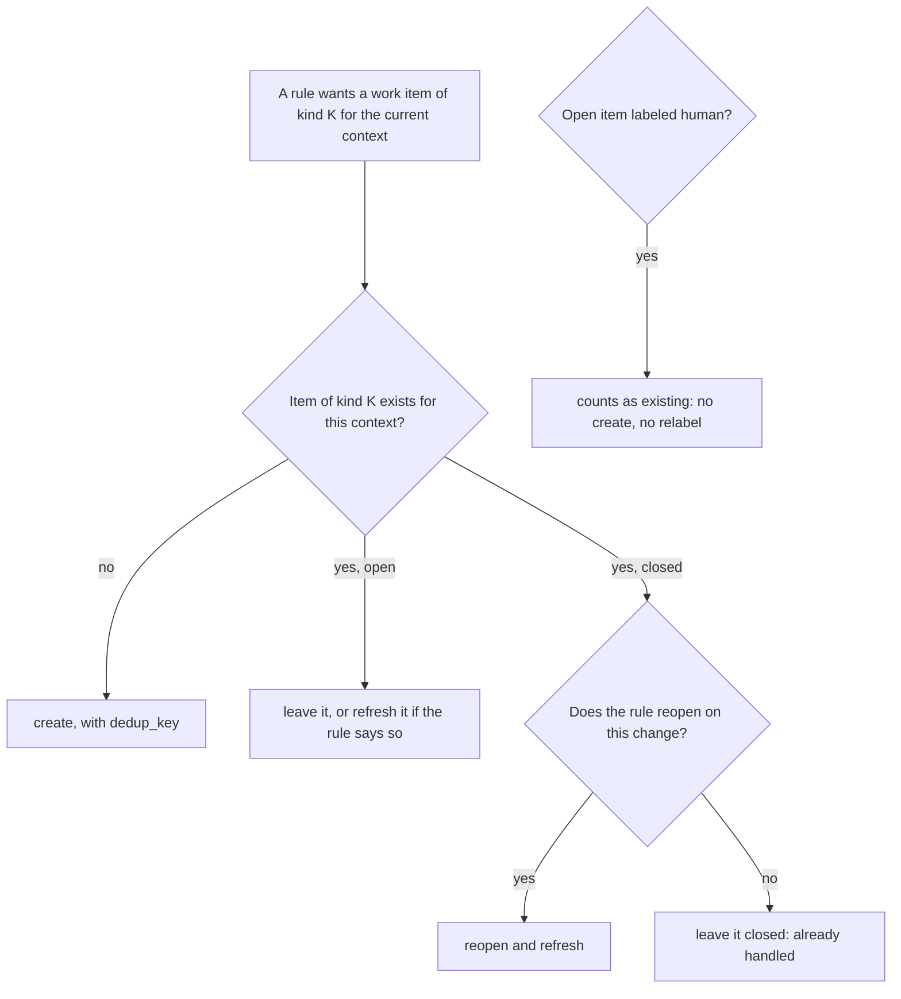

# pg-decider — work items

The decider writes work items to the agent tracker so a worker can claim them. This doc owns the
work-item contract: the kinds, their shapes, the dedup key that makes a write idempotent, and the
same-context rule that stops a decider from recreating work it has already raised. Roles and
workers MUST rely only on the fields in the table below.

## Kinds

There are six work-item kinds. A kind is named by its `kind` id, which is also the kind segment
of its dedup key.

| Kind id            | Table row        | Meaning                                                                 |
| ------------------ | ---------------- | ----------------------------------------------------------------------- |
| `anchor`           | anchor           | The parent of every other kind: one per PR                              |
| `process-feedback` | feedback cycle   | Address the unaddressed review feedback on a PR                         |
| `review-pr`        | review request   | Review a PR at its current head                                         |
| `fix-ci`           | fix-ci           | Fix the failing CI builds on a PR's current head                        |
| `resolve-conflict` | resolve-conflict | Resolve the merge conflict between a PR and its base                    |
| `focus-item`       | focus-item       | The bead that tracks one source entity chosen for focus: one per source |

## Bead shapes

Reproduced from the design of record; any later change MUST land with the sources and prompts that
read these shapes, in the same change:

| Kind             | bd type         | Title                          | Labels                                               | Metadata                                                                                                                                                                                                | Parent |
| ---------------- | --------------- | ------------------------------ | ---------------------------------------------------- | ------------------------------------------------------------------------------------------------------------------------------------------------------------------------------------------------------- | ------ |
| anchor           | `merge-request` | `<repo>#<n>: <pr title>`       | `co-owned` when applicable, `pbase:<n>` while nudged | `repo`, `pr_number`, `state`, `branch`, `base`, `author`, `url`, `draft`, `dedup_key`                                                                                                                   | none   |
| feedback cycle   | `task`          | `process-feedback: <repo>#<n>` | `mine`, `fbsum:<digest>`                             | `repo`, `pr_number`, `branch`, `covered_comments`, `dedup_key`; description is the rendered summary of unaddressed items                                                                                | anchor |
| review request   | `task`          | `review-pr: <repo>#<n>`        | none                                                 | `repo`, `pr_number`, `branch`, `head_sha`, `ownership`, `dedup_key`                                                                                                                                     | anchor |
| fix-ci           | `task`          | `fix-ci: <repo>#<n>`           | `mine`, `worker-ready`                               | `repo`, `pr_number`, `branch`, `head_sha`, `failing_checks`, `failing_builds`, `dedup_key`; description is the failing checks, each with a link to its run                                              | anchor |
| resolve-conflict | `task`          | `resolve-conflict: <repo>#<n>` | `mine`, `worker-ready`                               | `repo`, `pr_number`, `branch`, `head_sha`, `base`, `base_sha`, `dedup_key`; description is the base plus the conflicting files if the backend reports them, else an instruction to rebase onto the base | anchor |

| focus-item | `bug` when the source issue's tracker type is `Bug`, else `task` | `Focus <source ref> - <source title>` | `focus-item` | `source_type`, `source_id`, `focus_hold`, `dedup_key`; description is one line naming the source entity | none |

Notes on the table:

- `merge-request` and `task` are the tracker's issue types. `<repo>`, `<n>` and `<pr title>` are
  the PR's repository, number and title.
- `co-owned` is set only on a co-owned PR. `pbase:<n>` records the pre-nudge priority while a
  conflict nudge is in effect. `mine` is set only for a PR whose relationship to the operator is
  mine or co-owned; a team PR never gets a `process-feedback` or `fix-ci` item.
- `fbsum:<digest>` carries the digest of the feedback set the cycle was last aligned to. When an
  open cycle is updated for more feedback, the old `fbsum` label is replaced by the new one.
- `worker-ready` marks an item a worker can pick up with no further triage. A worker reads these
  fields the same way for every kind and needs no special case per kind.
- `head_sha` on `review-pr` is the REVIEWED head: it advances only when the decider refreshes the
  item for a new head. `ownership` is the PR's relationship to the operator at that time.
- `base_sha` and `branch`, with `base`, name the conflict context of a `resolve-conflict` item.
- The labels cell of a review request is `none`: the decider writes no label on it.
- A `focus-item` bead is not a PR's own work; see "The focus bead" below. Its `<source ref>` and
  `<source title>` are the source entity's reference and title.

### The focus bead

A `focus-item` bead tracks one source entity (a PR, or a tracker issue) that an operator chose for
focus. It differs from the other kinds in these ways:

- **One per source entity.** Its dedup key has no context suffix and no per-day part, so a source
  entity has at most one focus bead for all time.
- **Shape.** The type is `bug` when the source is an issue whose tracker type is `Bug` and `task`
  for every other source, a PR included (`KindContract.IssueTypeFor` in the contract data). The
  title is `Focus <source ref> - <source title>`; it MUST NOT begin with `<ref>: `, which the
  anchor-adoption match would read as a PR's own anchor. The only label is `focus-item`: no `human`
  label and no worker-routing label, because whether a worker takes the bead is the router's
  decision. It is created without an assignee and has no parent.
- **Metadata.** `source_type` and `source_id` name the source entity with neutral field names (they
  carry no focus vocabulary). `focus_hold` is the decider's hold marker: `struck` while the bead is
  held and `released` after. Its values are strings on purpose, not booleans.
- **Priority.** The source's tracker priority through the decider's `focus_priority_map` (see
  [`config.md`](config.md)); an unmapped value, and a PR, which has none, map to `P2`.
- **Link relation.** A view lists a focus bead under the relation `source`, never the PR's own
  `work` relation. The index of a view's work items holds a keyed focus bead like any other keyed
  work item, and `ParseKey` accepts the `focus-item` kind for both `pr` and `issue` entities.
- **Ignored by the PR rules.** The PR rules, `all.closed`, `all.reopened`, `adoption`,
  `adoption.node-id` and the plan's linked-work line MUST ignore a focus bead: a PR whose view links
  a focus bead MUST get the same plan as the same PR without it. A keyless link of relation `source`
  is never adopted, whatever its title looks like.
- **Beads and other issues.** The decider tells a bead from any other issue by one configured
  pattern, `bead_id_pattern` (the same name and meaning as pg-desk's key; see
  [`config.md`](config.md)): an issue whose id matches is a bead and every other issue is not. The
  tracker field of an issue is not that discriminator.

The condition under which a focus bead is minted, held and released belongs to the `focus.item`
rule. Its durable home is the section "The `focus.item` rule" below in this document, which resolves
the single-home statement in [`README.md`](README.md).

### Metadata encodings

Three metadata values hold lists. Each is a comma-separated string, sorted, with no spaces:

| Key                | Holds                                                                  | Example         |
| ------------------ | ---------------------------------------------------------------------- | --------------- |
| `covered_comments` | The ids of the comments this cycle (or an earlier update of it) covers | `c-881,c-902`   |
| `failing_builds`   | The failing builds on this head, each `<run id>:<attempt>`             | `9001:1,9002:2` |
| `failing_checks`   | The names of the failing checks                                        | `lint,unit`     |

`covered_comments` is what "not covered by an earlier cycle" is checked against: the union of the
`covered_comments` of every `process-feedback` item for the PR, open or closed. A cycle created
before the decider existed carries no `covered_comments` and covers nothing.

## The dedup key

Every work item the decider creates carries a `dedup_key` in its metadata. The key lives in the
work item itself, never only in some other store, so a crash between a create and anything else
that follows it cannot mint a duplicate on the next run.

The key is `<type>:<id>:<kind>` plus a context suffix, where `<type>` is the entity type (`pr`,
or `issue` for a `focus-item` bead of a tracker issue),
`<id>` is the entity id (for example `acme/widgets#42`) and `<kind>` is the kind id. The suffix
names the kind's context where that context is narrower than the PR:

| Kind id            | Context suffix                           | Example key                                                      |
| ------------------ | ---------------------------------------- | ---------------------------------------------------------------- |
| `anchor`           | none                                     | `pr:acme/widgets#42:anchor`                                      |
| `review-pr`        | none                                     | `pr:acme/widgets#42:review-pr`                                   |
| `fix-ci`           | `:<head_sha>`                            | `pr:acme/widgets#42:fix-ci:9f3c1e2`                              |
| `resolve-conflict` | `:<branch>:<head_sha>:<base>:<base_sha>` | `pr:acme/widgets#42:resolve-conflict:fix-x:9f3c1e2:main:77aa001` |
| `process-feedback` | `:<digest>`                              | `pr:acme/widgets#42:process-feedback:ab12`                       |
| `focus-item`       | none                                     | `issue:PROJ-1:focus-item`, `pr:acme/widgets#42:focus-item`       |

`<digest>` is the `fbsum` digest the cycle was created with.

### The node_id form

When the entity carries a stable backend id (`node_id`), the same key also exists in a second form
with the `node_id` in place of the entity id: `<type>:<node_id>:<kind>` plus the same suffix, for
example `pr:PR_kwDOabc123:fix-ci:9f3c1e2`. A repository rename or transfer changes the entity id
but not the `node_id`, so matching on either form stops a rename from orphaning existing work
items. The two forms name the SAME identity: a lookup for one form MUST find an item keyed in the
other, and an entity with no `node_id` has only the first form.

## Same-context rule

A work item that exists for the CURRENT context, open or closed, is never recreated. The context
differs per kind:

| Kind id            | The context is                                                 | When the context changes                                                                                     |
| ------------------ | -------------------------------------------------------------- | ------------------------------------------------------------------------------------------------------------ |
| `anchor`           | The PR                                                         | Never: one anchor per PR                                                                                     |
| `review-pr`        | The PR                                                         | The head advances: the one item is reopened and refreshed                                                    |
| `fix-ci`           | The head commit                                                | A new head gets a new item; a new failing build on the same head reopens and extends the existing one        |
| `resolve-conflict` | The branch, head, base and base commit together                | Any of the four changes: a new item                                                                          |
| `process-feedback` | The feedback itself: the comments no earlier cycle has covered | More feedback after a closed cycle: a new cycle; more feedback while a cycle is open: that cycle is extended |
| `focus-item`       | The source entity                                              | Never: one bead per source entity; a closed focus bead is never recreated                                    |

Further, for every kind:

- A closed item is left closed unless its own rule says that a new context reopens it. A hit on a
  closed item is therefore either a reopen (for the kinds above that say so) or nothing at all; it
  is never a second item.
- A merged or closed PR is dead, so the decider creates no work item for it, anchor included, and
  does not reopen one for it, unless the item is the anchor's own mirror or close (see "Terminal
  entities" and `INV-DECIDER-25` in [`plan-and-apply.md`](plan-and-apply.md)). The one other write
  is the `focus.item` hold of an unclaimed focus bead whose source is terminal.
- A changed `fbsum` digest alone is not more feedback. A cycle is raised only for comments that no
  earlier cycle covers.
- Items without a `dedup_key` that belong to the PR (matched by exact title, by the anchor title
  prefix `<repo>#<n>: `, or by `node_id`) count as existing work, so no duplicate is created while
  such an item is waiting to be adopted.
- An open item labeled `human` is parked work. It counts as existing for dedup, and the decider
  MUST NOT recreate it or relabel it.
- Who closed an item, or how, is not recorded by the decider and never changes its behavior. The
  decider reads an item's state only: open, or closed (the `focus.item` rule also reads a focus
  bead's finer status, assignee and hold marker; see "The `focus.item` rule"). There is no notion of
  a closure being dismissed by a person.

## The `focus.item` rule

The `focus.item` rule mints, holds and releases focus beads. It is one rule, registered for both
the `issue` and the `pr` entity types, tied to the `focus-item` kind (so a suppressed `focus-item`
kind skips it) and evaluated after every PR rule. For a PR it runs inside the hidden and suppressed
precedence of [`plan-and-apply.md`](plan-and-apply.md): a hidden or suppressed source gets no focus
bead and no change to the one it has. This section is the durable home of the rule's condition, and
[`README.md`](README.md) names it as the one place a rule's condition lives outside the PR rule
table.

The rule decides from the source entity's own view alone. The view says whether the source is
selected through the annotation `focus_selected`: a period key (a date, `YYYY-MM-DD`) means selected,
and `none`, the empty string and an unset value (`null`) all mean not selected. A value that is
neither a period key nor one of those three is malformed, and the rule skips it as `not matched`
whatever beads exist. A view in which the annotation is ABSENT is not the same as one in which it is
unset: the run fails closed (see "A view without the annotation" below).

**Terms.** A bead is **claimed** when its state is `in_progress` or its assignee is non-empty. It
is **held** only when ALL THREE hold: its status is `deferred`, its `focus_hold` marker is `struck`,
and its assignee is empty. Every other open bead is **in play**. A source is **terminal** when it is
a merged or closed PR, or an issue that is done: for an issue, its status category is `done`, or,
when the tracker gives no category (always for beads), its state is one of `closed`, `done`,
`resolved`, `cancelled`, `canceled` or `wontfix`.

### What the rule plans

| Transition      | When                                                                                                                             | Plan                                                                                                       |
| --------------- | -------------------------------------------------------------------------------------------------------------------------------- | ---------------------------------------------------------------------------------------------------------- |
| `mint`          | The source is selected, live, has no focus bead and its id is not a bead id                                                      | One `create` of the bead shape above                                                                       |
| `hold`          | The source is not selected, and the bead's status is exactly `open`, it is unclaimed and it is not held                          | One `update`: status `deferred`, no end date, metadata `focus_hold=struck`                                 |
| `release`       | The source is selected and live, and the bead is held                                                                            | One `update`: status `open`, deferral cleared, metadata `focus_hold=released`; the assignee is not touched |
| `release`       | The source is selected and live, and the bead is open, unclaimed and carries a stale `struck` marker (it was undeferred by hand) | One metadata-only `update` rewriting the marker to `released`                                              |
| `hold_terminal` | The source is terminal, and the bead's status is exactly `open` and it is unclaimed (selected or not, marker or not)             | The same single `update` as a hold                                                                         |

No bead is minted for a terminal source, nor for an issue whose id matches `bead_id_pattern` (an
epic or a plain bd task: its id already is a bead id; a PR is never one). A reselect of a terminal
source holds, and never releases, its bead. A source that already has a focus bead is never given a
second one, however the first was closed.

Every other state is a skip, with a reason from the closed vocabulary of
[`plan-and-apply.md`](plan-and-apply.md) and a `cause` fact naming the row. A skip of a source that
has a focus bead also carries the bead's id and state.

| Bead state                                                     | Selected source                         | Not selected source             | Skip reason       |
| -------------------------------------------------------------- | --------------------------------------- | ------------------------------- | ----------------- |
| No bead                                                        | `mint` (live) or skip `source-terminal` | skip `not-selected`             | `not matched`     |
| `open`, unclaimed, marker absent or `released`                 | skip `in-play`                          | `hold`                          | `already handled` |
| `open`, unclaimed, marker `struck`                             | `release` (marker rewrite only)         | `hold`                          | `already handled` |
| `in_progress`, or assigned (whatever the status and marker)    | skip `claimed`                          | skip `claimed`                  | `already handled` |
| `deferred`, marker `struck`, unassigned (held)                 | `release`                               | skip `held`                     | `already handled` |
| `deferred` with no marker, or marker `released` (someone else) | skip `deferred-by-someone-else`         | skip `deferred-by-someone-else` | `already handled` |
| `blocked`, `pinned`, `hooked` or any other status              | skip `status-not-open`                  | skip `status-not-open`          | `already handled` |
| `closed`                                                       | skip `closed`                           | skip `closed`                   | `already handled` |
| Terminal source, bead `open` and unclaimed                     | `hold_terminal`                         | `hold_terminal`                 | `already handled` |
| Terminal source, bead held                                     | skip `held-source-terminal`             | skip `held-source-terminal`     | `already handled` |

A terminal source otherwise follows the row of its bead's state (claimed, someone else's, closed and
the rest are left alone). A bead whose item is `open` but has open children is decided here like any
other open bead; whether a hold goes through then depends on the apply step's own live checks, which
[`plan-and-apply.md`](plan-and-apply.md) specifies. A bead a worker or a sweep closed is `closed` to
the rule, which does not read who closed it or why, and the rule never plans a `close` or a
`reopen` for a focus bead. A hold and a release are both `update` actions: the only fields they add
to the action are a status and a deferral clearing.

The plan names its transition in `facts.transition` (`mint`, `hold`, `release` or `hold_terminal`).
The rule is idempotent by construction: after the hold the view shows the marker, so a re-run on an
unchanged view writes nothing; a held bead is only released by a reselect, and a later strike
overwrites `released` with `struck`.

### A view without the annotation

A view whose `annotations` carries no `focus_selected` member at all (an older pg-desk, or a
rollback) MUST fail the run closed: `plan` and `apply` print the reason `view-lacks-focus_selected`
on stderr and exit `3`, before any rule or hook runs and with nothing written. A present `null` is
not absent: it means unset.

## Invariants

- **INV-DECIDER-1.** Every work item the decider creates MUST carry a `dedup_key` of the form
  `<type>:<id>:<kind>` plus the kind's context suffix, and the key MUST live in the work item.
- **INV-DECIDER-2.** A work item that exists for the current context, open or closed, MUST NOT be
  recreated; a decider MAY only reopen or refresh it where its rule says a new context warrants it.
  The one other write is the `focus.item` rule's hold and release of an existing focus bead (a
  status and metadata `update`, never a `reopen` or a `close`), which is a change of the bead's
  availability and not a new item.
- **INV-DECIDER-3.** The `id` form and the `node_id` form of a dedup key MUST be treated as the
  same identity, so that a rename or transfer does not orphan an existing work item.
- **INV-DECIDER-4.** An open work item labeled `human` MUST count as existing work: the decider
  MUST NOT recreate it or change its labels.
- **INV-DECIDER-5.** No decider behavior MAY depend on who closed a work item or how it was closed;
  the decider MUST read only whether the item is open or closed. The `focus.item` rule additionally
  reads a focus bead's other status (`in_progress`, `deferred`, `blocked`, `pinned`, `hooked`), its
  assignee and its `focus_hold` marker, and nothing about a closure: a bead closed for any reason
  reads `closed`.
- **INV-DECIDER-6.** A new feedback cycle MUST be raised only for comments no earlier cycle
  covers; a changed digest alone MUST NOT raise or reopen a cycle.
