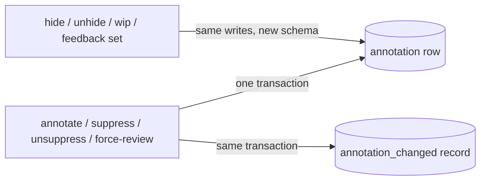

# pg-desk — annotate, suppress, unsuppress, force-review

The annotation verbs write the key/value `annotation` table of the migrated store
(entity-change-flow design 6.9 and 9.6): one row per `(type, id, key)` holding `value`, `origin`,
`set_by` and `set_at`. Every write appends one `annotation_changed` change-log record in the same
transaction, so the change is never visible without its record. An annotation write does not bump
the entity's version.

## Verbs

- `pg-desk <type> annotate <id> --key K --value V [--origin O] [--actor A]` sets key `K` to `V`
  on the entity, replacing any earlier value. `<type>` is `pr`, `issue` or `thread`. `--origin`
  names the writer and defaults to `pg-desk`; it is stored on the row and on the change record.
  `--key` and `--value` are required. A reserved key MUST carry its value shape (below) or the
  verb fails and writes nothing; any other key is stored as given.
- `pg-desk <type> suppress <id> --kind K` sets `suppress.K` to `true`. `unsuppress <id> --kind K`
  removes `suppress.K`; unsuppressing a kind that is not suppressed prints that there was nothing
  to do, appends no record and exits `0`.
- `pg-desk pr force-review <id>` sets `force_review` to the head SHA the PR is at now. It fails
  when the PR has no recorded head commit. It only sets the flag: honoring it once and clearing it
  belong to the deciders.
- `<id>` is resolved as for the other typed verbs: a PR by number, `OWNER/REPO#N` or URL; an
  issue or thread id verbatim. An id with no stored entity fails and writes nothing.
- `set_by` is `--actor`, defaulting to the configured actor; these verbs fail when neither is
  available.

## Reserved keys

| Key                     | Value                                                 | Written by                             |
| ----------------------- | ----------------------------------------------------- | -------------------------------------- |
| `hidden`                | JSON `{"value": true\|false, "reason": string\|null}` | `hide`, `unhide`                       |
| `wip`                   | `true` or `false`                                     | `wip`                                  |
| `disposition.<comment>` | `will-fix`, `wont-fix` or `no-action`                 | `pr feedback set`                      |
| `suppress.<kind>`       | `true`                                                | `suppress`                             |
| `force_review`          | the head SHA it was requested at                      | `pr force-review`                      |
| `ready_to_land`         | `true` or `false`                                     | the land-ready decider, via `annotate` |
| `decider.<name>.<k>`    | any string                                            | deciders, via `annotate`               |

`hidden` and `suppress.<kind>` are steps 1 and 2 of every PR rule's precedence order, so their
shapes are exact. `pr feedback set --disposition open` records the explicit override `open` (the
fourth disposition the feedback verbs accept) as `disposition.<comment>` too.

## Invariants

- **INV-ANNOTATE-1.** Every successful write or removal MUST append exactly one
  `annotation_changed` record in the same transaction as the row change; a failed write MUST leave
  neither.
- **INV-ANNOTATE-2.** A reserved key MUST be written only in its documented shape.
- **INV-ANNOTATE-3.** `force-review` MUST NOT consume or clear a flag; it only sets it.

## Old-schema refusal

`annotate`, `suppress`, `unsuppress` and `pr force-review` have no old-schema counterpart. On an
old-schema store each refuses with the store's error, which says to run
`pg-desk migrate --cutover`, and exits `1`.

## Exit codes

`0` on success (including unsuppressing a kind that was not suppressed); `1` on any error.

## Out of scope

Consuming and clearing `force_review`, and every rule that reads annotations (deciders); showing
annotations (`show`).
