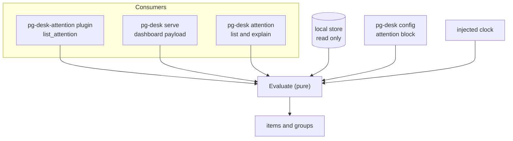

# pg-desk — attention

`pg-desk` decides which of the entities it holds need the operator now. It does so with one pure
evaluator that both consumers call: the `pg-desk-attention` plugin, which feeds the menu bar
through `pg-connector attention list`, and the `serve` dashboard payload. Two operator verbs,
`pg-desk attention list` and `pg-desk attention explain`, expose the same evaluator for debugging.

This is the entity half of the attention contract. A connector's own attention is limited to
what only that connector can see in its data (a calendar event inside its window, an agent session
waiting on a person, a firing alert); whether a PR, an issue or a thread needs the operator is
`pg-desk`'s call (see ADR 0081).

## The evaluator

`Evaluate` is the only entry point. It takes a read-only view of the store (entity rows,
interpretation rows, cross-reference edges, annotations, `meta`), the parsed configuration and a
clock, and returns the surviving items and their groups. It runs four stages in order:

1. **Project.** One view per entity, built from the stored interpretation row (panel, approvals,
   urgency, match reasons, ready-to-promote, degraded) plus the narrow facts a rule needs that the
   interpretation does not carry. The failing-check set is derived through the same CI rollup the
   dashboard and `pg-desk links` use, so the menu bar, the build links and the dashboard cannot
   disagree about what is failing. The projector MUST NOT re-implement the interpretation rules.
2. **Raise.** Every enabled rule kind sees each view and returns zero or more candidates, each
   with a rule kind, severity, reason and the time it began. Rule kinds are independent of one
   another.
3. **Suppress.** A candidate is dropped, with its reason recorded, by the first applicable of:
   1. the entity is hidden (on an unmigrated store, through the old annotation column), and a
      `wip` own PR SHOULD also suppress the `pr.own-*` rules;
   2. the entity carries `suppress.attention`, or `suppress.<rule kind>` for the candidate's own
      kind (steps 1 and 2 of every PR rule's precedence order in [`annotate.md`](annotate.md));
   3. a registered context suppressor claims it. The chain is open to further suppressors that
      look at the entity's neighbours; the first is `blocked-by-open-dependency` (see "Dependency
      suppression").
4. **Group and rank.** See "Grouping and order".

Which parts are fresh at read time, so that no reader assumes more than is true:

- **Computed at every read:** the suppression chain, grouping and ordering, and any rule that
  depends on the clock.
- **Computed when the entity was last hydrated:** the stored interpretation row the first rules
  project. Those rules are exactly as fresh as the last hydration of the entity, and an input
  inside interpretation that depends on a sibling stays stale until the entity itself is
  re-hydrated. Only the own-PR CI rule re-derives its fact at read time, from the stored CI
  facts.

An entity with surviving candidates yields exactly one item. The most severe candidate is the
item's primary reason, and the summary says how many others the entity raised. The item's `type`
is the entity type (`pr`, `issue`, `thread`) and its `id` is the entity id, so the item's
`{type, id}` is directly a valid ref for [`links.md`](links.md).

## The initial rule set

The first rules add no new notion of "needs me". They start from the dashboard's existing
definition, the two "awaiting me" panels (see [`interpret.md`](interpret.md)), and break it out by
reason so that severity and summary say why.

| Rule kind             | Raises when                                                                                                                                                                                                                                                 | Default severity                        |
| --------------------- | ----------------------------------------------------------------------------------------------------------------------------------------------------------------------------------------------------------------------------------------------------------- | --------------------------------------- |
| `pr.review-requested` | A team PR is in panel `team_awaiting_me`: a live review request on the operator, not hard-blocked.                                                                                                                                                          | `medium`                                |
| `pr.own-ci-failing`   | An own, open, non-draft PR whose CI rollup state is `failure` after the `check_interpreters` exclusions. It does not use the panel as its trigger, does not fire for a `none` or `pending` rollup, and does not apply the `review_exempt_checks` softening. | `high`                                  |
| `pr.own-needs-action` | An own, open PR in panel `mine_awaiting_me` for a cause other than CI: human changes requested, bot disapproval, merge conflict, unresolved thread, or approved and ready to land. It MUST NOT raise when CI, or a `none` rollup, is the only cause.        | `medium` (`low` for approved and ready) |

- **Why the CI rule reads the rollup state.** `review_exempt_checks` softens only the review
  state that decides the panels; it never changes what is reported as failing (the same statement
  [`links.md`](links.md) makes for build links). A `none` rollup puts an own PR in the panel but
  raises no CI item, and `pr.own-needs-action` excludes CI-only causes so that the two rules never
  report one cause twice.
- **One exclusion list.** The CI rule uses the same `check_interpreters` patterns as the CI
  rollup and the build links. There is no separate attention-only exclusion setting.

### Issue rules

An `issue` entity needs no interpretation row: it is projected from its stored facts, and its
rules read those facts and the injected clock. Which statuses mean "In Progress" comes from
configuration (`jira.in_progress_statuses`, matched case-insensitively), not from the tracker.

| Rule kind                 | Raises when                                                                                                                                                                                                                    | Default severity |
| ------------------------- | ------------------------------------------------------------------------------------------------------------------------------------------------------------------------------------------------------------------------------ | ---------------- |
| `issue.stale-in-progress` | An issue assigned to the operator is In Progress and the operator has not updated it for at least the threshold (default 7 calendar days). The summary says how many whole days it has been, and the item is the issue itself. | `medium`         |

- **What counts as an update by the operator.** The operator's own comment or status transition.
  An update by anyone else, or by a bot, never resets the clock.
- **Where the age is measured from.** The later of the operator's last update and the moment the
  issue entered In Progress. An issue the operator never updated is therefore measured from its
  In Progress entry, and an issue someone else only recently moved into In Progress is not
  reported as long neglected.
- **Unknown is not zero.** An issue not assigned to the operator, or one whose operator facts the
  connector could not supply, never raises (INV-ATTNEVAL-6). Reassigning the issue, moving it out
  of In Progress, or the operator updating it clears the item on the next evaluation, because the
  rule is computed at every read against the stored facts and the clock.
- **One item.** The item's `{type, id}` is `{issue, <key>}`, a valid ref for
  [`links.md`](links.md), which gives the menu bar and the dashboard the issue's page.
- **Known gap.** The connector's changelog carries status transitions only, so an operator edit of
  some other field does not count as an update.

## Configuration

The `attention` block of the `pg-desk` configuration (the same file `serve` and the plugin read,
so they share one source of truth):

| Key                                       | Default                                                         |
| ----------------------------------------- | --------------------------------------------------------------- |
| `attention.rules.<kind>.enabled`          | `true` for every kind                                           |
| `attention.rules.<kind>.severity`         | as in the rule table                                            |
| `attention.rules.<kind>.stale_after_days` | `7` for `issue.stale-in-progress`, the only kind that has it    |
| `attention.ordering.ties`                 | severity descending, then group size descending, then entity id |

`attention.ordering.ties` admits only its default (leaving it unset is the same): any other value is
a configuration error at load, so a deployment cannot believe it re-ordered the feed when it did
not. An unknown rule kind in the block is a configuration error at load, and so is
`stale_after_days` that is not a positive whole number, or that names a kind without that
parameter. A missing kind takes its
built-in default, so a deployment with no `attention` block works. The home-manager module renders
this block from `phillipgreenii.programs.pg-desk.attention`.

## Grouping and order

Each item belongs to the work context of its entity. The group key is the first that applies:

1. The issue the entity cross-references with relation `jira`. With several, the
   lexicographically smallest key, so the result is deterministic.
2. Otherwise the PR stack: the connected component of the dependency graph, named by its root PR
   (defined below).
3. Otherwise the work item that tracks it (relation `work`).
4. Otherwise a singleton group keyed by the entity.

A group anchored on an entity carries a key that is itself a `<type>:<id>` ref (`issue:<key>`,
`pr:<owner>/<repo>#<n>`), so a consumer can ask [`links.md`](links.md) for the group's related
links in the one call it already makes for the items. The group's label is for display.

Within a group, items are ordered most urgent first (severity descending, then entity id). Groups
are ordered by their most urgent item's severity descending, then by size descending, then by that
item's entity id; the group key makes the order total. When several issues (or several work items)
qualify, the lexicographically smallest id is the key. The cross-reference and stack levels are
read for pull requests; an entity of another type is its own singleton group. A group holds only
items that survived suppression: a suppressed entity neither joins a group nor counts toward its
size. A cross-reference that cannot be read is an error, never an ungrouped result. `Evaluate` computes this once and emits items
in that canonical order. A consumer MUST NOT apply a second ordering: it groups by `group.key` in
order of first appearance in the feed and keeps feed order inside each group, which reproduces the
evaluator's order for this source's items. Items from other sources have no group and are
singletons in feed order.

A consumer MUST NOT infer a group's size or completeness from a capped feed: a cap truncates the
item list, not groups. The full groups are available from the dashboard payload and from
`pg-desk attention list`.

**The PR stack.** The stack of a PR is the connected component, over the dependency graph of
"PR dependencies" in [`links.md`](links.md), that holds it. Edges are followed in both directions
from every source registered there (the `stack` source on both schema versions, an external
`depends_on` link on the migrated store), and only through open PRs: a merged or closed PR, or one
with no stored row, is not part of any stack and does not join the PRs on either side of it. A PR
with no open dependency and no open dependent is in no stack, so it falls through to the next level
rather than forming a stack of one. The stack is named by its root PR: the member that depends on no
other member (the base of the stack, the one that targets the default branch); when several members
qualify, the one with the lexicographically smallest id, and when none does (a dependency cycle) the
smallest id of all members. Every member of one stack therefore gets the same group key,
`pr:<owner>/<repo>#<n>` of the root, and the group's label is that root's id. Because the graph is
read at evaluation time, a stack regroups on the very next read after one of its PRs merges or its
base changes. A stack level that cannot be read is an error, never an ungrouped result. The
dashboard, `attention list` and the plugin all use this same source, so they cannot disagree.

On the unmigrated store the grouping levels are limited:

| Level                        | Unmigrated store                                                                   | Migrated store |
| ---------------------------- | ---------------------------------------------------------------------------------- | -------------- |
| Jira issue (relation `jira`) | Available: the legacy PR-to-issue rows, read as `links.md` reads them (degraded).  | Available.     |
| PR stack                     | Available: the `stack` dependency source reads only stored base and head branches. | Available.     |
| Work item (relation `work`)  | Not available: falls through to the singleton group.                               | Available.     |

## Verbs

### `pg-desk attention list`

`pg-desk attention list [--json]` prints the evaluator's full result and is read-only and offline.

- **Output.** With `--json` (or `PG_DESK_OUTPUT=json`), one JSON document, `schemaVersion` 1,
  evolving additively only: `now`, an optional `degraded`, `items`, and `groups`. Each item has
  `type`, `id`, `summary`, `severity`, the primary rule kind, and its group key. Each group has
  `key`, `label` and its items in canonical order. Without `--json` it prints one line per item in
  canonical order, with the group label.
- **Exit codes.** `0` whenever the store is readable, including when nothing needs the operator.
  `1` when the store cannot be read at all, or the configuration cannot be loaded or names an
  unknown rule kind.

### `pg-desk attention explain`

`pg-desk attention explain <type>:<id> [--json]` says why an entity is or is not listed.

- It prints every candidate any rule raised for the entity, and for each the first suppressor that
  dropped it (the hidden state, the `suppress.*` annotation, or the context suppressor), or that it
  survived. For an entity no rule raised a candidate for, it says which rules did not apply. It
  also prints the entity's group.
- An unknown ref is not an error, as for `links`: it says the entity is not held and exits `0`.
  Exit `1` when the store cannot be read, the configuration cannot be loaded, or the argument is
  not shaped `<type>:<id>`.

## The plugin

`pg-desk-attention` is a standalone `list_attention` backend, registered by bare name in the
connector umbrella's `attention.sources` like every other source. It speaks the script-out wire
protocol (one request on stdin, one response on stdout) and answers `list_attention` and
`capabilities`.

- **One feed.** The menu bar keeps reading only `pg-connector attention list`; the plugin's items
  join that feed and are deduplicated and ranked by the umbrella under the connector's own
  attention invariants. Because the umbrella's sort is stable and the plugin emits items in
  canonical order, the evaluator's tie-breaks survive among items of equal severity. A test MUST
  assert that the merged feed order round-trips to the evaluator's order.
- **Items.** One item per entity, with `type` the entity type, `id` the entity id, `summary`
  stating the reason, `severity`, and the optional `group` object `{key, label}` (attention schema
  version 3, defined with the connector's own attention contract). Items carry no cross-entity
  links; those come from `pg-desk links`.
- **No exec, no network.** The plugin reads the local store only. It MUST NOT exec any binary or
  open a network connection, so `pg-desk`'s composition rule (README) is unchanged by it.
- **Failure.** An unreadable store, or a configuration that cannot be loaded, is an error response,
  so the umbrella reports the source degraded. It is never an empty list.
- **Schema versions.** The plugin answers on an unmigrated store (INV-ATTNEVAL-5).

## The dashboard payload

`GET /api/v1/dashboard` gains an additive `attention` field carrying the same groups the plugin
emits, computed by the same `Evaluate` call on the same store read as the panel arrays. Existing
fields are unchanged. [`serve.md`](serve.md) describes the field, including how a failed
evaluation is reported (`attention` is `null` with an `attention_error`, never `[]`).

## Invariants

- **INV-ATTNEVAL-1.** The evaluator MUST be pure: no store write, no exec, no network, and time
  only through the injected clock. A fixed store and a fixed clock MUST give byte-identical output.
- **INV-ATTNEVAL-2.** The menu bar plugin and the dashboard MUST obtain attention from the same
  `Evaluate` function, and MUST NOT carry a second copy of any rule.
- **INV-ATTNEVAL-3.** An entity MUST yield at most one item per evaluation.
- **INV-ATTNEVAL-4.** A suppressed candidate MUST be explainable: the result MUST retain the
  suppressing rule or annotation so that `pg-desk attention explain` can print it.
- **INV-ATTNEVAL-5.** On an unmigrated store the evaluator MUST still run, honoring the old
  `hidden` and `wip` annotations, and MUST report that `suppress.*` overrides are unavailable
  (`degraded: true` in `attention list --json`, and in the `explain` output).
- **INV-ATTNEVAL-6.** A rule that cannot be evaluated because its facts are missing or degraded
  MUST NOT raise a candidate. An unreadable store MUST be an error, never an empty list that reads
  as "all clear".

## Dependency suppression

The context suppressor `blocked-by-open-dependency` drops a candidate that is raised because the
entity ITSELF is broken while any pull request the entity depends on is still open. A broken PR
stacked on an open PR is not actionable yet, and its breakage usually clears when the base merges.
The suppressor is the PR-to-PR dependency data's consumer (see "PR dependencies" in
[`links.md`](links.md)): the stack, derived at read time from the stored base and head branches, and
the external `depends_on` link an operator records, which exists on the migrated store only. A
shared issue is a group, never a dependency: three PRs on one issue are siblings.

- A candidate is "broken itself" when its cause is the entity's own state rather than someone
  else's action: `pr.own-ci-failing`, and `pr.own-needs-action` when a merge conflict is its ONLY
  cause. A review request, changes requested, bot disapproval, an unresolved thread, and approved
  and ready to land are never claimed, so a stacked PR with review feedback still surfaces.
- Only a dependency whose stored state is `open` holds a candidate back. A merged or closed
  dependency, and one with no stored row, does not. A PR that depends on several PRs, for example
  one stacked on an open PR and linked to an open sibling, stays suppressed until the LAST of them
  has merged or closed, and then the candidate fires on the very next read: the dependency is
  re-derived at every read from the dependency's own stored row.
- The suppressor runs after `hidden` and the `suppress.*` annotations, so an explicit annotation is
  the recorded reason when both apply. The dropped candidate is recorded as suppressed by
  `blocked-by-open-dependency` (`attention explain` prints it, INV-ATTNEVAL-4).
- It works on an unmigrated store for the stack source (that source reads entity rows); the
  external source yields nothing there, so only the stack holds candidates back.
- A dependency read that fails is an error, never an empty result that reads as "all clear"
  (INV-ATTNEVAL-6).

## Deferred

None of the following is part of the first release. Each is named so that no reader mistakes its
absence for a defect.

- **Re-review after my approval.** Needs the commit each review was submitted against, which the
  connector's review record does not carry. Restoring it is an operator decision tracked outside
  this doc.
- **Issue due dates** for Jira issues and beads. `issue` entities are now hydrated in the store
  (see "Issue rules"); the due-date rule itself is not yet written.
- **Further time-based rules** (a snooze that expires, escalation by waiting time). The evaluator
  takes the clock as an input, and `issue.stale-in-progress` is the first rule to use it.
- **Freshness of the underlying data.** How old the data behind an item is, per source, is a
  separate contract and is not an attention item (see [`freshness.md`](freshness.md)).

## Telemetry and logs

`pg-desk attention list` and `explain`, and the plugin, emit nothing over OpenTelemetry or
Prometheus and have no structured-log contract. On failure they print ordinary CLI error text on
stderr (the plugin returns it in its error response).
