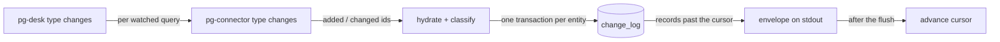

# pg-desk — changes

`pg-desk <type> changes --consumer NAME [--query Q] [--cached] [--reset] [--limit N] [--json]`, for
`<type>` one of `pr`, `issue`, `thread`, is the pull-through change feed: it keeps the watched set
fresh by asking pg-connector what changed, hydrates and classifies each reported entity, and hands
the caller the change-log records past its cursor as the `pg-desk.changes/v1` envelope
(entity-change-flow design 6.2, 9.2, 9.3). This document covers the pull-through core. Watched-set
membership (removal and source-terminal deactivation), the rolling sweep and the hydration budget
are a later change to the same verb.

## Behavior

- **Pull-through (default).** For each watched query of `<type>` (`watch.<type>.queries`), pg-desk
  runs `pg-connector <type> changes --query <q> --consumer pg-desk --output json` (the consumer
  name is pg-connector's own ledger cursor and is unrelated to `--consumer`). Every entity
  reported `added` or `changed` is hydrated through the entity pipeline with origin `pg-connector`,
  classified and logged; an entity reported by several queries is hydrated once per call. Entries
  reported `removed` are ignored by this verb. Hydration and classification run for every watched
  entity whether or not any decider subscribes to its type or kind.
- **Records.** After hydration the call returns the change-log records of `<type>` past `NAME`'s
  cursor, ascending by `seq`, at most `--limit N` of them (`0`, the default, means all). A record
  is `seq`, `type`, `id` (pg-desk's canonical entity id), `title` (display only), `version`,
  `kinds`, `origin`, `at`. The first observation of an entity yields only `reconcile`, never a
  transition kind.
- **Cursor.** The cursor advances to the last delivered `seq` only after the envelope was written
  to stdout, so a crash in between re-delivers the same records (a duplicate, never a loss).
  Reading, writing and advancing are bracketed by the per-`(type, NAME)` lock: two concurrent
  calls for one consumer serialize and the second reads from the cursor the first advanced; calls
  for different consumers or types do not contend. A plain call advances `NAME`'s own cursor
  exactly like a real pg-router poll, so running it by hand under a real consumer name is not a
  peek.
- **`--cached`.** Returns the records a real call would, without calling pg-connector, hydrating,
  registering the consumer, touching its `seen_at` or advancing its cursor; `sources` is empty.
  It works with no watched query configured and on an unregistered consumer (cursor `0`).
- **`--reset`.** Replays every ACTIVE entity of the type as `reconcile` with origin `reset`: each
  is re-hydrated and its previous snapshot is treated as unobserved, so the record carries only
  `reconcile`. It does not move the cursor, so a consumer first receives its undelivered backlog
  and then the replay. The replay is appended to the shared change log, so every consumer of the
  type receives those reconcile records; consumers MUST tolerate duplicates and deciders MUST be
  idempotent. Inactive entities are not replayed. `--reset` cannot be combined with `--cached`.
- **`--query Q`.** Restricts a call to one watched query; `Q` MUST name a configured query of the
  type, otherwise the call exits `1` listing the configured ones.
- **No watched query.** A real call for a type with no `watch.<type>.queries` is a usage error and
  exits `1` naming that key. `--cached` is unaffected.
- **Liveness.** Every real call (not `--cached`) registers the consumer and sets its `seen_at`,
  including a call that ends in total failure. This is the liveness signal that replaced the
  retired heartbeat.
- **Pruning.** After a real call pg-desk prunes the change log with `change_log_retention` and
  `consumer_stale_after` (store defaults when unset): rows older than the retention that every
  non-stale consumer has passed are deleted, and a stale consumer no longer holds them back.
- **`sources`.** The envelope has one row per consulted watched query: `ok`; `degraded` when a
  pg-connector backend row of that query was neither `succeeded` nor `disabled` (disabled counts as
  healthy) or when a hydration of an entity that query reported failed or was degraded, with the
  reasons joined by `; `; `failed` when the pg-connector call itself failed or could not be started.
- **Text form.** One line per record, the history layout prefixed by the entity —
  `<type> <id>  <seq>  <at>  <kinds joined by ", ">  origin=<origin>` — then one `source <query>:
<status>[ (<reason>)]` line per query and a final `cursor <from> -> <to>` line. `--json` (or
  `PG_DESK_OUTPUT=json`) prints the envelope; its shape is pinned by the golden files under
  `internal/changes/testdata` and `cmd/pg-desk/testdata`.

## Issue `comments_changed` is an `updated_at` proxy

The landed issue payload carries no comment field. For issues, `comments_changed` therefore means
"`updated_at` advanced while every other field of the issue did not change"; it is NOT a
comment-level diff, and an edit that only touches labels or priority emits nothing. Deciders MUST
NOT read it as proof that a comment was added.

## Failure semantics and exit codes

| Exit | Meaning                                                                                                                                                                           |
| ---- | --------------------------------------------------------------------------------------------------------------------------------------------------------------------------------- |
| `0`  | Every watched query listed and every reported entity hydrated cleanly.                                                                                                            |
| `1`  | Any other error: bad flags, an unknown `--query`, no watched query, an old-schema store, a store or config error.                                                                 |
| `2`  | Partial: at least one watched query or hydration failed or degraded. The envelope still carries the records, and the cursor advanced past what was delivered.                     |
| `3`  | Total failure: every watched query failed. The envelope is printed with `failed` sources and no records; nothing was logged and the cursor did not move (`seen_at` is still set). |

- A degraded or failed source never yields `removed`/`closed` for an entity it failed to list; the
  entity stays as it was and is retried on a later poll.
- A detail read failing for one entity keeps that entity's previous snapshot, logs nothing for it
  and marks the reporting query's source `degraded` (exit `2`). pg-connector has already moved its
  own ledger cursor past that entity, so it is not reported again until it changes; the rolling
  sweep (a later change) is what re-reads it.
- Each hydration is counted in the store's `meta` table (`change_flow.hydrations.<type>`,
  `change_flow.hydration_failures.<type>`, `change_flow.occ_retries.<type>`, and the per-entity
  `change_flow.degraded.<type>` set) for `status`, `doctor` and `/metrics`; an entity degraded in
  two consecutive hydrations counts as repeatedly degraded.

## Old-schema refusal

`changes` has no old-schema counterpart, so on a store not yet cut over it refuses (including with
`--cached`) with the store's error, which says to run `pg-desk migrate --cutover`, and exits `1`.

## Invariants

- **INV-CHANGES-1.** The consumer's cursor MUST advance only after the envelope was written, and
  never on `--cached`.
- **INV-CHANGES-2.** A total failure MUST log nothing and leave the cursor where it was.
- **INV-CHANGES-3.** A degraded or failed source or hydration MUST NOT produce a `removed` or
  `closed` record.
- **INV-CHANGES-4.** The first observation of an entity MUST yield only `reconcile`.
- **INV-CHANGES-5.** The only binary this verb execs is `pg-connector`, through the gather
  package's single exec chokepoint.

## Telemetry and logs

`changes` writes no OpenTelemetry or Prometheus output itself. It persists the hydration counters
above for `serve`, `status` and `doctor` to read; its diagnostics (a failed `--reset` replay of one
entity, a failed prune) go to stderr as plain lines.
