# pg-desk — changes

`pg-desk <type> changes --consumer NAME [--query Q] [--cached] [--reset] [--limit N] [--json]` is the
list-and-diff change feed that pg-desk itself runs for the types whose backend does not own its
changes (today `issue`): it lists each watched query with pg-connector's fingerprints, compares them
with the fingerprints it stored at each entity's last hydration, hydrates and classifies only the
entities that differ, and hands the caller the change-log records past its cursor as the
`pg-desk.changes/v1` envelope (entity-change-flow design 6.2, 9.2, 9.3). Besides the list-and-diff
core it keeps the watched set honest: an entity that dropped out of every watched query is confirmed
by one `show` read and then becomes closed, merged or removed, an entity terminal in its source
system (for a Jira issue, one whose status category is `done`) stops being active, a rolling sweep
re-hydrates the active entities by age, and a per-poll hydration budget bounds the detail reads
(design 6.1, 8.4, 8.5).

For the `pr` and `ci` types pg-desk does NOT run this flow. The daemon-backed GitHub backend owns
change detection, the baseline, the age sweep and the per-PR hydration for them, so pg-desk's own PR
change flow is retired (see "Who owns change detection"). Everything below the next section describes
the flow for the types pg-desk still serves itself, unless a passage says otherwise.

```mermaid
flowchart LR
    CLI["pg-desk type changes"] -->|"per watched query"| PC["pg-connector type list --fingerprints"]
    PC -->|"listing + fingerprints"| D["diff against stored list fingerprint"]
    D -->|"added / changed ids"| H["hydrate + classify"]
    H -->|"one transaction per entity"| LOG[("change_log")]
    LOG -->|"records past the cursor"| OUT["envelope on stdout"]
    OUT -->|"after the flush"| ADV["advance cursor"]
```

## Who owns change detection

ADR 0090 lets a backend that declares it owns its changes decide what changed for its own types, so
for `pr` and `ci` the owner is the daemon-backed GitHub backend, not pg-desk. The behavior of that
backend (what it detects, its feed, its acknowledgement and its freshness) is the subject of the
behavior-docs set for the GitHub connector backend; this document names that set by its role and
does not restate it.

- **The backend owns detection for `pr` and `ci`.** The detection baseline, the age sweep and the
  per-PR hydration that pg-desk's own flow used for `pr` belong to the backend. pg-desk MUST NOT
  keep a baseline, run a sweep or hydrate entities in order to detect a PR or CI change, and the
  backend, not pg-desk, owns the consumers' cursors for those types.
- **pg-desk reacts to the feed, it does not classify it.** The backend's feed decides WHETHER a
  desk run is triggered for a PR; the run itself decides what to do from the facts it gathers. After
  cutover the backend is the only source of the upstream change kinds for PRs, and pg-desk does not
  need them. `refresh` (see [`refresh.md`](refresh.md)) remains the only verb that classifies a
  change.
- **A CI change behind an unchanged rollup re-triggers categorization.** A change to a PR's CI runs
  or jobs is delivered on the PR feed as a PR change of kind `ci_changed`, naming the run and job
  fields that changed, so a PR whose rollup state did not move but whose runs or jobs did is still
  delivered, and the desk run for that PR re-categorizes it. One CI event triggers ONE desk run, not
  one per feed. This matters because CI state decides whether a PR is reviewable.
- **Detection bound.** A CI change that the rollup shows is seen within one summary freshness window
  plus the backend's settle time. A change behind an unchanged rollup is seen within the active-run
  window while a run on the current head is active, within the failed-run window while the current
  head has a non-passing run (the case that decides reviewability), and otherwise within the CI
  maximum age. Runs on an older head never make a PR active. The windows are the backend's
  configuration, not pg-desk's.
- **Recovery of a failed desk run.** The local reconcile tier of pg-desk's own flow (see "Rolling
  age sweep") is not used for `pr`. A run that did not complete is recovered by the backend's
  acknowledged feed, which redelivers every row a consumer did not acknowledge, and by the periodic
  reconcile lanes that remain: the scheduler's slow full-sweep backstop and `pg-desk reconcile` (see
  [`operator-commands.md`](operator-commands.md)).
- **Mergeability noise cannot reach the run.** The backend carries a PR's last known mergeability
  forward, so a transient mergeability answer does not change the facts a run compares.
- **A CI-only feed is PLANNED.** The connector's `ci changes` feed, for a consumer that wants CI
  changes without parsing PR rows, is planned and is not available; pg-desk does not use it.

## Behavior

The rest of this document describes the flow pg-desk runs itself, which serves the types whose
backend does not own its changes (`issue`); it is retired for `pr`.

- **List-and-diff (default).** For each watched query of `<type>` (`watch.<type>.queries`),
  pg-desk runs `pg-connector <type> list --query <q> --fingerprints --output json`: the whole
  current listing of the query with one opaque fingerprint per entity. There is no cursor and no
  connector-side consumer, so the call is stateless on the connector. pg-desk compares each listed
  entity's fingerprint with the list fingerprint it stored the last time it hydrated that entity
  (`entity.list_fp`): an entity with no row, or an inactive row, is **added**; an active row whose
  stored fingerprint differs is **changed**; otherwise it is unchanged and costs nothing. The
  comparison is always list against list, never against a hydrated payload: the list path lacks
  data the detail read has, and search results lag, so a cross-path comparison would report a
  change every tick. An entity the connector marks `stale` in a listing is ignored for change
  detection there. A row with an empty stored fingerprint (written by `--reset` or the cutover
  backfill) is changed once, which costs one re-hydration and no records of its own. Every added or
  changed entity is hydrated through the entity pipeline with origin `pg-connector`, classified
  and logged; an entity listed by several queries is hydrated once per call. Hydration and
  classification run for every watched entity whether or not any decider subscribes to its type or
  kind.
- **One transaction, the observed fingerprint.** The entity's snapshot, `hydrated_at`, `active`,
  its change-log rows and its stored list fingerprint are written in ONE transaction, and the
  fingerprint is the one observed in THIS call's listing, not one derived afterwards. A change that
  lands while the entity is being hydrated is therefore found on the next call, because the stored
  value is the older observed one. A hydration that fails, is degraded, or loses a compare-and-set
  writes nothing, so the entity is still different on the next call. Reads that do not come from a
  listing (`--reset`, the sweep, a confirmation read) write no fingerprint and leave the stored one
  as it was.
- **Order and cap.** Within `hydration.max_per_poll` the changed entities are hydrated first,
  oldest mismatch first (never hydrated counts as oldest), then the added ones by id. What the cap
  leaves is found again by the next call's diff; nothing is queued and nothing is dropped.
- **No retry state.** pg-desk runs no timer, backoff or retry loop and keeps no retry counter or
  deferral queue: the next scheduled call (pg-router's schedule) is the only retry, and an entity
  that keeps failing is retried on every call with no give-up.
- **Unsupported types.** An entity type whose list cannot be fingerprinted (`thread`: a Slack list
  has no stable per-entity fingerprint) is refused by `pg-desk thread changes` with a clear error
  and exit `1`, with or without `--cached`, before any connector call.
- **Records.** After hydration the call returns the change-log records of `<type>` past `NAME`'s
  cursor, ascending by `seq`, at most `--limit N` of them (`0`, the default, means all). A record
  is `seq`, `type`, `id` (pg-desk's canonical entity id), `title` (display only), `version`,
  `kinds`, `origin`, `at`. The first observation of an entity yields only `reconcile`, never a
  transition kind.
- **Cursor.** The cursor advances to the last delivered `seq` only after the envelope was written
  to stdout, so a crash in between re-delivers the same records (a duplicate, never a loss).
  Reading, writing and advancing are bracketed by the per-`(type, NAME)` lock: two concurrent
  calls for one consumer serialize and the second reads from the cursor the first advanced; calls
  for different consumers or types do not contend. A plain call advances `NAME`'s own cursor
  exactly like a real pg-router poll, so running it by hand under a real consumer name is not a
  peek.
- **`--cached`.** Returns the records a real call would, without listing through pg-connector, hydrating,
  registering the consumer, touching its `seen_at` or advancing its cursor; `sources` is empty.
  It works with no watched query configured and on an unregistered consumer (cursor `0`).
- **`--reset`.** Replays every ACTIVE entity of the type as `reconcile` with origin `reset`: each
  is re-hydrated and its previous snapshot is treated as unobserved, so the record carries only
  `reconcile`. The replay is EXEMPT from `hydration.max_per_poll` (decision recorded here as the
  design leaves it open): it is an explicit operator request, so every active entity is replayed in
  that one call and nothing is deferred; the replay's hydrations are not counted against the budget
  of the added/changed and sweep work in the same call. It does not move the cursor, so a consumer first receives its undelivered backlog
  and then the replay. The replay is appended to the shared change log, so every consumer of the
  type receives those reconcile records; consumers MUST tolerate duplicates and deciders MUST be
  idempotent. Inactive entities are not replayed. `--reset` cannot be combined with `--cached`.
- **`--query Q`.** Restricts a call to one watched query; `Q` MUST name a configured query of the
  type, otherwise the call exits `1` listing the configured ones.
- **No watched query.** A real call for a type with no `watch.<type>.queries` is a usage error and
  exits `1` naming that key. `--cached` is unaffected.
- **Liveness.** Every real call (not `--cached`) registers the consumer and sets its `seen_at`,
  including a call that ends in total failure. This is the liveness signal that replaced the
  retired heartbeat.
- **Pruning.** After a real call pg-desk prunes the change log with `change_log_retention` and
  `consumer_stale_after` (store defaults when unset): rows older than the retention that every
  non-stale consumer has passed are deleted, and a stale consumer no longer holds them back.
- **`sources`.** The envelope has one row per consulted watched query: `ok`; `degraded` when a
  pg-connector backend row of that query was neither `succeeded` nor `disabled` (disabled counts as
  healthy), when the listing was truncated (reason `list_truncated`), when a hydration of an entity
  that query listed failed or was degraded, or when the hydration budget left work for the next
  call (reason `hydration_budget`), with the reasons joined by `; `; `failed` when the pg-connector
  call itself failed or could not be started.
- **Text form.** One line per record, the history layout prefixed by the entity —
  `<type> <id>  <seq>  <at>  <kinds joined by ", ">  origin=<origin>` — then one `source <query>:
<status>[ (<reason>)]` line per query and a final `cursor <from> -> <to>` line. `--json` (or
  `PG_DESK_OUTPUT=json`) prints the envelope; its shape is pinned by the golden files under
  `internal/changes/testdata` and `cmd/pg-desk/testdata`.

## Active entities, removal and source-terminal deactivation

This section describes the flow pg-desk runs itself, not the retired `pr` flow. An entity is **active** while BOTH hold (design 6.1): it is non-terminal in its source system
(open PR; issue not terminal, see "What counts as a terminal issue" below; thread with a reply inside `watch.thread.active_window`)
AND at least one currently watched query still returns it. Only active entities are swept or
replayed by `--reset`.

- **Watched-set membership -> `removed`.** pg-desk keeps, per watched query, the ids that query
  listed at its last complete listing (store `meta` keys `change_flow.watchset.<type>.<query>`, no
  schema change). A **complete** listing is one where at least one pg-connector backend succeeded,
  none is degraded (`disabled` counts as healthy) and nothing was truncated; it rewrites the
  query's set to exactly the listed ids. A degraded or truncated listing only ever ADDS its listed
  ids and never removes any, and a failed query contributes nothing at all. A **removal
  candidate** is an id that was in a query's persisted set, is absent from that query's complete
  listing, and is held by no other configured query: the other-query test reads the persisted set
  of EVERY configured query, not only the queries run in this call (`--query Q` runs one). A
  candidate is first **confirmed** by exactly one `show` read (the **removal confirmation read**,
  see below), then becomes inactive, and the id leaves the persisted sets only AFTER the
  confirmation and the deactivation succeeded, so a failed read or deactivation keeps it in the
  set and it is found again on the next call. An entity another query still lists stays active. A
  removal for an entity the store does not hold, or that is already inactive, reads and writes
  nothing.
  `removed` says nothing about the source state: a removed entity's own state is unknown until a
  watched query lists it again, when it is added and becomes active with a `reconcile` record
  (first observation after a gap). The same absence in a targeted `refresh <id>` fails loudly
  instead (that half belongs to `refresh`).
- **Removal confirmation read.** Every watched PR query is `is:open` and the work-bead query is
  `--status open`, so a PR that merged or closed, and a bead that closed, leave the list as a
  plain absence. pg-desk therefore reads each removal candidate once (`pr show` / `issue show`,
  through the hydrate path with change kind `removed` and no list fingerprint, so the stored
  `list_fp` never moves) before deactivating it, and the outcome decides what is logged:

  | The read shows                                           | Logged                                                        | Entity                                             |
  | -------------------------------------------------------- | ------------------------------------------------------------- | -------------------------------------------------- |
  | the entity terminal (merged / closed PR; terminal issue) | the classifier's `merged` or `closed` (origin `pg-connector`) | inactive                                           |
  | `not_found`                                              | one `removed`                                                 | inactive                                           |
  | the entity still open (it merely left a query)           | one `removed`                                                 | inactive                                           |
  | a failed or degraded read                                | nothing                                                       | active, membership untouched, read again next call |

  Exactly one read is issued per candidate per call. The confirmation reads do not count against
  `hydration.max_per_poll`: they run in the membership phase, before the hydration budget, and
  several candidates are read in sorted id order. Three consecutive degraded reads end the reads
  for that call and leave the remaining candidates untouched. A degraded, truncated or failed
  listing produces no candidate, hence no read. Retry is the next scheduled call only; pg-desk
  keeps no timer, counter or queue for it.

- **Source-terminal deactivation.** After every successful hydration (added/changed, sweep or
  reset) an entity that is terminal in its source system (closed or merged PR, terminal issue, thread with no reply inside `watch.thread.active_window`) is set inactive through a
  compare-and-set write so the sweep stops re-hydrating it. No `removed` record is appended: the
  classifier already logged `closed`/`merged` where it saw the transition. `closed`/`merged` never
  implies the entity left every watched query, and `removed` never implies it was closed.

### What counts as a terminal issue

One rule serves both the classifier (the `closed` and `reopened` records) and source-terminal
deactivation:

- When the issue's stored facts carry the tracker's **status category** (`issue_show.status_category`,
  one of `new`, `indeterminate`, `done`), the category decides: `done` is terminal, the others are
  not, whatever the status is called ("Complete", "Released", "Won't Do"). The `jira.done_statuses`
  list is not consulted.
- When there is no category (the beads backend never has one; Jira omits it for a legacy "No
  Category" status or when an older `pjira` is on `PATH`), the status NAME decides: `closed`,
  `done`, `resolved`, `cancelled`, `canceled` and `wontfix`, case-insensitive.
- `closed` and `reopened` compare the two snapshots' terminal-ness, not their status strings, so
  an issue whose status string is unchanged can still be `closed`. **Rollout:** an issue stored as
  "Complete" before categories were carried, whose next hydration arrives with category `done`,
  logs `closed` (without `status_changed`, since the status did not change) and is deactivated. The
  same happens once to every stored done-category Jira issue on its next hydration, so a
  one-time burst of `closed` records and deactivations after the category first arrives is expected.
- A category that disappears is not a movement: when the old snapshot had a category and the new
  one has none (an older `pjira` on `PATH`, a degraded decode), no `closed`, `reopened` or `opened`
  is logged, so the name fallback cannot misread "Complete" as reopened. `status_changed` is still
  logged when the status strings differ.

## Rolling age sweep: two tiers (design 8.4)

This sweep belongs to the flow pg-desk runs itself and is not run for `pr` (see "Who owns change
detection"). On every real call pg-desk also runs an age sweep with two tiers. Both are rolling (OLDEST due
first), both are capped per call at `sweep.max_per_poll` (default 20; the cap applies to each tier
separately), and in both the cap only carries work forward: an entity the cap does not reach stays
due and is selected on the next call, nothing is queued and nothing is dropped. Inactive entities
are excluded from both. Skipping the entities already hydrated in the call, the remote tier runs
first and the local tier second.

- **Remote re-hydration tier.** Re-hydrates ACTIVE entities whose `hydrated_at` is empty or older
  than `sweep.max_age` (default 6h) plus the entity's jitter (below), oldest first (never
  hydrated first, then by due time, ties by id), and logs `reconcile` with origin `sweep` for each:
  a sweep hydration treats the previous snapshot as unobserved, so an unchanged entity still logs
  exactly one `reconcile` and a change the sweep finds surfaces as `reconcile` only. It exists
  because the list fingerprint cannot see review threads, merge-state status or edited comment
  bodies. It makes remote reads, so it draws on `hydration.max_per_poll` (below).
- **Local reconcile tier.** For ACTIVE entities whose LATEST `change_log` row is older than
  `sweep.reconcile_age` (default 30m; MAY be lowered, because the tier is local) plus the entity's
  jitter, appends one `reconcile` record with origin `local-reconcile`. It makes NO remote call, runs
  NO hydration and draws on no hydration budget: it re-evaluates what is already stored and so
  recovers a decider run that failed on an earlier record, without any acknowledgement protocol.
  The write is one compare-and-set that bumps the entity's version and appends the row while it
  keeps the snapshot, `hydrated_at` (so the remote tier's age clock is NOT reset), the active flag
  and the stored list fingerprint unchanged. The latest change time is `max(change_log.at)` per
  entity, derived on read. `change_log` rows are pruned and a reset or backfilled entity may hold
  none: such an entity falls back to its `hydrated_at`, and one with neither is due now and ranks
  oldest of all.
- **Jitter.** Each entity's due time is its base time (`hydrated_at` or latest change time) plus the
  tier's age plus a deterministic offset `hash(entity_id) mod (age / 5)` (FNV-1a 64 over the id, so
  it is the same for the same id on every run and process). Entities hydrated together by `--reset`
  or the cutover bootstrap therefore do not all fall due in the same call; pg-router triggers carry
  no jitter, so the spreading lives here. Order within a tier is by that due time.

The sizing bound `active_count / sweep.max_per_poll x poll_interval <= age` is evaluated by
`changes.SweepBoundHolds` over `changes.ActiveCount` and `changes.DueBacklog`, the shared helpers
`status`, `/metrics` and `doctor` use; `changes.SweepInputsForTier` gives its inputs per tier
(`remote`: `sweep.max_age`; `local`: `sweep.reconcile_age`, with the same cap). `reconcile_age` is
configured as `sweep.reconcile_age`. This sweep is selection logic inside `changes`; the old
top-level `pg-desk sweep` bulk backfill is unrelated and unchanged.

## Hydration budget (design 8.5)

The budget belongs to the flow pg-desk runs itself and does not apply to `pr`. `hydration.max_per_poll` (default 50) caps the DETAIL reads per call across both sources: the
added/changed entities first, then the remote sweep batch, so a tight budget starves the sweep
first. The local reconcile tier reads nothing remote and is outside the budget.
`--reset` replays are exempt (see `--reset`).

- When the budget runs out, or the backend answers degraded three hydrations in a row, the
  remaining hydrations are left for the next call, never retried inline. Every watched query that
  listed a left-over entity is marked `degraded` with reason `hydration_budget` (or
  `hydration_backend_degraded`); when only sweep work was left, every watched-query row of the type
  is marked. The call exits `2`.
- Nothing is queued. A left-over added/changed entity still differs from its stored fingerprint, so
  the next call's diff finds it again in the same order; a hydration that FAILED wrote nothing and
  is found the same way, on every call, with no counter and no give-up. Sweep work needs no queue
  either: the entity stays due.
- A budget-exhausted poll keeps the consumer cursor semantics unchanged: it advances only after the
  flush, over the records actually delivered.

## Issue-dependency hydration (`hydration.read_issue_deps`)

`hydration.read_issue_deps` (boolean, default `false`; home-module option `hydration.readIssueDeps`)
switches issue-dependency hydration on. It applies to every path that hydrates an issue: `changes`,
`refresh`, `run issue`, `sweep` and `reconcile` all hydrate through the one gatherer the pipeline
builds, and that gatherer reads the key.

- **Off (the default).** An issue hydration reads `issue show` only. The stored facts carry
  `issue_show` and no `issue_deps`.
- **On.** After `issue show`, the hydration also reads `pg-connector issue deps <id> --full` and
  stores its result as `issue_deps` beside `issue_show`: the RECURSIVE set the issue is blocked BY. It
  costs one extra connector read per issue hydration (it does not draw on `hydration.max_per_poll`,
  which counts hydrations). A failed or `not_found` deps read fails the hydration, so a stored
  `issue_deps` is never stale relative to its `issue_show`.
- **What it is for.** The daily-focus rank's "unblocks" key. An issue whose stored facts carry
  `issue_deps` is "available" to it; one without (the key was off when it was last hydrated) ranks
  with the key at 0 and is counted as unavailable, not as zero by evidence.
- **Direct edges are not behind the switch.** The one-level typed edges (`issue_show.deps`, each
  `{id, type}`) are stored whether or not the key is on. `issue_deps` is recursive and the Jira
  backend returns it empty, so it is NOT the source of the reverse index: the index
  (`dependency.IssueDependents`, below) is built from the direct edges only.

**The reverse-edge index.** `dependency.IssueDependents`, in `internal/dependency`, is the issue
counterpart of the PR `Resolver.DependentsOf`. Built once per read from the stored issue entities, it
answers `DependentsOf(issueID)`: the sorted ids of the issues blocked BY `issueID` directly. An issue
B is a dependent of A when B's stored `issue_show.deps` holds an edge `{id: A, type: blocks}`; only
edges of type `blocks` count, one hop only. For a chain A blocked by B and B blocked by C,
`DependentsOf(C)` is `[B]` and `DependentsOf(B)` is `[A]`. A dependent is listed only while its
entity is active and the caller's terminal predicate (the rank passes one built over
`classify.SourceTerminal` and its injected clock) does not hold; the index itself reads no clock and
refuses an unmigrated store. `Available(issueID)` is true when the issue's own stored facts carry
`issue_deps`. The index reads the store only: no connector call, no tracker call.

## Issue `comments_changed` is an `updated_at` proxy

The landed issue payload carries no comment field. For issues, `comments_changed` therefore means
"`updated_at` advanced while every other field of the issue did not change"; it is NOT a
comment-level diff, and an edit that only touches labels or priority emits nothing. Deciders MUST
NOT read it as proof that a comment was added.

## Failure semantics and exit codes

| Exit | Meaning                                                                                                                                                                           |
| ---- | --------------------------------------------------------------------------------------------------------------------------------------------------------------------------------- |
| `0`  | Every watched query listed and every reported entity hydrated cleanly.                                                                                                            |
| `1`  | Any other error: bad flags, an unknown `--query`, no watched query, an old-schema store, a store or config error.                                                                 |
| `2`  | Partial: at least one watched query or hydration failed or degraded. The envelope still carries the records, and the cursor advanced past what was delivered.                     |
| `3`  | Total failure: every watched query failed. The envelope is printed with `failed` sources and no records; nothing was logged and the cursor did not move (`seen_at` is still set). |

- A degraded, truncated or failed source never yields `removed`/`closed` for an entity it failed to
  list; the entity stays as it was and is retried on a later poll.
- A detail read failing for one entity keeps that entity's previous snapshot and stored
  fingerprint, logs nothing for it and marks the listing query's source `degraded` (exit `2`). The
  entity still differs on the next call, so it is hydrated again then (see the hydration budget);
  an entity already stored is also re-read by the rolling sweep.
- Each hydration is counted in the store's `meta` table (`change_flow.hydrations.<type>`,
  `change_flow.hydration_failures.<type>`, `change_flow.occ_retries.<type>`, and the per-entity
  `change_flow.degraded.<type>` set) for `status`, `doctor` and `/metrics`; an entity degraded in
  two consecutive hydrations counts as repeatedly degraded.
- **Per-query listing status.** After every real (non-`--cached`) call, for each watched query the
  call consulted, `changes` writes the store `meta` key `change_flow.listing.<type>.<query>`
  holding the JSON `{"status": ..., "reason": ..., "at": ...}`: `status` is `ok`, `degraded` or
  `failed` and `reason` is the same short text that query's envelope `sources[]` entry carries
  (empty for `ok`), both exactly as the envelope reports them; `at` is the RFC3339 time of the call.
  A later call overwrites the entry, so a `failed` query reads `ok` again after one good call. A
  total-failure call (exit `3`) still writes its `failed` entries. A `--cached` call writes
  nothing (it consults no tracker), and a query the call did not consult (`--query` named another)
  keeps the entry it had. The write is best-effort: a meta write error is a stderr warning and
  never fails the call. Store-only readers (`focus show`'s coverage header, the `/metrics` listing
  gauge, `doctor`) read these keys through `changes.ReadListingStatuses`, which returns a type's
  entries sorted by query and skips an undecodable value rather than failing. Telemetry: the write
  emits no OpenTelemetry or Prometheus output and logs only that warning.

## Old-schema refusal

`changes` has no old-schema counterpart, so on a store not yet cut over it refuses (including with
`--cached`) with the store's error, which says to run `pg-desk migrate --cutover`, and exits `1`.

## Invariants

INV-CHANGES-1 to INV-CHANGES-12, INV-CHANGES-16 and INV-CHANGES-17 govern the flow pg-desk runs
itself, which serves the types whose backend does not own its changes (`issue`); they do not apply
to `pr`, whose flow is retired.
INV-CHANGES-13 to INV-CHANGES-15 govern `pr` and `ci`.

- **INV-CHANGES-1.** The consumer's cursor MUST advance only after the envelope was written, and
  never on `--cached`.
- **INV-CHANGES-2.** A total failure MUST log nothing and leave the cursor where it was.
- **INV-CHANGES-3.** A degraded or failed source or hydration MUST NOT produce a `removed` or
  `closed` record.
- **INV-CHANGES-4.** The first observation of an entity MUST yield only `reconcile`.
- **INV-CHANGES-5.** The only binary this verb execs is `pg-connector`, through the gather
  package's single exec chokepoint; it calls `<type> list --fingerprints` and never `<type>
changes`.
- **INV-CHANGES-6.** A `removed` record MUST be logged only when no configured watched query still
  holds the entity: every configured query's persisted set is consulted, and only a complete
  (succeeded, non-truncated) listing may take an id out of its query's set.
- **INV-CHANGES-7.** An inactive entity MUST NOT be swept (either tier) or replayed by `--reset`.
- **INV-CHANGES-8.** A call MUST NOT start more than `hydration.max_per_poll` added/changed plus
  sweep hydrations (a `--reset` replay is exempt); changed/added work MUST be served before sweep
  work.
- **INV-CHANGES-9.** An entity's stored list fingerprint MUST be written only in the transaction
  that writes its snapshot, MUST be the fingerprint observed in the listing that triggered the
  hydration, and MUST be left unchanged by every failed, degraded or lost hydration.
- **INV-CHANGES-10.** pg-desk MUST NOT keep a retry counter, a deferral queue or a timer for the
  list-and-diff flow; the next scheduled call is the only retry.
- **INV-CHANGES-11.** A removal candidate MUST be confirmed by exactly one `show` read before it is
  deactivated, with a nil list fingerprint; a failed or degraded read MUST leave the entity active
  and its membership untouched, and a degraded, truncated or failed listing MUST NOT cause a read.
- **INV-CHANGES-12.** The local reconcile tier MUST make no remote call and no hydration, and the
  record it appends MUST leave the entity's `hydrated_at`, active flag and list fingerprint unchanged.
- **INV-CHANGES-13.** For `pr` and `ci`, pg-desk MUST NOT own change detection: it MUST NOT keep a
  detection baseline, run an age sweep or hydrate entities in order to find a change, and the
  backend that owns those changes, not pg-desk, MUST own the consumers' cursors.
- **INV-CHANGES-14.** A CI change behind an unchanged rollup MUST re-trigger categorization of the
  PR it belongs to, once per change and not once per feed.
- **INV-CHANGES-15.** A desk run that did not complete for a PR MUST still be recovered with no
  decider acknowledgement protocol and with no local reconcile tier in pg-desk, through the
  backend's redelivery of unacknowledged feed rows and the periodic reconcile lanes.
- **INV-CHANGES-16.** With `hydration.read_issue_deps` false an issue hydration MUST NOT call
  `issue deps`, and with it true MUST store its `--full` result as `issue_deps` or fail the
  hydration; the direct `issue_show.deps` edges MUST be stored either way.
- **INV-CHANGES-17.** The issue reverse-edge index MUST count DIRECT, `blocks`-typed edges only,
  MUST exclude inactive and (by the caller's predicate) terminal dependents, and MUST report an
  issue without stored `issue_deps` as unavailable rather than as having no dependents.

## Telemetry and logs

`changes` writes no OpenTelemetry or Prometheus output itself. It persists the hydration counters
above for `serve`, `status` and `doctor` to read; its diagnostics (a failed `--reset` replay or
sweep hydration of one entity, a failed membership write, a failed prune) go to stderr as plain
lines.
