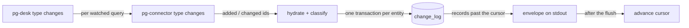

# pg-desk — changes

`pg-desk <type> changes --consumer NAME [--query Q] [--cached] [--reset] [--limit N] [--json]`, for
`<type>` one of `pr`, `issue`, `thread`, is the pull-through change feed: it keeps the watched set
fresh by asking pg-connector what changed, hydrates and classifies each reported entity, and hands
the caller the change-log records past its cursor as the `pg-desk.changes/v1` envelope
(entity-change-flow design 6.2, 9.2, 9.3). Besides the pull-through core it keeps the watched set
honest: an entity that dropped out of every watched query becomes removed, an entity terminal in
its source system stops being active, a rolling sweep re-hydrates the active entities by age, and
a per-poll hydration budget bounds the detail reads (design 6.1, 8.4, 8.5).

## Behavior

- **Pull-through (default).** For each watched query of `<type>` (`watch.<type>.queries`), pg-desk
  runs `pg-connector <type> changes --query <q> --consumer pg-desk --output json` (the consumer
  name is pg-connector's own ledger cursor and is unrelated to `--consumer`). Every entity
  reported `added` or `changed` is hydrated through the entity pipeline with origin `pg-connector`,
  classified and logged; an entity reported by several queries is hydrated once per call. Entries
  reported `removed` are never hydrated: they feed the watched-set membership below. Hydration and
  classification run for every watched entity whether or not any decider subscribes to its type or
  kind.
- **Records.** After hydration the call returns the change-log records of `<type>` past `NAME`'s
  cursor, ascending by `seq`, at most `--limit N` of them (`0`, the default, means all). A record
  is `seq`, `type`, `id` (pg-desk's canonical entity id), `title` (display only), `version`,
  `kinds`, `origin`, `at`. The first observation of an entity yields only `reconcile`, never a
  transition kind.
- **Cursor.** The cursor advances to the last delivered `seq` only after the envelope was written
  to stdout, so a crash in between re-delivers the same records (a duplicate, never a loss).
  Reading, writing and advancing are bracketed by the per-`(type, NAME)` lock: two concurrent
  calls for one consumer serialize and the second reads from the cursor the first advanced; calls
  for different consumers or types do not contend. A plain call advances `NAME`'s own cursor
  exactly like a real pg-router poll, so running it by hand under a real consumer name is not a
  peek.
- **`--cached`.** Returns the records a real call would, without calling pg-connector, hydrating,
  registering the consumer, touching its `seen_at` or advancing its cursor; `sources` is empty.
  It works with no watched query configured and on an unregistered consumer (cursor `0`).
- **`--reset`.** Replays every ACTIVE entity of the type as `reconcile` with origin `reset`: each
  is re-hydrated and its previous snapshot is treated as unobserved, so the record carries only
  `reconcile`. The replay is EXEMPT from `hydration.max_per_poll` (decision recorded here as the
  design leaves it open): it is an explicit operator request, so every active entity is replayed in
  that one call and nothing is deferred; the replay's hydrations are not counted against the budget
  of the added/changed and sweep work in the same call. It does not move the cursor, so a consumer first receives its undelivered backlog
  and then the replay. The replay is appended to the shared change log, so every consumer of the
  type receives those reconcile records; consumers MUST tolerate duplicates and deciders MUST be
  idempotent. Inactive entities are not replayed. `--reset` cannot be combined with `--cached`.
- **`--query Q`.** Restricts a call to one watched query; `Q` MUST name a configured query of the
  type, otherwise the call exits `1` listing the configured ones.
- **No watched query.** A real call for a type with no `watch.<type>.queries` is a usage error and
  exits `1` naming that key. `--cached` is unaffected.
- **Liveness.** Every real call (not `--cached`) registers the consumer and sets its `seen_at`,
  including a call that ends in total failure. This is the liveness signal that replaced the
  retired heartbeat.
- **Pruning.** After a real call pg-desk prunes the change log with `change_log_retention` and
  `consumer_stale_after` (store defaults when unset): rows older than the retention that every
  non-stale consumer has passed are deleted, and a stale consumer no longer holds them back.
- **`sources`.** The envelope has one row per consulted watched query: `ok`; `degraded` when a
  pg-connector backend row of that query was neither `succeeded` nor `disabled` (disabled counts as
  healthy), when a hydration of an entity that query reported failed or was degraded, or when the
  hydration budget deferred work (reason `hydration_budget`), with the reasons joined by `; `; `failed` when the pg-connector call itself failed or could not be started.
- **Text form.** One line per record, the history layout prefixed by the entity —
  `<type> <id>  <seq>  <at>  <kinds joined by ", ">  origin=<origin>` — then one `source <query>:
<status>[ (<reason>)]` line per query and a final `cursor <from> -> <to>` line. `--json` (or
  `PG_DESK_OUTPUT=json`) prints the envelope; its shape is pinned by the golden files under
  `internal/changes/testdata` and `cmd/pg-desk/testdata`.

## Active entities, removal and source-terminal deactivation

An entity is **active** while BOTH hold (design 6.1): it is non-terminal in its source system
(open PR; issue not in a terminal state; thread with a reply inside `watch.thread.active_window`)
AND at least one currently watched query still returns it. Only active entities are swept or
replayed by `--reset`.

- **Watched-set membership -> `removed`.** pg-connector reports membership change per query, so
  pg-desk keeps, per watched query, the ids that query currently returns (store `meta` keys
  `change_flow.watchset.<type>.<query>`, no schema change): `added`/`changed` put an id in the
  set, `removed` takes it out. When a query reports an entity `removed` and NO configured query's
  set still holds it, the entity becomes inactive and one `removed` record (origin `pg-connector`)
  is logged. An entity another query still returns stays active. A removal for an entity the store
  does not hold, or that is already inactive, writes nothing. A query whose pg-connector backend
  rows are degraded contributes no removals, and a failed query contributes nothing at all.
  `removed` says nothing about the source state: a removed entity's own state is unknown until a
  watched query returns it again, when it becomes active with a `reconcile` record (first
  observation after a gap). The same absence in a targeted `refresh <id>` fails loudly instead
  (that half belongs to `refresh`).
- **Source-terminal deactivation.** After every successful hydration (added/changed, sweep or
  reset) an entity that is terminal in its source system (closed or merged PR, issue in a terminal
  state, thread with no reply inside `watch.thread.active_window`) is set inactive through a
  compare-and-set write so the sweep stops re-hydrating it. No `removed` record is appended: the
  classifier already logged `closed`/`merged` where it saw the transition. `closed`/`merged` never
  implies the entity left every watched query, and `removed` never implies it was closed.

## Rolling sweep (design 8.4)

On every real call pg-desk also hydrates up to `sweep.max_per_poll` (default 20) ACTIVE entities
of the type whose `hydrated_at` is empty or older than `sweep.max_age` (default 6h), OLDEST FIRST
(never hydrated first, ties by id), skipping entities already hydrated in the call, and logs
`reconcile` with origin `sweep` for each: a sweep hydration treats the previous snapshot as
unobserved, so an unchanged entity still logs exactly one `reconcile` and a change the sweep finds
surfaces as `reconcile` only. Inactive entities are excluded. The sizing bound
`active_count / sweep.max_per_poll x poll_interval <= sweep.max_age` is evaluated by
`changes.SweepBoundHolds` over `changes.ActiveCount` and `changes.DueBacklog`, the shared helpers
`status`, `/metrics` and `doctor` use. This sweep is selection logic inside `changes`; the old
top-level `pg-desk sweep` bulk backfill is unrelated and unchanged.

## Hydration budget (design 8.5)

`hydration.max_per_poll` (default 50) caps the DETAIL reads per call across both sources: the
added/changed entities first, then the sweep batch, so a tight budget starves the sweep first.
`--reset` replays are exempt (see `--reset`).

- When the budget runs out, or the backend answers degraded three hydrations in a row, the
  remaining hydrations are deferred to the next poll, never retried inline. Every watched query
  that reported a deferred entity is marked `degraded` with reason `hydration_budget` (or
  `hydration_backend_degraded`); when only sweep work, or an entity carried over from an earlier
  poll, was deferred, every watched-query row of the type is marked. The call exits `2`.
- pg-connector moves its own ledger past an entity it reported, so a deferred added/changed entity
  would never be reported again. pg-desk therefore queues it in `meta`
  (`change_flow.deferred.<type>`) and hydrates the queue first on the next poll. A hydration that
  FAILED is queued the same way and retried up to 5 polls before it is dropped with a warning (the
  failure stays visible through the persisted degraded set). Sweep work needs no queue: the entity
  stays due.
- A budget-exhausted poll keeps the consumer cursor semantics unchanged: it advances only after the
  flush, over the records actually delivered.

## Issue `comments_changed` is an `updated_at` proxy

The landed issue payload carries no comment field. For issues, `comments_changed` therefore means
"`updated_at` advanced while every other field of the issue did not change"; it is NOT a
comment-level diff, and an edit that only touches labels or priority emits nothing. Deciders MUST
NOT read it as proof that a comment was added.

## Failure semantics and exit codes

| Exit | Meaning                                                                                                                                                                           |
| ---- | --------------------------------------------------------------------------------------------------------------------------------------------------------------------------------- |
| `0`  | Every watched query listed and every reported entity hydrated cleanly.                                                                                                            |
| `1`  | Any other error: bad flags, an unknown `--query`, no watched query, an old-schema store, a store or config error.                                                                 |
| `2`  | Partial: at least one watched query or hydration failed or degraded. The envelope still carries the records, and the cursor advanced past what was delivered.                     |
| `3`  | Total failure: every watched query failed. The envelope is printed with `failed` sources and no records; nothing was logged and the cursor did not move (`seen_at` is still set). |

- A degraded or failed source never yields `removed`/`closed` for an entity it failed to list; the
  entity stays as it was and is retried on a later poll.
- A detail read failing for one entity keeps that entity's previous snapshot, logs nothing for it
  and marks the reporting query's source `degraded` (exit `2`). pg-connector has already moved its
  own ledger cursor past that entity, so pg-desk queues the hydration for the next poll (see the
  hydration budget); an entity already stored is also re-read by the rolling sweep.
- Each hydration is counted in the store's `meta` table (`change_flow.hydrations.<type>`,
  `change_flow.hydration_failures.<type>`, `change_flow.occ_retries.<type>`, and the per-entity
  `change_flow.degraded.<type>` set) for `status`, `doctor` and `/metrics`; an entity degraded in
  two consecutive hydrations counts as repeatedly degraded.

## Old-schema refusal

`changes` has no old-schema counterpart, so on a store not yet cut over it refuses (including with
`--cached`) with the store's error, which says to run `pg-desk migrate --cutover`, and exits `1`.

## Invariants

- **INV-CHANGES-1.** The consumer's cursor MUST advance only after the envelope was written, and
  never on `--cached`.
- **INV-CHANGES-2.** A total failure MUST log nothing and leave the cursor where it was.
- **INV-CHANGES-3.** A degraded or failed source or hydration MUST NOT produce a `removed` or
  `closed` record.
- **INV-CHANGES-4.** The first observation of an entity MUST yield only `reconcile`.
- **INV-CHANGES-5.** The only binary this verb execs is `pg-connector`, through the gather
  package's single exec chokepoint.
- **INV-CHANGES-6.** A `removed` record MUST be logged only when no configured, successfully and
  non-degradedly listed watched query still returns the entity.
- **INV-CHANGES-7.** An inactive entity MUST NOT be swept or replayed by `--reset`.
- **INV-CHANGES-8.** A call MUST NOT start more than `hydration.max_per_poll` added/changed plus
  sweep hydrations (a `--reset` replay is exempt); changed/added work MUST be served before sweep
  work.

## Telemetry and logs

`changes` writes no OpenTelemetry or Prometheus output itself. It persists the hydration counters
above for `serve`, `status` and `doctor` to read; its diagnostics (a failed `--reset` replay or
sweep hydration of one entity, a failed membership write, a failed prune) go to stderr as plain
lines.
