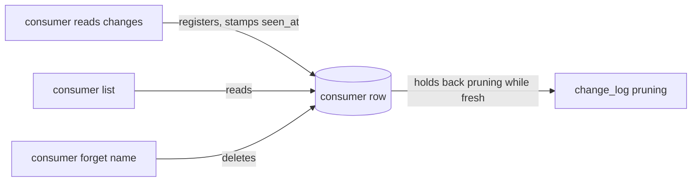

# pg-desk — consumer lifecycle

A consumer is a named reader of the change log for one entity type (for example a menu bar plugin
that reads `pg-desk pr changes --as <name>`). Its registration is one `(name, type)` row holding a
cursor (the highest change record it has been handed and confirmed) and `seen_at` (when it last
read). Two verbs under each type group manage those rows (entity-change-flow design 6.9):
`pg-desk <type> consumer list` and `pg-desk <type> consumer forget <name>`, for `<type>` one of
`pr`, `issue`, `thread`.

## Behavior

- `consumer list` prints the registered consumers of the group's type, ordered by name, one line
  each, two spaces between fields: `<name>  cursor=<n>  seen_at=<at>  <fresh|stale>`. `<at>` is
  the stored RFC3339 UTC time, or `never` for a consumer registered but never read. With no
  consumer it prints nothing and exits `0`. `--json` (or `PG_DESK_OUTPUT=json`) prints
  `{"consumers": [...]}` with `name`, `type`, `cursor`, `seen_at` (empty when never read) and
  `stale` per consumer.
- A consumer is **stale** when it was never read, or not seen within `consumer_stale_after`
  (default 7 days, see the configuration docs). This is the same rule change-log pruning applies:
  a stale consumer is excluded from the pruning horizon, so it no longer holds rows back.
- `consumer forget <name>` deletes that consumer's row for the group's type, and so stops it from
  holding back change-log pruning. It prints `forgot <type> consumer <name>`. Forgetting a
  consumer that is not registered is not an error: it prints that there was nothing to forget and
  exits `0`. A forgotten consumer that reads again is registered afresh at cursor `0`, so it
  replays the retained log.
- Neither verb moves a cursor, reads a record, or contacts the network. `list` is read-only;
  `forget` only deletes the one row.

## Invariants

- **INV-CONSUMER-1.** `forget` MUST delete only the `(name, type)` row it names: a consumer of the
  same name under another type, and every other consumer, MUST be untouched.
- **INV-CONSUMER-2.** After `forget`, change-log pruning MUST NOT wait for that consumer.
- **INV-CONSUMER-3.** `list` and `forget` MUST NOT register a consumer or stamp `seen_at`.

## Old-schema refusal

The consumer table exists only on the migrated store, so both verbs refuse an old-schema store with
the store's error, which says to run `pg-desk migrate --cutover`, and exit `1`.

## Exit codes

`0` on success (including an empty list and forgetting an absent consumer); `1` on any error.

## Out of scope

Flagging a stalled consumer (reported by `doctor`) and the consumer-lag metric.
