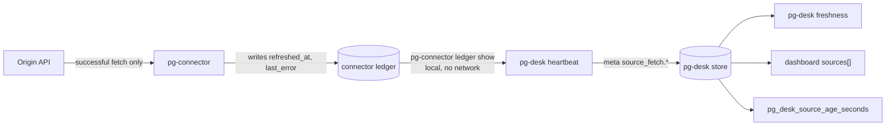

# pg-desk — freshness

`pg-desk` reports how old the data behind its views is, per source, so a quiet menu bar or an
empty list is never mistaken for an all-clear when the origin has simply stopped answering. The
**freshness of a source** is the time of its last SUCCESSFUL origin fetch. It is distinct from
two things that are easy to confuse with it:

- **A row's `as_of`.** Most rows are old in a healthy, event-driven store; `as_of` says when the
  row last changed, not whether the origin is still being read.
- **Pipeline liveness.** `pg_desk_dashboard_stale` and `pg_desk_dashboard_age_seconds`, and the
  dashboard payload's `generated_at`, `age_seconds` and `stale`, are derived from
  `meta.last_heartbeat` and say whether the heartbeat is still running. A source can be stale
  while the pipeline is live, and the other way round.

A **source** is a `(backend, query)` pair known to the connector's ledger. The user-visible unit
is the backend: its **display label** defaults to the backend name without the `pg-connector-`
prefix (for example `pr-github`), and its age is the OLDEST age among its queries, which is the
conservative reading.

## Recording

`pg-desk heartbeat` reads `pg-connector ledger show` (a local read, zero origin cost) and records,
per ledger key, the last success and the last error under the meta key
`source_fetch.<backend>.<query>` (with `@<instance>` appended to the query part for a ledger that
carries an instance). Two ledgers that map to the same key, one per entity type, are folded
conservatively: the older success wins.

- **Monotonic.** A recorded success time never moves backwards, and the recorded last error is the
  later of the stored and the incoming one. A stale or reordered read, or a ledger that was
  cleared, cannot make a source look less fresh than it was already known to be fresh, or fresher.
- **Idempotent.** Recording the same ledger twice changes nothing.
- **A source with no success yet is still recorded**, so it is reported as unknown and stale
  rather than being absent.
- **The liveness stamp does not depend on the connector.** `heartbeat` stamps
  `meta.last_heartbeat` first. If `pg-connector ledger show` is missing, slow (30 seconds) or
  answers something undecodable, `heartbeat` names that on stderr, leaves the previously recorded
  source times to age, and still exits `0`. Only a store that cannot be written fails it.
- **Reporting lag** is at most one heartbeat period (60 seconds by default), far below the
  threshold.

## Surfaces

- **`pg-desk freshness --json`.** Read-only and offline: it reads the store and, for the threshold
  and labels, the configuration. Output is always one JSON document, `schemaVersion` 1, evolving
  additively only: `now`, `stale_after_seconds` (the default threshold), `any_stale` and
  `sources[]`. Each source has `source` (the backend name), `label`, `last_success_at`,
  `age_seconds` and `stale`; `last_success_at` and `age_seconds` are `null` for a source with no
  recorded success. Rows are sorted by `source`; `sources` is `[]` when nothing is recorded, and
  `any_stale` is then `false`. A configuration that cannot be loaded degrades to the defaults and
  is named on stderr, so the indicator never disappears into a false all-clear. Exit `0` whenever
  the store is readable; `1` otherwise.
- **`GET /api/v1/dashboard`.** An additive `sources[]` with the same row shape. Every existing
  field is unchanged, including the pipeline-liveness fields.
- **`pg_desk_source_age_seconds{source}`** on `/metrics` (a gauge, seconds; `source` is the backend
  name). A source with no recorded success exports NO series: it is never exported as `0`, which
  would read as freshly fetched. `pg-desk freshness` reports such a source as unknown and stale.

Consumers decide how to show it: the menu bar and the My Work dashboard show a row only for a stale
source (those are separate beads in the repos that own them). Staleness is never an attention item
(see [`attention.md`](attention.md), `ATTN-0`).

## Configuration

| Key                                    | Default                 | Meaning                                                                                             |
| -------------------------------------- | ----------------------- | --------------------------------------------------------------------------------------------------- |
| `freshness.source_stale_after`         | `15m`                   | A source is stale when its last success is OLDER than this (exactly at the bound is not yet stale). |
| `freshness.sources.<name>.stale_after` | global                  | Per-source threshold. `<name>` is the backend name or the name without the `pg-connector-` prefix.  |
| `freshness.sources.<name>.label`       | prefix-stripped backend | Display label.                                                                                      |

Durations accept the day form (`1d`, `1d12h`) and MUST be positive; an invalid value fails
configuration load naming the key. The key is deliberately not the top-level `stale_after`, which
nothing reads.

**Threshold.** 15 minutes is 15 poll periods at 60 seconds, or 7.5 at 120 seconds, so several
consecutive failed ticks, such as a short stretch of rate-limit refusals, do not raise the
indicator, while a sustained outage does within a quarter of an hour. It is below the 30-minute
`pr-sweep` cycle, so the indicator appears before the slow recovery path would have repaired
anything.

## Invariants

- **INV-FRESH-1.** Freshness MUST be the time of the last successful fetch from the origin system,
  never a per-row `as_of`.
- **INV-FRESH-2.** An answer served from a cache MUST NOT advance a source's freshness. This is
  upheld at the connector, which stamps the ledger only for a completed origin fetch (see the
  connector's `INV-LEDGER-FRESH-2`); `pg-desk` only copies what the ledger holds and MUST NOT
  stamp a success of its own.
- **INV-FRESH-3.** A fetch counts as successful only when the origin answered for the whole query
  (no `unavailable`, no truncation, no partial page). Also upheld at the connector (see
  `INV-LEDGER-FRESH-1` and `INV-LEDGER-FRESH-3`): a partial answer is recorded as a last error,
  never as a success.
- **INV-FRESH-4.** A source with no recorded success MUST be reported with `age_seconds: null` and
  `stale: true` (fail closed), on the verb and on the dashboard, and MUST export no
  `pg_desk_source_age_seconds` series. A backend one of whose queries has no recorded success is
  reported the same way.
- **INV-FRESH-5.** `pg_desk_dashboard_stale` and `pg_desk_dashboard_age_seconds` keep their meaning
  (pipeline liveness, from `meta.last_heartbeat`) and their polarity (`0` fresh, `1` stale). Their
  descriptions and [`serve.md`](serve.md) MUST say that they are liveness and not data age.

## Telemetry and logs

`pg-desk freshness` emits nothing over OpenTelemetry or Prometheus and has no structured-log
contract; on failure it prints ordinary CLI error text on stderr. `serve` exports
`pg_desk_source_age_seconds` (see [`serve.md`](serve.md)). No alert rule is shipped on it: the menu
bar and My Work indicators already surface it, and a Grafana rule is a one-line follow-up if one is
wanted.
