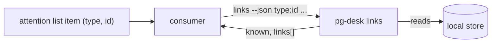

# pg-desk — links

`pg-desk links` is a read-only batch lookup of the cross-reference links `pg-desk` already holds:
for each ref a consumer hands it, it answers with the links to that item's PR, build and
issue-tracker pages. It exists so a consumer that lists attention items (for example a menu bar
plugin whose item source is `pg-connector attention list`) can offer quick links without
re-deriving cross-entity knowledge itself. `pg-desk` owns that knowledge: attention items never
carry cross-entity links.

## Contract

- **Invocation.** `pg-desk links --json <type>:<id> [<type>:<id> ...]`, or `pg-desk links --json
--stdin` with one `<type>:<id>` per line. A ref is an attention item's `type` and `id` unchanged,
  so a PR ref is `pr:<owner>/<repo>#<n>` — the same id `pg-desk` uses for its own `pr` entity. The
  id MAY itself contain colons: only the first colon separates type from id. `--json` is accepted
  for symmetry with the other verbs; the output is always JSON.
- **Output.** One JSON document, `schemaVersion` 1, evolving additively only:
  `as_of`, an optional `degraded`, and `items`, an object keyed by the ref exactly as given
  (trimmed). Each item has `known` and `links[]`; each link has `kind`, `relation`, `label`,
  `url`, and optionally `state`.
- **`kind`** is a closed set — `pr`, `build`, `issue`, `thread`, `other` — and is a rendering hint,
  not the entity type. **`relation`** is the cross-reference relation: `self`, `jira`, `work`,
  `parent`, `mentions`, `ci`.
- **`as_of`** is the oldest `as_of` among the stored entities of the refs; it is absent when no ref
  has a stored entity. The consumer decides what staleness means. There is no refresh option.
- **Exit codes.** `0` for every answer, including refs that are unknown. `1` when the store cannot
  be read at all (missing, not a pg-desk store), when the configuration cannot be loaded, or when
  no refs were given.

## Per-type links

| Ref type | Links produced                                                                                                                                                  |
| -------- | --------------------------------------------------------------------------------------------------------------------------------------------------------------- |
| `pr`     | itself (`self`); one `build` link (`ci`) per failing CI run on the current head; each issue its text names (`jira`); each thread that mentions it (`mentions`). |
| `issue`  | itself (`self`); the PR it tracks (`work`) or that names it (`jira`); its `parent`                                                                              |
| `thread` | itself (`self`); the PRs it mentions (`mentions`)                                                                                                               |

A ref of any other type — an alert, an agent session — is simply unknown.

A `build` link is read from the CI facts stored with the PR; the verb never asks the network for
them. A failing run is one the dashboard's CI rollup counts as failed: a run on the PR's current
head (the newest run per workflow, so a green re-run supersedes an earlier failure), whose name no
`check_interpreters` pattern excludes, and whose conclusion is neither a pass (`success`,
`neutral`, `skipped`) nor undecided (still running, `pending`, `expected`). A cancelled run that is
the newest for its workflow counts as failed. The link's `label` is "`<run name> (<state>)`", its
`url` is the run's URL and its `state` is the run's conclusion. A PR with no failing run — green,
still running, or with no stored CI facts — has no `build` link. A failing run with no usable URL
is omitted (INV-LINKS-3).

A ticket key becomes a URL through the configuration key `links.issue_url_template`: an absolute
`http(s)` URL containing exactly one `%s`, which is replaced by the URL-escaped key. Where no
template is configured, the URL stored with the issue's snapshot is used. Only ids shaped like
`ticket_patterns` are ever rendered through the template: a bead id never is. No tracker instance
name appears in `pg-desk`.

## Invariants

- **INV-LINKS-1.** The verb MUST be read-only and offline: it MUST NOT hydrate, MUST NOT call the
  network, and MUST NOT write the store (including creating or migrating it).
- **INV-LINKS-2.** An unknown ref MUST NOT be an error: it is `known: false` with empty `links`, and
  the exit code is `0`. This covers a ref with no stored entity and no links, a type the verb does
  not support, and a ref that is not shaped `<type>:<id>`.
- **INV-LINKS-3.** A link MUST have a URL or be omitted. A link whose URL cannot be determined — no
  stored snapshot URL and no template — MUST NOT be emitted empty. Only plain `http(s)` URLs
  without whitespace or control characters are emitted.
- **INV-LINKS-4.** Build links MUST honor the same check exclusions as the CI rollup the dashboard
  shows, so a menu and the dashboard never disagree about whether a build is failing. A `build` link
  is emitted for exactly the CI runs the rollup counts as failed, and for no others.

## Unmigrated store

Cross-reference links with relations exist only on the migrated store. On an unmigrated store the
verb MUST NOT fail: it degrades to the legacy PR-to-issue ticket-key links, answers them as
relation `jira`, and reports `"degraded": true` at the top level. Every other link kind is absent
until the store is migrated.

## Out of scope

Refreshing stale data, listing links for a type the store does not hold, and any link not derived
from a stored entity or cross-reference. Where an attention item has its own page, that page's URL
is the item's own concern, not this verb's.
