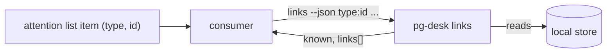

# pg-desk — links

`pg-desk links` is a read-only batch lookup of the cross-reference links `pg-desk` already holds:
for each ref a consumer hands it, it answers with the links to that item's PR, build and
issue-tracker pages. It exists so a consumer that lists attention items (for example a menu bar
plugin whose item source is `pg-connector attention list`) can offer quick links without
re-deriving cross-entity knowledge itself. `pg-desk` owns that knowledge: attention items never
carry cross-entity links.

## Contract

- **Invocation.** `pg-desk links --json <type>:<id> [<type>:<id> ...]`, or `pg-desk links --json
--stdin` with one `<type>:<id>` per line. A ref is an attention item's `type` and `id` unchanged,
  so a PR ref is `pr:<owner>/<repo>#<n>` — the same id `pg-desk` uses for its own `pr` entity. The
  id MAY itself contain colons: only the first colon separates type from id. `--json` is accepted
  for symmetry with the other verbs; the output is always JSON.
- **Output.** One JSON document, `schemaVersion` 1, evolving additively only:
  `as_of`, an optional `degraded`, and `items`, an object keyed by the ref exactly as given
  (trimmed). Each item has `known` and `links[]`; each link has `kind`, `relation`, `label`,
  `url`, and optionally `state`.
- **`kind`** is a closed set — `pr`, `build`, `issue`, `thread`, `other` — and is a rendering hint,
  not the entity type. **`relation`** is the cross-reference relation: `self`, `jira`, `work`,
  `parent`, `mentions`, `ci`.
- **`as_of`** is the oldest `as_of` among the stored entities of the refs; it is absent when no ref
  has a stored entity. The consumer decides what staleness means. There is no refresh option.
- **Exit codes.** `0` for every answer, including refs that are unknown. `1` when the store cannot
  be read at all (missing, not a pg-desk store), when the configuration cannot be loaded, or when
  no refs were given.

## Per-type links

| Ref type | Links produced                                                                                                                                                                                        |
| -------- | ----------------------------------------------------------------------------------------------------------------------------------------------------------------------------------------------------- |
| `pr`     | itself (`self`); one `build` link (`ci`) per failing CI run on the current head; each PR it depends on (`depends_on`); each issue its text names (`jira`); each thread that mentions it (`mentions`). |
| `issue`  | itself (`self`); the PR it tracks (`work`) or that names it (`jira`); its `parent`                                                                                                                    |
| `thread` | itself (`self`); the PRs it mentions (`mentions`)                                                                                                                                                     |

A ref of any other type — an alert, an agent session — is simply unknown.

A `build` link is read from the CI facts stored with the PR; the verb never asks the network for
them. A failing run is one the dashboard's CI rollup counts as failed: a run on the PR's current
head (the newest run per workflow, so a green re-run supersedes an earlier failure), whose name no
`check_interpreters` pattern excludes, and whose conclusion is neither a pass (`success`,
`neutral`, `skipped`) nor undecided (still running, `pending`, `expected`). A cancelled run that is
the newest for its workflow counts as failed. A run that fails only because of review-exempt jobs
(`review_exempt_checks`, see [`interpret.md`](interpret.md)), and a cancelled run that no longer
blocks a team PR from review, both still count as failed here: those rules affect whether the PR
is reviewable, never what is reported as failing. The link's `label` is "`<run name> (<state>)`", its
`url` is the run's URL and its `state` is the run's conclusion. A PR with no failing run — green,
still running, or with no stored CI facts — has no `build` link. A failing run with no usable URL
is omitted (INV-LINKS-3).

A ticket key becomes a URL through the configuration key `links.issue_url_template`: an absolute
`http(s)` URL containing exactly one `%s`, which is replaced by the URL-escaped key. Where no
template is configured, the URL stored with the issue's snapshot is used. Only ids shaped like
`ticket_patterns` are ever rendered through the template: a bead id never is. No tracker instance
name appears in `pg-desk`.

## PR dependencies

A PR waits for another PR in one of two ways, and `pg-desk` reads both from the local store only
(nothing is fetched and nothing is written):

- **Stack.** PR A depends on PR B when A's base branch is B's head branch, in the same repository,
  and B is open. It is derived each time it is read from the stored PR rows, so it is never older
  than the store: a base PR that was stored after its dependent is found, and the edge ends the
  moment B merges or closes. A PR whose head branch is its own base branch (a fork's default branch
  proposed upstream) is never a stack base. It needs no migrated store.
- **External.** An operator records `pg-desk pr link add <id> pr:<id> --relation depends_on`
  (see "External links" below): the PR named first depends on the one named second. It exists only
  on the migrated store; on an unmigrated store it contributes nothing and is not an error.

Both feed one read, which merges the sources that claim the same edge. Each `depends_on` link of a
`pr` ref points at a PR it depends on, and its `state` is that PR's stored state (`open`, `merged`
or `closed`; absent when it has no stored row, which is NOT open). An external link keeps showing
after its target merged, with `state` `merged`; a stack edge does not. A shared Jira issue is a
group, never a dependency: three PRs on one issue are siblings. This is the data the attention
evaluator's dependency suppression and stack grouping read (see [`attention.md`](attention.md));
that behavior is separate and is described there.

## Derived `source` links

Besides the relations the verb answers above, `pg-desk` derives one more cross-reference relation
when it hydrates a bead (an `issue` entity): **`source`**. A bead whose own metadata carries a
non-empty `source_type` and `source_id` gets exactly one derived link from the bead to the entity
those two fields name, relation `source`, origin `derived:source-entity`. `source_type` MUST be one
of the registered entity types (`pr`, `issue`, `thread`); any other value, or a missing
`source_type` or `source_id`, derives nothing and is not an error.

- The link is rebuilt on every re-hydrate of the bead and drops when the metadata is removed or the
  bead is removed.
- The rule is generic and carries no knowledge of what the bead is for. It MUST NOT read the
  `repo` and `pr_number` metadata fields: those derive a `work` link, which makes the bead that
  PR's own work item, and a `source` link never does. A PR's own links, its work items and its
  plan are therefore the same with or without a bead whose source is that PR, whatever the bead's
  title looks like.
- `source` is not a relation that joins entities into one correlation group (only `work` does).
- The `links` verb does not list `source` links: it answers only the relations named above.
  The stored link is visible in the `show` view of both entities.
- The extractor emits no OpenTelemetry or Prometheus data and logs nothing.

## Invariants

- **INV-LINKS-1.** The verb MUST be read-only and offline: it MUST NOT hydrate, MUST NOT call the
  network, and MUST NOT write the store (including creating or migrating it).
- **INV-LINKS-2.** An unknown ref MUST NOT be an error: it is `known: false` with empty `links`, and
  the exit code is `0`. This covers a ref with no stored entity and no links, a type the verb does
  not support, and a ref that is not shaped `<type>:<id>`.
- **INV-LINKS-3.** A link MUST have a URL or be omitted. A link whose URL cannot be determined — no
  stored snapshot URL and no template — MUST NOT be emitted empty. Only plain `http(s)` URLs
  without whitespace or control characters are emitted.
- **INV-LINKS-4.** Build links MUST honor the same check exclusions as the CI rollup the dashboard
  shows, so a menu and the dashboard never disagree about whether a build is failing. A `build` link
  is emitted for exactly the CI runs the rollup counts as failed, and for no others.

## Unmigrated store

Cross-reference links with relations exist only on the migrated store. On an unmigrated store the
verb MUST NOT fail: it degrades to the legacy PR-to-issue ticket-key links, answers them as
relation `jira`, and reports `"degraded": true` at the top level. Every other link kind is absent
until the store is migrated, except the build links and the stack `depends_on` links, which are
read from the stored PR rows and so work on either schema.

## External links: `link add` and `link remove`

`pg-desk <type> link add <id> <type>:<id> [--relation R] [--reason TEXT] [--actor A]` and
`pg-desk <type> link remove <id> <type>:<id> [--actor A]` (for `<type>` one of `pr`, `issue`,
`thread`) let an operator record and retract a link the extractors do not derive (entity-change-flow
design 6.3). Unlike the read-only `links` verb above, these write the store, and they refuse an
old-schema store with the store's error (run `pg-desk migrate --cutover`), exit `1`.

Every link records whether it is internal (derived) or external: the stored origin is
`derived:<extractor>` or `external:<actor>`, one row per link, relation and origin.

- **`link add`** records an external claim: origin `external:<actor>` with when and the optional
  reason. `--relation` defaults to `references`. The actor is the configured actor unless `--actor`
  is given; with neither, the verb fails. Both ends are resolved like the typed verbs resolve an
  id; the second argument's id may itself contain colons (only the first colon separates the type
  from the id). Adding a link that is already derived still records the external claim, so the link
  survives if the source entity later changes. Adding the same claim again refreshes its reason and
  time and records no further change.
- **`link remove`** removes the acting actor's external claims on the pair, in either direction
  and across all relations. It never removes a derived claim or another actor's external claim. On
  a pair whose only claims are derived it fails with `derived from <extractor>; change the source
entity`; when nothing of the actor's exists (and nothing is derived) it fails saying so.
- **External never overrides internal.** An external claim is its own row next to any derived
  one; it never replaces or removes a derived link. Suppressing a derived link is not offered.
- **Change records.** Every add or remove that changes the set of claims appends a change record,
  origin `pg-desk`, for both entities: `link_changed`, except that a `pr` whose other end is one of
  its own work items (recognized from work-item metadata and parent links only) gets `work_changed`.
  An end with no stored entity row (for example an issue key never hydrated) is skipped; the other
  end still gets its record.

## Out of scope

Refreshing stale data, listing links for a type the store does not hold, and any link not derived
from a stored entity or cross-reference. Where an attention item has its own page, that page's URL
is the item's own concern, not this verb's.
