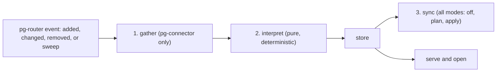

# pg-desk — the pipeline (`run`)

`pg-desk run <type> <id> --change added|changed|removed|sweep` runs the pipeline for one entity;
an absent `--change` means `sweep`.

The full design has three stages — gather, interpret, and sync — run in one process, because the
stages are strictly ordered and pg-router's own core does not sequence handlers (the design's
`pr-pool` naming predates the pg-router rename, bead `pg2-myc6y`). All three ship as of Phase 10
(docket pg2-2j5ac.34) — see [`sync.md`](sync.md) for stage 3's own full behavior.

An `issue` or `thread` event is designed to additionally re-run stage 2 for the PR it links to, so
that sync never signals from facts older than the last gather of that PR. As of Phase 10, `run
issue` for the beads backend implements this: it resolves the triggering bead to its linked PR
(see [`run-issue.md`](run-issue.md)) and re-runs interpret for it, without a fresh gather and
without re-running sync. `run issue` for Jira and `run thread` are still Phase 13, as is the
cross-reference step that would give either kind of event a linked PR — see
[`gather.md`](gather.md), [`interpret.md`](interpret.md), and [`sync.md`](sync.md).

## Exit codes

`run`'s contract to pg-router is fixed regardless of phase: it MUST exit `0` on success and on a
degraded run (see [`gather.md`](gather.md)) — a sync failure (recorded as `sync_error`, see
[`sync.md`](sync.md)) is also a `0`, never a failure of `run` itself — `1` when the triggering
entity itself could not be fetched or the store could not be written, and MUST NEVER exit `9` or
return a raw `pg-connector` exit code.

## Telemetry and logs

`run` emits nothing over OpenTelemetry or Prometheus through Phase 10 (D24); OpenTelemetry export
is a later observability item, alongside pg-router's own metrics sink. `run` MUST log structured
JSON to stderr, which pg-router captures as the triggering scheduler. `--verbose` additionally
prints the three-stage timeline (gather, interpret, sync).

## Out of scope (Phase 9, narrowed by Phase 10)

`run issue` for Jira and `run thread` are Phase 13, as is the cross-reference step that would give
either kind of event a linked PR to re-interpret (`run issue` for the beads backend is
[`run-issue.md`](run-issue.md), not this doc). `repos[]` supports exactly one repository this
phase; multi-repository `run` is out of scope.
