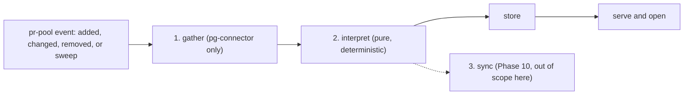

# pg-desk — the pipeline (`run`)

`pg-desk run <type> <id> --change added|changed|removed|sweep` runs the pipeline for one entity;
an absent `--change` means `sweep`.

The full design has three stages — gather, interpret, and sync — run in one process, because the
stages are strictly ordered and pr-pool's own core does not sequence handlers. Phase 9 implements
the first two; sync is out of scope beyond its own storage schema (see "Out of scope" below and
[`store-schema.md`](store-schema.md)).

An `issue` or `thread` event is designed to additionally re-run stage 2 for every PR the store
already links to it, so that sync (once it exists) never signals from facts older than the last
gather of that PR. In Phase 9 this rule has nothing to act on: `run issue` for the beads backend
is Phase 10, `run issue` for Jira and `run thread` are Phase 13, and the cross-reference links
that would give either kind of event a linked PR are also Phase 13 — see
[`gather.md`](gather.md) and [`interpret.md`](interpret.md).

## Exit codes

`run`'s contract to pr-pool is fixed regardless of phase: it MUST exit `0` on success and on a
degraded run (see [`gather.md`](gather.md)), `1` when the triggering entity itself could not be
fetched or the store could not be written, and MUST NEVER exit `9` or return a raw `pg-connector`
exit code.

## Telemetry and logs

`run` emits nothing over OpenTelemetry or Prometheus in Phase 9 (D24); OpenTelemetry export is a
later observability item, alongside pr-pool's own metrics sink. `run` MUST log structured JSON to
stderr, which pr-pool captures as the triggering scheduler. `--verbose` additionally prints the
three-stage timeline (gather, interpret, and — once it ships — sync).

## Out of scope (Phase 9)

The sync stage itself — minting or reconciling agent-signal beads from an interpretation — is
Phase 10, beyond the `ledger` table's own schema. `run issue` for the beads backend is Phase 10;
`run issue` for Jira and `run thread` are Phase 13, as is the cross-reference step that would give
either kind of event a linked PR to re-interpret. `repos[]` supports exactly one repository this
phase; multi-repository `run` is out of scope.
